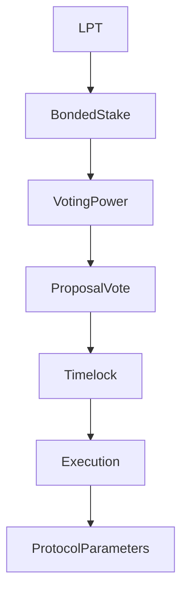

{/* codex-i18n: eyJraW5kIjoiY29kZXgtaTE4biIsInZlcnNpb24iOjEsInNvdXJjZVBhdGgiOiJ2Mi9scHQvZ292ZXJuYW5jZS9vdmVydmlldy5tZHgiLCJzb3VyY2VSb3V0ZSI6InYyL2xwdC9nb3Zlcm5hbmNlL292ZXJ2aWV3Iiwic291cmNlSGFzaCI6IjE2MDljNDMyNjBhMzY5NjI1ZGUxMWUyODc4ZjM4ZjA2NDQyZWIwZGNlNzk1ZWNjNjg5NWU4MmMxNTczOGM2MTIiLCJsYW5ndWFnZSI6ImVzIiwicHJvdmlkZXIiOiJvcGVucm91dGVyIiwibW9kZWwiOiJxd2VuL3F3ZW4tdHVyYm8iLCJnZW5lcmF0ZWRBdCI6IjIwMjYtMDMtMDFUMTE6MTA6MzguMjQ5WiJ9 */}
import { MathInline, MathBlock } from '/snippets/components/content/math.jsx'

## Resumen Ejecutivo

La gobernanza Livepeer es un sistema de toma de decisiones con ponderación por participación, en cadena, que controla las actualizaciones de parámetros del protocolo, las actualizaciones de contratos (donde sean actualizables) y las asignaciones del tesoro.

La autoridad de gobernanza proviene exclusivamente de **acreditado LPT**. Funciona en la capa de protocolo (en cadena)**protocolo layer (en cadena)** y modifica las reglas económicas y contractuales que restringen la capa de red.

---

## 1. Definición formal

Sea:

- <MathInline latex={String.raw`B_i`} /> = stake vinculado atribuido al participante <MathInline latex={String.raw`i`} />
- <MathInline latex={String.raw`B_T`} /> = stake vinculado total

Poder de votación:

<MathBlock latex={String.raw`V_i = \frac{B_i}{B_T}`} />

La gobernanza es por lo tanto un sistema de toma de decisiones ponderado por capital sobre el stake vinculado. Solo el stake vinculado contribuye al peso de votación.

---

## 2. Alcance de la gobernanza

La gobernanza puede modificar:

1. Parámetros de inflación (por ejemplo, coeficiente de ajuste, tasa de compromiso objetivo)
2. Implementaciones de contratos (a través de patrones de actualización donde estén habilitados)
3. Pagos del tesoro
4. Constantes de configuración del protocolo

La gobernanza hace**no**controlar directamente:

- programación de GPU
- enrutamiento de trabajos
- Estrategias de precios de puerta de enlace
- Comportamiento operativo fuera de cadena

Esos pertenecen a la capa de red.

---

## 3. Modelo híbrido en cadena/ fuera de cadena

Livepeer utiliza un modelo de gobernanza híbrido en cadena y fuera de cadena. Los procesos fuera de cadena (discusión, grupos de trabajo y señales) permiten a la comunidad debatir y perfeccionar ideas en un foro abierto. Las votaciones en cadena luego fijan esas ideas en actualizaciones del protocolo o asignaciones de fondos. Esta separación mantiene las transacciones en cadena mínimas mientras maximiza la entrada de la comunidad y la transparencia.

### Propuestas de mejora de Livepeer (LIPs)

El mecanismo principal para el cambio del protocolo es la Propuesta de Mejora del Livepeer (LIP). Las LIP son documentos estructurados (hospedados en GitHub) que especifican cambios técnicos, ajustes de parámetros o procesos de gobernanza, similar a las EIP de Ethereum.

La vida útil de una LIP sigue un ritmo deliberado:

1. **Idea y discusión** – Cualquiera puede presentar una idea en el foro Livepeer o en Discord. Los comentarios iniciales de desarrolladores, orquestadores y delegadores ayudan a identificar los puntos de compromiso.

2. **Formación de Entidad de Propósito Especial** – Las ideas complejas suelen dar lugar a la formación de una Entidad de Propósito Especial (SPE): un grupo de trabajo de miembros de la comunidad que definen el problema, investigan alternativas, producen especificaciones y estiman los requisitos de recursos. Los SPE operan fuera de la cadena y son responsables ante la comunidad.

3. **Redacción y requisito de estaking** – Una vez que una propuesta está madura, los autores redactan una LIP utilizando una plantilla estándar y abren un pull request contra el repositorio del protocolo. Los propietarios deben tener al menos 100 LPT comprometidos en cadena para presentar una LIP.

4. **Revisión formal y revisión** – El LIP es revisado por la comunidad, los desarrolladores principales y la Fundación Livepeer. El período de revisión suele durar al menos dos semanas.

5. **Señalización de Snapshot** – Antes de moverse a la cadena, los propuestos pueden realizar una votación de Snapshot (encuesta ponderada por tokens fuera de la cadena) para evaluar la opinión.

6. **Voto en cadena** – Finalmente, el LIP se presenta al contrato inteligente de gobernanza para una votación vinculante. Si se cumplen los umbrales de cuórum y mayoría, la propuesta se coloca en cola para su ejecución.

---

## 4. Mecánicas de votación

Que una propuesta <MathInline latex={String.raw`P`} />esté activa durante una ventana de votación.

Poder de voto total emitido:

<MathBlock latex={String.raw`V_{cast} = \sum_{i \in voters} B_i`} />

Una propuesta pasa si cumple los umbrales de cuórum y mayoría como se definen en la lógica del contrato de gobernanza. Estos umbrales se aplican en cadena.

---

## 5. Gobernanza como capa de seguridad

La seguridad de la gobernanza depende de la distribución del stake vinculado.

Sea<MathInline latex={String.raw`\theta`} /> la fracción de capital necesaria para influir en un resultado.

Capital mínimo requerido:

<MathBlock latex={String.raw`Capital_{control} \geq \theta B_T`} />

La seguridad aumenta con el valor total de las participaciones aseguradas y disminuye con la concentración de las participaciones:

<MathBlock latex={String.raw`Security \propto B_T`} />

---

## 6. Contexto arquitectónico

### 6.1 Contratos de la capa del protocolo

La lógica de gobernanza interactúa con los contratos responsables de:

- Creación de propuestas
- Votación y conteo de votos
- Aplicación del timelock
- Ejecución de propuestas aprobadas

Direcciones de contratos canónicos: [Registro de Contratos](https://docs.livepeer.org/references/contract-addresses)

### 6.2 Interacción de Capa de Red

Las decisiones de gobernanza pueden influir indirectamente en el comportamiento de la red modificando:

- Parámetros de incentivo
- Dinámica de recompensas
- Lógica de contrato actualizable

Sin embargo, la ejecución de cargas de trabajo sigue siendo off-chain.

---

## 7. Diagrama del sistema

---

## 8. Separación de Protocolo vs Red

**Protocolo (En cadena):**
- Creación de propuesta
- Votación y conteo de votos
- Actualizaciones de parámetros
- Actualizaciones de contrato
- Ejecución del tesoro

**Red (Off-Chain):**
- Operación del nodo
- Ejecución de la carga de trabajo
- Enrutamiento y precios

La gobernanza modifica las reglas; los actores de la red los ejecutan dentro de esas reglas.

---

## Referencias

- [Livepeer Protocol Repository](https://github.com/livepeer/protocol)
- [Registro de Contratos](https://docs.livepeer.org/references/contract-addresses)
- [Livepeer Improvement Proposals (LIPs)](https://github.com/livepeer/LIPs)
