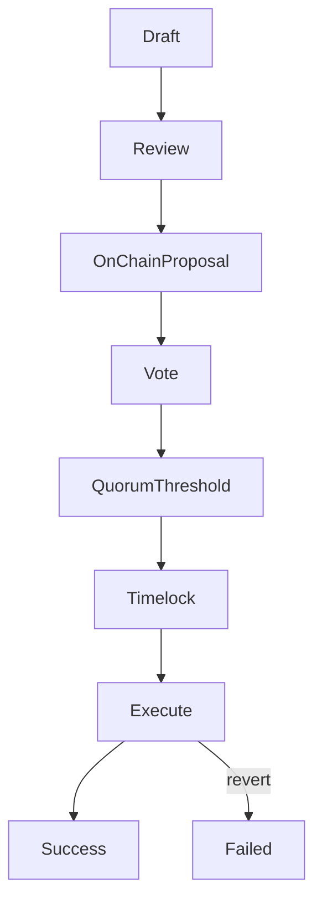

{/* codex-i18n: eyJraW5kIjoiY29kZXgtaTE4biIsInZlcnNpb24iOjEsInNvdXJjZVBhdGgiOiJ2Mi9scHQvdHJlYXN1cnkvcHJvcG9zYWxzLm1keCIsInNvdXJjZVJvdXRlIjoidjIvbHB0L3RyZWFzdXJ5L3Byb3Bvc2FscyIsInNvdXJjZUhhc2giOiIzN2RjMzYwNjU5NDlhMDJiNzQ3Y2M1YmIyMzQ4ZDE5ZGJiYTJiYmY2ODUwNmYzNmY5MDdlMTcwNjk4YjQ3OGNhIiwibGFuZ3VhZ2UiOiJlcyIsInByb3ZpZGVyIjoib3BlbnJvdXRlciIsIm1vZGVsIjoicXdlbi9xd2VuLXR1cmJvIiwiZ2VuZXJhdGVkQXQiOiIyMDI2LTAzLTAxVDExOjE5OjI1LjcxNloifQ== */}
import { MathInline, MathBlock } from '/snippets/components/content/math.jsx'

## Resumen Ejecutivo

Una propuesta de tesorería es una propuesta de gobernanza cuyo payload ejecutable autoriza una acción de tesorería en cadena (normalmente una transferencia, subvención o llamada de contrato). En Livepeer, las propuestas de tesorería se aplican a nivel de protocolo (en cadena)**nivel de protocolo (en cadena)**: una vez que se alcanza el quórum y los umbrales y expira el tiempo de espera, las acciones codificadas se ejecutan de forma determinista.

Esta página define la estructura de los payloads de las propuestas de tesorería, sus semánticas de ejecución y los principales modos de fallo.

---

## 1. Definición Formal

Una propuesta de tesorería <MathInline latex={String.raw`P`} />es un conjunto de acciones ejecutables:

<MathBlock latex={String.raw`P = \{ a_1, a_2, \dots, a_n \}`} />

Cada acción <MathInline latex={String.raw`a_k`} />se define como:

<MathBlock latex={String.raw`a_k = (Target_k, Value_k, Data_k)`} />

Donde:

- **Objetivo**es el contrato o dirección llamada
- **Valor**es la cantidad de token nativo adjunta (si aplica)
- **Datos**es calldata codificado en ABI que especifica el selector de función y los argumentos

La propuesta pasa por la gobernanza y se ejecuta después del tiempo de espera.

---

## 2. Autorización de gobernanza

Dejar las variables de stake vinculado:

- <MathInline latex={String.raw`B_i`} /> = stake vinculado del votante<MathInline latex={String.raw`i`} />
- <MathInline latex={String.raw`B_T`} /> = stake vinculado total

Poder de votación:

<MathBlock latex={String.raw`V_i = \frac{B_i}{B_T}`} />

Condición de cuórum:

<MathBlock latex={String.raw`V_{cast} \ge Q \cdot B_T`} />

Condición umbral (ejemplo):

<MathBlock latex={String.raw`V_{for} > V_{against}`} />

Solo las propuestas que cumplan las condiciones de gobernanza ingresan en la cola de timelock.

---

## 3. Semántica de la cola de timelock

Una vez aprobada, la propuesta se coloca en una cola de timelock con un retraso<MathInline latex={String.raw`T_{delay}`} />.

Timelock proporciona:

- Ventana de ejecución predecible
- Tiempo de reacción para los interesados
- Mitigación contra cambios repentinos o maliciosos

La ejecución solo es posible después de que transcurra el retraso.

---

## 4. Semántica de ejecución

Después de que expire el timelock, los intentos de ejecución tratan de aplicar cada acción<MathInline latex={String.raw`a_k`} /> de forma atómica dentro de la transacción de ejecución.

Dos propiedades importantes:

1. **Determinismo:** la ejecución está definida de forma estricta por los datos de entrada
2. **Atomicidad:** si alguna acción revierte, la transacción revierte a menos que el modelo de ejecución tolerara explícitamente un fallo parcial

Las propuestas del tesoro deben escribirse teniendo en cuenta la corrección de calldata y el modelo de fallos.

---

## 5. Transferencia de tesoro como caso canónico

Una acción común es una transferencia de tesoro.

Si el saldo del tesoro es <MathInline latex={String.raw`T`} /> y la cantidad de asignación es <MathInline latex={String.raw`A`} />:

<MathBlock latex={String.raw`T' = T - A`} />

El saldo del destinatario aumenta en <MathInline latex={String.raw`A`} /> bajo las reglas de transferencia del activo.

---

## 6. Modos de falla

La ejecución de una propuesta del tesoro puede fallar por varias razones.

### 6.1 Error de calldata

Un selector de función incorrecto o una codificación ABI malformada causa un rechazo.

### 6.2 Saldo insuficiente en el tesoro

La cantidad transferida excede los fondos del tesoro.

### 6.3 Revertir contrato objetivo

El contrato llamado rechaza la llamada debido a controles de acceso, estado pausado o validación de parámetros.

### 6.4 Semántica de transferencia de activos

Algunos contratos de tokens pueden:

- Devolver false en lugar de revertir
- Aplicar tarifas de transferencia
- Imponer listas de permisos

Los autores de propuestas deben verificar el comportamiento del activo objetivo.

### 6.5 Configuración del timelock

Si las condiciones de retraso del timelock o ventana de ejecución están mal configuradas, las propuestas pueden volverse inexecutables.

---

## 7. Lista de mitigación de riesgos

Antes de presentar una propuesta de tesorería:

1. Verificar las direcciones y contratos objetivo a través del registro
2. Confirmar que el codificado ABI es correcto
3. Confirmar que el saldo de la tesorería es suficiente
4. Simular la ejecución donde sea posible
5. Asegúrate de que el calldata sea auditable y tenga un alcance mínimo

---

## 8. Flujo de ejecución de la propuesta

---

## 9. Separación entre protocolo y red

**Protocolo (En cadena):**
- Definición del payload de la propuesta
- Conteo de votos y autorización
- Cola de timelock
- Ejecución determinista
- Transferencias del tesoro

**Red (fuera de cadena):**
- Redacción y revisión
- Entrega de subvenciones y ejecución operativa por parte de los beneficiarios

Las propuestas del tesoro están respaldadas por lógica del protocolo; los resultados requieren entrega fuera de cadena.

---

## Referencias

- [Livepeer Repositorio del protocolo](https://github.com/livepeer/protocol)
- [Registro de contratos](https://docs.livepeer.org/references/contract-addresses)
