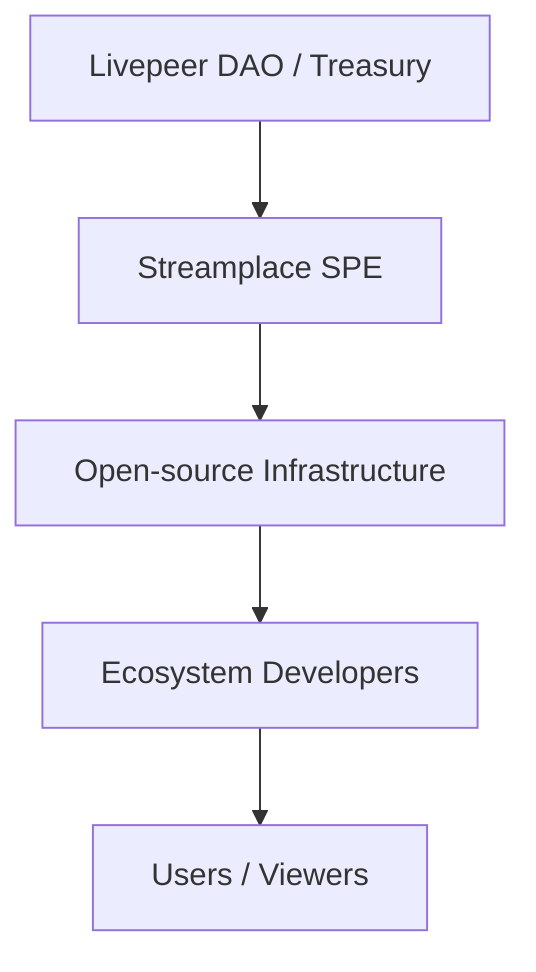

{/* codex-i18n: eyJraW5kIjoiY29kZXgtaTE4biIsInZlcnNpb24iOjEsInNvdXJjZVBhdGgiOiJ2Mi9zb2x1dGlvbnMvc3RyZWFtcGxhY2UvaW50cm9kdWN0aW9uL3N0cmVhbXBsYWNlLWZ1bmRpbmctbW9kZWwubWR4Iiwic291cmNlUm91dGUiOiJ2Mi9zb2x1dGlvbnMvc3RyZWFtcGxhY2UvaW50cm9kdWN0aW9uL3N0cmVhbXBsYWNlLWZ1bmRpbmctbW9kZWwiLCJzb3VyY2VIYXNoIjoiMWNhYWE3MTkyY2MzMTkwNzllMTMzN2IwNDliYjYyYTkzN2IxODEwMzU4MzY3YzVhY2RkZmUyMGNiODc5YmQ5ZSIsImxhbmd1YWdlIjoiZXMiLCJwcm92aWRlciI6Im9wZW5yb3V0ZXIiLCJtb2RlbCI6InF3ZW4vcXdlbi10dXJibyIsImdlbmVyYXRlZEF0IjoiMjAyNi0wMi0yN1QxODowODozNy4yNzZaIn0= */}
---

Streamplace opera como una **Entidad de Propósito Específico (SPE)** dentro del ecosistema Livepeer. Las SPE son equipos financiados públicamente responsables de construir **infraestructura crítica, de código abierto y bienes públicos** que fortalece y expande la Red Livepeer.

Esta página explica:

- ¿Qué es un SPE?
- Cómo fluye el financiamiento desde el Tesoro de Livepeer
- Cómo utiliza Streamplace este financiamiento
- ¿Por qué existe el modelo SPE?

---

# 🏛️ ¿Qué es un SPE?

Un **Entidad de Propósito Especial**es un equipo de ingeniería o operaciones orientado a una misión, financiado por el ecosistema Livepeer para entregar:

- Infraestructura a largo plazo
- Software de código abierto
- Capacidades a nivel de red
- Bienes públicos que benefician a creadores, desarrolladores y operadores de nodos

Streamplace es un SPE enfocado específicamente en**infraestructura de video descentralizada, sistemas de procedencia y SDKs para aplicaciones sociales/Web3**.

---

# 💸 Diagrama de flujo de financiación

---

# 📦 Lo que entrega Streamplace como SPE

El financiamiento de la tesorería permite a Streamplace mantener y mejorar:

### **1. Nodo Streamplace**

- ingestión (WHIP/WHEP/RTMP)
- segmentación
- incrustación de proveniencia (C2PA + Ethereum)
- envío de codificación

### **2. SDK y APIs**

Herramientas amigables para desarrolladores:

- transmisión en vivo
- configuración de metadatos
- integraciones de reproducción
- incrustación de aplicaciones sociales

### **3. Estándares de metadatos y procedencia**

Un esquema completo para:

- derechos
- advertencias de contenido
- política de distribución
- metadatos de repetición y episodios

### **4. Infraestructura de bienes públicos**

Todo lo que construye Streamplace es:

- **de código abierto**
- **transparente**
- **propiedad de la ecosistema**
- **sin permiso** para adoptar

---

# 🔥 ¿Por qué existe el modelo SPE

Los SPE aseguran que Livepeer puedan financiar de manera sostenible proyectos complejos y de largo plazo sin depender de:

- capital de riesgo
- operadores centralizados
- modelos de negocio de código cerrado

El modelo SPE crea:

- capacidad estable para trabajo crítico de la red
- responsabilidad transparente
- resiliencia del ecosistema
- descentralización saludable

---

# 📚 Páginas relacionadas

- [Visión general de Streamplace](/solutions/streamplace/overview)
- [Arquitectura](/solutions/streamplace/introduction/streamplace-architecture)
- [Proveniencia y metadatos](/solutions/streamplace/introduction/streamplace-provenance)
- [Guía de integración para desarrolladores](/solutions/streamplace/introduction/streamplace-integration)
