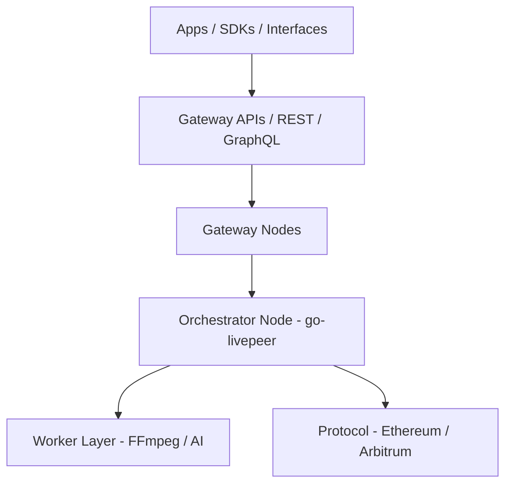

{/* codex-i18n: eyJraW5kIjoiY29kZXgtaTE4biIsInZlcnNpb24iOjEsInNvdXJjZVBhdGgiOiJ2Mi9hYm91dC9saXZlcGVlci1uZXR3b3JrL3RlY2huaWNhbC1hcmNoaXRlY3R1cmUubWR4Iiwic291cmNlUm91dGUiOiJ2Mi9hYm91dC9saXZlcGVlci1uZXR3b3JrL3RlY2huaWNhbC1hcmNoaXRlY3R1cmUiLCJzb3VyY2VIYXNoIjoiOWFmZTc2YTc4YzNiM2Q4MGExOTY5MzE0N2FlNzEwNmZiYTYxYjM1MTA5NjVhZWFhOWEyNzBiMjhjOWFlYjc1MCIsImxhbmd1YWdlIjoiZnIiLCJwcm92aWRlciI6Im9wZW5yb3V0ZXIiLCJtb2RlbCI6Im9wZW5haS9ncHQtb3NzLTEyMGI6ZnJlZSIsImdlbmVyYXRlZEF0IjoiMjAyNi0wMi0yNlQwNjo1MDowMi42NzFaIn0= */}
import { DynamicTable } from '/snippets/components/layout/table.jsx'
import { GotoCard, GotoLink } from '/snippets/components/primitives/links.jsx'

Cette page décrit l'ensemble complet d'outils, d'infrastructures et de composants qui alimentent le réseau Livepeer au niveau du nœud, de la passerelle et du client. L'architecture de Livepeer est modulaire et orientée développeur : vous pouvez exécuter un Orchestrateur, créer une passerelle IA personnalisée, ou utiliser des API pour créer des applications multimédias sur un calcul décentralisé.

## Couches d'architecture

Le réseau se situe au-dessus du protocole : les passerelles et les orchestrateurs gèrent le calcul hors chaîne et le routage ; le protocole (Arbitrum) gère le staking, les tickets et les récompenses.

## Nœud Orchestrateur

Le nœud Orchestrateur exécute **go-livepeer** (le `livepeer` binaire), disponible à :

[https://github.com/livepeer/go-livepeer](https://github.com/livepeer/go-livepeer)

### Composants clés

- **Sélection du transcodeur** - Travailleurs internes ou externes ; configurés via `orchSecret` et `orchAddr` pour les transcodeurs distants
- **Validation des tickets** - L2 `TicketBroker` sur Arbitrum pour la remise des paiements ETH
- **Réclamation de récompense** - Soumission Merkle à `BondingManager` chaque round
- **Staking LPT** - BondingManager pour l'auto-bond et le stake des délégateurs
- **Publicité régionale** - Pour le routage des passerelles (latence, capacité)

### Modes de déploiement

- Bare metal avec GPU
- Conteneurisé
- Mise à l'échelle automatique dans le cloud

### Outils

- **livepeer_cli** - Staker, définir les frais/coupe de récompense, surveiller les sessions
- **livepeer_exporter** - Exportateur de métriques Prometheus pour l'observabilité

## Couche de travailleur

Les travailleurs peuvent être des services locaux ou distants attachés à un Orchestrateur :

<DynamicTable
  headerList={["Type", "Language / runtime", "Example use"]}
  itemsList={[
    { "Type": "Transcoder", "Language / runtime": "FFmpeg", "Example use": ".ts segment processing, multi-bitrate output" },
    { "Type": "Inference", "Language / runtime": "Python (Torch)", "Example use": "AI tasks, e.g. SDXL image-to-image" },
    { "Type": "Plugin", "Language / runtime": "WebRTC / C++", "Example use": "Real-time browser capture or object detection" }
  ]}
/>

Configuré via Orchestrateur `config.json` ou variables d'environnement.

## Infrastructure de passerelle

Les passerelles gèrent :

- Authentification de session (clé API, dépôt ETH, ou vérification de crédit)
- Routage des jobs vers les Orchestrateurs
- Journalisation des sessions et nouvelles tentatives

**Bases de code :**

- [Studio Gateway](https://github.com/livepeer/studio-gateway)
- [Daydream Gateway](https://github.com/livepeer/daydream)
- [Cascade](https://github.com/livepeer/cascade) - Équilibreur de charge et coordination du flux de travail IA

**Fonctionnalités :** Limitation du débit, scoring régional, sondes de santé, Orchestrateurs de secours, suivi du crédit (p. ex. Postgres/Redis).

## API

<DynamicTable
  headerList={["API", "Protocol", "Description"]}
  itemsList={[
    { "API": "REST Gateway", "Protocol": "HTTPS", "Description": "Transcode, AI job control (e.g. Livepeer Studio API)" },
    { "API": "gRPC Gateway", "Protocol": "gRPC", "Description": "Fast session handshakes, monitoring (e.g. ReserveSession, Heartbeat)" },
    { "API": "Explorer API", "Protocol": "GraphQL", "Description": "Metrics, staking, round data (explorer.livepeer.org)" }
  ]}
/>

**Points de terminaison :**

- `https://livepeer.studio/api` - Studio REST
- `https://explorer.livepeer.org/graphql` - Explorer GraphQL

## CLI et SDKs

**CLI :** `livepeer_cli` (fourni avec go-livepeer)

- Miser LPT, bond/unbond
- Définir les frais d'Orchestrateur et la part de récompense
- Surveiller les sessions actives, interroger l'état du protocole

**SDKs :**

- **[Livepeer JS SDK](https://github.com/livepeer/js-sdk)** - Lecture, ingestion, outils de session IA ; fonctionne sous Node.js et dans le navigateur
- **Pipelines IA Python** - Utilisé dans des projets internes et communautaires (p. ex. dotSimulate, MetaDJ)

## Surveillance et observabilité

<DynamicTable
  headerList={["Tool", "Metric type", "Description"]}
  itemsList={[
    { "Tool": "Prometheus", "Metric type": "Session, CPU, ticketing", "Description": "Exposed via livepeer_exporter" },
    { "Tool": "Grafana dashboards", "Metric type": "Visual ops", "Description": "Studio and Orchestrator internal views" },
    { "Tool": "Loki", "Metric type": "Logs", "Description": "Transcode errors, API retries" },
    { "Tool": "Gateway logs", "Metric type": "Credits, API, routing", "Description": "Per-session logs (e.g. Redis / S3)" }
  ]}
/>

Le logiciel de nœud expose des métriques explicites (p. ex. taux de succès des segments, valeur des tickets envoyés/échangés, swaps d'orchestrateur) ; voir [Cycle de vie du travail](./job-lifecycle) pour les détails des événements/transitions.

## Exemples de déploiement

- [Orchestrateur sur AWS](https://github.com/livepeer/orchestrator-on-aws)
- [Déploiement de la passerelle Studio](https://github.com/livepeer/studio-gateway-deploy)
- [Pipeline de nœud IA Daydream](https://github.com/livepeer/daydream)

## Voir aussi

- [Interfaces](./interfaces) - REST, gRPC, GraphQL, JS SDK, CLI et accès aux contrats intelligents
- [Marketplace](./marketplace) - Comment les passerelles routent les travaux et comment la tarification fonctionne
- [Cycle de vie du travail](./job-lifecycle) - Flux de bout en bout et machine d'états
- [Architecture technique du protocole](../livepeer-protocol/technical-architecture) - Contrats on-chain et types de nœuds du point de vue du protocole
- [Contrats blockchain](../resources/blockchain-contracts) - Adresses de contrat (Arbitrum)

## Références

- [Livepeer GitHub](https://github.com/livepeer)
- [Docs de l'Orchestrateur](/v2/fr/orchestrators/orchestrators-portal)
- [Passerelle Daydream](https://github.com/livepeer/daydream)
- [Livepeer Explorer](https://explorer.livepeer.org)
