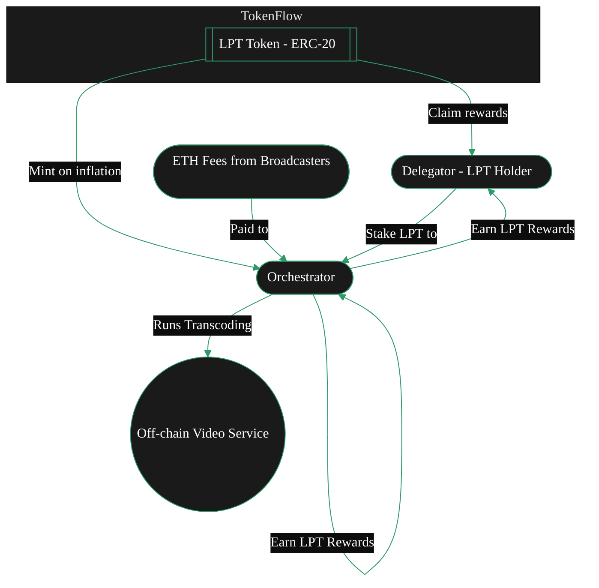

{/* codex-i18n: eyJraW5kIjoiY29kZXgtaTE4biIsInZlcnNpb24iOjEsInNvdXJjZVBhdGgiOiJ2Mi9hYm91dC9saXZlcGVlci1wcm90b2NvbC9saXZlcGVlci10b2tlbi5tZHgiLCJzb3VyY2VSb3V0ZSI6InYyL2Fib3V0L2xpdmVwZWVyLXByb3RvY29sL2xpdmVwZWVyLXRva2VuIiwic291cmNlSGFzaCI6ImU3N2E5ZjhhYzE2N2EzYjE1NThhZmIxZDA5OWEyZTc1OTRhNDhiYzM4YmQxZjMzNWMxZjhiYTdmNzgxZjNiZmYiLCJsYW5ndWFnZSI6ImZyIiwicHJvdmlkZXIiOiJvcGVucm91dGVyIiwibW9kZWwiOiJvcGVuYWkvZ3B0LW9zcy0xMjBiOmZyZWUiLCJnZW5lcmF0ZWRBdCI6IjIwMjYtMDItMjZUMTM6NDQ6MzMuNzg5WiJ9 */}
{/* This page describes:
3. **Token (LPT)**

   * Purpose of LPT
   * Security model
   * Inflation mechanics
   * Not used for job payments (ETH is) 

BUT ONLY BRIEFLY -> DEFERS TO TOKEN TAB
*/}

import { CardTitleTextWithArrow } from '/snippets/components/primitives/text.jsx'
import { AccordionTitleWithArrow } from '/snippets/components/primitives/text.jsx'
import { Quote } from '/snippets/components/content/quote.jsx'
import { CustomDivider } from '/snippets/components/primitives/divider.jsx'
import { LinkArrow } from '/snippets/components/primitives/links.jsx'
import { DynamicTable } from '/snippets/components/layout/table.jsx'
import { ScrollableDiagram } from '/snippets/components/content/zoomableDiagram.jsx'

<div style={{ display: "flex", justifyContent: "center"}}>
  <CardTitleTextWithArrow icon="hand-holding-dollar" horizontal href="https://www.livepeer.org/lpt"> Livepeer Token </CardTitleTextWithArrow> 
</div>

<div style={{ display: "flex", margin: "0 1rem" }}>
   <Tip>
      <span style={{fontSize: '1.0rem'}}>
         _**Did you know?**_
      </span>
      Livepeer’s token distribution had no [ICO](https://messari.io/report/merkle-mine). <br/> <br/>
      Instead, the initital 10 million LPT supply was distributed via a community [Merkle Mine](https://github.com/livepeer/merkle-mine), 
      allowing a wide set of participants to claim tokens at network launch. 
      <Icon icon="github" size={18}/> {" "} <LinkArrow label={<span style={{color: "var(--hero-text)"}}>View the github code</span>} href="https://github.com/livepeer/merkle-mine" newline={false} borderColor="var(--accent)" />
   </Tip>
</div>
{/* <Quote> 
The **Livepeer Token (LPT)** is the staking and coordination token of the Livepeer protocol. LPT underpins protocol security, work selection, reward distribution, and decentralised governance incentivising optimal network service outcomes. 
</Quote> */}

<CustomDivider style={{margin: 0, marginBottom: "-2rem" }} />

## Jeton LP
Livepeer est un jeton utilitaire et un composant central du protocole Livepeer. Il est utilisé pour sécuriser et inciter le réseau décentralisé à fournir sa proposition de valeur clé : des flux de travail d'IA et de diffusion vidéo fiables, économiques et puissants.

<div style={{ display: "flex", justifyContent: "center", width: "fit-content", margin: "0 auto" }}>
   <Accordion title={<div style={{color: "var(--accent)"}}>ELI5: Livepeer Token</div>} icon="user-crown">
      LPT is akin to a membership key for Liveper or LPT is like the loyalty token for useful network participants.
         - You need it to join and earn in the Livepeer system.
         - If you hold LPT, you can rent out your GPU (participate) or vote on network rules.
         - Over time, the network prints new LPT (adds to the money supply) to reward people who help run it. Those who have put their LPT into the system (staked) get extra tokens.
   </Accordion>
</div>

L'un des plus grands avantages concurrentiels de Livepeer est sa décentralisation – créant des marchés libres et des prix compétitifs. Ce réseau de nœuds décentralisés, d'orchestrateurs, de passerelles et de diffuseurs, ainsi que le flux de paiements dans le réseau pour accomplir un travail utile, repose sur le jeton Livepeer (LPT).

### Objectif du jeton
 {/* The Livepeer Token (LPT) is used for **staking**, **securing** the network, and **governance**. */}
Le jeton Livepeer (LPT) possède plusieurs fonctions clés au sein du protocole :
- **Mise en jeu**: LPT doit être mis en jeu (bondé) dans le protocole via le contrat BondingManager pour fonctionner en tant qu'Orchestrateur ou pour déléguer.
- **Gouvernance**: Tout LPT mis en jeu peut voter sur les propositions. Les votes des délégateurs sont exprimés via leur Orchestrateur choisi.
- **Sécurité**: Le protocole est sécurisé par le stake. Si un Orchestrateur se comporte mal, son LPT mis en jeu (et celui de ses délégateurs) peut être confisqué.

{ /* The Livepeer Token (LPT) has several key functions within the protocol:
 - **Securing the network** through **staking** and **bonding**
   - _Operators (Orchestrators) bond LPT to run transcoding services;_ 
   - _Delegators stake LPT to support operators they trust._ 
 - **Rewarding participants** for their value-weighted contributions
   - _Staked LPT earns inflationary rewards (new LPT) and a share of ETH fees_
 - Enabling **participatory governance** and treasury management
   - _Staked LPT unlocks voting rights to shape the network's future._ */}

 <Info>LPT is **not used** for service payments for video and AI compute (e.g. transcoding, AI inference) -> those are paid in ETH or other currencies via separate payment channels. </Info>

<DynamicTable
  tableTitle={<span style={{fontSize: '0.9rem'}}>LPT Usage</span>}
  headerList={["Use Case", "LPT Functionality"]}
  itemsList={[
    { "Use Case": "Protocol Security", "LPT Functionality": "Bonded stake determines active Orchestrators" },
    { "Use Case": "Inflation Rewards", "LPT Functionality": "Only bonded LPT receives newly minted token share" },
    { "Use Case": "Governance", "LPT Functionality": "Voting rights restricted to bonded LPT holders" },
    { "Use Case": "Slashing Guarantee", "LPT Functionality": "Orchestrators risk LPT loss for malicious behavior" },
    { "Use Case": "Delegation Incentives", "LPT Functionality": "Delegators earn yield by bonding LPT to performant Orchestrators" },
  ]}
  margin="0 0.5rem -2rem 0.5rem"
/>

### Offre et distribution

- **Offre initiale**: 10,000,000 LPT à la genèse (2018), distribués via Merkle Mine (pas d'ICO ni de pré-minage).

<Accordion title="See Initial LPT Distribution" icon="chart-pie">
   ```mermaid
   %%{init: {'theme': 'base', 'themeVariables': { 'primaryColor': '#1a1a1a', 'primaryTextColor': '#fff', 'primaryBorderColor': '#2d9a67', 'lineColor': '#2d9a67', 'secondaryColor': '#0d0d0d', 'tertiaryColor': '#1a1a1a', 'background': '#0d0d0d', 'fontFamily': 'system-ui', 'pieStrokeColor': '#0d0d0d', 'pieOuterStrokeColor': '#0d0d0d', 'pieSectionTextColor': '#fff', 'pieLegendTextColor': '#fff', 'pieTitleTextColor': '#fff', 'pie1': '#2d9a67', 'pie2': '#1a794e', 'pie3': '#08a045', 'pie4': '#004225' }}}%%
   pie title Initial LPT Distribution 2018
   "Community - MerkleMine" : 63.44
   "Team & Founders" : 19.00
   "Early Backers" : 12.35
   "Protocol Treasury" : 5.21
   ```
</Accordion>

- **Offre actuelle**: ~37,900,000 LPT (au début de 2025) – toute l’offre supplémentaire provient des récompenses inflationnistes du protocole.
- **Modèle d'inflation**: Le protocole crée dynamiquement de nouveaux LPT. Si le pourcentage de jetons mis en jeu tombe en dessous de 50 %, l'inflation augmente pour attirer davantage de participants. Si le staking dépasse 50 %, l'inflation diminue.
   - _Exemple_: Au début de 2025, ~44 % de LPT était mis en jeu. Le taux d'inflation était d'environ 25,6 % APR. Puisque seuls 44 % des jetons généraient de l'inflation, cela signifiait que les participants voyaient environ 25,6 % / 0,44 ≈ 58 % d'APR effectif sur leurs LPT mis en jeu.
- **Mise en jeu vs Non mise en jeu**: Environ 44 % de LPT est mis en jeu (juin 2025). Le reste (56 %) est librement négociable/non lié. Seule la partie mise en jeu reçoit les récompenses d'inflation.


<Card title="LPT Inflation Rate" icon="chart-line" href="https://www.livepeer.org/explorer" arrow horizontal>
   View the LPT Inflation Rate on Livepeer Explorer
</Card>

### Modèle d'inflation dynamique

Livepeer lie les émissions de LPT à la participation au bonding. Ce modèle garantit :

- La vitesse de mise reste active
- La dilution n'affecte que les participants non mis en jeu
- La participation à la gouvernance augmente avec la sécurité du protocole

Ce mécanisme introduit un coût d'opportunité significatif pour la passivité, encourageant la délégation active et le rééquilibrage.

<Accordion title="See Inflation Modelling Calculations" icon="calculator">

   Livepeer’s inflation is dynamic - designed to calibrate toward a target bonding rate (β*) and secure the protocol with sufficient staked LPT.

   ```bash Inflation Update Rule
   If B(t)/S(t) < β*:
   r(t+1) = min(r(t) + Δ, r_max)
   Else:
   r(t+1) = max(r(t) - Δ, r_min)
   ```

   where:
   ```
   - S(t) = total circulating supply of LPT
   - B(t) = total bonded supply
   - β* = target bonding rate (e.g. 50%)
   - r(t) = current inflation rate
   - Δ = step rate (e.g. 0.05%)
   - r_min, r_max = protocol-set bounds (e.g. 0.5% to 7%)
   ```

   ```bash Minting Function
   M(t) = r(t) * S(t)
   ```
</Accordion>


### Distribution des récompenses
#TODO
- Orchestrateurs : au prorata du stake lié
- Délégateurs : part des récompenses de l'orchestrateur, répartie selon le rewardCut
- Trésorerie : % fixe (actuellement 10 %) de M(t) par round

<ScrollableDiagram title="LPT Staking and Reward Flow" maxHeight="350px">



</ScrollableDiagram>

<Danger> Move majority of this to token section. This section will just give a product/design decision overview </Danger>

### Gouvernance
#TODO
Seuls les LPT liés accordent des droits de vote sur les propositions de protocole Livepeer (LIPs).

**Outils de gouvernance :**
- Forum : forum.livepeer.org
- Vote Snapshot : utilisé pour le signalement hors chaîne
- Contrat du gouverneur : exécute les propositions on-chain après le vote

Le pouvoir de vote est proportionnel à la mise liée au bloc de snapshot. Les votants peuvent déléguer leur pouvoir de vote à d'autres via le LPT lié.

### Trésorerie
#TODO
Une partie des émissions de LPT se dirige vers une trésorerie communautaire. La trésorerie est destinée à financer des projets à l'échelle de l'écosystème (biens publics). Le consensus social de Livepeer est que les fonds de la trésorerie devraient principalement aller aux SPE, qui les déploient ensuite dans des initiatives spécifiques.

---

#MOVE THESE


## Mécanique technique
#TODO
### Bonding et Unbonding
LPT doit être activement bondé pour participer à l'inflation et à la gouvernance.

- Bonding : Staker LPT auprès d'un orchestrateur
- Débondage : initier une période de 7 jours avant le retrait
- Rebondage : déplacer la mise liée vers un autre orchestrateur instantanément
- Chaque LPT lié contribue au poids de sélection de l'orchestrateur et à la part d'inflation.


### Réduction et pénalités

Le LPT lié est soumis à une réduction si un orchestrateur est détecté :

- Soumission de résultats de transcodage invalides
- Tricher lors de la rédemption de tickets (réclamations frauduleuses)
- Être contesté et échouer la vérification on-chain

Le montant sanctionné LPT est :
- Partiellement brûlé
- Partiellement redirigé vers le trésor
- Entraîne une perte de collatéral du délégateur


### Ressources supplémentaires

<Card title="Obtain Livepeer Token" icon="hand-holding-dollar" href="https://www.livepeer.org/lpt" arrow horizontal>
   Looking for places to get LPT? Follow this link.
</Card>
<Columns cols={2}>
   <Card title="LPT on Arbiscan" icon="cubes" href="https://arbiscan.io/token/0x58b6a8a3302369daec31a0680985978a9d54189c" arrow horizontal />
   <Card title="Livepeer Explorer" icon="chart-line" href="https://explorer.livepeer.org/" arrow horizontal />
   <Card title="Livepeer Blog: Token Design" icon="feather" href="https://blog.livepeer.org/livepeer-token-design-3000/" arrow horizontal />
   <Card title="Livepeer Contracts GitHub" icon="github" href="https://github.com/livepeer/protocol" arrow horizontal />
</Columns>


{/* #### Actors

- **Broadcaster (payer)** → submits jobs (video/AI) and funds them using **Probabilistic Micropayments (PM) tickets**.
- **Orchestrator (validator/worker coordinator)** → stakes LPT (self-stake + delegated), wins work, forwards segments to…
- **Transcoder (work executor)** → performs compute (encode/transcode/inference) for the orchestrator.
- **Delegator (capital provider)** → bonds LPT to an orchestrator, shares its rewards & fees.
- GPU Providers are paid for running AI Jobs

**Flow:**&#x20;

Broadcaster → (PM tickets/segments) → Orchestrator → (tasks) → Transcoder → (results) → Broadcaster.

**Economic weight flows:**&#x20;

Delegators → (bonded LPT) → Orchestrator → (rewards/fees split back) → Delegators. */}


--- 
#REVIEW


## Diagrammes de flux économiques
Afficher :
- Inflation → Orchestrateurs + Trésorerie
- Frais (ETH) → Orchestrateurs
- Délégation → Récompenses partagées
- Gouvernance → Allocation de la trésorerie

(-> Staking, Récompenses, Frais & Slashing)


