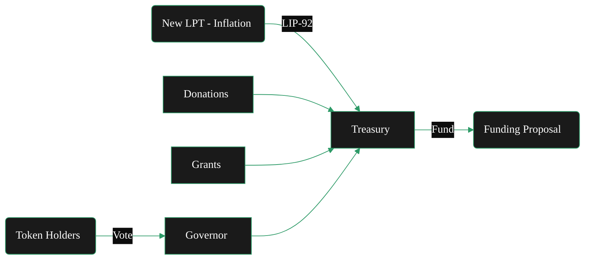

{/* codex-i18n: eyJraW5kIjoiY29kZXgtaTE4biIsInZlcnNpb24iOjEsInNvdXJjZVBhdGgiOiJ2Mi9hYm91dC9saXZlcGVlci1wcm90b2NvbC90cmVhc3VyeS5tZHgiLCJzb3VyY2VSb3V0ZSI6InYyL2Fib3V0L2xpdmVwZWVyLXByb3RvY29sL3RyZWFzdXJ5Iiwic291cmNlSGFzaCI6IjAyMDE4OGMxNzRmZjA1MDMxZDYyYmEzYzlkNDhlZmY4NDgwMDdlNDliODg5ZmJiZTFhNmU2ZmNkMjE5Y2M1ZDEiLCJsYW5ndWFnZSI6ImZyIiwicHJvdmlkZXIiOiJvcGVucm91dGVyIiwibW9kZWwiOiJvcGVuYWkvZ3B0LW9zcy0yMGI6ZnJlZSIsImdlbmVyYXRlZEF0IjoiMjAyNi0wMi0yNlQxMzowNTo1NC42NzhaIn0= */}
{/* 
This page describes:
5. **Treasury**

   * Funding source
   * Inflation allocation
   * Grants / SPEs
   * Budget governance 

BUT - only briefly - it lives in token.

*/}
import { CardTitleTextWithArrow } from '/snippets/components/primitives/text.jsx'
import { CustomDivider } from '/snippets/components/primitives/divider.jsx'
import { Quote } from '/snippets/components/content/quote.jsx'
import { DynamicTable } from '/snippets/components/layout/table.jsx'

<div style={{ display: "flex", justifyContent: "center", padding: 0, margin: 0}}>
  <CardTitleTextWithArrow icon="piggy-bank" horizontal href="https://explorer.livepeer.org/treasury"> Livepeer Treasury </CardTitleTextWithArrow> 
</div>
<CustomDivider style={{margin: 0, marginBottom: "-1rem"}} />

<Quote>
The Livepeer Treasury is a smart contract-controlled pool of LPT tokens funded through protocol inflation and penalty mechanisms. It serves as the protocol’s capital allocator - financing public goods and ecosystem development, and is governed by token holders via LIP proposals.
</Quote>

## Genèse
À la fin de 2023, la communauté a adopté plusieurs propositions créant le trésor Livepeer. 

- **Création & Gouvernance**: 
   - [LIP‑89](https://github.com/livepeer/LIPs/blob/main/LIPs/LIP-0089.md) a établi le [Trésor](./treasury)
   - Il a déployé un gouverneur OpenZeppelin personnalisé (avec un seuil de proposition de 100 LPT et un vote pondéré par mise)
{/* - [LIP-89](https://github.com/livepeer/LIPs/blob/main/LIPs/LIP-0089.md) introduced a treasury contract managed by Livepeer’s Governor framework. Any token holder can propose using treasury funds. Treasury proposals follow the standard governance rules: stake 100 LPT to propose, then voting requires ≥33% quorum and &gt;50% “For” to pass (identical to protocol votes). Once passed, the treasury contract executes the transfer (of LPT or ETH) to the specified recipient. */}
- **Financement**: 
   - [LIP‑92](https://github.com/livepeer/LIPs/blob/main/LIPs/LIP-0092.md) définit l'allocation de revenus sur la chaîne : envoyant **10% des nouvelles LPT** émissions dans le trésor.
   {/* - Initially, the treasury holds whatever funds were donated or allocated during genesis and via special proposals. There is no automatic tax today. [LIP-92](https://github.com/livepeer/LIPs/blob/main/LIPs/LIP-0092.md) has been discussed as a way to deduct a small percentage of protocol inflation each round and add it to the treasury. Other funding methods include grants, donations, or revenue-sharing agreements. Any change to treasury funding (like LIP-92) must be approved by token-holder vote. */}
- **Utilisation**:} 
   - [LIP‑90](https://github.com/livepeer/LIPs/blob/main/LIPs/LIP-0090.md) a établi que le trésor devrait financer les biens publics.
   - Les propositions approuvées peuvent allouer les actifs du trésor à des projets qui bénéficient à l'écosystème Livepeer. 
   {/* - For example, Special Purpose Entities (teams building tools, education, security audits, etc.) can apply for grants from the treasury. All spending is transparent on-chain. The Community Forum often hosts calls or discussions with applicants, and final decisions rest with the on-chain vote. */}

<div sytle={{ display: "flex", justifyContent: "center", margin: "0 1rem" }}>

</div>
{/* https://github.com/shtukaresearch/livepeer-data-geography/blob/651a56e8c8290b30855f1393543ee9e0961c071c/roles/spe.md
The Livepeer treasury is allocated to ecosystem projects via so-called special-purpose entities (SPEs) who vie for budget allocations through a competitive grant application process. A dashboard of SPE with active funding allocations can be found here.

Scenarios
An SPE or prospective SPE operator must develop Livepeer ecosystem programmes and apply to the DAO for funding.

Identify opportunities for funded contributions.
Into which focus areas are funds most likely to be allocated?
Data availability score: 0 (no treasury allocation strategy)
Potential resource. Develop and publich ecosystem funding strategy.
How much existing competition for funding is there in my focus area?
Resource. Trawling Treasury forum
Data availability score: 4
Decide parameters (amount, focus area) to pitch an application for funding.
How much have previous grant applicants in similar focus areas received?
Resource. Trawling Treasury forum
Data availability score: 4
Which grants were rejected or revisions requested because they asked for too much funding or support?
Resource. Trawling Treasury forum; Treasury explorer
Data availability score: 4
Views: Governance (all subviews). */}

{/* <iframe src="https://dune.com/dob/livepeer-treasury" width="100%" height="500px" frameBorder="0"></iframe> */}

## Objectifs
Le trésor est conçu pour :

- **Soutenir la croissance de l'écosystème** en finançant le développement de base, les outils, les intégrations et la R&D
- **Améliorer la sécurité du protocole** en soutenant les audits, la conception d'incitations et les primes aux bugs
- **Décentraliser la gouvernance** via un vote sur chaîne sur les propositions de financement (LIPs)
- **Permettre la coordination à long terme** au-delà du champ d'action d'un seul acteur ou d'une seule entreprise

## Sources de financement

Livepeer’s trésorerie s'accroît de valeur provenant de ces sources principales (en 2026) :

1. **Inflation du protocole**: 25 % des LPT nouvellement créés (récompenses inflationnistes LPT) sont envoyés directement au trésor communautaire sur chaîne à chaque tour. (dans un multisig contrôlé par la Fondation Livepeer et les gardiens communautaires.)
2. **Pénalités de slashing**: lorsqu'un orchestrateur est sanctionné, 50 % du LPT sanctionné est brûlé et 50 % est transféré au trésor.
3. **Restes du pool de frais**: si les passerelles/émissions déposent plus de ETH que ce qui est finalement payé via les tickets gagnants, le reste est transféré au trésor. 
4. **Transferts directs LIP**: les entités communautaires ou multisig peuvent déposer LPT manuellement via des propositions LIP.

<DynamicTable
  headerList={["Source", "Description"]}
  itemsList={[
    { "Source": "Inflationary Minting", "Description": "% of each round’s LPT minted is routed to treasury" },
    { "Source": "Slashing Penalties", "Description": "Orchestrator misbehavior results in partial burn + treasury deposit" },
    { "Source": "Ticket Fee Remainders", "Description": "Unclaimed or expired broadcaster deposits are swept to the treasury" },
    { "Source": "Direct LIP Transfers", "Description": "Community or multisig entities can deposit LPT manually" },
  ]}
  margin= "0 0 -1rem 0"
/>

## Utilisation des fonds
Le but du trésor est de financer les biens publics.

Cela inclut le développement, les subventions, les audits de sécurité, la recherche, les initiatives opérationnelles, les outils et les initiatives de croissance de l'écosystème qui bénéficient à l'ensemble de l'écosystème (selon la détermination de la communauté). 
{/* Examples include grants for improving monitoring infrastructure, research into verifiable transcoding and support for builders.  */}

<DynamicTable
  tableTitle={<span style={{fontSize: '1rem'}}>Fund Use Cases</span>}
  headerList={["Category", "Examples"]}
  itemsList={[
    { "Category": "Core Development", "Examples": "Protocol upgrades, contract rewrites, Arbitrum migrations" },
    { "Category": "Ecosystem Grants", "Examples": "Funding for clients, indexers, AI integrations" },
    { "Category": "Public Goods", "Examples": "Documentation, SDKs, Explorer enhancements" },
    { "Category": "Security & Audits", "Examples": "Formal audits of bonding/ticket contracts" },
    { "Category": "Community Campaigns", "Examples": "Education, marketing, live events" },
    { "Category": "Contributor Payments", "Examples": "Retroactive or milestone-based compensation" },
  ]}
  margin="0 0 -1rem 0"
/>

> _Voir [LIP-73](https://github.com/livepeer/LIPs/blob/main/LIPs/LIP-0073.md) et [LIP-77](https://github.com/livepeer/LIPs/blob/main/LIPs/LIP-0077.md) pour des exemples_

<Card title="Livepeer Explorer - Treasury Dashboard" icon="globe" href="https://explorer.livepeer.org/treasury" arrow horizontal > Monitor on-chain staking, proposals, and treasury transactions in real time on the Livepeer Explorer </Card>
{/* When the treasury balance reached a pre‑defined cap, contributions paused; future LIPs can adjust the rate or resume funding. */}

## Gouvernance
Le trésor utilise le même [modèle de gouvernance & processus](governance-model) comme le protocole (bien que mis en œuvre par un contrat Governor séparé):
{/* Compound-style Governor contract customized for Livepeer. */}
- **Propositions**: Stakez 100 LPT pour proposer.
- **Vote**: Tout jeton mis en jeu (orchestrateurs + délégateurs) peut voter sur la subvention. Les délégateurs laissent normalement leur opérateur voter en leur nom, mais peuvent se détacher pour voter séparément.
- **Quorum/Seuil**: Identique au protocole : 33 % du stake doit participer, avec une majorité en faveur.
- **Exécution**: Si adopté, le Gouverneur libère les fonds immédiatement. En cas d'échec, le stake est retourné et les fonds restent intacts.

### Rapports et transparence 

Les soldes du Trésor, les décaissements et les résultats historiques des LIP sont visibles publiquement via :

- [Livepeer Explorateur](https://explorer.livepeer.org/treasury): Suivez le Trésor en chaîne via l'Livepeer Explorateur – Page du Trésor. 
- Historique de gouvernance sur [Arbiscan](https://arbiscan.io/address/0x363cdB9BaE210Ef182c60b5a496139E980330127#code): Toutes les propositions, votes et paiements sont publics
- Événements de distribution dans [ABI](https://arbiscan.io/address/0x363cdB9BaE210Ef182c60b5a496139E980330127#code)
      ```javascript Example Query (using ethers.js)
      const event = TreasuryContract.filters.TreasuryWithdrawal()
      provider.on(event, (log) => console.log(log.args))
      ```
- Pour des exemples historiques, consultez le [Fils de discussion du forum](https://forum.livepeer.org/c/treasury/20) sur les propositions de financement ou les registres de vote de l'explorateur.
- Suivez les mises à jour des jalons et les rapports sur le [Livepeer Forum](https://forum.livepeer.org/c/treasury/20).

{/* ## Grants & Allocations
The Livepeer treasury is allocated to ecosystem projects via so-called special-purpose entities (SPEs) who vie for budget allocations through a competitive grant application process. 

Spending proposals must be approved by governance, ensuring transparency and accountability. 

Special‑purpose entities (SPEs) can request allocations to execute scoped projects (e.g., building a verification framework, developing new codecs) and must report back on milestones. 

This structure turns inflation into a community‑directed investment in the protocol’s long‑term health rather than pure dilution. */}

## Livepeer Rôle de la Fondation

Alors que le trésor sur chaîne est entièrement gouverné par la communauté, la Livepeer Fondation joue un rôle important en tant que gardien neutre des processus de financement et des résultats.
<Info> 
{/* The Livepeer Foundation is a non-profit organisation that stewards the long-term vision, ecosystem growth, and core development of the Livepeer network.  */}
{/* <br/><br/>  */}
**Treasury mechanics remain on-chain and community governance-controlled** 
- The community controls the money 
- The Foundation ensures the money is effectively & accountably used.
</Info>
Son rôle comprend:
- **Orchestration de la gouvernance**: Garantit que les propositions de trésor passent efficacement de l'idée à l'exécution sur chaîne grâce à des processus structurés et à la coordination.
   {/* 
   The Foundation ensures that treasury proposals move from idea → draft → community review → on-chain execution.
      This includes:

      - Structuring proposal frameworks (SPEs, budget formats, milestones)
      - Coordinating review cycles and community calls
      - Ensuring proposals are sufficiently specified before vote
      - Facilitating execution after approval
      Without this layer, treasury funds stall in process friction.
    */}
- **Responsabilité & Supervision des jalons**: Maintient la transparence et suit les livrables afin que les fonds approuvés se traduisent en résultats mesurables.
      {/* <div> 
      Once treasury funds are approved, the Foundation helps ensure:
         - Deliverables are tracked
         - Milestones are reported publicly
         - Budget usage aligns with scope
         - Underperforming initiatives are surfaced
      They do not “police” spending - they maintain transparency and continuity so governance decisions compound rather than fragment.
      </div> */}
- **Encadrement du capital stratégique**: Aide à définir les priorités de financement et la stratégie d'allocation à long terme alignée sur la santé du réseau.
   {/* 
   The Foundation helps define:
      - What categories of work treasury should fund (protocol R&D, ecosystem growth, infra, coordination)
      - Multi-quarter budgeting horizons
      - Tradeoffs between short-term impact and long-term network health
   They frame the strategy - the community votes on allocation.
    */}
- **Facilitation de l'exécution**: Aligne les contributeurs et élimine les obstacles afin que les initiatives financées par le trésor soient réellement livrées.
   {/* 
      Treasury funding is only valuable if someone can execute.

      The Foundation:
      - Identifies capable contributors
      - Aligns working groups
      - Removes operational blockers
      - Bridges Foundation resources with independent SPEs

      This converts governance intent into shipped outcomes.
   */}
- **Santé du réseau à long terme**: Gère le déploiement du trésor pour renforcer la sécurité du protocole, la décentralisation et la croissance de l'écosystème.
   {/* 
   The treasury exists to strengthen:
      - **Protocol security** - audits, formal verification, incentive design
      - **Decentralization** - reducing validator/operator concentration, enabling new node types
      - **Supply-side resilience** - transcoder infrastructure, redundancy, geographic distribution
      - **Demand-side growth** - application integrations, developer tooling, use-case expansion
      - **Tooling and ecosystem expansion** - SDKs, monitoring, indexing, public goods

   The Foundation’s role is to ensure treasury deployment reinforces these pillars rather than drifting into reactive or fragmented spending.
    */}

{/* The community controls the money.
The Foundation ensures the money gets used well.

They are not the treasury owner.
They are the steward of treasury effectiveness. */}

{/* 
- **Shapes/coordinates the governance pipeline** so treasury proposals get written, reviewed, and executed via the community’s SPE + voting process.
- **Convenes/participates in Advisory Boards** (incl. governance/treasury focus) to align priorities and unblock proposal work.
- **Supports the SPE framework** (templates, reporting, accountability), often via GovWorks-type operations.
- **Coordinates core ecosystem work** (incl. onboarding/aligning technical SPEs, convening dev syncs, mediating ecosystem-level conflicts), 
- Helps ensure **accountability** for allocated fund use. */ }

## Architecture des contrats

- Nom du contrat : `Treasury`
- Déploiement : Arbitrum One

_**Rôle du contrat**_

- Détient LPT fonds
- Accepte autorisé `distribute()` appels de la gouvernance
- Émet `TreasuryWithdrawal` événements sur les dépenses approuvées

<Card title="Treasury Contract on Arbiscan" icon="ethereum" href="https://arbiscan.io/address/0x363cdB9BaE210Ef182c60b5a496139E980330127#code" arrow horizontal > See the full Tresury contract ABI and transaction details on Arbiscan </Card> 

## Discussions d'amélioration
Pour garantir que les dépenses du trésor sont alignées sur les objectifs du protocole, la communauté Livepeer a expérimenté des cadres pour le financement des biens publics. 

- Un exemple est le [**modèle de subvention transparent basé sur des jalons**](https://forum.livepeer.org/t/treasury-grant-process/3250): les proposeurs soumettent des budgets et des livrables, les fonds sont libérés en tranches à la réalisation et les progrès sont publiquement rapportés sur le forum. 
- Un autre est [**financement quadratique**](https://forum.livepeer.org/t/quadratic-funding/3251), qui pourrait correspondre aux dons communautaires provenant du trésor pour signaler un fort soutien de base. Les discussions ont également exploré le financement rétroactif de style réseau regen, où les contributions sont récompensées après que l'impact a été démontré. 

Ces expériences reflètent l'engagement d'une communauté mûrie et investie envers une allocation de ressources inclusive et responsable.

{/* ## Long-Term Vision */}

## Ressources supplémentaires
<Card title="Treasury Documentation" icon="piggy-bank" href="/v2/fr/lpt/treasury/overview" arrow horizontal > See the Livepeer Treasury documentation in the [LP Token](/v2/fr/lpt/treasury/overview) section for comprehensive technical details and guides on voting and porposals. </Card>
<Columns cols={2}>
   <Card title="LIP-89: Treasury Proposal" icon="file" href="https://github.com/livepeer/LIPs/blob/master/LIPs/LIP-89.md"> Specification for the on-chain Treasury and governance framework </Card> 
   <Card title="LIP-92: Treasury Funding" icon="message" href="https://forum.livepeer.org/t/lip-92-livepeer-treasury-contribution-percentage/3249"> Discussion of allocating a percentage of inflation to the treasury </Card> 
   <Card title="Treasury Explorer" icon="globe" href="https://explorer.livepeer.org/treasury" > On-chain treasury transactions </Card>
   <Card title="Messari Report" icon="scroll" href="https://messari.io/asset/livepeer/reports" > Messari Report: Livepeer Treasury </Card>
   <Card title="Treasury Analytics" icon="chart-line" href="https://dune.com/dob/livepeer-treasury" > Dune Dashboard Analytics </Card>
   <Card href="https://www.karmahq.xyz/community/livepeer" title="Community SPE Dashboard" icon="boxes" > SPE Project Dashboard </Card>
   <Card href="https://arbiscan.io/address/0x363cdB9BaE210Ef182c60b5a496139E980330127#code" title="Treasury Contract" icon="ethereum" > Treasury Contract on Arbiscan </Card>
   <Card href="https://github.com/livepeer/protocol/blob/e8b6243c/contracts/governance/Treasury.sol" title="Treasury Contract" icon="github" > Treasury Contract on Github </Card>
</Columns>
