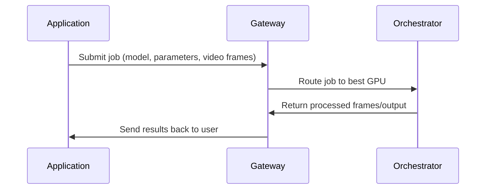

{/* codex-i18n: eyJraW5kIjoiY29kZXgtaTE4biIsInZlcnNpb24iOjEsInNvdXJjZVBhdGgiOiJ2Mi9hYm91dC9yZXNvdXJjZXMvZ2F0ZXdheXMtdnMtb3JjaGVzdHJhdG9ycy5tZHgiLCJzb3VyY2VSb3V0ZSI6InYyL2Fib3V0L3Jlc291cmNlcy9nYXRld2F5cy12cy1vcmNoZXN0cmF0b3JzIiwic291cmNlSGFzaCI6ImQwMmIyOTYzNTY1M2VlMGZkNmM0MzlkYjEyNWJkNTY1ZmY3NTc5NTUxYWEwNjI3MjdmODU4ZTE3YThhMDYyNDAiLCJsYW5ndWFnZSI6ImZyIiwicHJvdmlkZXIiOiJvcGVucm91dGVyIiwibW9kZWwiOiJvcGVuYWkvZ3B0LW9zcy0xMjBiOmZyZWUiLCJnZW5lcmF0ZWRBdCI6IjIwMjYtMDItMjZUMTg6MTE6MjguOTYyWiJ9 */}
---

## Vue d'ensemble

En bref :

<Callout >

<Icon icon="torii-gate" /> **Gateways coordinate.**

<Icon icon="microchip"/> **Orchestrators compute.**

</Callout>

Ensemble, ils constituent l'épine dorsale du pipeline vidéo IA Livepeer.

| Rôle             | Fonction                                       | Effectue‑t‑il le travail GPU ? | Orienté vers l'extérieur ? |
| ---------------- | ---------------------------------------------- | ------------------ | ---------------- |
| **Passerelle**      | Réception des tâches, tarification, routage, correspondance des capacités | ❌ Non              | ✅ Oui           |
| **Orchestrateur** | Calcul GPU, inférence, transcodage, BYOC      | ✅ Oui             | ❌ Non            |

## Responsabilités de la passerelle

Les passerelles agissent comme la porte d'entrée du réseau :

- Recevoir des tâches des applications
- Déterminer le modèle, le pipeline ou le GPU requis
- Sélectionner le meilleur orchestrateur en fonction des performances et du prix
- Acheminer la charge de travail avec une faible latence
- Retourner les résultats au client
- Publier les offres du marketplace (modèles, pipelines, coût par image, etc.)

Les passerelles fournissent _intelligence de service_, pas de calcul.

---

## Responsabilités de l'Orchestrateur

Les orchestrateurs sont des opérateurs GPU qui exécutent :

- Inférence IA en temps réel
- Pipelines Daydream / ComfyStream
- Conteneurs BYOC
- Transcodage traditionnel

Ils fournissent :

- Puissance GPU
- Exécution du modèle
- Sortie déterministe et vérifiable
- Garanties de performance

Ils n'exposent pas directement les API externes - les passerelles s'en occupent.
