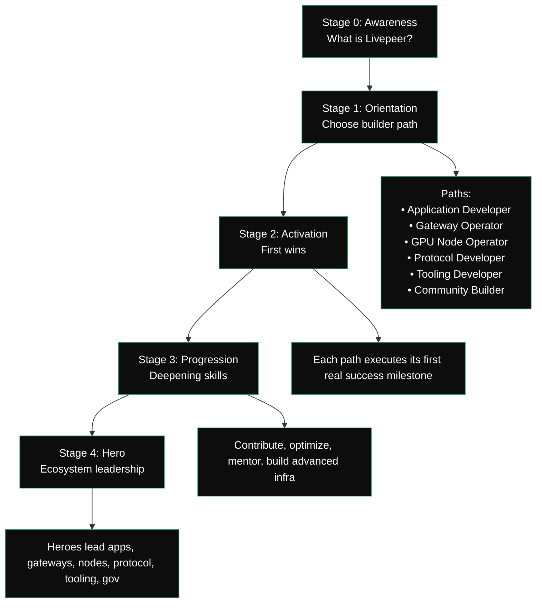

{/* codex-i18n: eyJraW5kIjoiY29kZXgtaTE4biIsInZlcnNpb24iOjEsInNvdXJjZVBhdGgiOiJ2Mi9kZXZlbG9wZXJzL2RldmVsb3Blci1qb3VybmV5Lm1keCIsInNvdXJjZVJvdXRlIjoidjIvZGV2ZWxvcGVycy9kZXZlbG9wZXItam91cm5leSIsInNvdXJjZUhhc2giOiI3ZGY1ZTM0N2Q2ODc2ZWI0NDc4N2EyZWQxODgzOGI0ZjA1MzIxNTljNWY5NGM4YTVlMzVmNzUwNTQ1NTIwY2EwIiwibGFuZ3VhZ2UiOiJmciIsInByb3ZpZGVyIjoib3BlbnJvdXRlciIsIm1vZGVsIjoib3BlbmFpL2dwdC1vc3MtMTIwYjpmcmVlIiwiZ2VuZXJhdGVkQXQiOiIyMDI2LTAyLTI3VDAyOjE4OjEyLjU2N1oifQ== */}
| Étape | Nom        | Objectif                                             | Résultats                                                                           |
| ----- | ----------- | --------------------------------------------------- | ---------------------------------------------------------------------------------- |
| 0     | Conscience   | Comprendre Livepeer, modèle de calcul, rôles de l'écosystème | Clarté sur Protocole → Réseau → Applications ; modèle mental de base                           |
| 1     | Orientation | Identifier quelle persona de constructeur correspond à leurs objectifs     | Chemin choisi : Développement d'application, Opérateur de passerelle, Nœud GPU, Développement de protocole, Outils, Communauté |
| 2     | Activation  | Effectuer la première action significative dans le chemin choisi      | "Première victoire" obtenue : application construite, nœud déployé, contrat rédigé, outil créé     |
| 3     | Progression | Augmenter l'expertise et la contribution                 | Contributions, optimisations, mentorat, flux de travail avancés                        |
| 4     | Héros        | Devenir un leader/gestionnaire dans l'écosystème            | Opérer à grande échelle, publier des outils, rédiger des propositions, gérer des programmes                    |

