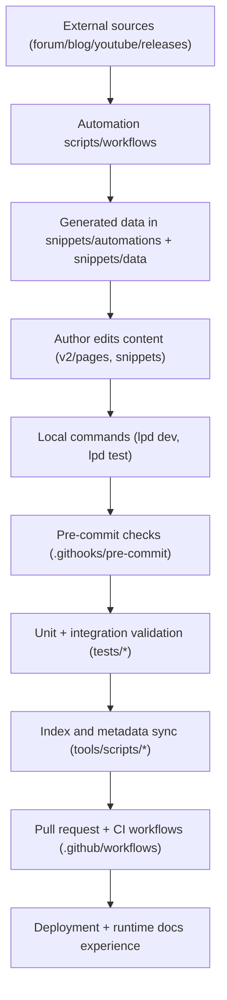

{/* codex-i18n: eyJraW5kIjoiY29kZXgtaTE4biIsInZlcnNpb24iOjEsInNvdXJjZVBhdGgiOiJkb2NzLWd1aWRlL2FyY2hpdGVjdHVyZS1tYXAubWR4Iiwic291cmNlUm91dGUiOiJkb2NzLWd1aWRlL2FyY2hpdGVjdHVyZS1tYXAiLCJzb3VyY2VIYXNoIjoiNGJlZWU5YTFiYTI3YmE1NGY4ZGZiYzgzMjI0NDI0OTBmNWFlYzA5NjJjZmNiYmZkMjBjZjEzOGIyNTg4NmY2MyIsImxhbmd1YWdlIjoiZnIiLCJwcm92aWRlciI6Im9wZW5yb3V0ZXIiLCJtb2RlbCI6InF3ZW4vcXdlbi10dXJibyIsImdlbmVyYXRlZEF0IjoiMjAyNi0wMy0wMVQxNzoxNjo0MC4xNDNaIn0= */}
Ceci est une carte des systèmes internes sur la manière dont le contenu, les outils, la validation et l'automatisation interagissent.

## Composants de niveau supérieur

- Source de contenu : `v2/pages/**`, `snippets/**`, `docs.json`
- UX en temps réel : Mintlify dev/build + déploiement des documents hébergés
- Outils pour opérateur local : `lpd`, `.githooks/*`, `tools/scripts/*`, `tests/*`
- CI/automatisation : `.github/workflows/*`, `.github/scripts/*`, `snippets/automations/*`
- Documents de gouvernance : `README.md`, `docs-guide/*`, `contribute/CONTRIBUTING/*`

## Flux de données et de contrôle

## Niveaux d'exécution

### Niveau 1 : Rédaction + Système de contenu

- Les pages et extraits en Markdown/MDX sont les primitives de contenu modifiables.
- `docs.json` définit le contexte de navigation et de routage.

### Niveau 2 : Application locale

- `lpd` orchestre la configuration/dev/tests/hooks/scripts.
- Le hook de pré-validation exécute des contrôles rapides de sécurité et des audits progressifs.
- Les exécuteurs de tests valident le style, le MDX, les liens/importations, la qualité, la navigation des documents et les documents des scripts.

### Niveau 3 : CI + Automatisation

- Les workflows exécutent des vérifications de qualité des fichiers modifiés et des tests navigateur pour les PR.
- Les workflows planifiés/manuels mettent à jour les données externes et les ressources associées.
- Les workflows de modèles et d'entrée imposent la qualité et l'étiquetage des problèmes/PR.

### Niveau 4 : Gouvernance des documents

- `docs-guide/` définit la source de vérité de la navigation interne.
- `README.md` fournit une orientation de haut niveau et pointe vers les pages du guide de documentation canonique.

## Bords de contrat clés

1. Contrat de métadonnées de script :
   - En-têtes de script -> génération d'index de script -> catalogue de scripts du guide de documentation.
2. Contrat de workflow/modèle :
   - `.github/workflows/*` + `.github/ISSUE_TEMPLATE/*` -> index générés du guide de documentation.
3. Contrat de validité du contenu :
   - Changements de contenu -> hooks/tests -> CI -> documents déployables.
