{/* codex-i18n: eyJraW5kIjoiY29kZXgtaTE4biIsInZlcnNpb24iOjEsInNvdXJjZVBhdGgiOiJ2Mi9nYXRld2F5cy9ydW4tYS1nYXRld2F5L2NvbmZpZ3VyZS92aWRlby1jb25maWd1cmF0aW9uLm1keCIsInNvdXJjZVJvdXRlIjoidjIvZ2F0ZXdheXMvcnVuLWEtZ2F0ZXdheS9jb25maWd1cmUvdmlkZW8tY29uZmlndXJhdGlvbiIsInNvdXJjZUhhc2giOiI4MjFiOGY1Y2Q5YTUwMTZkYWI1YTc3MWFiMmY0NTg3N2NmODk3YzUyYTRhOTZmZjEyYTg3MmY5MjcwYTUxYjc0IiwibGFuZ3VhZ2UiOiJmciIsInByb3ZpZGVyIjoib3BlbnJvdXRlciIsIm1vZGVsIjoicXdlbi9xd2VuLXR1cmJvIiwiZ2VuZXJhdGVkQXQiOiIyMDI2LTAyLTI3VDE0OjEwOjM4Ljg0OFoifQ== */}
<Danger>
  {' '}
  Ugh I hate this page. I think its best to move everything to quickstart and have
  this be a comprehensive flag overview{' '}
</Danger>

import { DoubleIconLink } from '/snippets/components/primitives/links.jsx'
import { DynamicTable } from '/snippets/components/layout/table.jsx'
import { ScrollableDiagram } from '/snippets/components/content/zoomableDiagram.jsx'
import { CustomResponseField } from '/snippets/components/content/responseField.jsx'
import { CustomDivider } from '/snippets/components/primitives/divider.jsx'

{/* Page Flow:

1. Intro
2. Diagram
3. Main Flags
4. Quickstart Code
5. Full Config Guide Options */}

## TL;DR Configuration

Si vous voulez simplement un passerelle vidéo fonctionnelle, utilisez la commande ci-dessous :

<Tabs>
<Tab title="Off-Chain" icon="terminal">
Replace <Badge color="gray">{'<ORCHESTRATOR_ADDRESSES>'}</Badge> with your locally running orchestrator http address.
```bash wrap lines icon="terminal" Off-Chain Video Gateway
livepeer -gateway \
  -network offchain \
  # Minimum required video flags
  -rtmpAddr=0.0.0.0:1935 \
  -httpAddr=0.0.0.0:8935 \
  -transcodingOptions=P240p30fps16x9,P360p30fps16x9 \
  # You will need to add your local orchestrator address if you are running off-chain
  -orchAddr=<ORCHESTRATOR_ADDRESSES> #comma separated list of orchestrator addresses
  # Example: -orchAddr=http://192.168.1.100:8935,http://192.168.1.101:8935
  # You can also use a JSON file: -orchAddr=/path/to/orchestrators/orchestrators-portal.json
```
</Tab>
<Tab title="On-Chain" icon="link">
Replace <Badge color="gray">{'<ORCHESTRATOR_ADDRESSES>'}</Badge> with publicly available orchestrator addresses.

```bash wrap lines icon="link" On-Chain Video Gateway
livepeer -gateway \
  -network arbitrum-one-mainnet \
  # See the on-chain setup guide for more details on these flags
  -ethUrl=<YOUR_RPC_URL> \
  -ethAcctAddr=<YOUR_ETH_ADDRESS> \
  -ethPassword=<YOUR_PASSWORD> \
  -ethKeystorePath=<KEYSTORE_PATH> \
  # Minimum required video flags
  -rtmpAddr=0.0.0.0:1935 \
  -httpAddr=0.0.0.0:8935 \
  -transcodingOptions=P240p30fps16x9,P360p30fps16x9 \
  # Price per unit is required on-chain (see pricing guide)
  -maxPricePerUnit=1000 \
  # You will need to connect to a public orchestrator if you are running onchain
  -orchAddr=<ORCHESTRATOR_ADDRESSES> #comma separated list of orchestrators
  # Example:  -orchAddr=https://orch1.example.com:8935,https://orch2.example.com:8935
  # You can also use a JSON file: -orchAddr=/path/to/orchestrators/orchestrators-portal.json

```

Livepeer does not currently maintain a list of publicly available Orchestrators. You need to discover them through:

- **Livepeer CLI**: Use livepeer_cli → Option 9: "List registered orchestrators"
- **Network discovery**: The gateway discovers orchestrators from the on-chain registry
- **Community resources**: Check Livepeer community channels or documentation

Jump to the <DoubleIconLink label="Connect Guide" href="/v2/fr/gateways/run-a-gateway/connect/connect-with-offerings" iconLeft="link" /> for details on connecting to orchestrators.

</Tab>
</Tabs>

<CustomDivider middleText="OVERVIEW" />
{/* 1. Intro */}
Passerelles pour la transcodage vidéo Dans le transcodage vidéo traditionnel, le Gateway ingère les flux vidéo via[RTMP](https://en.wikipedia.org/wiki/Real-Time_Messaging_Protocol) ou[HTTP](https://en.wikipedia.org/wiki/Hypertext_Transfer_Protocol), segments
them, and distributes transcoding work to Orchestrators{' '}

{/* The workflow involves segmenting video, sending segments with payments to Orchestrators,
receiving transcoded results, and serving them via HLS .

Gateways that receive a live or recorded RTMP stream need to transcode it into multiple renditions before sending it to Orchestrators for distribution. */}

{/* Key components include:

- **[BroadcastSessionsManager](https://github.com/livepeer/go-livepeer/blob/5691cb48/core/broadcast.go)**: Manages transcoding sessions and selects Orchestrators
- **[RTMP](https://en.wikipedia.org/wiki/Real-Time_Messaging_Protocol) Server**: Handles RTMP (Real-Time Message Protocol) stream ingestion
- **[Payment Manager](https://github.com/livepeer/go-livepeer/blob/5691cb48/core/live_payment.go)**: Generates and sends payment tickets for transcoding work */}

{/* 2. Diagram */}

```mermaid
%%{init: {'theme': 'base', 'themeVariables': { 'primaryColor': '#1a1a1a', 'primaryTextColor': '#fff', 'primaryBorderColor': '#2d9a67', 'lineColor': '#2d9a67', 'secondaryColor': '#0d0d0d', 'tertiaryColor': '#1a1a1a', 'background': '#0d0d0d', 'fontFamily': 'system-ui' }}}%%
flowchart TB
    subgraph INPUT["Video Input Sources"]
        direction LR
        RTMP["RTMP Stream<br/>:1935"]
        HTTP["HTTP Upload<br/>:8935"]
    end

    GATEWAY["Gateway Node<br/>LivepeerNode<br/>-gateway mode"]

    INPUT --> GATEWAY

    subgraph MANAGER["Broadcast Session Manager"]
        BSM["BroadcastSessionsManager<br/>Manages transcoding sessions<br/>Selects orchestrators"]
    end

    GATEWAY --> BSM

    subgraph PROCESSING["Video Processing Pipeline"]
        direction TB
        SEG["Segment Video<br/>Split into chunks"]
        TRANS["Send to Orchestrators<br/>with payment tickets"]
        ORCH["Orchestrators<br/>Transcode segments<br/>Multiple renditions"]
        RECEIVE["Receive Results<br/>Transcoded segments"]
    end

    BSM --> SEG --> TRANS --> ORCH --> RECEIVE

    subgraph OUTPUT["Output & Delivery"]
        direction LR
        HLS["HLS Manifest<br/>.m3u8"]
        RENDITIONS["Multiple Renditions<br/>240p, 360p, 720p, 1080p"]
    end

    RECEIVE --> HLS --> RENDITIONS

    subgraph PAYMENT["Payment System"]
        direction TB
        PM["Payment Manager<br/>Generate tickets"]
        TICKETS["Per-segment payments<br/>Based on pixels transcoded"]
    end

    TRANS --> PM --> TICKETS --> ORCH

    subgraph STORAGE["Storage (Optional)"]
        OBJ["Object Store<br/>S3/IPFS"]
    end

    RENDITIONS -.-> OBJ

    classDef default fill:#1a1a1a,color:#fff,stroke:#2d9a67,stroke-width:2px
    classDef video fill:#1a1a1a,color:#fff,stroke:#3b82f6,stroke-width:2px
    classDef payment fill:#1a1a1a,color:#fff,stroke:#fbbf24,stroke-width:2px
    class RTMP,HTTP,BSM,SEG,TRANS,ORCH,RECEIVE,HLS,RENDITIONS video
    class PM,TICKETS payment
    style INPUT fill:#0d0d0d,stroke:#2d9a67,stroke-width:1px
    style MANAGER fill:#0d0d0d,stroke:#3b82f6,stroke-width:1px
    style PROCESSING fill:#0d0d0d,stroke:#3b82f6,stroke-width:1px
    style OUTPUT fill:#0d0d0d,stroke:#3b82f6,stroke-width:1px
    style PAYMENT fill:#0d0d0d,stroke:#fbbf24,stroke-width:1px
    style STORAGE fill:#0d0d0d,stroke:#2d9a67,stroke-width:1px,stroke-dasharray: 5 5
```

<ScrollableDiagram title="Video Gateway Transcoding Architecture" maxHeight="900px">



</ScrollableDiagram>

<Card
  title="Code Reference"
  icon="github"
  href="https://github.com/livepeer/go-livepeer/blob/5691cb48/core/livepeernode.go"
  horizontal
  arrow
>
  go-livepeer/core/livepeernode.go
</Card>

{/* 3. Main Flags */}

## Indicateurs de configuration essentiels

#### Indicateurs requis

<ResponseField name="-gateway" type="boolean" required default="false">
  Enable Gateway mode
</ResponseField>
<ResponseField name="-network" type="string" default="offchain" >
  Set to the blockchain network for production gateways <Badge color="gray"> `arbitrum-one-mainnet` </Badge>
</ResponseField>
<ResponseField name="-orchAddr" type="string" default="none" required>
  Set to <Badge color="gray"> `http://<ORCHESTRATOR_IP>:<PORT>` </Badge> to connect to orchestrators
</ResponseField>
#### Configuration du réseau
<ResponseField name="-rtmpAddr" type="string" default="127.0.0.1:1935">
  Set to <Badge color="gray"> `0.0.0.0:1935` </Badge> to allow external RTMP connections
</ResponseField>
<ResponseField name="-httpAddr" type="string" default="127.0.0.1:8935">
  Set to <Badge color="gray"> `0.0.0.0:8935` </Badge> to allow external HLS/API access
</ResponseField>
#### Configuration de la transcoding
<ResponseField name="-transcodingOptions" type="string" default="P240p30fps16x9,P360p30fps16x9">
  Set to <Badge color="gray"> `path/to/transcodingOptions.json` </Badge> to use a custom transcoding configuration
</ResponseField>
#### Indicateurs supplémentaires sur la chaîne
Ajoutez ces indicateurs pour la configuration sur la chaîne. Voir <DoubleIconLink label="On-Chain Setup Guide" href="/v2/gateways/run-a-gateway/requirements/on-chain%20setup/on-chain" iconLeft="link" /> pour plus de détails.

<CustomResponseField
  name="-network"
  type="string"
  default="offchain"
  post={[
    <span>
      <span style={{ color: 'gray' }}>value:</span>
      <span style={{ color: '#3b82f6' }}>"arbitrum-one-mainnet"</span>
    </span>,
  ]}
/>
<CustomResponseField
  name="-maxPricePerUnit"
  type="int"
  default="0"
  post={[
    <span>
      <span style={{ color: 'gray' }}>value:</span>
      <span style={{ color: '#3b82f6' }}>"1000"</span>
    </span>,
  ]}
/>
<CustomResponseField
  name="-ethUrl"
  type="string"
  default="none"
  post={[
    <span>
      <span style={{ color: 'gray' }}>value:</span>
      <span style={{ color: '#3b82f6' }}>"YOUR_RPC_URL"</span>
    </span>,
  ]}
  required
/>
<CustomResponseField
  name="-ethAcctAddr"
  type="string"
  default="leave empty to auto-create"
  post={[
    <span>
      <span style={{ color: 'gray' }}>value:</span>
      <span style={{ color: '#3b82f6' }}>"YOUR_ETH_ADDRESS"</span>
    </span>,
  ]}
/>
<CustomResponseField
  name="-ethPassword"
  type="string"
  default="leave empty to auto-create"
  post={[
    <span>
      <span style={{ color: 'gray' }}>value:</span>
      <span style={{ color: '#3b82f6' }}>"YOUR_PASSWORD"</span>
    </span>,
  ]}
/>
<CustomResponseField
  name="-ethKeystorePath"
  type="string"
  default="leave empty to auto-create"
  post={[
    <span>
      <span style={{ color: 'gray' }}>value:</span>
      <span style={{ color: '#3b82f6' }}>"KEYSTORE_PATH"</span>
    </span>,
  ]}
/>

<CustomDivider middleText="FULL CONFIGURATION GUIDE" />
## Guide complet de configuration

### Méthodes de configuration

Vous avez trois façons de configurer votre passerelle Livepeer après l'installation :

- Indicateurs de ligne de commande (les plus courants)
- Variables d'environnement (précédées de LP_)
- Fichier de configuration (format clé-valeur en texte brut)

### Exemples de configuration

Les exemples ci-dessous montrent les méthodes de configuration les plus courantes.

<Tabs>
<Tab title="CLI" icon="terminal">
.
</Tab>
<Tab title="Config File" icon="file">
.
</Tab>
<Tab title="Env Variables" icon="variable">
.
</Tab>
<Tab title="Docker" icon="docker">

```bash wrap icon="docker" Create docker-compose.yml
# 1. Create a basic docker-compose.yml
cat > docker-compose.yml << EOF
version: '3.9'
services:
  gateway:
    image: livepeer/go-livepeer:master
    ports:
      - 1935:1935  # RTMP ingest
      - 8935:8935  # HLS/API
    volumes:
      - gateway-data:/root/.lpData
    command: |
      -gateway
      -network offchain
      -rtmpAddr=0.0.0.0:1935
      -httpAddr=0.0.0.0:8935
      -orchAddr=https://orchestrator.example.com:8935
      -transcodingOptions=P240p30fps16x9,P360p30fps16x9,P720p30fps16x9

volumes:
  gateway-data:
EOF
```

Start the Gateway

```bash wrap icon="docker" Start the gateway
# 2. Start the gateway
docker-compose up -d
```

</Tab>
<Tab title="Binary" icon="code">
.
</Tab>
</Tabs>

```bash
livepeer -gateway \
  -network offchain \
  -transcodingOptions=${env:HOME}/.lpData/offchain/transcodingOptions.json \
  -orchAddr=0.0.0.0:8935 \
  -httpAddr=0.0.0.0:9935 \
  -v=6
```

<Tabs>
<Tab title="Docker" icon="docker">

```bash wrap icon="docker" Create docker-compose.yml
# 1. Create a basic docker-compose.yml
cat > docker-compose.yml << EOF
version: '3.9'
services:
  gateway:
    image: livepeer/go-livepeer:master
    ports:
      - 1935:1935  # RTMP ingest
      - 8935:8935  # HLS/API
    volumes:
      - gateway-data:/root/.lpData
    command: |
      -gateway
      -network arbitrum-one-mainnet
      -rtmpAddr=0.0.0.0:1935
      -httpAddr=0.0.0.0:8935
      -orchAddr=https://orchestrator.example.com:8935
      -transcodingOptions=P240p30fps16x9,P360p30fps16x9,P720p30fps16x9
      -ethUrl <YOUR_RPC_URL> \
      -ethAcctAddr <YOUR_ETH_ADDRESS> \
      -ethPassword <YOUR_PASSWORD> \
      -ethKeystorePath <KEYSTORE_PATH> \
      -maxPricePerUnit 1000

volumes:
  gateway-data:
EOF
```

Start the Gateway

```bash wrap icon="docker" Start the gateway
# 2. Start the gateway
docker-compose up -d
```

</Tab>
<Tab title="Binary" icon="code">
.
</Tab>
</Tabs>

```bash
livepeer -gateway \
  -network arbitrum-one-mainnet \
  -ethUrl=<YOUR_RPC_URL> \
  -ethAcctAddr=<YOUR_ETH_ADDRESS> \
  -ethPassword=<YOUR_PASSWORD> \
  -ethKeystorePath=<KEYSTORE_PATH> \
  -maxPricePerUnit=1000 \
  -orchAddr=<ORCHESTRATOR_ADDRESSES> \
  -monitor=true
```

## Options de transcodage JSON

Livepeer prend en charge les fichiers de configuration JSON pour les options de transcodage via le `-transcodingOptions` drapeau.

Le fichier transcodingOptions.json vous permet de contrôler précisément l'échelle de codage.

Ce fichier est un fichier de configuration personnalisé contenant un tableau d'objets de rendu qui définit quels rendus (résolutions + débits) votre Gateway produira pour chaque flux entrant.

Il remplace l'échelle intégrée par défaut (par exemple, P240p30fps16x9, etc.).

```json wrap lines icon="brackets-curly" transcodingOptions.json example
[
  {
    // required
    "bitrate": 1600000,
    "width": 854,
    "height": 480,
    // optional
    "name": "480p0",
    "fps": 0,
    "profile": "h264constrainedhigh",
    "gop": "1"
  },
  {
    // required
    "bitrate": 3000000,
    "width": 1280,
    "height": 720,
    // optional
    "name": "720p0",
    "fps": 0,
    "profile": "h264constrainedhigh",
    "gop": "1"
  },
  {
    // required
    "bitrate": 6500000,
    "width": 1920,
    "height": 1080,
    // optional
    "name": "1080p0",
    "fps": 0,
    "profile": "h264constrainedhigh",
    "gop": "1"
  }
]
```

#### Remarques

- La configuration JSON s'applique uniquement aux options de transcodage, et non aux autres indicateurs de passerelle
- Le fichier doit contenir un JSON valide avec la structure spécifiée
- Tous les champs sont facultatifs, sauf width, height et bitrate
- Vous pouvez mélanger la configuration JSON avec d'autres indicateurs de ligne de commande

<Card
  title="Next Step: Pricing Configuration"
  href="./pricing-configuration"
  icon="hand-holding-dollar"
  horizontal
  arrow
>
  Configure pricing for your gateway.
</Card>

## Référence complète des indicateurs de configuration

### Modifications essentielles

<DynamicTable
  headerList={['Option', 'Recommended Change', 'Why']}
  itemsList={[
    {
      Option: '-orchAddr',
      'Recommended Change': 'Set to your orchestrator URLs',
      Why: 'Required to connect to transcoding services',
    },
    {
      Option: '-transcodingOptions',
      'Recommended Change': 'Customize based on needs',
      Why: 'Controls output video quality profiles',
    },
    {
      Option: '-maxSessions',
      'Recommended Change': 'Adjust based on server capacity',
      Why: 'Limits concurrent streams',
    },
  ]}
  monospaceColumns={[0]}
/>

### Configuration du réseau

<DynamicTable
  headerList={['Option', 'Default', 'Recommended', 'Description']}
  itemsList={[
    {
      Option: '-rtmpAddr',
      Default: '127.0.0.1:1935',
      Recommended: '0.0.0.0:1935',
      Description: 'Allow external RTMP connections',
    },
    {
      Option: '-httpAddr',
      Default: '127.0.0.1:8935',
      Recommended: '0.0.0.0:8935',
      Description: 'Allow external HLS access',
    },
    {
      Option: '-cliAddr',
      Default: '127.0.0.1:7935',
      Recommended: '0.0.0.0:5935',
      Description: 'Allow external CLI access',
    },
  ]}
  monospaceColumns={[0, 1, 2]}
/>

### Paramètres de transcodage

<DynamicTable
  headerList={['Option', 'Default', 'When to Change', 'Description']}
  itemsList={[
    {
      Option: '-transcodingOptions',
      Default: 'P240p30fps16x9,P360p30fps16x9',
      'When to Change': 'Need different quality levels',
      Description: 'Video output profiles',
    },
    {
      Option: '-maxSessions',
      Default: '10',
      'When to Change': 'Based on server capacity',
      Description: 'Max concurrent streams',
    },
    {
      Option: '-maxAttempts',
      Default: '3',
      'When to Change': 'Unreliable network',
      Description: 'Retry attempts for failed transcodes',
    },
  ]}
  monospaceColumns={[0, 1]}
/>

### Considérations en production

<DynamicTable
  headerList={['Option', 'Recommended Setting', 'Use Case']}
  itemsList={[
    {
      Option: '-monitor',
      'Recommended Setting': 'true',
      'Use Case': 'Production monitoring',
    },
    {
      Option: '-authWebhookUrl',
      'Recommended Setting': 'Set your auth endpoint',
      'Use Case': 'Secure stream authentication',
    },
    {
      Option: '-currentManifest',
      'Recommended Setting': 'true',
      'Use Case': 'Easier HLS playback',
    },
  ]}
  monospaceColumns={[0, 1]}
/>

<Expandable title=">_ Configuration Options">
  <DynamicTable
    headerList={['Category', 'Flag', 'Default', 'Description']}
    itemsList={[
      {
        Category: 'Basic Setup',
        Flag: '-gateway',
        Default: '-',
        Description: 'Enable gateway mode (required)',
      },
      {
        Category: '',
        Flag: '-network',
        Default: 'offchain',
        Description: 'Network type (offchain, arbitrum-one-mainnet)',
      },
      {
        Category: 'Network Binding',
        Flag: '-rtmpAddr',
        Default: '127.0.0.1:1935',
        Description: 'RTMP server address for video ingest',
      },
      {
        Category: '',
        Flag: '-httpAddr',
        Default: '127.0.0.1:8935',
        Description: 'HTTP server address for API/HLS',
      },
      {
        Category: '',
        Flag: '-cliAddr',
        Default: '127.0.0.1:7935',
        Description: 'CLI API server address',
      },
      {
        Category: 'Transcoding',
        Flag: '-transcodingOptions',
        Default: 'P240p30fps16x9,P360p30fps16x9',
        Description: 'Video output profiles',
      },
      {
        Category: '',
        Flag: '-maxSessions',
        Default: '10',
        Description: 'Maximum concurrent streams',
      },
      {
        Category: '',
        Flag: '-maxPricePerUnit',
        Default: '0',
        Description: 'Maximum price per pixel',
      },
      {
        Category: 'Orchestrator',
        Flag: '-orchAddr',
        Default: '""',
        Description: 'Orchestrator addresses',
      },
      {
        Category: '',
        Flag: '-orchWebhookUrl',
        Default: '""',
        Description: 'Discovery webhook URL',
      },
      {
        Category: 'Authentication',
        Flag: '-authWebhookUrl',
        Default: '""',
        Description: 'Stream authentication webhook',
      },
      {
        Category: 'Storage',
        Flag: '-objectStore',
        Default: '""',
        Description: 'Object storage URL',
      },
      {
        Category: 'Monitoring',
        Flag: '-monitor',
        Default: 'false',
        Description: 'Enable metrics collection',
      },
    ]}
    monospaceColumns={[1, 2]}
  />
</Expandable>

<Expandable title="old docs">
  ## Modify Config Files
  <Tabs>
      <Tab title="Docker Config (Recommended)">

Create the transcodingOptions.json file using the above template.

```bash icon="docker"
nano -p /var/lib/docker/volumes/gateway-lpData/_data/transcodingOptions.json
```

Modify the docker-compose.yml file from the root user's home directory _/root/_
and add the following below `-pixelsPerUnit=1`

```bash icon="docker"
-transcodingOptions=/root/.lpData/transcodingOptions.json
```

      </Tab>
      <Tab title="Linux Config">

Create the transcodingOptions.json file using the above template.

```bash icon="linux"
sudo nano /usr/local/bin/lptConfig/transcodingOptions.json
```

Modify the Linux Service file /etc/systemd/system/livepeer.service and add the
following below `-pixelsPerUnit=1`

```bash icon="linux"
-transcodingOptions=/usr/local/bin/lptConfig/transcodingOptions.json \
```

  </Tab>
  <Tab title="Windows Config">

Create the transcodingOptions.json file using the above template.

Open notepad (or your text editor of choice) paste the template above and save
the transcodingOptions.json file in the following location.

In Windows, <span style={{ fontWeight: 'bold', color: '#fff' }}>%USERNAME%</span> is already a built-in environment variable
-> You can use it directly.

```bash icon="windows"
C:\Users\%USERNAME%\.lpData\transcodingOptions.json
```

Modify Windows bat file to include the following command after
`-pixelsPerUnit=1`

```bash icon="windows"
-transcodingOptions=C:\Users\%USERNAME%\.lpData\transcodingOptions.json
```

  </Tab>
  </Tabs>
</Expandable>
