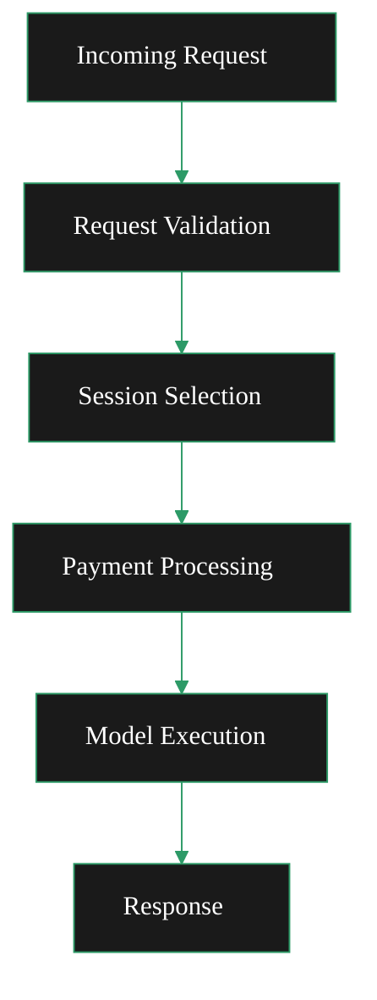

{/* codex-i18n: eyJraW5kIjoiY29kZXgtaTE4biIsInZlcnNpb24iOjEsInNvdXJjZVBhdGgiOiJ2Mi9nYXRld2F5cy9ydW4tYS1nYXRld2F5L21vbml0b3IvbW9uaXRvci1hbmQtb3B0aW1pc2UubWR4Iiwic291cmNlUm91dGUiOiJ2Mi9nYXRld2F5cy9ydW4tYS1nYXRld2F5L21vbml0b3IvbW9uaXRvci1hbmQtb3B0aW1pc2UiLCJzb3VyY2VIYXNoIjoiMGIwOGFkOGVlYzI0OTYwNGU4MWFkYWE1NGExNGE0ZjQ0MTY2NjYwMjRiNDJiODAzY2Y2MzUzYzEyNzI4OWFkNCIsImxhbmd1YWdlIjoiZnIiLCJwcm92aWRlciI6Im9wZW5yb3V0ZXIiLCJtb2RlbCI6InF3ZW4vcXdlbi10dXJibyIsImdlbmVyYXRlZEF0IjoiMjAyNi0wMi0yN1QxNDoxNToyNi43MzhaIn0= */}
import { DoubleIconLink } from '/snippets/components/primitives/links.jsx'
import { ScrollableDiagram } from '/snippets/components/content/zoomableDiagram.jsx'

<Danger> Currently operating as a brainstorming page </Danger>

## Acheminement des demandes

**Flux de traitement des demandes (les deux)**

- **Validation des demandes**: Middleware de validation OpenAPI valide la structure de la demande
- **Sélection de la session**: AISessionManager sélectionne l'orchestrator approprié en fonction des capacités du modèle
- **Traitement des paiements**: Calcule le paiement en fonction du nombre de pixels pour les points de terminaison non en direct
- **Exécution du modèle**: Envoie la demande à l'worker IA avec le modèle spécifié

<ScrollableDiagram title="Request Processing Flow">

</ScrollableDiagram>

#### Demandes de transcodage

Les demandes traditionnelles de transcodage vidéo sont gérées par :

- **Ingestion RTMP**: Port `1935` par défaut
- **Push HTTP**: `/live/{streamKey}` point de terminaison lorsque `-httpIngest`est activé
- **Sortie HLS**: Flux à débit adaptatif pour la lecture

#### Demandes d'IA

Les demandes de traitement par IA sont acheminées via des points de terminaison dédiés<DoubleIconLink label="ai_mediaserver.go" href="https://github.com/livepeer/go-livepeer/blob/5691cb48/server/ai_mediaserver.go" iconLeft="github" />

<Danger> (fixme) OpenAPI Spec is here: ai/worker/api/openapi.json </Danger>

    <ResponseField name="/text-to-image" type="json">
      Generate images from text prompts.
      Uses `jsonDecoder` for parsing
    </ResponseField>
    <ResponseField name="/image-to-image" type="multipart/form-data">
      Transform images with prompts.
      Uses `multipartDecoder` for file uploads
    </ResponseField>
    <ResponseField name="/image-to-video" type="multipart/form-data">
      Create videos from images.
      Uses `multipartDecoder` for file uploads
    </ResponseField>
    <ResponseField name="/upscale" type="multipart/form-data">
      Upscale (enhance) images to higher resolution.
      Uses `multipartDecoder` for file uploads
    </ResponseField>
    <ResponseField name="/live/video-to-video/{stream}/start" type="multipart/form-data">
      Apply transformations to a live video streamed to the returned endpoints.
      Live video endpoint has specialized handling for real-time streaming with MediaMTX integration
    </ResponseField>

## Modèles de paiement

La configuration double gère deux modèles de paiement différents :

#### Paiements de transcodage

Base : Par segment de vidéo traité
Méthode : Tickets de paiement envoyés avec chaque segment
Vérification : Vérification par multi-orchestrateur pour l'assurance qualité

#### Paiements d'IA

Base : Par pixel traité (largeur × hauteur × sorties)
Méthode : Calcul du paiement basé sur les pixels
Vidéo en direct : Paiements basés sur l'intervalle pendant la diffusion

## Considérations opérationnelles

#### Allocation de ressources

Lorsque vous exécutez une configuration double, prenez en compte :

- Ressources GPU : partagées entre la transcodage et les charges de travail d'IA
- Mémoire : les modèles d'IA nécessitent une grande quantité de RAM lorsqu'ils sont chargés (« chauds »)
- Réseau : bande passante pour l'ingestion de flux et les demandes/réponses d'IA

#### Surveillance

Surveillez les deux types de charge de travail :

- Transcodage : latence de traitement des segments, taux de réussite
- IA : temps de chargement des modèles, latence d'inférence, taux de traitement des pixels

#### Stratégies d'extension

- Horizontal : déployer plusieurs instances de passerelle derrière un équilibreur de charge
- Vertical : allouer plus de ressources GPU pour la parallélisation des modèles d'IA
- Spécialisé : Nœuds séparés pour la transcodification vs l'IA en fonction des modèles de charge de travail
