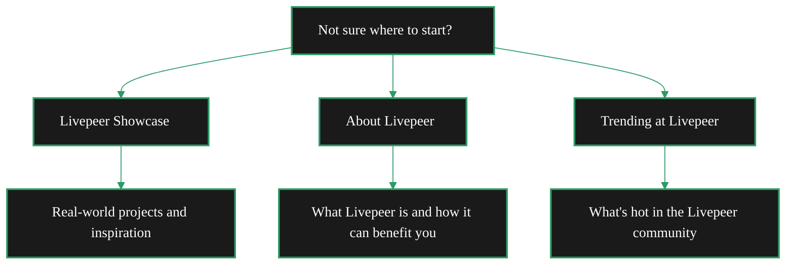

{/* codex-i18n: eyJraW5kIjoiY29kZXgtaTE4biIsInZlcnNpb24iOjEsInNvdXJjZVBhdGgiOiJ2Mi9ob21lL2dldC1zdGFydGVkLm1keCIsInNvdXJjZVJvdXRlIjoidjIvaG9tZS9nZXQtc3RhcnRlZCIsInNvdXJjZUhhc2giOiJiZDQ5MjdhNWUzNWEyNzEzNGM5YWI1YWY5NmQ1NTU4NmNlOTAyODFiNzZlN2UzYzRlN2FiMjc4MDNkMDdhYjFjIiwibGFuZ3VhZ2UiOiJmciIsInByb3ZpZGVyIjoib3BlbnJvdXRlciIsIm1vZGVsIjoib3BlbmFpL2dwdC1vc3MtMTIwYjpmcmVlIiwiZ2VuZXJhdGVkQXQiOiIyMDI2LTAyLTI0VDE3OjQzOjI3LjIwMloifQ== */}
import { DisplayCard } from '/snippets/components/layout/customCards.jsx'
import { LinkArrow } from '/snippets/components/primitives/links.jsx'

Pas sûr(e) de savoir par où commencer ? Nous avons ce qu'il vous faut. Voici un guide pour vous aider à trouver ce que vous cherchez.

### Je suis nouveau sur Livepeer
<Columns cols={2}>

    <DisplayCard icon="eyes" title="Just Browsing">
            <LinkArrow label="Livepeer Showcase" href="/v2/fr/home/solutions/showcase" newline={false}  description="Check out real-world projects and get inspired." />
            <LinkArrow label="About Livepeer" href="/v2/fr/home/about-livepeer/vision" description="Learn what Livepeer is and how it can benefit you." newline={false} />
            <LinkArrow label="Trending at Livepeer" href="/v2/fr/community/livepeer-community/trending-topics" description="See what's new across the Livepeer blog, forum, and socials." newline={false} />
    </DisplayCard>
    <DisplayCard icon="camera-movie" title="Real-time AI Video">
        <LinkArrow label="Stream Video Quickstart" href="/v2/home/get-started/stream-video" newline={false} description="Get started with Livepeer video streaming in minutes." />
        <LinkArrow label="Daydream" href="/v2/fr/solutions/daydream/overview" newline={false} description="Real-time AI video creation." />
        <LinkArrow label="Livepeer Studio" description="Try out Livepeer Studio, a hosted video platform." newline={false} href="/v2/fr/solutions/livepeer-studio/overview" />
    </DisplayCard>

</Columns>

{/* Just Browsing!

- [Livepeer Showcase](/v2/fr/home/solutions/showcase) - Check out real-world projects and get inspired.
- [About Livepeer](../about/portal) - Learn what Livepeer is and how it can benefit you.

Want to use video AI in your project?

- [Livepeer AI Quickstart](/v2/fr/developers/quickstart/ai/ai-pipelines) - Get started with Livepeer AI in minutes.
- [Daydream](/v2/fr/solutions/daydream/overview) - Learn more about Daydream, Livepeer's real-time AI video platform.
- [Platforms](../solutions/portal) - Explore other Livepeer platforms and tools.

Want to stream or broadcast live video?

- [Stream Video Quickstart](/v2/fr/developers/quickstart/video/video-streaming) - Get started with Livepeer video streaming in minutes.
- [Livepeer Studio](https://livepeer.studio) - Try out Livepeer Studio, a hosted video platform.

Get more out of these docs:

- [Documentation Guide](/v2/fr/resources/documentation-guide/style-guide) - Learn how to use these docs effectively.
- [Contribute to the Docs](/v2/fr/resources/documentation-guide/contribute-to-the-docs) - Help improve these docs.

--- */}

### Je suis développeur
<Columns cols={2}>

    <DisplayCard icon="wand-magic-sparkles" title="Integrate Video or AI">
        <LinkArrow label="Livepeer AI Quickstart" href="/v2/fr/developers/quickstart/ai/ai-pipelines" newline={false} description="Get started with Livepeer AI in minutes." />
        <LinkArrow label="Daydream" href="../solutions/daydream/overview" newline={false} description="Learn more about Daydream, Livepeer's real-time AI video platform." />
    </DisplayCard>
    <DisplayCard icon="microchip-ai" title="Custom AI Pipelines">
        <LinkArrow label="ComfyStream" href="../developers/ai-pipelines/comfystream" newline={false} description="Learn more about ComfyStream, Livepeer's AI pipeline platform." />
        <LinkArrow label="BYOC" href="../developers/ai-pipelines/byoc" newline={false} description="Bring Your Own Compute, Livepeer's custom AI pipeline platform." />
    </DisplayCard>
    <DisplayCard icon="building" title="Build a Business">
        <LinkArrow label="Developer Hub" href="../developers/portal" newline={false} description="Learn more about building on Livepeer." />
        <LinkArrow label="Gateways" href="../gateways/gateways-portal" newline={false} />
        <LinkArrow label="Funding & Opportunities" href="../developers/builder-opportunities/dev-programs" newline={false} description="Find Grants, RFPs & Other Opportunities." />
    </DisplayCard>

</Columns>

### Je suis fournisseur de GPU
<Columns cols={2}>

    <DisplayCard icon="server" title="Earn from Idle GPU">
        <LinkArrow label="Orchestrators" href="/v2/fr/orchestrators/quickstart/overview" newline={false} description="Learn more about running an orchestrator." />
    </DisplayCard>
    <DisplayCard icon="warehouse" title="Data Centre">
        <LinkArrow label="Contact" href="mailto:hello@livepeer.org" newline={false} description="Contact us for a chat." />
    </DisplayCard>

</Columns>

### Je suis utilisateur/créateur
<Columns cols={2}>

    <DisplayCard icon="video" title="Stream or Broadcast">
        <LinkArrow label="Daydream" href="../solutions/daydream/overview" newline={false} description="Learn more about Daydream, Livepeer's real-time AI video platform." />
        <LinkArrow label="Stream Video Quickstart" href="/v2/fr/developers/quickstart/video/video-streaming" newline={false} description="Get started with Livepeer video streaming in minutes." />
        <LinkArrow label="Livepeer Studio" href="https://livepeer.studio" newline={false} description="Try out Livepeer Studio, a hosted video platform." />
    </DisplayCard>

</Columns>

### Je suis détenteur de LPT
<Columns cols={2}>

    <DisplayCard icon="coins" title="Delegate LPT">
        <LinkArrow label="Delegators" href="../lpt/delegation/overview" newline={false} description="Learn more about delegating LPT." />
    </DisplayCard>
    <DisplayCard icon="check-to-slot" title="Vote">
        <LinkArrow label="Governance" href="../lpt/governance/overview" newline={false} description="Learn more about Livepeer governance." />
    </DisplayCard>

</Columns>

### Je suis une entreprise :
<Columns cols={2}>

    <DisplayCard icon="handshake" title="Use Livepeer in Your Product">
        <LinkArrow label="Partner" href="../developers/x-unstaged/partner-integrations" newline={false} description="Learn more about Livepeer partners." />
        <LinkArrow label="Contact" href="mailto:hello@livepeer.org" newline={false} description="Contact us for a chat." />
    </DisplayCard>

</Columns>

### Je suis chercheur
<Columns cols={2}>

    <DisplayCard icon="flask" title="Learn More About Livepeer">
        <LinkArrow label="Whitepaper" href="https://livepeer.org/whitepaper" newline={false} description="Learn more about the Livepeer network." />
        <LinkArrow label="Blog" href="https://blog.livepeer.org" newline={false} description="Read the latest news and articles about Livepeer." />
    </DisplayCard>

</Columns>

### Carte du parcours

