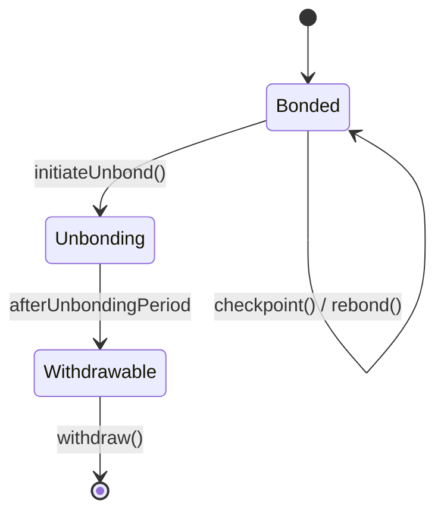

{/* codex-i18n: eyJraW5kIjoiY29kZXgtaTE4biIsInZlcnNpb24iOjEsInNvdXJjZVBhdGgiOiJ2Mi9scHQvYWJvdXQvbWVjaGFuaWNzLm1keCIsInNvdXJjZVJvdXRlIjoidjIvbHB0L2Fib3V0L21lY2hhbmljcyIsInNvdXJjZUhhc2giOiJiOTk1NTM4MmY5ZDNjNGQ0M2JjMGI4NDdhNmRiYmZkYTkwNmRhYTFjMDUzYWMzYjU4YjE1ZGMyYjdlYmM4MDY2IiwibGFuZ3VhZ2UiOiJmciIsInByb3ZpZGVyIjoib3BlbnJvdXRlciIsIm1vZGVsIjoib3BlbmFpL2dwdC1vc3MtMjBiOmZyZWUiLCJnZW5lcmF0ZWRBdCI6IjIwMjYtMDMtMDFUMTA6MjM6MTYuNDk4WiJ9 */}
import { MathInline, MathBlock } from '/snippets/components/content/math.jsx'

## Résumé exécutif

Cette page décrit les mécanismes déterministes au niveau du contrat qui régissent la transition de LPT entre les états liés et non liés, la façon dont les rounds sont traités, et comment les récompenses sont vérifiées et réclamées.

Tous les mécanismes décrits ici fonctionnent strictement au niveau du **couche protocole (on-chain)**.

---

## 1. Variables d'état principales

Soit :

- <MathInline latex={String.raw`S_t`} /> = offre totale de LPT à la ronde <MathInline latex={String.raw`t`} />
- <MathInline latex={String.raw`B_T`} /> = mise totale liée
- <MathInline latex={String.raw`B_i`} /> = mise liée attribuée au participant <MathInline latex={String.raw`i`} />
- Ronde <MathInline latex={String.raw`t`} /> = époque comptable discrète gérée par le protocole

Les rounds constituent l'unité comptable atomique pour l'émission et la distribution des récompenses.

---

## 2. Liaison

La liaison est l'acte de verrouiller LPT dans le contrat de staking afin de participer aux récompenses et à la gouvernance du protocole.

Lorsque le participant <MathInline latex={String.raw`i`} /> lie le montant <MathInline latex={String.raw`x`} />:

<MathBlock latex={String.raw`B_i^{new} = B_i^{old} + x`} />

<MathBlock latex={String.raw`B_T^{new} = B_T^{old} + x`} />

La mise liée contribue à :

- Éligibilité aux récompenses
- Poids de vote de gouvernance
- Participation à la sécurité

Le bonding est enregistré dans le contrat BondingManager.

---

## 3. Attribution de délégation

Si le délégataire <MathInline latex={String.raw`D`} /> s'engage auprès de l'orchestrateur <MathInline latex={String.raw`O`} />:

<MathBlock latex={String.raw`B_O = B_{self,O} + \sum_D b_{D,O}`} />

Les délégataires conservent la propriété mais délèguent les droits de récompense et l'attribution du poids de vote.

---

## 4. Désengagement

Le désengagement initie une période de retrait.

Lorsque le participant <MathInline latex={String.raw`i`} /> se désengage d'un montant <MathInline latex={String.raw`x`} />:

<MathBlock latex={String.raw`B_i^{new} = B_i^{old} - x`} />

<MathBlock latex={String.raw`B_T^{new} = B_T^{old} - x`} />

La mise en jeu entre dans un état de retrait en attente soumis à une période de désengagement mesurée en tours.

Pendant cette période :

- La mise en jeu ne génère pas de récompenses
- La mise en jeu ne peut pas être transférée immédiatement

Ce délai protège contre la manipulation rapide basée sur la mise en jeu.

---

## 5. Cycle de vie du tour

Chaque tour comprend :

1. Calcul de l'inflation
2. Éligibilité à la distribution des récompenses
3. Traitement des points de contrôle

La transition de tour est déclenchée par la logique de temporisation du protocole.

Émission par tour :

<MathBlock latex={String.raw`R_t = S_t \cdot r_t`} />

Mise à jour de l'offre :

<MathBlock latex={String.raw`S_{t+1} = S_t + R_t`} />

---

## 6. Pointage des récompenses

Les récompenses ne sont pas transférées automatiquement ; elles doivent être pointées.

Le pointage met à jour les soldes de récompenses des participants en fonction du poids de la mise.

Allocation à l'orchestrateur <MathInline latex={String.raw`O`} />:

<MathBlock latex={String.raw`R_O = R_t \cdot \frac{B_O}{B_T}`} />

Part du délégataire :

<MathBlock latex={String.raw`R_{D,O} = R_O (1 - c_O) \cdot \frac{b_{D,O}}{B_O}`} />

Le pointage met à jour l'état de comptabilité interne avant le retrait ou le rebond.

---

## 7. Réclamation et rebond

Les participants peuvent :

- Réclamer les récompenses vers un solde liquide
- Rebondir les récompenses (mise composée)

Le rebond augmente <MathInline latex={String.raw`B_i`} /> et donc le poids économique futur.

---

## 8. Diagramme de transition d'état

---

## 9. Implications de sécurité

Mécanismes qui protègent l'intégrité du protocole :

- **Délai de désengagement** - réduit la manipulation à court terme
- **Comptabilité basée sur les tours** - cycles de récompense déterministes
- **Allocation pondérée par la mise** - sécurité soutenue par le capital

---

## 10. Séparation du protocole et du réseau

**Protocole (On-Chain) :**
- Logique de mise/désengagement
- Transitions de tour
- Émission de récompenses
- Attribution de mise

**Réseau (Off-Chain) :**
- Exécution de tâches
- Performance
- Génération de frais

Les mécanismes décrits ici sont entièrement sur la chaîne.

---

## Références

- [Livepeer Référentiel de protocole](https://github.com/livepeer/protocol)
- [Registre des contrats](https://docs.livepeer.org/references/contract-addresses)
