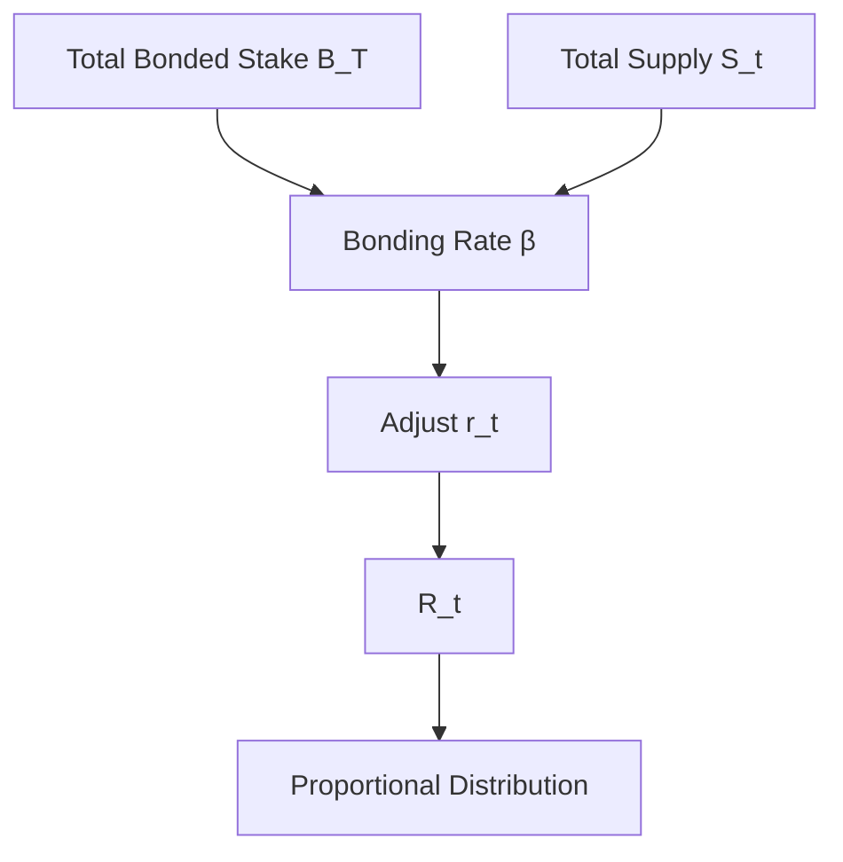

{/* codex-i18n: eyJraW5kIjoiY29kZXgtaTE4biIsInZlcnNpb24iOjEsInNvdXJjZVBhdGgiOiJ2Mi9scHQvYWJvdXQvdG9rZW5vbWljcy5tZHgiLCJzb3VyY2VSb3V0ZSI6InYyL2xwdC9hYm91dC90b2tlbm9taWNzIiwic291cmNlSGFzaCI6IjBiZDJlZmIyODVmZTUwMzIxNGQ0NGY1YjZmNmM5MmIyYTc5OTA2NDAwYjlkNWIwOGYwNDg5ZTAwZjVkNWRkNzMiLCJsYW5ndWFnZSI6ImZyIiwicHJvdmlkZXIiOiJvcGVucm91dGVyIiwibW9kZWwiOiJxd2VuL3F3ZW4tdHVyYm8iLCJnZW5lcmF0ZWRBdCI6IjIwMjYtMDMtMDFUMTA6NDc6MDEuMDY0WiJ9 */}
import { MathInline, MathBlock } from '/snippets/components/content/math.jsx'

## Résumé exécutif

La tokenomique LPT définit comment le protocole Livepeer émet une nouvelle offre, ajuste l'inflation par rapport à la participation à la sécurité, distribue les récompenses et maintient un équilibre de sécurité garantie par le capital.

Le modèle de tokenomique est mis en œuvre au niveau **du protocole (sur la chaîne)** via le staking, la logique d'ajustement de l'inflation et la répartition déterministe des récompenses.

---

## 1. Variables formelles

Soit :

- <MathInline latex={String.raw`S_t`} /> = offre totale LPT à la ronde <MathInline latex={String.raw`t`} />
- <MathInline latex={String.raw`B_T`} /> = offre totale LPT bloquée
- <MathInline latex={String.raw`B_i`} /> = montant bloqué attribué au participant <MathInline latex={String.raw`i`} />
- <MathInline latex={String.raw`\beta`} /> = taux de blocage = <MathInline latex={String.raw`\frac{B_T}{S_t}`} />
- <MathInline latex={String.raw`\beta^*`} /> = taux de blocage cible
- <MathInline latex={String.raw`r_t`} /> = taux d'inflation appliqué dans le tour<MathInline latex={String.raw`t`} />
- <MathInline latex={String.raw`\alpha`} /> = coefficient d'ajustement de l'inflation
- <MathInline latex={String.raw`c_O`} /> = taux de commission défini par l'orchestrator<MathInline latex={String.raw`O`} />

---

## 2. Modèle d'émission d'inflation

Par tour<MathInline latex={String.raw`t`} />, nouveaux LPT mintés :

<MathBlock latex={String.raw`R_t = S_t \cdot r_t`} />

Mise à jour de l'offre :

<MathBlock latex={String.raw`S_{t+1} = S_t + R_t`} />

L'inflation se compose donc par rapport à l'offre actuelle.

---

## 3. Mécanisme de rétroaction du taux de mise en garde

Le protocole ajuste l'inflation en fonction de l'écart entre le taux de mise en garde actuel et le taux de mise en garde cible.

Taux de mise en garde actuel :

<MathBlock latex={String.raw`\beta = \frac{B_T}{S_t}`} />

Règle d'ajustement :

Si <MathInline latex={String.raw`\beta < \beta^*`} />:

<MathBlock latex={String.raw`r_{t+1} = r_t + \alpha`} />

Si <MathInline latex={String.raw`\beta > \beta^*`} />:

<MathBlock latex={String.raw`r_{t+1} = r_t - \alpha`} />

Cela crée une boucle de contrôle :

- Système sous-mis (under-bonded) → inflation plus élevée → incitation plus forte à la mise en garantie
- Système sur-émis → inflation plus faible → dilution réduite

Le système cherche un équilibre où <MathInline latex={String.raw`\beta \approx \beta^*`} />.

---

## 4. Distribution des récompenses

L'émission totale par tour <MathInline latex={String.raw`R_t`} /> est distribuée proportionnellement au poids de la participation.

Définir le poids économique :

<MathBlock latex={String.raw`W_i = \frac{B_i}{B_T}`} />

Allocation à l'orchestrateur <MathInline latex={String.raw`O`} />:

<MathBlock latex={String.raw`R_O = R_t \cdot \frac{B_O}{B_T}`} />

Délégué <MathInline latex={String.raw`D`} /> lié à l'orchestrateur <MathInline latex={String.raw`O`} />:

<MathBlock latex={String.raw`R_{D,O} = R_O (1 - c_O) \cdot \frac{b_{D,O}}{B_O}`} />

Cela sépare l'émission brute des rendements ajustés par les commissions des délégués.

---

## 5. Émission vs Revenus de frais

Les rendements pour les participants liés peuvent comprendre :

1. Émission basée sur l'inflation (expansion de la masse monétaire)
2. Revenus de frais provenant des charges de vidéo/IA (basés sur la demande)

Récompense totale pour le participant<MathInline latex={String.raw`i`} />:

<MathBlock latex={String.raw`Reward_i = Issuance_i + Fees_i`} />

L'inflation est déterminée par le protocole ; les frais sont déterminés par le marché.

Les tokenomics doivent donc être évalués en deux composantes : les dynamiques d'émission et la demande du réseau.

---

## 6. Équilibre de sécurité

Le coût de sécurité pour un contrôle adversarial augmente avec le montant bloqué.

Soit <MathInline latex={String.raw`\theta`} />être la fraction seuil nécessaire pour influencer la gouvernance ou l'allocation.

Capital requis :

<MathBlock latex={String.raw`Capital_{attack} \geq \theta B_T`} />

Augmenter<MathInline latex={String.raw`B_T`} /> augmente le coût du contrôle.

L'ajustement de l'inflation encourage un équilibre autour d'un taux stable de participation à la sécurité.

---

## 7. Compromis économiques

| Mécanisme | Compromis |
|------------|-----------|
| Inflation dynamique | Stabilité vs réactivité |
| Paiement délégué | Accessibilité vs risque de centralisation |
| Récompenses pondérées par la capitalisation | Résistance de la sécurité vs concentration de la richesse |

---

## 8. Schéma du système

---

## 9. Séparation entre le protocole et le réseau

**Couche du protocole (sur la chaîne) :**
- Calcul de l'inflation
- Ajustement du taux de mise en garantie
- Comptabilité des participations
- Émission de récompenses

**Couche réseau (hors chaîne) :**
- Génération des frais à partir des charges de travail
- Performance opérationnelle
- Acheminement des tâches

La tokenomie régit l'émission ; l'activité du réseau régit les frais.

---

## Références

- [Livepeer Dépôt du protocole](https://github.com/livepeer/protocol)
- [Registre des contrats](https://docs.livepeer.org/references/contract-addresses)
