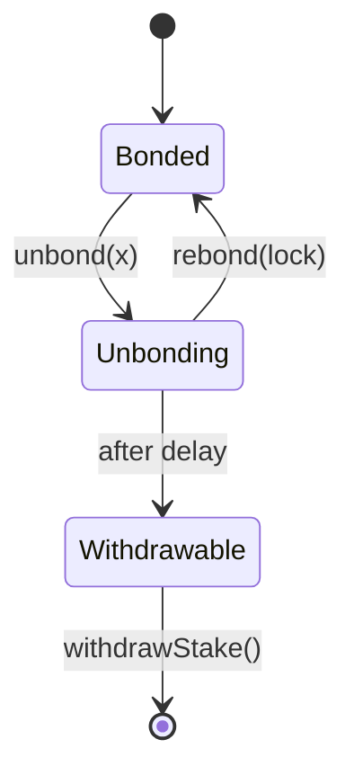
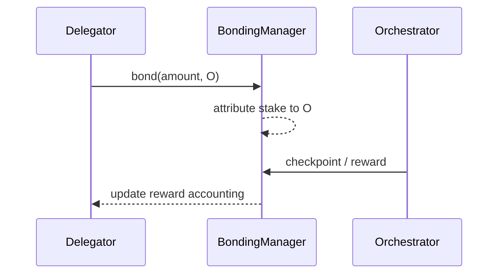

{/* codex-i18n: eyJraW5kIjoiY29kZXgtaTE4biIsInZlcnNpb24iOjEsInNvdXJjZVBhdGgiOiJ2Mi9scHQvZGVsZWdhdGlvbi9hYm91dC1kZWxlZ2F0b3JzLm1keCIsInNvdXJjZVJvdXRlIjoidjIvbHB0L2RlbGVnYXRpb24vYWJvdXQtZGVsZWdhdG9ycyIsInNvdXJjZUhhc2giOiJmNjg4MThlMjM3YjYzNGVhMDY2YWU3ODc2N2M1MjA0NGU0YWQ4ZWFlMmViZTg0YTllY2I5MDgzNjU1ZTMyZDNiIiwibGFuZ3VhZ2UiOiJmciIsInByb3ZpZGVyIjoib3BlbnJvdXRlciIsIm1vZGVsIjoicXdlbi9xd2VuLXR1cmJvIiwiZ2VuZXJhdGVkQXQiOiIyMDI2LTAzLTAxVDExOjAyOjUzLjQyNVoifQ== */}
import { MathInline, MathBlock } from '/snippets/components/content/math.jsx'

## Résumé exécutif

Un **déléguant** est un détenteur de LPT qui lie son stake et l'attribue à un orchestrator. Les déléguants ne font pas fonctionner d'infrastructure, mais ils sont des participants économiquement responsables : leur stake augmente la sécurité du protocole, façonne l'allocation du capital entre les orchestrators et contribue à la puissance de gouvernance pondérée par le stake.

La délégation est strictement une **couche de protocole (sur la chaîne)**mécanisme. Les délégués ne routent pas ou n'exécutent pas de tâches ; ils participent à la sous-couche économique sur chaîne qui contraint et incite les opérateurs au niveau du réseau.

---

## 1. Définition formelle

Soit :

- <MathInline latex={String.raw`D`} />: une adresse de délégué
- <MathInline latex={String.raw`O`} />: une adresse d'orchestrateur
- <MathInline latex={String.raw`b_{D,O}`} />: la mise bloquée par <MathInline latex={String.raw`D`} /> vers <MathInline latex={String.raw`O`} />
- <MathInline latex={String.raw`B_{self,O}`} />: la participation auto-bondée de <MathInline latex={String.raw`O`} />

Total de la participation attribuée à <MathInline latex={String.raw`O`} />:

<MathBlock latex={String.raw`B_O = B_{self,O} + \sum_D b_{D,O}`} />

Total de la participation liée :

<MathBlock latex={String.raw`B_T = \sum_O B_O`} />

Les changements de participation des délégués modifient l'état comptable du protocole (attribution de la participation liée) et donc les résultats des récompenses et de la gouvernance pondérés par la participation.

---

## 2. Contexte architectural

### 2.1 Couche du protocole (sur la chaîne)

Les délégués interagissent avec les contrats de protocole qui :

- suivent le stake lié à chaque adresse
- attribuent le stake à un délégué (orchestrator)
- appliquent les délais de déblocage
- allouer l'émission (et, le cas échéant, les frais)
- calculer la puissance de gouvernance pondérée par le stake

les adresses des contrats canoniques et les réseaux sont publiés dans le [registre des contrats](https://docs.livepeer.org/references/contract-addresses).

### 2.2 Couche réseau (hors chaîne)

Les orchestrateurs font fonctionner le logiciel et l'infrastructure des nœuds (GPU/calcul, routage, processus d'exploitation) pour exécuter le travail. Les délégués sont économiquement liés aux performances et au comportement des opérateurs, mais ne contrôlent pas directement les chemins d'exécution.

---

## 3. Rôle économique

Les délégués servent trois objectifs du protocole.

### 3.1 Participation à la sécurité

Le coût de la sécurité augmente avec le montant total des fonds bloqués :

<MathBlock latex={String.raw`\text{Security} \propto B_T`} />

Les délégués augmentent <MathInline latex={String.raw`B_T`} />, augmentant le coût économique nécessaire pour capturer les résultats pondérés par le stake.

### 3.2 Répartition du capital

La délégation redistribue le stake entre les orchestrators, façonnant ainsi la structure du marché des opérateurs.

Poids de l'orchestrator :

<MathBlock latex={String.raw`W_O = \frac{B_O}{B_T}`} />

Les délégués sélectionnant <MathInline latex={String.raw`O`} /> augmentent <MathInline latex={String.raw`W_O`} />, affectant l'allocation d'émission et l'influence de gouvernance.

### 3.3 Participation à la gouvernance

Le pouvoir de vote provient de la mise en garde. Pour un participant <MathInline latex={String.raw`i`} />:

<MathBlock latex={String.raw`V_i = \frac{B_i}{B_T}`} />

Les délégués influencent donc les changements de paramètres du protocole, les mises à niveau et les décisions du trésor.

---

## 4. Modèle de récompense (émission et frais)

Par tour <MathInline latex={String.raw`t`} />, émission du protocole :

<MathBlock latex={String.raw`R_t = S_t \cdot r_t`} />

Allocation d'émission brute de l'Orchestrator :

<MathBlock latex={String.raw`R_O = R_t \cdot \frac{B_O}{B_T}`} />

Allocation d'émission nette du Délegateur avec commission <MathInline latex={String.raw`c_O`} />:

<MathBlock latex={String.raw`R_{D,O} = R_O \cdot (1 - c_O) \cdot \frac{b_{D,O}}{B_O}`} />

Le rendement total du Délegateur se décompose en :

<MathBlock latex={String.raw`\text{Reward}_{D,O} = \text{Issuance}_{D,O} + \text{Fees}_{D,O}`} />

L'émission est déterminée par le protocole ; les frais sont déterminés par le marché (la demande du réseau).

---

## 5. Droits, contraintes et responsabilités

### 5.1 Droits

Les délégués peuvent :

- lier et déléguer leur participation à un orchestrateur
- délier leur participation (sujet à un délai du protocole)
- rebond pendant la fenêtre de déblocage
- retirer le stake après la période de déblocage
- réclamer/rebondre les récompenses en fonction des mécanismes du protocole

### 5.2 Contraintes

Les délégués ne peuvent pas :

- accélérer le déblocage au-delà du délai défini par le protocole
- garantir le flux de travail ou les revenus de frais
- remplacer les décisions opérationnelles de l'orchestrator

La délégation est une exposition au capital sans contrôle opérationnel.

### 5.3 Responsabilités (Pratique)

Les délégués devraient surveiller :

- taux de commission <MathInline latex={String.raw`c_O`} />
- consistance des points de récompense
- concentration des participations et décentralisation
- propositions de gouvernance affectant les paramètres d'inflation/sécurité

La délégation est mieux modélisée comme une allocation de capital à long terme.

---

## 6. Cadre d'évaluation pour le choix de l'orchestrator

La sélection des délégués est multi-objectif.

Définir une fonction utilitaire de déléguée :

<MathBlock latex={String.raw`U(O) = f(\text{NetYield}_O, \text{Reliability}_O, \text{Concentration}_O, \text{GovernanceAlignment}_O)`} />

Où :

- <MathInline latex={String.raw`\text{NetYield}_O`} /> est réduit par la commission <MathInline latex={String.raw`c_O`} />
- <MathInline latex={String.raw`\text{Reliability}_O`} /> capte la cohérence du point de contrôle et la stabilité opérationnelle
- <MathInline latex={String.raw`\text{Concentration}_O`} /> pénalise déjà une part de participation dominante
- <MathInline latex={String.raw`\text{GovernanceAlignment}_O`} /> reflète les préférences de gouvernance à long terme

---

## 7. Risques et modes de défaillance

Les délégués font face à un profil de risque en couches.

1. **Risque de commission :**plus élevé<MathInline latex={String.raw`c_O`} />réduit les rendements nets.
2. **Risque de point de contrôle / réalisation :**l'émission réalisée peut diverger de l'allocation théorique si le checkpointing n'est pas effectué.
3. **Risque de liquidité :**la période de déblocage limite la sortie.
4. **Risque de concentration :**l'exposition systémique augmente avec la centralisation des participations.
5. **Risque de suppression (si activé) :**le stake peut être réduit sous des conditions protocolaires définies.

---

## 8. Diagrammes

### 8.1 Modèle d'état

### 8.2 Flux de récompense

---

## 9. Séparation du protocole et du réseau

**Protocole (sur chaîne) :**comptabilisation et attribution de la participation liée, émission et répartition pondérée par la participation, délais de désengagement, pouvoir de vote en matière de gouvernance.

**Réseau (hors chaîne) :**exécution et routage des tâches, génération des frais, performance opérationnelle et disponibilité.

Les délégués participent à l'économie du protocole ; les orchestrateurs participent aux opérations du réseau.

---

## Références

- [Livepeer dépôt du protocole](https://github.com/livepeer/protocol)
- [Registre de contrat](https://docs.livepeer.org/references/contract-addresses)
