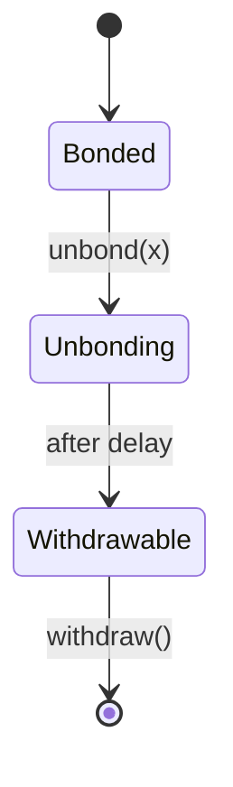
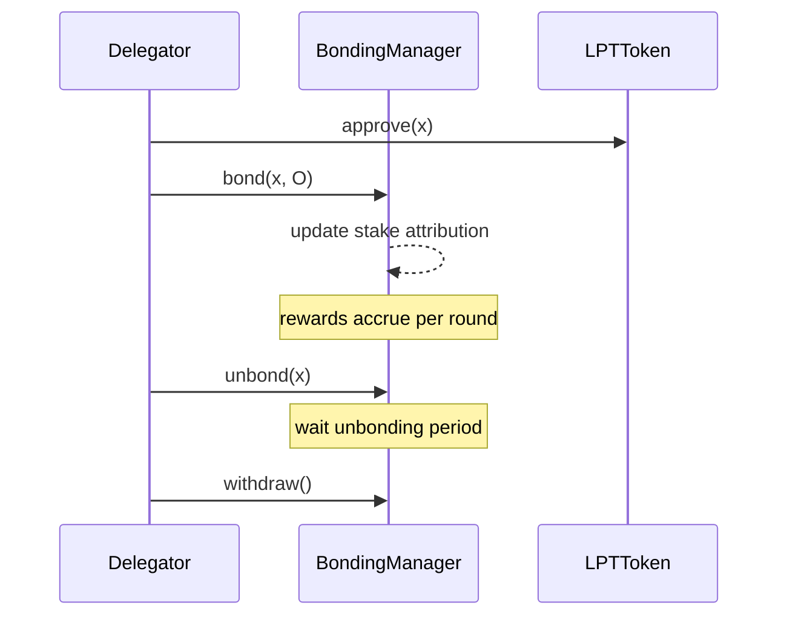

{/* codex-i18n: eyJraW5kIjoiY29kZXgtaTE4biIsInZlcnNpb24iOjEsInNvdXJjZVBhdGgiOiJ2Mi9scHQvZGVsZWdhdGlvbi9kZWxlZ2F0aW9uLWd1aWRlLm1keCIsInNvdXJjZVJvdXRlIjoidjIvbHB0L2RlbGVnYXRpb24vZGVsZWdhdGlvbi1ndWlkZSIsInNvdXJjZUhhc2giOiIxZDk3ZmE4MmY3MDAwNTM5ZWI2ZjEyMmMyYjFkMjk4ODE2NGQxMWU1NGVkYTFjNDIyNmM4OWFkODhhYzNjMmRlIiwibGFuZ3VhZ2UiOiJmciIsInByb3ZpZGVyIjoib3BlbnJvdXRlciIsIm1vZGVsIjoicXdlbi9xd2VuLXR1cmJvIiwiZ2VuZXJhdGVkQXQiOiIyMDI2LTAzLTAxVDExOjA1OjAzLjE0NVoifQ== */}
import { MathInline, MathBlock } from '/snippets/components/content/math.jsx'

## Résumé exécutif

Ce guide fournit une présentation étape par étape précise au niveau du protocole et consciente des contrats pour déléguer LPT. Il se concentre strictement sur les mécanismes sur la chaîne : le lien, l'attribution de mise, le point de vérification des récompenses, le désengagement et le retrait.

La délégation modifie l'état du protocole. Elle ne modifie pas directement le routage ou l'exécution du réseau.

---

## 1. Conditions préalables

Avant de déléguer, un participant doit :

1. Posséder LPT dans un portefeuille autogéré.
2. Soyez connecté au bon réseau de déploiement (voir le registre des contrats).
3. Comprenez la période d'indisponibilité et les contraintes de liquidité.

Références aux contrats canoniques :[Adresses des contrats](https://docs.livepeer.org/references/contract-addresses)

La délegation interagit principalement avec le contrat BondingManager.

---

## 2. Étape 1 - Approuver le transfert de jeton

Si vous interagissez directement avec les contrats, le contrat de jeton LPT doit être approuvé pour transférer le montant de mise souhaité.

Soit <MathInline latex={String.raw`x`} /> la quantité à déléguer.

L'autorisation n'altère pas l'état de mise ; elle autorise uniquement le contrat de mise à transférer les jetons.

Impact sur l'état : aucun (mise à jour de l'autorisation uniquement).

---

## 3. Étape 2 - Miser et déléguer

Appel à `bond(x, O)`où :

- <MathInline latex={String.raw`x`} /> = LPT montant
- <MathInline latex={String.raw`O`} /> = adresse de l'orchestrateur choisi

Transition d'état :

<MathBlock latex={String.raw`B_i^{new} = B_i^{old} + x`} />

<MathBlock latex={String.raw`B_O^{new} = B_O^{old} + x`} />

<MathBlock latex={String.raw`B_T^{new} = B_T^{old} + x`} />

La délegation affecte immédiatement l'attribution des fonds pour les tours suivants (soumise aux règles de temporisation du protocole).

---

## 4. Étape 3 - Vérifier l'état sur la chaîne

Après le lien (bonding), vérifiez :

1. Montant lié pour votre adresse.
2. Attribution de l'adresse du délégué (orchestrator).
3. Capital total attribué à l'orchestrator.

Méthodes de vérification :

- Lecture du bloc d'explorateur de l'état de BondingManager.
- Livepeer Explorer ou indexeur équivalent.

La délegation doit être vérifiable via l'état sur la chaîne, et non uniquement via l'affichage de l'interface utilisateur.

---

## 5. Accumulation de récompenses et point de contrôle

Par tour<MathInline latex={String.raw`t`} />:

<MathBlock latex={String.raw`R_t = S_t \cdot r_t`} />

Allocation de l'orchestrateur :

<MathBlock latex={String.raw`R_O = R_t \cdot \frac{B_O}{B_T}`} />

Allocation nette du déléguateur avec commission <MathInline latex={String.raw`c_O`} />:

<MathBlock latex={String.raw`R_{D,O} = R_O \cdot (1 - c_O) \cdot \frac{b_{D,O}}{B_O}`} />

Les récompenses peuvent nécessiter un point de vérification avant d'être réclamables ou réaffectables.

Le point de vérification met à jour la comptabilité interne mais ne transfère pas automatiquement les jetons, sauf si cela est explicitement réclamé.

---

## 6. Étape 4 - Réaffectation (Composante optionnelle)

Au lieu de retirer les récompenses, un déléguer peut réattacher.

Si le montant des récompenses = <MathInline latex={String.raw`y`} />:

<MathBlock latex={String.raw`B_i^{new} = B_i^{old} + y`} />

La capitalisation augmente le poids futur :

<MathBlock latex={String.raw`W_i = \frac{B_i}{B_T}`} />

---

## 7. Étape 5 - Initier le désengagement

Pour quitter la délégation, appelez `unbond(x)`.

Transition d'état :

<MathBlock latex={String.raw`B_i^{new} = B_i^{old} - x`} />

<MathBlock latex={String.raw`B_O^{new} = B_O^{old} - x`} />

<MathBlock latex={String.raw`B_T^{new} = B_T^{old} - x`} />

Le stake entre dans un état de déblocage.

Pendant le déblocage :

- Le stake ne génère pas de récompenses.
- Le stake ne peut pas être retiré immédiatement.

---

## 8. Délai de déblocage

Le protocole impose un délai mesuré en tours.

Ce délai :

- Empêche les attaques de rotation rapide des participations.
- Stabilise la participation à la sécurité.
- Introduit un risque de liquidité pour les délégués.

Modèle d'état :

---

## 9. Étape 6 - Retirer le stake

Après la fin de la période d'indisponibilité, appelez`withdraw()`.

Impact sur l'état :

- Le solde lié reste réduit.
- Solde liquide LPT augmente.

Le retrait finalise la sortie.

---

## 10. Liste de vérification des risques

Avant de déléguer, évaluez :

1. Taux de commission<MathInline latex={String.raw`c_O`} />
2. Concentration du stake de l'orchestrateur
3. Consistance des points de contrôle historiques
4. Alignement de la gouvernance
5. Besoins en liquidité (en tenant compte du délai de déblocage)

La délégation est une décision d'allocation du capital dans un cadre de liquidité limitée.

---

## 11. Séparation entre le protocole et le réseau

**Protocole (sur la chaîne) :**

- `bond()`
- `unbond()`
- `withdraw()`
- répartition des récompenses
- poids de vote de gouvernance

**Réseau (hors chaîne) :**

- temps d'activité du nœud
- exécution des tâches
- génération des frais

Les modifications de délégation modifient l'état du protocole ; elles ne modifient pas directement le comportement de routage.

---

## 12. Diagramme de séquence (d'une extrémité à l'autre)

---

## Références

- [Livepeer dépôt du protocole](https://github.com/livepeer/protocol)
- [Registre des contrats](https://docs.livepeer.org/references/contract-addresses)
