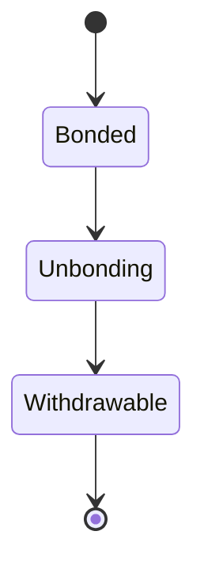
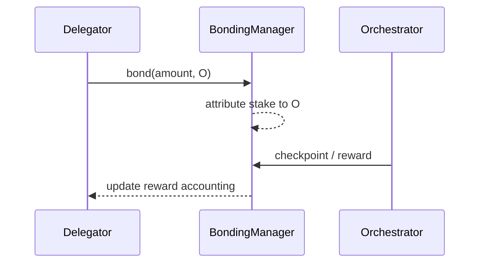

{/* codex-i18n: eyJraW5kIjoiY29kZXgtaTE4biIsInZlcnNpb24iOjEsInNvdXJjZVBhdGgiOiJ2Mi9scHQvZGVsZWdhdGlvbi9vdmVydmlldy5tZHgiLCJzb3VyY2VSb3V0ZSI6InYyL2xwdC9kZWxlZ2F0aW9uL292ZXJ2aWV3Iiwic291cmNlSGFzaCI6IjQ3NTcwM2Y0NDQyNzA1MmY4ZTJjMTFmODlhODk4MDYwZDc3MjcyMzE4ODE3MzA5N2NiYTZhNzI4Y2Y1MGJlMWMiLCJsYW5ndWFnZSI6ImZyIiwicHJvdmlkZXIiOiJvcGVucm91dGVyIiwibW9kZWwiOiJxd2VuL3F3ZW4tdHVyYm8iLCJnZW5lcmF0ZWRBdCI6IjIwMjYtMDMtMDFUMTE6MDI6MDEuOTY5WiJ9 */}
import { MathInline, MathBlock } from '/snippets/components/content/math.jsx'

## Résumé exécutif

La délégation est le mécanisme du protocole par lequel un détenteur de LPT lie son stake et l'attribue à un orchestrator, augmentant ainsi le poids économique de cet orchestrator sans que le déléguant n'opère d'infrastructure.

La délégation est strictement une**action au niveau du protocole (sur la chaîne)**Elle ne exécute pas de tâches, ne route pas de segments ou ne contrôle pas la planification des GPU. Elle modifie plutôt les résultats pondérés par le stake : la répartition des récompenses, le poids de la gouvernance et (lorsque cela est pertinent) la répartition des tâches.

---

## 1. Définition formelle

Soit :

- <MathInline latex={String.raw`D`} /> un déléguer
- <MathInline latex={String.raw`O`} /> un orchestrateur
- <MathInline latex={String.raw`b_{D,O}`} /> soit LPT lié par <MathInline latex={String.raw`D`} /> vers <MathInline latex={String.raw`O`} />
- <MathInline latex={String.raw`B_{self,O}`} /> soit le montant de l'auto-lien de l'orchestrateur

Total stake attribué à l'orchestrator <MathInline latex={String.raw`O`} />:

<MathBlock latex={String.raw`B_O = B_{self,O} + \sum_D b_{D,O}`} />

Total de la mise engagée :

<MathBlock latex={String.raw`B_T = \sum_O B_O`} />

La délégation est une règle d'attribution sur la mise engagée enregistrée dans l'état du contrat de protocole.

---

## 2. Contexte architectural

### 2.1 Responsabilités du niveau protocole

La délégation est implémentée par des contrats intelligents du protocole qui : 

- Suivent le stake lié par adresse
- Attribuent le stake du déléguant à un délégué (orchestrator)
- Allouent les avantages d'inflation et de frais de manière proportionnelle
- Imposent des délais d'annulation

Adresses des contrats canoniques : [Registre des contrats](https://docs.livepeer.org/references/contract-addresses)

### 2.2 Responsabilités du niveau réseau

Le niveau réseau :

- Exécute le logiciel d'orchestration
- Exécute les tâches de transcodage/IA
- Génère des frais en fonction de la demande du marché
- Maintient l'uptime et les caractéristiques de performance

La délegation influence les opérateurs qui ont un plus grand poids économique, mais l'exécution du réseau reste hors chaîne.

---

## 3. Poids économique et sécurité

La délegation augmente<MathInline latex={String.raw`B_O`} />, augmentant ainsi la part pondérée par le stake de l'orchestrateur.

Définir le poids de l'orchestrateur:

<MathBlock latex={String.raw`W_O = \frac{B_O}{B_T}`} />

Implication de sécurité :

- Augmenter<MathInline latex={String.raw`B_T`} /> augmente le coût du capital requis pour capturer les résultats pondérés par le stake.

Ainsi :

<MathBlock latex={String.raw`\text{Security} \propto B_T`} />

---

## 4. Attribution des récompenses (émission)

Par tour <MathInline latex={String.raw`t`} />, l'émission du protocole est mintée :

<MathBlock latex={String.raw`R_t = S_t \cdot r_t`} />

Répartition de l'émission brute de l'Orchestrator :

<MathBlock latex={String.raw`R_O = R_t \cdot \frac{B_O}{B_T}`} />

Répartition de l'émission nette des délégués avec commission <MathInline latex={String.raw`c_O`} />:

<MathBlock latex={String.raw`R_{D,O} = R_O (1 - c_O) \cdot \frac{b_{D,O}}{B_O}`} />

Cette formule sépare :

- Émission du protocole (expansion de la offre)
- Commission de l'orchestrateur
- Part des délégués proportionnelle

---

## 5. Revenus de frais (Demande)

Les frais sont déterminés par la demande et peuvent être attribués aux parties prenantes selon les règles de comptabilité du protocole.

Le retour total des délégués se décompose en :

<MathBlock latex={String.raw`Reward_{D,O} = Issuance_{D,O} + Fees_{D,O}`} />

L'émission est déterminée par le protocole ; les frais dépendent de l'utilisation du réseau.

---

## 6. Délégation comme allocation de capital

La délégation crée un marché d'opérateurs. Les délégués allouent leur participation en fonction de :

- Niveaux de commission
- Fiabilité des points de vérification
- Réputation de performance
- Préférences de décentralisation

Comme le stake peut migrer (sous réserve des contraintes d'indemnisation), la délégation fonctionne comme une allocation continue du capital plutôt qu'une décision unique.

---

## 7. Contraintes de liquidité et d'indemnisation

La délégation n'est pas immédiatement réversible.

L'indemnisation introduit un délai mesuré en tours de protocole. Ce délai :

- Réduit les attaques de rotation rapide du stake
- Stabilise la participation à la sécurité
- Introduit des contraintes de liquidité pour les délégués

Modèle d'état :

---

## 8. Risques et modes de défaillance

Les délégués font face à des risques au niveau du protocole et de l'opérateur :

1. **Risque de commission :** <MathInline latex={String.raw`c_O`} />réduit la part nette
2. **Risque de point de contrôle :** le non-respect d'un point de contrôle réduit l'émission réalisée
3. **Exposition à la sanction :** lorsque cela est activé, le stake peut être réduit dans des conditions définies
4. **Risque de concentration :** important <MathInline latex={String.raw`B_O`} /> augmente l'exposition systémique
5. ** Risque de liquidité :** le délai de déblocage restreint la sortie

Ce sont des risques économiques inhérents à un protocole pondéré par le capital.

---

## 9. Diagramme de séquence

---

## 10. Séparation entre le protocole et le réseau

**Protocole (sur chaîne) :**
- Attribution des stakes
- Formules d'émission et d'émision
- Comptabilisation des droits aux récompenses
- Attribution du poids de gouvernance

**Réseau (hors chaîne) :**
- Exécution des tâches de transcodage/AI
- Uptime et performance
- Génération des frais

La délégation est une action du protocole qui contraint économiquement le comportement du réseau.

---

## Références

- [Livepeer Dépôt du protocole](https://github.com/livepeer/protocol)
- [Registre des contrats](https://docs.livepeer.org/references/contract-addresses)
