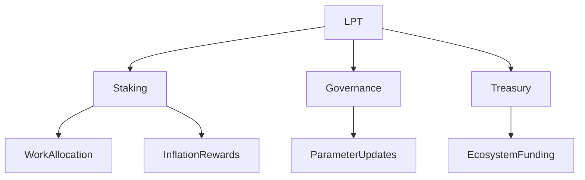

import { MathInline, MathBlock } from '/snippets/components/content/math.jsx'

## Executive Summary

The Livepeer Token (LPT) is the protocol-layer asset that secures, governs, and economically regulates the Livepeer network. It is not a payment token for video consumption, nor a representation of corporate equity. Its function is strictly structural: it converts bonded capital into measurable economic weight that secures job allocation, enables governance, and funds ecosystem development.

LPT operates exclusively at the **protocol layer (on-chain)** on Arbitrum One.

<CustomDivider />

## 1. Formal Definition

Let the Livepeer Protocol be defined as an on-chain coordination system for allocating work and rewards across decentralized compute providers.

LPT is defined as:

> A stake-weighted coordination asset that provides economic security, governance authority, and treasury control within the Livepeer Protocol.

Its functional domains are:

1. Staking security
2. Inflation-based reward distribution
3. Delegated capital allocation
4. Governance voting
5. Treasury stewardship

<CustomDivider />

## 2. Architectural Context

### 2.1 Protocol Layer (On-Chain)

LPT interacts with core smart contracts:

- **BondingManager** - stake accounting
- **Minter** - inflation issuance
- **RoundsManager** - epoch-based reward timing
- **Governor** - proposal and voting execution
- **Treasury** - governance-controlled funds

All protocol authority derives from bonded LPT balances.

### 2.2 Network Layer (Off-Chain)

The network layer includes:

- Orchestrator software
- GPU compute execution
- Transcoding and inference pipelines
- Gateway APIs and routing

LPT does not execute work. It economically secures actors who perform work.

<CustomDivider />

<Accordion title="Technical Reference: Protocol Mechanics" icon="function">

## 3. Staking and Economic Weight

Let:

- <MathInline latex={String.raw`B_i`} /> = bonded stake of participant <MathInline latex={String.raw`i`} />
- <MathInline latex={String.raw`B_T`} /> = total bonded stake

Economic weight:

<MathBlock latex={String.raw`W_i = \frac{B_i}{B_T}`} />

Work allocation and inflation rewards are proportional to <MathInline latex={String.raw`W_i`} />.

This creates a capital-backed Sybil resistance model.

---

## 4. Inflation Mechanism Overview

Per round <MathInline latex={String.raw`t`} />:

<MathBlock latex={String.raw`R_t = S_t \times r_t`} />

Where:

- <MathInline latex={String.raw`S_t`} /> = token supply at round <MathInline latex={String.raw`t`} />
- <MathInline latex={String.raw`r_t`} /> = protocol-defined inflation rate

Inflation adjusts dynamically based on bonding rate relative to target bonding rate (see [Tokenomics](./tokenomics) section for full derivation).

---

## 5. Delegation Model

Delegators bond stake to orchestrators, increasing their economic weight without running infrastructure.

Total orchestrator stake:

<MathBlock latex={String.raw`B_O = B_{self,O} + \sum_D b_{D,O}`} />

Delegation enables capital efficiency and competitive operator markets.

---

## 6. Governance Authority

Voting power derives from bonded stake:

<MathBlock latex={String.raw`V_i = \frac{B_i}{B_T}`} />

Governance may modify:

- Inflation parameters
- Contract implementations
- Treasury allocations

Governance authority is capital-weighted and on-chain enforced.

---

## 7. Security Model

Protocol security is proportional to total bonded stake:

<MathBlock latex={String.raw`\text{Security} \propto B_T`} />

An attacker must acquire a threshold fraction of bonded LPT to influence work allocation or governance.

---

## 8. Economic Tradeoffs

| Mechanism | Tradeoff |
|-----------|----------|
| Inflation issuance | Bootstrapping vs dilution |
| Delegation | Accessibility vs concentration |
| Capital-weighted governance | Security vs wealth influence |

These tradeoffs are explicit design decisions.

</Accordion>

<CustomDivider />

## 9. System Interaction Diagram

<CustomDivider />

## 10. Operational Considerations

Participants must understand:

- Bonding and unbonding delays
- Commission structures
- Inflation parameter adjustments
- Governance quorum thresholds

Participation exposes capital to protocol-level risk.

<CustomDivider />

## References

- [Livepeer Protocol Repository](https://github.com/livepeer/protocol)
- [Contract Registry](https://docs.livepeer.org/references/contract-addresses)
- [Livepeer Improvement Proposals (LIPs)](https://github.com/livepeer/LIPs)
