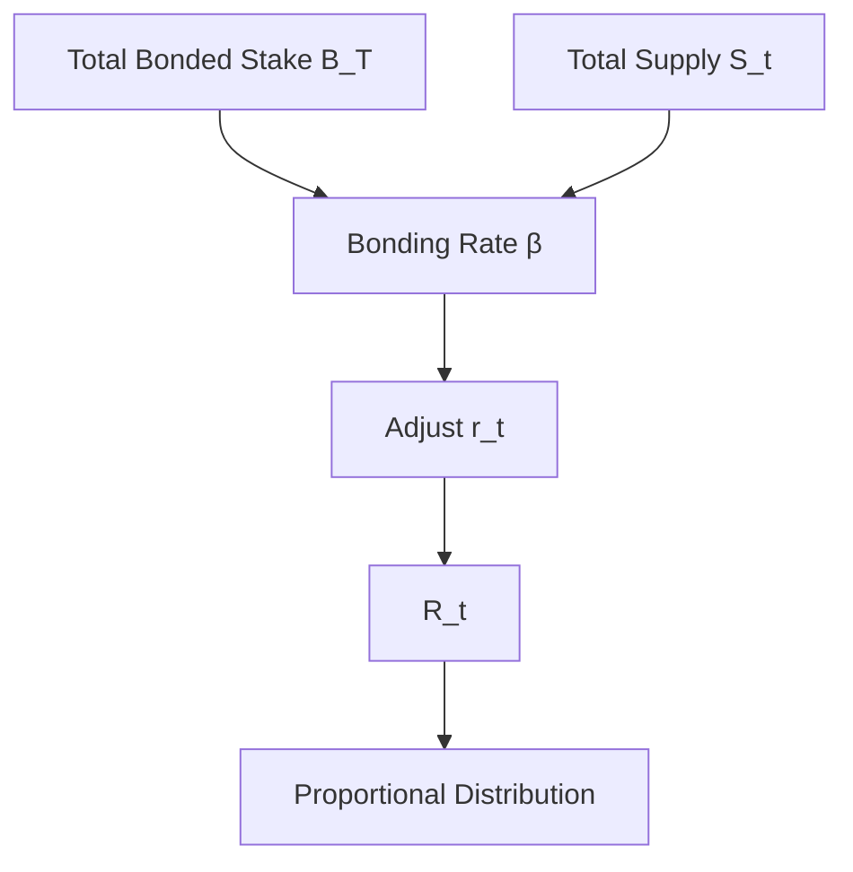

import { MathInline, MathBlock } from '/snippets/components/content/math.jsx'

## Executive Summary

LPT tokenomics defines how the Livepeer Protocol issues new supply, adjusts inflation relative to security participation, distributes rewards, and maintains a capital-backed security equilibrium.

The tokenomics model is implemented at the **protocol layer (on-chain)** via staking, inflation adjustment logic, and deterministic reward allocation.

---

<Accordion title="Technical Reference: Formal Tokenomics Model" icon="function">

## 1. Formal Variables

Let:

- <MathInline latex={String.raw`S_t`} /> = total LPT supply at round <MathInline latex={String.raw`t`} />
- <MathInline latex={String.raw`B_T`} /> = total bonded LPT
- <MathInline latex={String.raw`B_i`} /> = bonded stake attributed to participant <MathInline latex={String.raw`i`} />
- <MathInline latex={String.raw`\beta`} /> = bonding rate = <MathInline latex={String.raw`\frac{B_T}{S_t}`} />
- <MathInline latex={String.raw`\beta^*`} /> = target bonding rate
- <MathInline latex={String.raw`r_t`} /> = inflation rate applied in round <MathInline latex={String.raw`t`} />
- <MathInline latex={String.raw`\alpha`} /> = inflation adjustment coefficient
- <MathInline latex={String.raw`c_O`} /> = commission rate set by orchestrator <MathInline latex={String.raw`O`} />

---

## 2. Inflation Issuance Model

Per round <MathInline latex={String.raw`t`} />, newly minted LPT:

<MathBlock latex={String.raw`R_t = S_t \cdot r_t`} />

Supply update:

<MathBlock latex={String.raw`S_{t+1} = S_t + R_t`} />

Inflation therefore compounds relative to current supply.

---

## 3. Bonding-Rate Feedback Mechanism

The protocol adjusts inflation according to the deviation between the current bonding rate and target bonding rate.

Current bonding rate:

<MathBlock latex={String.raw`\beta = \frac{B_T}{S_t}`} />

Adjustment rule:

If <MathInline latex={String.raw`\beta < \beta^*`} />:

<MathBlock latex={String.raw`r_{t+1} = r_t + \alpha`} />

If <MathInline latex={String.raw`\beta > \beta^*`} />:

<MathBlock latex={String.raw`r_{t+1} = r_t - \alpha`} />

This creates a control loop:

- Under-bonded system → higher inflation → stronger staking incentive
- Over-bonded system → lower inflation → reduced dilution

The system seeks equilibrium where <MathInline latex={String.raw`\beta \approx \beta^*`} />.

---

## 4. Reward Distribution

Total issuance per round <MathInline latex={String.raw`R_t`} /> is distributed proportionally to stake weight.

Define economic weight:

<MathBlock latex={String.raw`W_i = \frac{B_i}{B_T}`} />

Allocation to orchestrator <MathInline latex={String.raw`O`} />:

<MathBlock latex={String.raw`R_O = R_t \cdot \frac{B_O}{B_T}`} />

Delegator <MathInline latex={String.raw`D`} /> bonded to orchestrator <MathInline latex={String.raw`O`} />:

<MathBlock latex={String.raw`R_{D,O} = R_O (1 - c_O) \cdot \frac{b_{D,O}}{B_O}`} />

This separates gross issuance from commission-adjusted delegator returns.

---

## 5. Issuance vs Fee Revenue

Returns to bonded participants may consist of:

1. Inflation-based issuance (supply expansion)
2. Fee revenue from video/AI workloads (demand-based)

Total reward to participant <MathInline latex={String.raw`i`} />:

<MathBlock latex={String.raw`Reward_i = Issuance_i + Fees_i`} />

Inflation is protocol-determined; fees are market-driven.

Tokenomics must therefore be evaluated in two components: issuance dynamics and network demand.

---

## 6. Security Equilibrium

Security cost for adversarial control scales with bonded stake.

Let <MathInline latex={String.raw`\theta`} /> be the threshold fraction required to influence governance or allocation.

Required capital:

<MathBlock latex={String.raw`Capital_{attack} \geq \theta B_T`} />

Increasing <MathInline latex={String.raw`B_T`} /> increases the cost of control.

Inflation adjustment encourages equilibrium around a stable security participation rate.

</Accordion>

---

## 7. Economic Tradeoffs

| Mechanism | Tradeoff |
|------------|-----------|
| Dynamic inflation | Stability vs responsiveness |
| Delegated staking | Accessibility vs centralization risk |
| Capital-weighted rewards | Security strength vs wealth concentration |

---

## 8. System Diagram

---

## 9. Protocol vs Network Separation

**Protocol Layer (On-Chain):**
- Inflation calculation
- Bonding rate adjustment
- Stake accounting
- Reward minting

**Network Layer (Off-Chain):**
- Fee generation from workloads
- Operational performance
- Job routing

Tokenomics governs issuance; network activity governs fees.

---

## References

- [Livepeer Protocol Repository](https://github.com/livepeer/protocol)
- [Contract Registry](https://docs.livepeer.org/references/contract-addresses)
