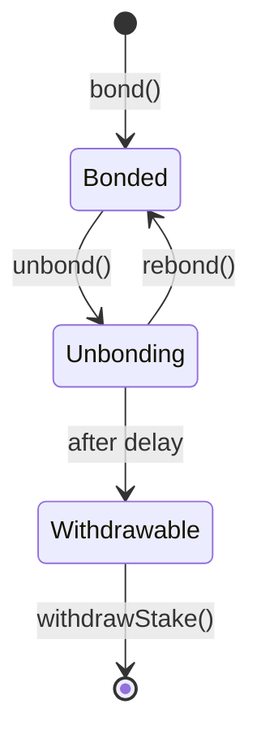

Once you have delegated, your LPT is actively earning on your behalf. This page covers how to manage your position: checking performance, claiming and compounding rewards, moving to a different orchestrator, and exiting when you are ready.

---

## How rewards accumulate

You do not need to do anything for rewards to accrue. Each round, when your orchestrator calls `Reward()`, the BondingManager contract updates the reward accounting for all delegators in that orchestrator's pool. Your pending reward balance increases automatically.

These rewards sit in the contract against your account. They are not in your wallet yet. To access them — either to compound or withdraw — you need to claim them.

<Note>
  If your orchestrator does not call `Reward()` in a round, no rewards are distributed for that round. Check the Explorer periodically to confirm your orchestrator is consistently calling reward. See [Choose an Orchestrator](./choose-an-orchestrator) for how to interpret reward call history.
</Note>

---

## Claim your earnings

Claiming earnings is the action that moves accrued rewards into your bonded balance, where you can then compound or initiate withdrawal.

### From the Explorer

1. Go to [explorer.livepeer.org](https://explorer.livepeer.org) and connect your wallet
2. Navigate to your account page
3. Click **Claim Earnings**
4. Sign the transaction (small Arbitrum gas cost)

After claiming, your bonded balance increases by the claimed amount.

### How often should you claim?

The protocol supports claiming rewards accumulated over many rounds in a single transaction. You do not forfeit rewards by waiting to claim — they accumulate indefinitely in contract state.

That said, unclaimed rewards do not compound. If you want your reward earnings to generate additional rewards, you need to claim and rebond them. The longer you leave unclaimed rewards without rebonding, the more compounding potential you forego.

<Tip>
  Some orchestrators run automated bots that call `claimEarnings` on behalf of their delegators. Ask in [#orchestrators on Discord](https://discord.gg/livepeer) or check the orchestrator's documentation to see if they do this.
</Tip>

---

## Compound: rebond your rewards

Rebonding adds your claimed earnings back to your bonded balance. This compounds your position: a larger bonded stake earns a larger share of each future round's rewards.

After claiming earnings, your bonded balance includes both your original stake and your new rewards. If you want to withdraw the reward portion as liquid LPT, you would initiate unbonding. If you want to compound, simply leave the rewards in your bonded balance — they will earn alongside your original stake from the next round.

### Is compounding worth it?

For long-term delegators, yes. The more frequently you claim and rebond, the larger your bonded stake grows, and the more you earn in subsequent rounds. The effect compounds over time, particularly during periods of higher inflation.

The trade-off is gas cost per claim transaction. On Arbitrum One, this is negligible (a few cents). Claim as often as feels sensible relative to the amount accrued.

---

## Switch orchestrators

If your orchestrator's performance changes — missed reward calls, a commission increase, dropping out of the active set — you can redelegate to a different orchestrator without going through the unbonding process.

### How to redelegate

1. Go to [explorer.livepeer.org](https://explorer.livepeer.org) and connect your wallet
2. Find the new orchestrator you want to delegate to
3. Click **Delegate** on their profile
4. The transaction changes your stake attribution from your current orchestrator to the new one
5. Sign the transaction

Redelegation takes effect in the next round. Your bonded balance does not change — only the orchestrator your stake is attributed to. There is no waiting period.

<Warning>
  Claim any pending earnings before redelegating. Earnings that have accrued from your current orchestrator but have not been claimed should be claimed first to ensure they are correctly accounted for before the attribution change.
</Warning>

### When to switch

- Your orchestrator starts missing `Reward()` calls consistently (2+ consecutive missed rounds)
- Your orchestrator raises their commission to an unacceptable level
- Your orchestrator drops out of the active set and shows no sign of returning
- You want to support a smaller or more recently active orchestrator for network health reasons

---

## Unbond and withdraw

When you want to fully exit delegation and return your LPT to your wallet, you go through a two-step process: initiate unbonding, then withdraw after the waiting period.

### The unbonding flow

### Step 1: Initiate unbonding

1. Go to [explorer.livepeer.org](https://explorer.livepeer.org) and connect your wallet
2. Navigate to your account page
3. Click **Undelegate** (or **Unbond**)
4. Enter the amount to unbond — you can unbond a partial amount
5. Sign the transaction

Your stake enters the unbonding state. It no longer earns rewards from this point.

{/* REVIEW: Unbonding period — verify the exact round count against the current BondingManager `unbondingPeriod` parameter. The protocol has historically used 7 rounds (~7 days at ~21 hours per round). getting-started.mdx stated "approximately 21 hours (one round)" which may refer to a different protocol state or be incorrect. Confirm with Mehrdad or Rick before publishing. */}

### Step 2: Wait for the unbonding period

During this period, your LPT remains in the BondingManager contract. You cannot accelerate the wait. You can, however, cancel unbonding and rebond if you change your mind — this returns your stake to bonded status without needing to start a new approval and bond cycle.

### Step 3: Withdraw

Once the unbonding period completes, your stake moves to a withdrawable state. Return to your account in the Explorer and click **Withdraw**. This sends your LPT back to your connected wallet.

<Tip>
  If you are switching orchestrators rather than fully exiting, use redelegation instead. Redelegation avoids the unbonding wait and keeps your stake earning throughout.
</Tip>

---

## Monitor your position

### Explorer dashboard

The Livepeer Explorer account page shows:
- Your current bonded balance
- Pending unclaimed earnings
- Your orchestrator's current stats (commission, reward call history, active status)
- Historical reward accrual

Check this at minimum whenever you plan to claim or when you hear about changes to your orchestrator's status.

### Signals to watch for

<AccordionGroup>

<Accordion title="Your orchestrator's reward call rate drops">
  If your orchestrator goes from 30/30 rounds to 25/30 or lower, investigate. Check their Discord presence, the Explorer history, and the Livepeer community channels for any explanation. If it looks structural rather than a one-off incident, consider redelegating.
</Accordion>

<Accordion title="Your orchestrator raises their commission">
  Commission changes take effect the next round. If you notice a significant increase in rewardCut or a decrease in feeShare, evaluate whether the new terms are still competitive. Redelegation is straightforward and free of a waiting period.
</Accordion>

<Accordion title="Your orchestrator drops out of the active set">
  If their total bonded stake falls below the top 100, they exit the active set. You earn nothing while they are inactive. This can happen if large delegators exit. Redelegate promptly to an active orchestrator.
</Accordion>

<Accordion title="A governance proposal that affects your returns">
  LIPs that modify the inflation rate, unbonding period, treasury allocation, or active set size directly affect delegator economics. Governance proposals are visible on the Explorer voting page. Your bonded stake gives you voting power — use it.
</Accordion>

</AccordionGroup>

---

## Governance

Your bonded LPT gives you voting weight on Livepeer Improvement Proposals. Governance decisions include inflation parameter changes, treasury allocations, protocol upgrades, and active set size.

Voting happens through the Explorer. Active proposals are visible under the governance section. To vote, connect your wallet and sign a transaction with your preferred option.

Governance is optional but worth monitoring, particularly for proposals that affect inflation rates or unbonding periods.

---

## Frequently asked questions

<AccordionGroup>

<Accordion title="Do I lose pending rewards if I redelegate to a new orchestrator?">
  No. Pending unclaimed rewards are tracked against your account, not your orchestrator. They will still be claimable after you redelegate. That said, claim before redelegating as a precaution to ensure accounting is clean.
</Accordion>

<Accordion title="Can I unbond while still earning rewards?">
  The moment you call `unbond()`, your stake exits the earning state. You will not earn rewards during the unbonding period. If you want to continue earning while deciding, stay bonded and redelegate if needed.
</Accordion>

<Accordion title="Can I rebond during the unbonding period to change my mind?">
  Yes. During the unbonding wait, you can call `rebond()` to return your stake to bonded status. This cancels the unbonding and attributes your stake back to the last orchestrator you delegated to.
</Accordion>

<Accordion title="Can I partially unbond?">
  Yes. You can unbond a specific amount rather than your entire bonded balance. The unbonded portion enters the waiting period while the remainder stays bonded and continues earning.
</Accordion>

<Accordion title="What happens to my delegation if I bridge my LPT back to Ethereum mainnet?">
  You must unbond and withdraw on Arbitrum One before bridging. LPT that is bonded in the BondingManager contract cannot be bridged directly — it must be in a liquid, wallet-held state first.
</Accordion>

<Accordion title="Is there a minimum delegation amount?">
  There is no protocol-enforced minimum. In practice, very small delegations (a few LPT) will earn returns so small that the gas cost of claiming outweighs the benefit. Delegation becomes meaningfully rewarding at larger amounts — assess based on current network parameters visible on the Explorer.
</Accordion>

</AccordionGroup>

---

## Related pages

<CardGroup cols={2}>
  <Card title="Choose an Orchestrator" icon="list-check" href="./choose-an-orchestrator" arrow>
    Evaluating and selecting an orchestrator, and completing the initial delegation transaction.
  </Card>
  <Card title="Delegation Economics" icon="chart-line" href="./delegation-economics" arrow>
    How the reward formulas work, what rewardCut and feeShare mean, and what to expect from returns.
  </Card>
  <Card title="Livepeer Explorer" icon="compass" href="https://explorer.livepeer.org" arrow>
    Live orchestrator stats, your account position, and the governance voting interface.
  </Card>
  <Card title="Delegation Overview" icon="scroll" href="./overview" arrow>
    The complete section landing page with key facts and the full page map.
  </Card>
</CardGroup>
