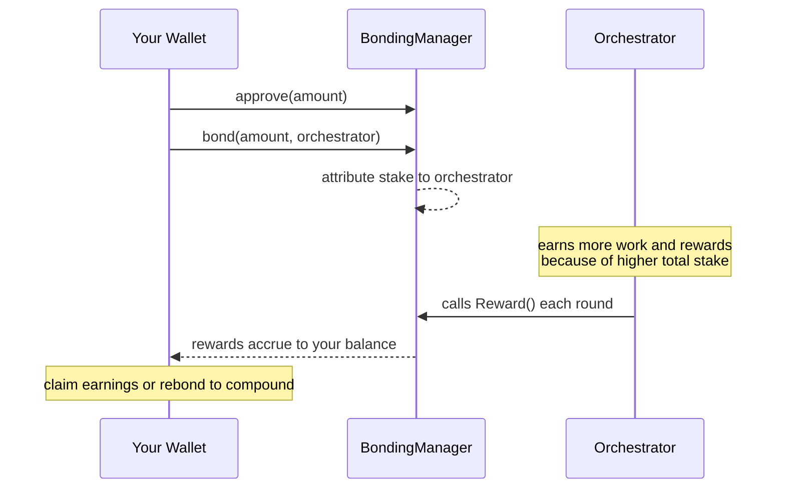
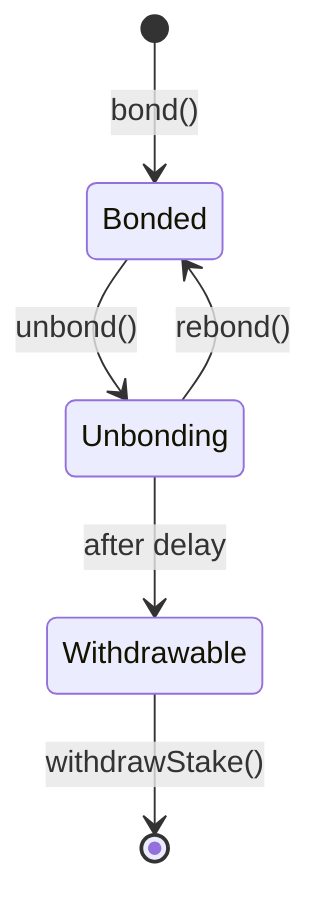

Delegation is how LPT holders participate in the Livepeer network without running infrastructure. You bond your tokens to an orchestrator, that orchestrator earns more work and more rewards because of your stake, and you receive a share of those rewards in return.

This section covers everything you need to go from LPT holder to active delegator: how the economics work, how to choose an orchestrator, how to execute the delegation transaction, and how to manage your position over time.

---

## What you get from delegating

<CardGroup cols={3}>
  <Card title="LPT inflation rewards" icon="coins">
    New LPT is minted each round and distributed to bonded stake. Delegating is the only way to keep pace with network inflation.
  </Card>
  <Card title="ETH fee revenue" icon="ethereum">
    Orchestrators earn ETH when they process video or AI jobs. A share of those fees flows to delegators proportional to their stake.
  </Card>
  <Card title="Governance weight" icon="scale-balanced">
    Bonded stake gives you voting power on Livepeer Improvement Proposals (LIPs), protocol upgrades, and treasury decisions.
  </Card>
</CardGroup>

---

## What happens if you do not delegate

LPT has a parametric inflation model. When less than roughly 50% of total supply is bonded, the inflation rate rises to encourage more delegation. When more than 50% is bonded, it falls.

If you hold LPT but do not delegate, you receive none of this inflation. Every round you stay unbonded, your share of total supply decreases relative to delegators who are earning new tokens. This is a real and ongoing cost of holding without delegating.

<Note>
  The inflation rate adjusts each round based on the bonding ratio. You can view the current rate and total bonded supply at [explorer.livepeer.org](https://explorer.livepeer.org).
</Note>

---

## Key facts before you start

<AccordionGroup>

<Accordion title="Your tokens stay in a non-custodial contract">
  When you delegate, your LPT moves into the Livepeer BondingManager smart contract on Arbitrum One. You are not sending tokens to an orchestrator. The orchestrator cannot access or move your LPT. Only you can initiate unbonding and withdrawal.
</Accordion>

<Accordion title="LPT must be on Arbitrum One">
  Livepeer's staking protocol runs on Arbitrum One, not Ethereum mainnet. If your LPT is on Ethereum, you need to bridge it first before delegating. See the bridging guide linked at the bottom of this page.
</Accordion>

<Accordion title="You can only delegate to one orchestrator at a time">
  Your full bonded stake is attributed to a single orchestrator. You cannot split your stake across multiple orchestrators from one address. To change orchestrators, you redelegate (instant) or unbond and re-bond (slower).
</Accordion>

<Accordion title="Unbonding is not instant">
  When you want to exit, you initiate unbonding. There is a protocol-enforced waiting period before you can withdraw your LPT to your wallet. Plan accordingly if you may need liquidity.

  {/* REVIEW: Unbonding period — getting-started.mdx states "approximately 21 hours (one round)". Historical protocol documentation states 7 rounds (~7 days). Verify against current BondingManager `unbondingPeriod` parameter before publishing. */}
</Accordion>

<Accordion title="You are not responsible for orchestrator performance">
  If your orchestrator underperforms or stops earning, you stop earning — but your stake is not at risk from their performance. Slashing (stake reduction as a penalty) exists as a protocol mechanism but is currently disabled on Livepeer mainnet.
</Accordion>

</AccordionGroup>

---

## How delegation works

---

## State lifecycle

---

## In this section

<CardGroup cols={2}>

  <Card title="Delegation Economics" icon="chart-line" href="./delegation-economics" arrow>
    How inflation works, what rewardCut and feeShare mean, and a worked example of what you can expect to earn.
  </Card>

  <Card title="Choose an Orchestrator" icon="list-check" href="./choose-an-orchestrator" arrow>
    The step-by-step guide to evaluating orchestrators, selecting one, and completing the delegation transaction. Start here when you are ready to delegate.
  </Card>

  <Card title="Manage Your Delegation" icon="gauge" href="./manage-your-delegation" arrow>
    Claiming rewards, compounding, switching orchestrators, and exiting your position.
  </Card>

  <Card title="Bridge LPT to Arbitrum" icon="bridge" href="/v2/lpt/about/bridge-lpt" arrow>
    If your LPT is on Ethereum mainnet, start here.
  </Card>

</CardGroup>

---

## Protocol references

<CardGroup cols={2}>
  <Card title="Livepeer Explorer" icon="compass" href="https://explorer.livepeer.org" arrow>
    The primary interface for delegation, orchestrator browsing, and reward claiming.
  </Card>
  <Card title="Contract Addresses" icon="file-contract" href="/references/contract-addresses" arrow>
    BondingManager and associated contract addresses on Arbitrum One.
  </Card>
</CardGroup>
