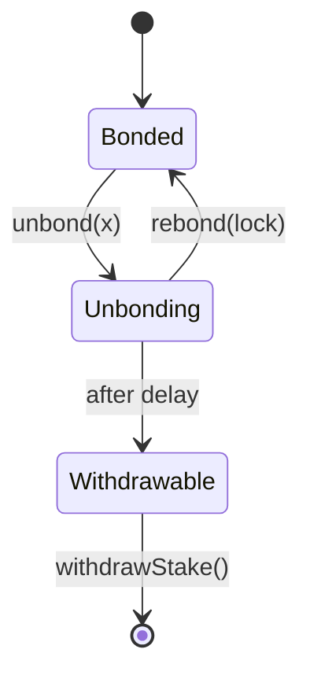
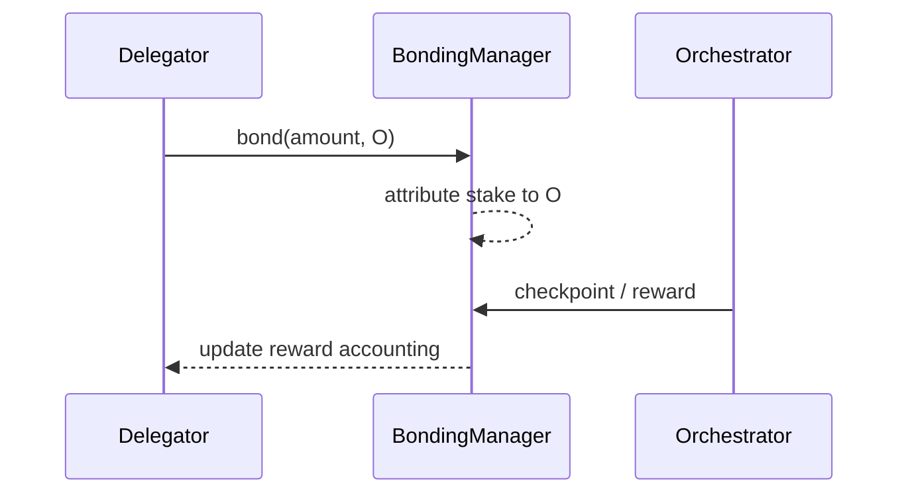

import { MathInline, MathBlock } from '/snippets/components/content/math.jsx'

## Executive Summary

A **delegator** is an LPT holder who bonds stake and attributes it to an orchestrator. Delegators do not run infrastructure, but they are economically responsible participants: their stake increases protocol security, shapes capital allocation across orchestrators, and contributes stake-weighted governance power.

Delegation is strictly a **protocol-layer (on-chain)** mechanism. Delegators do not route or execute jobs; they participate in the on-chain economic substrate that constrains and incentivizes network-layer operators.

---

## 1. Formal Definition

Let:

- <MathInline latex={String.raw`D`} />: a delegator address
- <MathInline latex={String.raw`O`} />: an orchestrator address
- <MathInline latex={String.raw`b_{D,O}`} />: stake bonded by <MathInline latex={String.raw`D`} /> toward <MathInline latex={String.raw`O`} />
- <MathInline latex={String.raw`B_{self,O}`} />: self-bonded stake of <MathInline latex={String.raw`O`} />

Total stake attributed to <MathInline latex={String.raw`O`} />:

<MathBlock latex={String.raw`B_O = B_{self,O} + \sum_D b_{D,O}`} />

Total bonded stake:

<MathBlock latex={String.raw`B_T = \sum_O B_O`} />

Delegator stake changes protocol accounting state (bonding attribution) and therefore stake-weighted reward and governance outcomes.

---

## 2. Architectural Context

### 2.1 Protocol Layer (On-Chain)

Delegators interact with protocol contracts that:

- track bonded stake per address
- attribute stake to a delegate (orchestrator)
- enforce unbonding delays
- allocate issuance (and, where applicable, fees)
- compute stake-weighted governance power

Canonical contract addresses and networks are published in the [contract registry](https://docs.livepeer.org/references/contract-addresses).

### 2.2 Network Layer (Off-Chain)

Orchestrators operate node software and infrastructure (GPUs/compute, routing, ops processes) to execute work. Delegators are economically coupled to operator performance and behavior, but do not control execution pathways directly.

---

## 3. Economic Role

Delegators serve three protocol goals.

### 3.1 Security Participation

Security cost scales with total bonded stake:

<MathBlock latex={String.raw`\text{Security} \propto B_T`} />

Delegators increase <MathInline latex={String.raw`B_T`} />, raising the economic cost required to capture stake-weighted outcomes.

### 3.2 Capital Allocation

Delegation redistributes stake across orchestrators, shaping operator market structure.

Orchestrator weight:

<MathBlock latex={String.raw`W_O = \frac{B_O}{B_T}`} />

Delegators selecting <MathInline latex={String.raw`O`} /> increase <MathInline latex={String.raw`W_O`} />, affecting issuance allocation and governance influence.

### 3.3 Governance Participation

Voting power derives from bonded stake. For a participant <MathInline latex={String.raw`i`} />:

<MathBlock latex={String.raw`V_i = \frac{B_i}{B_T}`} />

Delegators therefore influence protocol parameter changes, upgrades, and treasury decisions.

---

## 4. Reward Model (Issuance and Fees)

Per round <MathInline latex={String.raw`t`} />, protocol issuance:

<MathBlock latex={String.raw`R_t = S_t \cdot r_t`} />

Orchestrator gross issuance allocation:

<MathBlock latex={String.raw`R_O = R_t \cdot \frac{B_O}{B_T}`} />

Delegator net issuance allocation with commission <MathInline latex={String.raw`c_O`} />:

<MathBlock latex={String.raw`R_{D,O} = R_O \cdot (1 - c_O) \cdot \frac{b_{D,O}}{B_O}`} />

Delegator total return decomposes into:

<MathBlock latex={String.raw`\text{Reward}_{D,O} = \text{Issuance}_{D,O} + \text{Fees}_{D,O}`} />

Issuance is protocol-determined; fees are market-driven (network demand).

---

## 5. Rights, Constraints, and Responsibilities

### 5.1 Rights

Delegators can:

- bond and delegate stake to an orchestrator
- unbond stake (subject to protocol delay)
- rebond during the unbonding window
- withdraw stake after the unbonding period
- claim/rebond rewards depending on protocol mechanics

### 5.2 Constraints

Delegators cannot:

- accelerate unbonding beyond the protocol-defined delay
- guarantee job flow or fee revenue
- override orchestrator operational decisions

Delegation is capital exposure without operational control.

### 5.3 Responsibilities (Practical)

Delegators should monitor:

- commission rate <MathInline latex={String.raw`c_O`} />
- reward checkpoint consistency
- stake concentration and decentralization
- governance proposals affecting inflation/security parameters

Delegation is best modeled as long-duration capital allocation.

---

## 6. Evaluation Framework for Orchestrator Selection

Delegator selection is multi-objective.

Define a delegator utility function:

<MathBlock latex={String.raw`U(O) = f(\text{NetYield}_O, \text{Reliability}_O, \text{Concentration}_O, \text{GovernanceAlignment}_O)`} />

Where:

- <MathInline latex={String.raw`\text{NetYield}_O`} /> is reduced by commission <MathInline latex={String.raw`c_O`} />
- <MathInline latex={String.raw`\text{Reliability}_O`} /> captures checkpoint consistency and operational stability
- <MathInline latex={String.raw`\text{Concentration}_O`} /> penalizes already-dominant stake share
- <MathInline latex={String.raw`\text{GovernanceAlignment}_O`} /> reflects long-term stewardship preferences

---

## 7. Risks and Failure Modes

Delegators face a layered risk profile.

1. **Commission risk:** higher <MathInline latex={String.raw`c_O`} /> reduces net returns.
2. **Checkpoint / realization risk:** realized issuance can diverge from theoretical allocation if checkpointing is not performed.
3. **Liquidity risk:** unbonding delay restricts exit.
4. **Concentration risk:** systemic exposure increases with stake centralization.
5. **Slashing risk (if enabled):** stake may be reduced under defined protocol conditions.

---

## 8. Diagrams

### 8.1 State Model

### 8.2 Reward Flow

---

## 9. Protocol vs Network Separation

**Protocol (On-Chain):** bonded stake accounting and attribution, issuance and stake-weighted allocation, unbonding delays, governance voting power.

**Network (Off-Chain):** job execution and routing, fee generation, operational performance and uptime.

Delegators participate in protocol economics; orchestrators participate in network operations.

---

## References

- [Livepeer protocol repository](https://github.com/livepeer/protocol)
- [Contract registry](https://docs.livepeer.org/references/contract-addresses)
