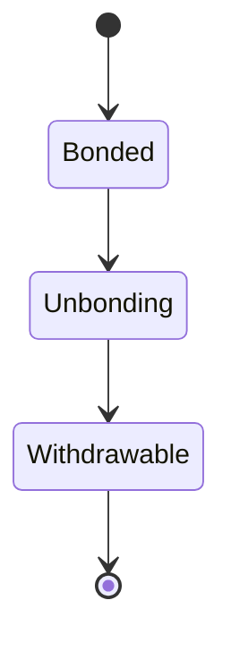
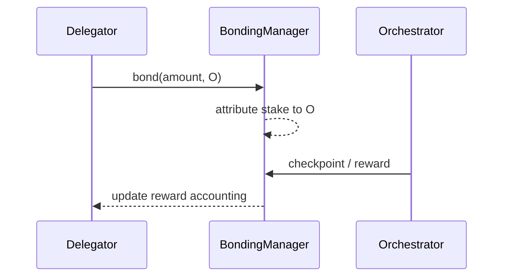

import { MathInline, MathBlock } from '/snippets/components/content/math.jsx'

## Executive Summary

Delegation is the protocol mechanism by which an LPT holder bonds stake and attributes it to an orchestrator, increasing that orchestrator's economic weight without the delegator operating infrastructure.

Delegation is strictly a **protocol-layer (on-chain)** action. It does not execute jobs, route segments, or control GPU scheduling. Instead, it modifies stake-weighted outcomes: reward allocation, governance weight, and (where applicable) work allocation.

---

<Accordion title="Technical Reference: Stake Attribution Model" icon="function">

## 1. Formal Definition

Let:

- <MathInline latex={String.raw`D`} /> be a delegator
- <MathInline latex={String.raw`O`} /> be an orchestrator
- <MathInline latex={String.raw`b_{D,O}`} /> be LPT bonded by <MathInline latex={String.raw`D`} /> toward <MathInline latex={String.raw`O`} />
- <MathInline latex={String.raw`B_{self,O}`} /> be orchestrator self-bonded stake

Total stake attributed to orchestrator <MathInline latex={String.raw`O`} />:

<MathBlock latex={String.raw`B_O = B_{self,O} + \sum_D b_{D,O}`} />

Total bonded stake:

<MathBlock latex={String.raw`B_T = \sum_O B_O`} />

Delegation is an attribution rule over bonded stake recorded in protocol contract state.

</Accordion>

---

## 2. Architectural Context

### 2.1 Protocol Layer Responsibilities

Delegation is implemented by protocol smart contracts that:

- Track bonded stake per address
- Attribute delegator stake to a delegate (orchestrator)
- Allocate inflation and fee entitlements proportionally
- Enforce unbonding delays

Canonical contract addresses: [Contract Registry](https://docs.livepeer.org/references/contract-addresses)

### 2.2 Network Layer Responsibilities

The network layer:

- Runs orchestrator software
- Executes transcoding/AI workloads
- Produces fees under market demand
- Maintains uptime and performance characteristics

Delegation influences which operators have greater economic weight, but network execution remains off-chain.

---

<Accordion title="Technical Reference: Stake Attribution Model" icon="function">

## 3. Economic Weight and Security

Delegation increases <MathInline latex={String.raw`B_O`} />, increasing the orchestrator's stake-weighted share.

Define orchestrator weight:

<MathBlock latex={String.raw`W_O = \frac{B_O}{B_T}`} />

Security implication:

- Increasing <MathInline latex={String.raw`B_T`} /> increases the capital cost required to capture stake-weighted outcomes.

Thus:

<MathBlock latex={String.raw`\text{Security} \propto B_T`} />

---

## 4. Reward Allocation (Issuance)

Per round <MathInline latex={String.raw`t`} />, protocol issuance is minted:

<MathBlock latex={String.raw`R_t = S_t \cdot r_t`} />

Orchestrator gross issuance allocation:

<MathBlock latex={String.raw`R_O = R_t \cdot \frac{B_O}{B_T}`} />

Delegator net issuance allocation with commission <MathInline latex={String.raw`c_O`} />:

<MathBlock latex={String.raw`R_{D,O} = R_O (1 - c_O) \cdot \frac{b_{D,O}}{B_O}`} />

This formula separates:

- Protocol issuance (supply expansion)
- Orchestrator commission
- Proportional delegator share

---

## 5. Fee Revenue (Demand)

Fees are demand-driven and may accrue to stakeholders according to protocol accounting rules.

Total delegator return decomposes into:

<MathBlock latex={String.raw`Reward_{D,O} = Issuance_{D,O} + Fees_{D,O}`} />

Issuance is protocol-determined; fees depend on network usage.

</Accordion>

---

## 6. Delegation as Capital Allocation

Delegation creates an operator market. Delegators allocate stake based on:

- Commission levels
- Checkpoint reliability
- Performance reputation
- Decentralization preferences

Because stake can migrate (subject to unbonding constraints), delegation functions as ongoing capital allocation rather than a one-time decision.

---

## 7. Liquidity Constraints and Unbonding

Delegation is not instantly reversible.

Unbonding introduces a delay measured in protocol rounds. This delay:

- Reduces rapid stake rotation attacks
- Stabilizes security participation
- Introduces liquidity constraints for delegators

State model:

---

## 8. Risks and Failure Modes

Delegators face protocol- and operator-level risks:

1. **Commission risk:** <MathInline latex={String.raw`c_O`} /> reduces net share
2. **Checkpoint risk:** missed checkpointing reduces realized issuance
3. **Slashing exposure:** where enabled, stake may be reduced under defined conditions
4. **Concentration risk:** large <MathInline latex={String.raw`B_O`} /> increases systemic exposure
5. **Liquidity risk:** unbonding delay restricts exit

These are economic risks inherent to a capital-weighted protocol.

---

## 9. Sequence Diagram

---

## 10. Protocol vs Network Separation

**Protocol (On-Chain):**
- Stake attribution
- Issuance formulas and minting
- Reward entitlement accounting
- Governance weight attribution

**Network (Off-Chain):**
- Execution of transcoding/AI jobs
- Uptime and performance
- Fee generation

Delegation is a protocol action that economically constrains network behavior.

---

## References

- [Livepeer Protocol Repository](https://github.com/livepeer/protocol)
- [Contract Registry](https://docs.livepeer.org/references/contract-addresses)
