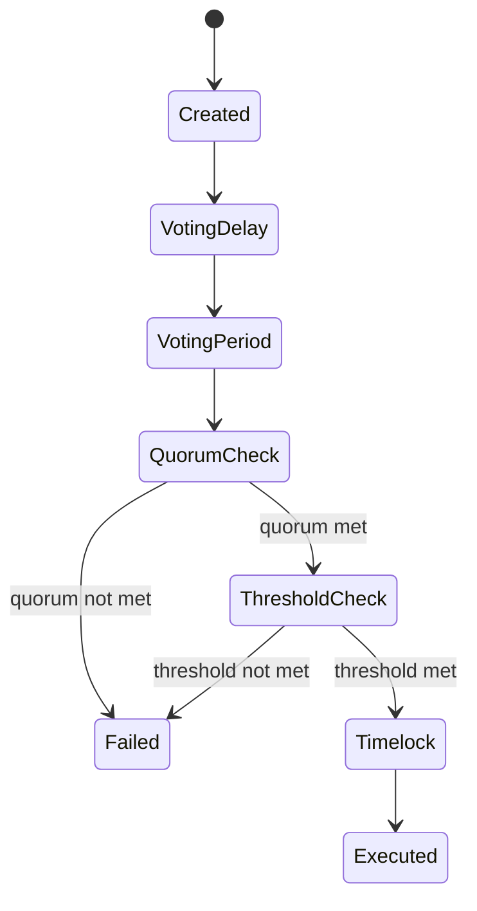

import { MathInline, MathBlock } from '/snippets/components/content/math.jsx'

## Executive Summary

Livepeer governance is a capital-weighted, proposal-based system enforced entirely by smart contracts. Authority is proportional to bonded stake, and execution is deterministic once quorum and threshold conditions are met.

This page formalizes the governance decision process, including quorum mechanics, voting thresholds, timelock semantics, and attack surface considerations.

---

## 1. Governance Primitives

Let:

- <MathInline latex={String.raw`B_i`} /> = bonded stake attributed to participant <MathInline latex={String.raw`i`} />
- <MathInline latex={String.raw`B_T`} /> = total bonded stake
- <MathInline latex={String.raw`V_i`} /> = voting power of participant <MathInline latex={String.raw`i`} />

Voting power:

<MathBlock latex={String.raw`V_i = \frac{B_i}{B_T}`} />

All governance weight is derived from bonded stake.

---

## 2. Proposal Lifecycle

A governance proposal typically follows these deterministic phases:

1. **Creation** - proposal submitted with encoded actions
2. **Voting Delay** - period before voting opens
3. **Voting Period** - bonded participants cast votes
4. **Quorum Check** - minimum participation requirement
5. **Threshold Check** - majority condition
6. **Queue (Timelock)** - execution delay
7. **Execution** - state transition if conditions met

These transitions are enforced by governance contracts.

---

## 3. Quorum Requirement

Let:

- <MathInline latex={String.raw`Q`} /> = quorum fraction
- <MathInline latex={String.raw`V_{cast}`} /> = total voting power cast

Quorum condition:

<MathBlock latex={String.raw`V_{cast} \ge Q \cdot B_T`} />

At least 33% of all staked LPT must participate in the vote for it to be valid. This requirement ensures that a small cabal cannot push through radical changes without broad community involvement.

---

## 4. Majority / Threshold Condition

Let:

- <MathInline latex={String.raw`V_{for}`} /> = stake-weighted votes in favor
- <MathInline latex={String.raw`V_{against}`} /> = stake-weighted votes against

Majority condition (simple majority):

<MathBlock latex={String.raw`V_{for} > V_{against}`} />

More than 50% of participating votes must favour the proposal. Simple majority approval balances inclusivity with decisiveness: proposals that split the community evenly cannot pass.

---

## 5. Timelock Semantics

Approved proposals enter a timelock period before execution.

Timelock properties:

- Introduces delay between approval and execution
- Provides opportunity for stakeholder reaction
- Reduces sudden-parameter-change risk

Timelock delay <MathInline latex={String.raw`T_{delay}`} /> is defined at the protocol level.

---

## 6. Execution Model

If quorum and threshold conditions are satisfied and timelock has elapsed:

- Encoded actions are executed
- Contract state transitions deterministically

Execution may include:

- Parameter modification
- Proxy implementation updates
- Treasury transfers

Execution is atomic per proposal.

---

## 7. Governance Objects and Contract Architecture

Official contract address documentation lists governance-related contracts on Arbitrum mainnet:

- **Governor** - proposal and voting logic
- **LivepeerGovernor (proxy/target)** - upgradeable governor implementation
- **BondingVotes** - stake-weighted voting power tracking
- **Treasury** - governance-controlled funds

This establishes that governance is not merely social; it is enacted through deployed contracts with published addresses.

---

## 8. Treasury Parameters

Treasury governance discussions identify two parameters as especially important:

| Parameter | Description |
|-----------|-------------|
| `treasuryRewardCutRate` | Percentage cut of inflationary rewards routed into the treasury each round (currently ~10%) |
| `treasuryBalanceCeiling` | Once the treasury balance exceeds a ceiling (750,000 LPT), the cut can be set to zero |

---

## 9. Security and Game-Theoretic Considerations

### 9.1 Capital Requirement for Control

Let <MathInline latex={String.raw`\theta`} /> represent the minimum fraction required to control outcomes.

Minimum capital required:

<MathBlock latex={String.raw`Capital_{control} \ge \theta B_T`} />

Higher bonded stake increases governance capture cost.

### 9.2 Stake Concentration Risk

If a small number of addresses control a large fraction of <MathInline latex={String.raw`B_T`} />, governance capture risk increases. Security is inversely proportional to concentration.

### 9.3 Voter Apathy Risk

If quorum fraction <MathInline latex={String.raw`Q`} /> is high relative to typical participation:
- Proposals may fail due to insufficient turnout

If <MathInline latex={String.raw`Q`} /> is low:
- Small coordinated groups may pass proposals

Quorum calibration is therefore a security parameter.

### 9.4 Executor Centralisation

The security committee/protocol owners invoke functions to set values per vote outcome. This introduces a trust dependency: even if voting is decentralised, execution may remain centralised in some paths.

---

## 10. Risks to Governance Capture

The system highlights several structurally important risks:

1. **Low participation and voting power concentration** - reduces defence against hostile governance actions
2. **Executor centralisation** - security committee dependency introduces trust requirements
3. **Slashing disabled** - reduces the system's ability to impose automatic economic penalties for misbehaviour, increasing reliance on reputation and social remedies

---

## 11. Governance State Machine

---

## 12. Protocol vs Network Separation

**Protocol (On-Chain):**
- Proposal submission
- Vote casting
- Quorum and threshold enforcement
- Timelock execution
- Parameter modification

**Network (Off-Chain):**
- Node operation
- Performance
- Job execution

Governance modifies the rules; network actors operate within those rules.

---

## References

- [Livepeer Protocol Repository](https://github.com/livepeer/protocol)
- [Contract Registry](https://docs.livepeer.org/references/contract-addresses)
- [Livepeer Improvement Proposals (LIPs)](https://github.com/livepeer/LIPs)
