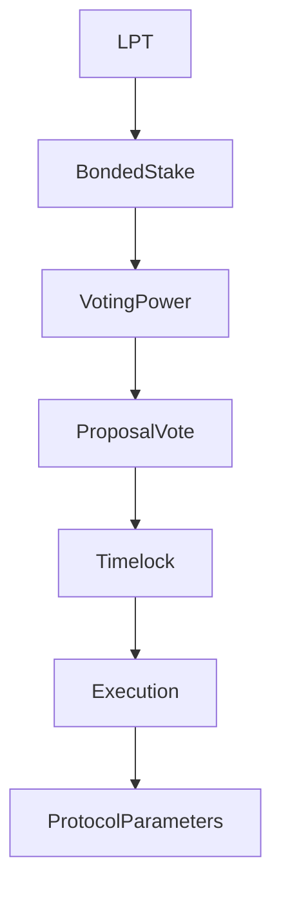

import { MathInline, MathBlock } from '/snippets/components/content/math.jsx'

## Executive Summary

Livepeer governance is a stake-weighted, on-chain decision system that controls protocol parameter updates, contract upgrades (where upgradeable), and treasury allocations.

Governance authority derives exclusively from **bonded LPT**. It operates at the **protocol layer (on-chain)** and modifies economic and contractual rules that constrain the network layer.

<Note>
 For Foundation structure, SPE process steps, and community governance participation guidance, see [Governance & the Foundation](/v2/community/livepeer-community/governance-and-foundation).
</Note>

---

## 1. Formal Definition

Let:

- <MathInline latex={String.raw`B_i`} /> = bonded stake attributed to participant <MathInline latex={String.raw`i`} />
- <MathInline latex={String.raw`B_T`} /> = total bonded stake

Voting power:

<MathBlock latex={String.raw`V_i = \frac{B_i}{B_T}`} />

Governance is therefore a capital-weighted decision system over bonded stake. Only bonded stake contributes to voting weight.

---

## 2. Governance Scope

Governance may modify:

1. Inflation parameters (e.g., adjustment coefficient, target bonding rate)
2. Contract implementations (via upgrade patterns where enabled)
3. Treasury disbursements
4. Protocol configuration constants

Governance does **not** directly control:

- GPU scheduling
- Job routing
- Gateway pricing strategies
- Off-chain operational behavior

Those belong to the network layer.

---

## 3. Hybrid On-Chain/Off-Chain Model

Livepeer uses a hybrid on-chain/off-chain governance model. Off-chain processes (discussion, working groups and signalling) allow the community to debate and refine ideas in an open forum. On-chain votes then bind those ideas into protocol upgrades or fund allocations. This separation keeps on-chain transactions minimal while maximising community input and transparency.

### Livepeer Improvement Proposals (LIPs)

The primary mechanism for protocol change is the Livepeer Improvement Proposal (LIP). LIPs are structured documents (hosted on GitHub) that specify technical changes, parameter adjustments or governance processes-similar to Ethereum's EIPs.

The lifecycle of a LIP follows a deliberate cadence:

1. **Idea & discussion** – Anyone can raise an idea on the Livepeer forum or Discord. Early feedback from developers, orchestrators and delegators helps identify trade-offs.

2. **Special-Purpose Entity formation** – Complex ideas often result in the formation of a Special-Purpose Entity (SPE): a working group of community members who scope the problem, research alternatives, produce specifications and estimate resource requirements. SPEs operate off-chain and are accountable to the community.

3. **Drafting & staking requirement** – Once a proposal is mature, the authors draft a LIP using a standard template and open a pull request against the protocol repository. Proposers must have at least 100 LPT bonded on-chain to submit a LIP.

4. **Formal review & revision** – The LIP is reviewed by the community, core developers and the Livepeer Foundation. The review period typically lasts at least two weeks.

5. **Snapshot signalling** – Before moving on-chain, proposers may conduct a Snapshot vote (off-chain token-weighted poll) to gauge sentiment.

6. **On-chain vote** – Finally, the LIP is submitted to the governance smart contract for a binding vote. If quorum and majority thresholds are met, the proposal is queued for execution.

---

## 4. Voting Mechanics

Let a proposal <MathInline latex={String.raw`P`} /> be active during a voting window.

Total voting power cast:

<MathBlock latex={String.raw`V_{cast} = \sum_{i \in voters} B_i`} />

A proposal passes if it satisfies quorum and majority thresholds as defined in governance contract logic. These thresholds are enforced on-chain.

---

## 5. Governance as Security Layer

Governance security depends on bonded stake distribution.

Let <MathInline latex={String.raw`\theta`} /> be the fraction of stake required to influence an outcome.

Minimum capital required:

<MathBlock latex={String.raw`Capital_{control} \geq \theta B_T`} />

Security increases with total bonded stake and decreases with stake concentration:

<MathBlock latex={String.raw`Security \propto B_T`} />

---

## 6. Architectural Context

### 6.1 Protocol Layer Contracts

Governance logic interacts with contracts responsible for:

- Proposal creation
- Vote casting and tallying
- Timelock enforcement
- Execution of approved proposals

Canonical contract addresses: [Contract Registry](https://docs.livepeer.org/references/contract-addresses)

### 6.2 Network Layer Interaction

Governance decisions may indirectly influence network behavior by modifying:

- Incentive parameters
- Reward dynamics
- Upgradeable contract logic

However, execution of workloads remains off-chain.

---

## 7. System Diagram

---

## 8. Protocol vs Network Separation

**Protocol (On-Chain):**
- Proposal creation
- Vote casting and tallying
- Parameter updates
- Contract upgrades
- Treasury execution

**Network (Off-Chain):**
- Node operation
- Workload execution
- Routing and pricing

Governance modifies rules; network actors execute within those rules.

---

## References

- [Livepeer Protocol Repository](https://github.com/livepeer/protocol)
- [Contract Registry](https://docs.livepeer.org/references/contract-addresses)
- [Livepeer Improvement Proposals (LIPs)](https://github.com/livepeer/LIPs)
