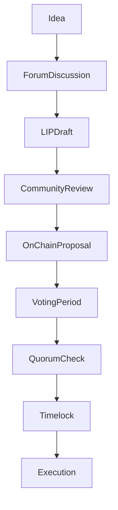

import { MathInline, MathBlock } from '/snippets/components/content/math.jsx'

## Executive Summary

Livepeer governance consists of both off-chain coordination processes and on-chain execution logic. While voting and parameter enforcement are handled by smart contracts, proposal formation, review, and social consensus-building occur off-chain.

This page formalizes the complete governance lifecycle from idea formation to on-chain execution.

---

## 1. Governance Lifecycle Overview

Governance unfolds in two coordinated domains:

1. **Off-Chain Process Layer** (discussion, drafting, signaling)
2. **On-Chain Execution Layer** (proposal submission, voting, execution)

These layers are complementary but distinct.

---

## 2. Off-Chain Process Layer

### 2.1 Idea Formation

Governance typically begins with:

- Identification of protocol parameter inefficiency
- Security model adjustments
- Economic misalignment
- Treasury allocation needs
- Contract upgrade requirements

Ideas are usually discussed in public forums before formalization.

### 2.2 Livepeer Improvement Proposals (LIPs)

A Livepeer Improvement Proposal (LIP) formalizes protocol changes. A LIP generally includes:

- Motivation
- Technical specification
- Economic impact analysis
- Security considerations
- Backward compatibility analysis

LIPs serve as the canonical documentation for governance changes.

### 2.3 Social Signaling and Feedback

Before on-chain submission, proposals typically undergo:

- Community discussion
- Technical review
- Risk assessment
- Stakeholder signaling

This reduces the probability of adversarial or poorly constructed proposals reaching execution.

---

## 3. On-Chain Voting Rules

The governance contract enforces explicit voting thresholds to protect against low-participation attacks:

### 3.1 Quorum

At least **33%** of all staked LPT must participate in the vote for it to be valid. This requirement ensures that a small cabal cannot push through radical changes without broad community involvement.

### 3.2 Approval Threshold

More than **50%** of participating votes must favour the proposal. Simple majority approval balances inclusivity with decisiveness: proposals that split the community evenly cannot pass.

### 3.3 Voting Power

Voting power is proportional to bonded LPT:

<MathBlock latex={String.raw`V_i = \frac{B_i}{B_T}`} />

Delegators exercise governance indirectly by delegating to orchestrators whose values align with their own; orchestrators must publicly declare their positions and can cast votes accordingly.

---

## 4. On-Chain Execution Layer

### 4.1 Proposal Submission

A formal governance proposal encodes executable contract actions. Proposal payload may include:

- Parameter updates
- Contract implementation upgrades
- Treasury transfers

Submission triggers the deterministic governance state machine.

### 4.2 Voting Window

Voting occurs via an on-chain smart contract. When a LIP is ready, its hash and parameters are queued, and tokenholders can vote using signature-based messages.

### How to Vote

<Steps>
  <Step title="Hold Bonded LPT">
 Only LPT that is bonded (staked) to an orchestrator has governance voting power. If you haven't bonded yet, start in the [Delegation Guide](/v2/lpt/delegation/delegation-guide).
  </Step>
  <Step title="Find Active Proposals">
 Navigate to [explorer.livepeer.org/voting](https://explorer.livepeer.org/voting). Active proposals are listed with their current vote tally and deadline.
  </Step>
  <Step title="Connect Your Wallet">
 Connect the wallet that holds your bonded LPT. You must be on the **Arbitrum One** network.
  </Step>
  <Step title="Cast Your Vote">
 Select **Yes**, **No**, or **Abstain**. Your voting power equals your proportion of total bonded LPT at the time the proposal was submitted.
  </Step>
  <Step title="Monitor Execution">
 If quorum (33%) and majority (&gt;50%) are met, the proposal enters a timelock queue and executes automatically after the delay period.
  </Step>
</Steps>

### 4.3 Quorum and Threshold Checks

Proposal must satisfy:

<MathBlock latex={String.raw`V_{cast} \ge Q \cdot B_T`} />

And majority condition:

<MathBlock latex={String.raw`V_{for} > V_{against}`} />

Conditions are enforced by governance contracts.

### 4.4 Timelock Queue

Approved proposals enter a timelock period before execution.

Timelock properties:

- Delay between approval and execution
- Risk mitigation against sudden parameter shifts
- Allows participants to assess consequences

### 4.5 Execution

If conditions are met and timelock expires:

- Encoded actions execute atomically
- Contract state changes
- Treasury transfers occur if included

Execution is irreversible at the transaction level.

---

## 5. Treasury Coordination

Treasury allocations follow the same governance lifecycle:

1. Off-chain proposal discussion
2. On-chain encoded treasury action
3. Voting and quorum
4. Timelock
5. Execution

Treasury governance uses identical stake-weighted enforcement logic.

---

## 6. Livepeer Foundation and Treasury Stewardship

The Livepeer Foundation, incorporated as a neutral nonprofit in 2025, stewards the protocol's long-term health. It coordinates core development, research and ecosystem growth, but its authority derives from tokenholders via governance.

Key responsibilities include:

| Responsibility | Description |
|----------------|-------------|
| **Protocol maintenance** | Maintaining and upgrading smart contracts, reference implementations, and SDKs |
| **Research and standards** | Funding research into verifiable transcoding, zero-knowledge proofs, and new codecs |
| **Grant programmes** | Managing the community treasury to fund builders, tooling, and documentation |
| **Ecosystem advocacy** | Representing Livepeer in regulatory discussions and engaging with blockchain communities |

Despite its coordinating role, the Foundation is not a central authority. Treasury disbursements, major protocol changes and long-term roadmaps require approval via LIPs.

---

## 7. Risk Mitigation and Process Safeguards

### 7.1 Multi-Stage Review

Separation of:

- Social review (off-chain)
- Deterministic execution (on-chain)

Reduces accidental or malicious parameter changes.

### 7.2 Transparency

All votes and execution transactions are publicly verifiable on-chain. Governance is auditable via block explorers.

### 7.3 Parameter Calibration

Quorum <MathInline latex={String.raw`Q`} /> and timelock duration <MathInline latex={String.raw`T_{delay}`} /> are governance-level security parameters.

If <MathInline latex={String.raw`Q`} /> is too low:
- Small coalitions may pass proposals

If <MathInline latex={String.raw`Q`} /> is too high:
- Governance stagnation may occur

---

## 8. Considerations and Potential Improvements

The choice of a 33% quorum and 50% approval reflects a trade-off between agility and resistance to capture. Some decentralised networks have explored:

- **Dynamic quorum** - where the quorum adjusts based on historical turnout
- **Conviction voting** - where votes accumulate over time
- **Quadratic voting** - to amplify minority voices

Livepeer's governance has not yet adopted these mechanisms, but community discussions remain ongoing.

---

## 9. Governance Process Flow Diagram

---

## 10. Protocol vs Network Separation

**Protocol (On-Chain):**
- Proposal submission
- Vote casting
- Quorum enforcement
- Timelock queue
- Execution of contract changes

**Network (Off-Chain):**
- Discussion forums
- LIP drafting
- Social signaling
- Infrastructure execution

Governance modifies protocol rules; network actors operate within updated parameters.

---

## References

- [Livepeer Protocol Repository](https://github.com/livepeer/protocol)
- [Contract Registry](https://docs.livepeer.org/references/contract-addresses)
- [Livepeer Improvement Proposals (LIPs)](https://github.com/livepeer/LIPs)
- [Livepeer Forum](https://forum.livepeer.org)
