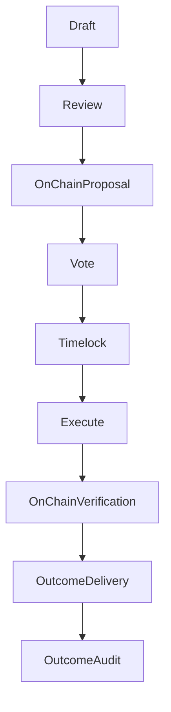

import { MathInline, MathBlock } from '/snippets/components/content/math.jsx'

## Executive Summary

A treasury allocation is a governance-authorized on-chain action that transfers protocol-controlled assets to a recipient for a defined purpose. Allocations are enforced deterministically by smart contracts, but their real-world outcomes depend on off-chain delivery by recipients.

This page defines:

- the allocation accounting model
- an evaluation framework for allocation decisions
- security and failure modes
- verification and audit methods

---

<Accordion title="Technical Reference: Allocation Mathematics" icon="function">

## 1. Formal Allocation Model

Let:

- <MathInline latex={String.raw`T`} /> = treasury balance before allocation
- <MathInline latex={String.raw`A_k`} /> = allocation amount of proposal <MathInline latex={String.raw`k`} />
- <MathInline latex={String.raw`T'`} /> = treasury balance after allocation

Single allocation update:

<MathBlock latex={String.raw`T' = T - A_k`} />

Over <MathInline latex={String.raw`n`} /> allocations:

<MathBlock latex={String.raw`T_n = T_0 - \sum_{k=1}^{n} A_k`} />

Where each <MathInline latex={String.raw`A_k`} /> is executed by a governance proposal payload.

</Accordion>

---

## 2. Allocation Taxonomy

Treasury allocations generally fall into categories:

1. **Ecosystem Development** - applications, integrations, SDKs.
2. **Protocol R&D** - security research, audits, economic modeling.
3. **Infrastructure Support** - operator tooling, monitoring, reliability improvements.
4. **Community Programs** - education, onboarding, documentation, events.
5. **Strategic Interventions** - bootstrapping demand or supply where markets underprovide.

These categories are conceptual; on-chain execution is simply calldata.

---

<Accordion title="Technical Reference: Allocation Mathematics" icon="function">

## 3. Evaluation Framework

Treasury allocation is a decision under uncertainty.

Define an allocation proposal <MathInline latex={String.raw`k`} /> with expected outcome function:

<MathBlock latex={String.raw`Outcome_k = g(Impact_k, Feasibility_k, Risk_k, Alignment_k)`} />

A practical decision function is:

<MathBlock latex={String.raw`Score_k = w_1 Impact_k + w_2 Feasibility_k - w_3 Risk_k + w_4 Alignment_k`} />

Where <MathInline latex={String.raw`w_i`} /> are governance-chosen weights.

### 3.1 Impact

Measures the expected improvement to protocol objectives such as:

- increased network demand (fees)
- improved operator participation (bonding)
- strengthened security posture

### 3.2 Feasibility

Assesses execution likelihood given:

- technical scope
- team capability
- delivery timeline

### 3.3 Risk

Captures:

- execution risk
- adversarial risk
- opportunity cost

### 3.4 Alignment

Ensures outcomes strengthen protocol-level objectives rather than private value capture.

</Accordion>

---

<Accordion title="Technical Reference: Allocation Mathematics" icon="function">

## 4. Governance Security Model

Allocations inherit governance security.

Let:

- <MathInline latex={String.raw`B_T`} /> = total bonded stake
- <MathInline latex={String.raw`\theta`} /> = fraction required to control governance outcome

Capital required for control:

<MathBlock latex={String.raw`Capital_{control} \ge \theta B_T`} />

Treasury safety therefore depends on stake distribution and participation.

</Accordion>

---

## 5. Failure Modes and Risks

### 5.1 Protocol-Level Failures

- calldata errors
- insufficient treasury balance
- target contract reverts

### 5.2 Governance-Level Failures

- capture by concentrated stake
- low quorum / low participation
- rushed proposals with insufficient review

### 5.3 Outcome-Level Failures

Because delivery is off-chain:

- recipients may fail to deliver
- outcomes may be unverifiable
- incentives may misalign

Treasury can enforce transfer, not performance.

---

## 6. Verification and Audit Model

Verification splits into two domains:

### 6.1 On-Chain Verification (Deterministic)

Confirm that:

- proposal executed successfully
- transfers occurred
- recipient address matches intended target
- treasury balance decreased by <MathInline latex={String.raw`A_k`} />

This is verifiable via transaction logs and state reads.

### 6.2 Off-Chain Outcome Verification (Non-Deterministic)

Outcome verification requires:

- milestone reporting
- public deliverables (code, docs, deployments)
- reproducible evidence of impact

Treasury governance should prefer allocations with measurable, auditable outputs.

---

## 7. Diagram - Allocation Lifecycle

---

## 8. Protocol vs Network Separation

**Protocol (On-Chain):**

- allocation authorization and execution
- deterministic transfers
- on-chain audit trail

**Network/Off-Chain:**

- recipient delivery
- ecosystem impact
- outcome measurement

Treasury controls assets on-chain; results depend on off-chain execution.

---

## References

- [Livepeer Protocol Repository](https://github.com/livepeer/protocol)
- [Contract Registry](https://docs.livepeer.org/references/contract-addresses)
