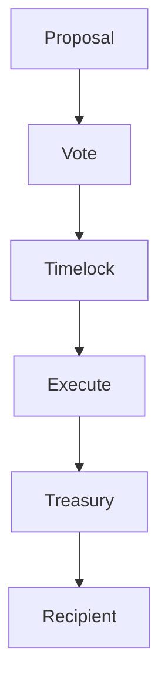

import { MathInline, MathBlock } from '/snippets/components/content/math.jsx'
import { PdfEmbed } from '/snippets/components/data/embed.jsx'

## Executive Summary

The Livepeer Treasury is the governance-controlled pool of protocol-managed assets used to fund ecosystem development, security research, infrastructure support, and other strategically aligned allocations.

Treasury control is enforced at the **protocol layer (on-chain)** through governance execution. The treasury is not controlled by off-chain committees in the enforcement sense; rather, governance proposals deterministically authorize transfers and actions.

---

## Using the Treasury

<PdfEmbed title="Using the Livepeer Community Treasury" src="https://paragraph.com/@livepeer-2/using-the-livepeer-community-treasury" />

## 1. Formal Definition

Let:

- <MathInline latex={String.raw`T`} /> = treasury balance (in relevant asset units)
- <MathInline latex={String.raw`A_k`} /> = allocation amount executed by proposal <MathInline latex={String.raw`k`} />

Treasury balance update after allocation <MathInline latex={String.raw`k`} />:

<MathBlock latex={String.raw`T' = T - A_k`} />

More generally, after a set of allocations <MathInline latex={String.raw`\{A_1, A_2, \dots, A_n\}`} />:

<MathBlock latex={String.raw`T_n = T_0 - \sum_{k=1}^{n} A_k`} />

Where each <MathInline latex={String.raw`A_k`} /> is authorized via governance.

---

## 2. Architectural Context

### 2.1 Protocol Layer

At the protocol layer:

- Governance contracts authorize allocations
- Execution contracts (e.g., timelock/treasury execution logic) perform transfers
- On-chain state is the source of truth

Canonical contract registry: [Contract Addresses](https://docs.livepeer.org/references/contract-addresses)

### 2.2 Network Layer

At the network layer, treasury-funded initiatives may affect:

- Orchestrator adoption
- Developer tooling
- Ecosystem applications

But treasury enforcement remains on-chain.

---

## 3. Treasury Purpose and Economic Rationale

A protocol treasury exists to:

1. Fund public goods aligned with protocol growth
2. Reduce underinvestment in shared infrastructure
3. Support long-horizon research and development
4. Provide mechanism for strategic ecosystem interventions

From an economic standpoint, the treasury is a coordination instrument for funding non-excludable benefits that markets underprovide.

---

## 4. Treasury Governance Model

Treasury decisions are executed through the governance lifecycle.

Let:

- <MathInline latex={String.raw`B_T`} /> = total bonded stake
- <MathInline latex={String.raw`B_i`} /> = bonded stake attributed to voter <MathInline latex={String.raw`i`} />

Voting power:

<MathBlock latex={String.raw`V_i = \frac{B_i}{B_T}`} />

Thus, the treasury inherits governance security properties.

---

## 5. Security Model

Treasury security depends on:

1. Total bonded stake <MathInline latex={String.raw`B_T`} />
2. Stake distribution (concentration)
3. Quorum and timelock configuration

Capital required to control outcomes:

<MathBlock latex={String.raw`Capital_{control} \ge \theta B_T`} />

A treasury is therefore as secure as the governance system controlling it.

---

## 6. Risks and Failure Modes

Key risks include:

- **Governance capture** - stake concentration
- **Low participation** - quorum risk
- **Mis-specified calldata** - execution failure
- **Misaligned incentives** - allocation inefficiency

Treasury is not automatically "good"; its outcomes depend on governance process quality.

---

## 7. System Diagram

---

## 8. Protocol vs Network Separation

**Protocol (On-Chain):**
- Treasury custody and execution
- Governance authorization
- Deterministic on-chain transfers

**Network (Off-Chain):**
- Allocation recipients execute work (development, infra)
- Ecosystem growth effects
- Operational delivery

Treasury is enforced by protocol logic; outcomes occur through off-chain delivery.

---

## References

- [Livepeer Protocol Repository](https://github.com/livepeer/protocol)
- [Contract Registry](https://docs.livepeer.org/references/contract-addresses)
