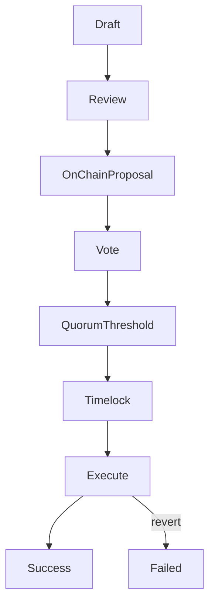

import { MathInline, MathBlock } from '/snippets/components/content/math.jsx'

## Executive Summary

A treasury proposal is a governance proposal whose executable payload authorizes an on-chain treasury action (typically a transfer, grant, or contract call). In Livepeer, treasury proposals are enforced at the **protocol layer (on-chain)**: once quorum and thresholds are met and the timelock expires, the encoded actions execute deterministically.

This page defines the structure of treasury proposal payloads, their execution semantics, and the primary failure modes.

### How to Submit a Proposal

<Steps>
  <Step title="Start with a Discussion">
 Post your idea on the [Livepeer Forum](https://forum.livepeer.org) in the Governance category. Gather community feedback before going on-chain.
  </Step>
  <Step title="Draft a LIP">
 Formalise as a Livepeer Improvement Proposal (LIP) in the [livepeer/LIPs repository](https://github.com/livepeer/LIPs). Include motivation, technical specification, and economic impact.
  </Step>
  <Step title="Submit On-Chain">
 Use the [Livepeer Explorer](https://explorer.livepeer.org) to submit the proposal on-chain. The encoded calldata determines what executes if the proposal passes.
  </Step>
  <Step title="Voting Period">
 Token holders vote during the designated window. **Quorum:** 33% of bonded LPT must participate. **Threshold:** &gt;50% for votes must be in favour.
  </Step>
  <Step title="Timelock and Execution">
 Approved proposals enter a timelock period before automatic execution. Monitor status at [explorer.livepeer.org/treasury](https://explorer.livepeer.org/treasury).
  </Step>
</Steps>

---

## 1. Formal Definition

A treasury proposal <MathInline latex={String.raw`P`} /> is a tuple of executable actions:

<MathBlock latex={String.raw`P = \{ a_1, a_2, \dots, a_n \}`} />

Each action <MathInline latex={String.raw`a_k`} /> is defined as:

<MathBlock latex={String.raw`a_k = (Target_k, Value_k, Data_k)`} />

Where:

- **Target** is the contract or address called
- **Value** is the native token amount attached (if any)
- **Data** is ABI-encoded calldata specifying the function selector and arguments

The proposal passes through governance and executes after timelock.

---

## 2. Governance Authorization

Let bonded stake variables:

- <MathInline latex={String.raw`B_i`} /> = bonded stake of voter <MathInline latex={String.raw`i`} />
- <MathInline latex={String.raw`B_T`} /> = total bonded stake

Voting power:

<MathBlock latex={String.raw`V_i = \frac{B_i}{B_T}`} />

Quorum condition:

<MathBlock latex={String.raw`V_{cast} \ge Q \cdot B_T`} />

Threshold condition (example):

<MathBlock latex={String.raw`V_{for} > V_{against}`} />

Only proposals meeting governance conditions enter the timelock queue.

---

## 3. Timelock Queue Semantics

Once approved, the proposal is queued in a timelock for a delay <MathInline latex={String.raw`T_{delay}`} />.

Timelock provides:

- Predictable execution window
- Reaction time for stakeholders
- Mitigation against sudden or malicious changes

Execution is only possible after the delay elapses.

---

## 4. Execution Semantics

After timelock expiry, execution attempts to apply each action <MathInline latex={String.raw`a_k`} /> atomically within the execution transaction.

Two important properties:

1. **Determinism:** execution is strictly defined by calldata
2. **Atomicity:** if any action reverts, the transaction reverts unless the execution model explicitly tolerates partial failure

Treasury proposals must therefore be authored with calldata correctness and failure model in mind.

---

## 5. Treasury Transfer as Canonical Case

A common action is a treasury transfer.

If treasury balance is <MathInline latex={String.raw`T`} /> and allocation amount is <MathInline latex={String.raw`A`} />:

<MathBlock latex={String.raw`T' = T - A`} />

Recipient balance increases by <MathInline latex={String.raw`A`} /> under the asset's transfer semantics.

---

## 6. Failure Modes

Treasury proposal execution can fail for several reasons.

### 6.1 Calldata Error

Incorrect function selector or malformed ABI encoding causes revert.

### 6.2 Insufficient Treasury Balance

Transfer amount exceeds treasury holdings.

### 6.3 Target Contract Revert

The called contract rejects the call due to access controls, paused state, or parameter validation.

### 6.4 Asset Transfer Semantics

Some token contracts may:

- Return false instead of reverting
- Apply transfer fees
- Enforce allowlists

Proposal authors must verify target asset behavior.

### 6.5 Timelock Configuration

If timelock delay or execution window conditions are misconfigured, proposals may become unexecutable.

---

## 7. Risk Mitigation Checklist

Before submitting a treasury proposal:

1. Verify target addresses and contracts via registry
2. Confirm ABI encoding is correct
3. Confirm treasury balance is sufficient
4. Simulate execution where possible
5. Ensure calldata is auditable and minimally scoped

---

## 8. Proposal Execution Flow

---

## 9. Protocol vs Network Separation

**Protocol (On-Chain):**
- Proposal payload definition
- Vote tally and authorization
- Timelock queue
- Deterministic execution
- Treasury transfers

**Network (Off-Chain):**
- Drafting and review
- Grant delivery and operational execution by recipients

Treasury proposals are enforced by protocol logic; outcomes require off-chain delivery.

---

## References

- [Livepeer Protocol Repository](https://github.com/livepeer/protocol)
- [Contract Registry](https://docs.livepeer.org/references/contract-addresses)
