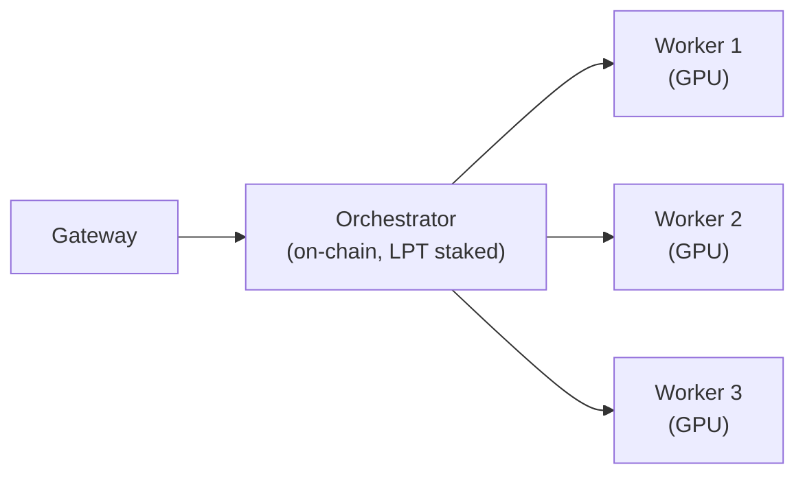

# Brief 09 Output — Run a Pool

**Status:** Research complete · Draft MDX ready · Previous brief updates appended  
**Date:** March 2026  
**No commits. No repo writes. For human review only.**

---

## Part 1 — Research Report

### 1.1 Notion Findings

| Page | Status | Key intel |
|------|--------|-----------|
| **Run a Pool** (IA Confirmed) | Exists — THIN (blank content) | Phase 2 expand. Cover: pool architecture, 3 connection models, fee-sharing mechanics, on-chain identity, communication expectations. Confirmed path: `v2/orchestrators/advanced/run-a-pool.mdx`. Section: Advanced. |
| **Connect to Arbitrum** (IA Confirmed) | Missing — Phase 2 Create | Section: Setup. Tab: GPU Nodes. Confirmed path: `v2/orchestrators/setup/connect-to-arbitrum.mdx`. Assessment: "Connecting to Arbitrum (-ethUrl + RPC choice) is a consistent confusion point for operators without a crypto background." |
| **Community Pools** (IA Confirmed) | Exists — wrong section | Move to `resources/community-pools.mdx`. Phase 4 expand to proper directory: pool name, on-chain address, fee split, supported hardware, workloads, join process, contact. |
| **orchestrator-journey** (IA Confirmed) | Exists — incomplete | Missing Pool Worker path → link `join-a-pool`. Missing AI Compute path → link `AI-prompt-start` (Phase 1 dependency). |
| **AI Models on Orchestrators** (Product Knowledge) | Complete | Core architecture confirmed: App → Gateway → Orchestrator(s). Pricing is off-chain; settlement via Livepeer tickets. |

---

### 1.2 Research Questions Answered

**Q1. Pool technical architecture:**

One orchestrator holds the on-chain identity (registered address, LPT stake, service URI). Multiple remote transcoders/workers connect to it and process jobs. The orchestrator routes incoming segments to available workers via gRPC streaming. Workers never appear on-chain.

Architecture (confirmed from go-livepeer source + PR #575 + Titan Node):
```
Gateway → Orchestrator (on-chain, -orchestrator -orchSecret <secret>)
                    ↓
          Remote Transcoder 1 (-transcoder -orchAddr orch:8935 -orchSecret <secret>)
          Remote Transcoder 2 (-transcoder -orchAddr orch:8935 -orchSecret <secret>)
          Remote Transcoder N (-transcoder -orchAddr orch:8935 -orchSecret <secret>)
```

**Q2. Orchestrator flags for accepting workers:**

To run as a pool orchestrator (accepting remote workers, NOT doing local transcoding):
```bash
livepeer \
  -network arbitrum-one-mainnet \
  -ethUrl <RPC_URL> \
  -orchestrator \
  -orchSecret <SHARED_SECRET> \      # enables remote worker connections; required
  -serviceAddr <PUBLIC_HOST>:8935 \
  -pricePerUnit <PRICE_PER_UNIT>
```

Key distinction: **omit `-transcoder`** when using remote workers. Using `-orchestrator` without `-transcoder` puts the node in standalone orchestrator mode — it accepts remote transcoders but does not transcode locally.

[//]: # (REVIEW: Confirm with Rick/protocol team whether -transcoder can coexist with -orchSecret (i.e. can the orchestrator also do some local transcoding while accepting remote workers\). go-livepeer test_args.sh shows both modes work independently.)

**Q3. Worker (transcoder) flags:**
```bash
livepeer \
  -transcoder \
  -orchAddr <ORCHESTRATOR_HOST>:8935 \
  -orchSecret <SHARED_SECRET> \
  -nvidia 0,1,2 \
  -maxSessions <N>
```

Workers do NOT need `-network`, `-ethUrl`, or any Ethereum account. They are purely compute nodes.

**Q4. Three connection models:**

From Titan Node pool software and go-livepeer architecture:

| Model | Description | Worker provides | Operator configures |
|---|---|---|---|
| **BYO Container** | Worker runs go-livepeer in `-transcoder` mode in their own Docker/Linux environment. Direct connection to pool orchestrator. | GPU machine, Docker, orchSecret | orchSecret, firewall to accept worker connections on :8935 |
| **Bare Metal** | Worker runs go-livepeer `-transcoder` binary directly on Linux/Windows. Titan Node provides custom pool client (v1.38) that wraps this. | GPU machine, NVIDIA driver, ethAddr for payout | Pool management dashboard, payout tracking by ethAddr |
| **Cloud GPU** | Worker provisions a cloud GPU instance (Vast.ai, CoreWeave, Lambda, etc.) and connects as a transcoder. | Cloud GPU rental budget | Same as BYO Container; operator may provide Docker image |

**Q5. On-chain identity:**

Only the orchestrator's Ethereum address is registered on-chain. Workers have no on-chain presence. Delegators staking to the pool are staking to the orchestrator's address. Pool performance (sessions, fees earned) is visible via Livepeer Explorer against the orchestrator address.

**Q6. Major existing pools:**

| Pool | Architecture | Worker software | Fee model | Notes |
|---|---|---|---|---|
| **Titan Node** | Custom pool binary (Titan Node Pool v1.38, wraps go-livepeer) | Download from titan-node.com (Windows GUI/CLI, Linux CLI) | Off-chain payout to worker ethAddr; ETH Revenue Cut 95%, LPT Reward Cut 30% | Largest pool. Accepts RTX 40xx/30xx/20xx, GTX 10xx, Quadro. Payout tracked via ethAddr + nickname config. |
| **Livepool** (Video Miner / Nico Vergauwen) | Similar architecture | Custom pool client | Off-chain | Creator published Medium guide; pool at livepool.io (status REVIEW) |

**Q7. Pool management tools:**

- Titan Node uses a custom dashboard (dashboard.titan-node.com or similar) tracking worker ethAddr, nickname, sessions
- No official Livepeer Foundation pool management tooling found
- `tools.livepeer.cloud` — [//]: # (REVIEW: verify this exists and is still active)
- Livepeer Explorer shows orchestrator-level stats (total stake, sessions, fees) — no worker-level breakdown

**Q8. Common pool operator problems (sourced from go-livepeer issues + Titan Node docs):**

1. Worker connects but gets no jobs — usually a `maxSessions` config issue or NVENC session limit hit
2. Worker disconnects and reconnects silently — transcoders reconnect automatically but jobs in-flight are dropped; orchestrator logs show `RegisterTranscoder` on reconnect
3. NVIDIA driver session limits — consumer cards (GTX/RTX) have a limit on concurrent NVENC sessions (typically 3–8); Titan Node auto-patches drivers to remove this limit
4. `orchSecret` exposure — if the secret leaks, any node can connect as a worker and receive job assignments (billing impact if pool has off-chain payout obligations)
5. Worker ETH address for payout — off-chain payout requires operators to track worker ETH addresses reliably; no protocol-level accounting

**Q9. What `join-a-pool.mdx` covers:**

Per Notion IA assessment: "Full 4-step guide: choose a pool, connect GPU (3 connection models: BYO container / bare metal / cloud), aggregation mechanics, earn rewards. Comparison table vs running solo. Off-chain payout mechanics explained." — Do NOT duplicate. Brief 09 links to it.

**Q10. Community content:**

- Titan Node YouTube — video mining tutorials; join pool instructions
- Nico Vergauwen Medium — "How I Set up a Livepeer node and earned over 1000$ in a month" — detailed pool architecture explanation from worker perspective
- livepeer.academy (Titan Node initiative) — curated tutorials

---

### 1.3 Gaps / SME Review Items

| Gap | Priority | Suggested verifier |
|-----|----------|--------------------|
| Can `-transcoder` coexist with `-orchSecret` on the same node? (hybrid: local + remote) | High | Rick / go-livepeer test_args.sh |
| Is `tools.livepeer.cloud` still active? | Medium | Check live URL |
| Livepool (livepool.io) — still active? | Medium | Check live URL |
| Current Titan Node fee splits for new operators | Low | titan-node.com |
| Community feedback on "what's hardest about running a pool" | Medium | Discord `#orchestrating` since Q4 2024 |

---

### 1.4 Media Candidates

- Titan Node YouTube — strong embed candidate; search "livepeer titan node pool setup" or "livepeer video mining pool"
- livepeer.academy — may have structured video walkthrough
- Nico Vergauwen Medium article — reference link (not embed), good for "further reading"

---

## Part 2 — Draft MDX: `run-a-pool.mdx`

```mdx
---
title: 'Run a Pool'
description: 'Operate a Livepeer GPU pool — accept external worker connections, manage job routing across multiple GPUs, and handle fee distribution.'
keywords: ["livepeer", "orchestrator", "pool", "GPU pool", "transcoder pool", "worker", "fee sharing", "pool operator", "Titan Node", "Video Miner"]
pageType: 'guide'
audience: 'orchestrator'
status: 'current'
---

A Livepeer pool is a single orchestrator node that routes jobs to multiple external GPU workers. Pool operators hold the on-chain identity and LPT stake; workers contribute GPU compute and earn payouts managed off-chain by the operator. This page is for experienced orchestrators who want to expand beyond their own hardware by accepting external worker connections.

If you are looking to join an existing pool as a worker, see [Join a Pool](/v2/orchestrators/get-started/join-a-pool). <!-- REVIEW: confirm path -->

---

## How a pool works

The Livepeer protocol sees only one entity: your orchestrator. It has a single on-chain address, a single stake, and a single service URI. What happens behind that address is your architecture to design.

In a pool, the orchestrator node accepts connections from remote transcoders (workers). When a gateway routes a job to your orchestrator, go-livepeer dispatches it to an available worker via gRPC streaming RPC. Workers process the segment and return results directly — the orchestrator handles the protocol-level interaction, the workers handle the compute.



Workers have no on-chain presence. They are not visible to delegators or on Livepeer Explorer. All stake, all protocol reputation, and all on-chain fees flow to and through the orchestrator.

---

## Worker connection models

<Tabs>
  <Tab title="BYO Container">
    Workers run go-livepeer in transcoder mode directly — in Docker, on bare Linux, or on a VM — and connect to your orchestrator using the shared secret you configure.

    **Who it's for:** Technically capable workers who want full control over their environment. Best for Linux operators or those already running GPU containers.

    **Worker provides:** A machine with an NVIDIA GPU, NVIDIA drivers installed, and network connectivity to your orchestrator on port 8935.

    **Worker runs:**
    ```bash
    livepeer \
      -transcoder \
      -orchAddr <YOUR_ORCHESTRATOR_HOST>:8935 \
      -orchSecret <SHARED_SECRET> \
      -nvidia 0 \
      -maxSessions 10
    ```

    Workers do not need an Ethereum account, LPT, or an RPC endpoint. They connect, register, and begin receiving transcoding tasks automatically.

    **You configure:** Set `-orchSecret` on your orchestrator (see [Accepting workers](#accepting-workers) below). Open or whitelist port 8935 inbound on your orchestrator for worker connections.
  </Tab>

  <Tab title="Pool client (managed)">
    Some pool operators provide a custom client that wraps go-livepeer and adds payout tracking. Titan Node, for example, publishes their own pool binary (Windows GUI/CLI + Linux CLI) that workers download and configure with their ETH address and a nickname.

    **Who it's for:** Workers who want a simplified setup experience, particularly on Windows. Removes the requirement to install go-livepeer directly.

    **Worker provides:** GPU machine, NVIDIA driver, their Ethereum address (for payout), bandwidth (minimum 100 Mbps upload recommended).

    **You build or provide:** A custom pool client is operator-built tooling, not a Livepeer Foundation product. You are responsible for building or adapting client software, maintaining a payout dashboard, and tracking worker contributions by ETH address.

    <Note>
    Running a managed pool client is a significant engineering investment. Titan Node built and maintains their own pool binary (v1.38 at time of writing). If you are starting out, the BYO Container model requires less custom tooling.
    </Note>
  </Tab>

  <Tab title="Cloud GPU">
    Workers provision a cloud GPU instance (Vast.ai, Lambda Labs, CoreWeave, RunPod, etc.) and connect it as a remote transcoder. This requires no owned hardware — workers pay for GPU time and earn back through transcoding fees.

    **Who it's for:** Workers without dedicated hardware. Also useful for operators who want to temporarily scale capacity during peak demand.

    **Worker provides:** A provisioned cloud GPU instance running Linux, with Docker or go-livepeer installed. Network egress to your orchestrator.

    **You configure:** Same as BYO Container. Optionally provide a Docker image workers can pull to simplify setup on cloud instances.

    <Note>
    Cloud GPU unit economics for transcoding are tight. Workers should verify margins on their chosen cloud provider before committing. At current network pricing, high-end consumer GPUs (RTX 4090) on owned hardware are significantly more cost-efficient than rented compute.
    </Note>
  </Tab>
</Tabs>

---

## Accepting workers

To configure your orchestrator to accept remote worker connections, replace the combined `-orchestrator -transcoder` flags with `-orchestrator -orchSecret`:

```bash
livepeer \
  -network arbitrum-one-mainnet \
  -ethUrl <RPC_URL> \
  -orchestrator \
  -orchSecret <SHARED_SECRET> \
  -serviceAddr <PUBLIC_HOST>:8935 \
  -pricePerUnit <PRICE_PER_UNIT>
```

**Key points:**

- **`-orchSecret`** is a shared secret that authenticates worker connections. Any node that knows this secret can connect as a worker. Treat it like a password — rotate it if you believe it has been compromised.
- **`-transcoder` is omitted.** This puts the orchestrator in standalone mode: it handles gateway connections and routing, but does no local transcoding. All jobs are dispatched to connected workers.
- **Port 8935** must be open for both inbound gateway connections and inbound worker connections.

<Warning>
Keep `-orchSecret` private. If exposed, any node can connect as a worker and receive job assignments. Depending on your off-chain payout model, this could result in payout obligations to unknown parties or dilute job distribution across unintended workers.
</Warning>

Workers connect by running:
```bash
livepeer \
  -transcoder \
  -orchAddr <YOUR_ORCHESTRATOR_HOST>:8935 \
  -orchSecret <SHARED_SECRET> \
  -nvidia 0,1,2 \
  -maxSessions 10
```

Adjust `-nvidia` for the worker's GPU IDs (use `nvidia-smi -L` to list them) and `-maxSessions` based on available VRAM and the NVENC concurrent session limit for their card.

When a worker connects, your orchestrator logs will show:
```
Got a RegisterTranscoder request
```

---

## Fee distribution

<Note>
**Fee distribution in a Livepeer pool is entirely off-chain.** The protocol pays all fees and rewards to the orchestrator's Ethereum address. There is no protocol-level mechanism to split payments to workers. Pool operators implement their own payout systems.
</Note>

In practice, this means:

**What the protocol does:** All ETH transcoding fees and LPT block rewards are paid to your orchestrator's Ethereum address. The split you configured between yourself and delegators (reward cut / fee cut) applies at this level.

**What you manage:** Tracking worker contributions and distributing their share of earnings from your orchestrator wallet. Common approaches:

- **Per-session tracking** — log sessions handled per worker ETH address; pay out proportionally to sessions at the end of each period
- **Custom pool client** — build tooling that tracks ethAddr + nickname + sessions (Titan Node's model); automate payouts on a schedule
- **Manual distribution** — suitable for small pools; calculate shares and send ETH periodically

There is no standardised payout protocol. Existing pools (Titan Node, others) have each implemented their own approach. If you are building a public-facing pool, be explicit with workers about your payout frequency, minimum thresholds, and how contributions are measured.

---

## On-chain identity and transparency

Your pool is represented by your orchestrator's Ethereum address. On [Livepeer Explorer](https://explorer.livepeer.org):

- **Delegators** see your orchestrator's total stake, reward cut, fee cut, and historical performance (sessions, fees earned)
- **Workers** are not visible — Explorer has no concept of remote transcoders
- **Pool performance** (sessions, fees) reflects the aggregate work done by all connected workers; there is no worker-level breakdown in Explorer

If you are running a public pool and want to build delegator trust, consider publishing a transparency page or regular forum posts documenting your pool's architecture, hardware footprint, uptime, and payout history. Titan Node does this via their website and Livepeer Forum campaign posts.

---

<Accordion title="Running a pool: ongoing responsibilities">

**Worker connection management**
Monitor connected workers. If a worker disconnects, your orchestrator will continue accepting jobs and assign them to remaining workers. A disconnected worker that was handling a session will cause that session to fail. Workers reconnect automatically on restart (you will see `Got a RegisterTranscoder request` in logs when they do).

**Session limits and NVENC caps**
Consumer NVIDIA GPUs have a cap on concurrent NVENC encoding sessions (typically 3–8 per card, depending on model). Workers hitting this limit will reject new segments silently. Titan Node patches the NVIDIA driver to remove this limit. Ensure workers are aware of this limitation and have patched drivers if needed.

**Routing and load balancing**
go-livepeer distributes sessions across connected workers internally. No manual load balancing is required for basic deployments. For large pools, a load balancer in front of multiple orchestrator instances is possible but is an advanced setup — see go-livepeer `doc/multi-o.md` for the multi-orchestrator architecture.

**Node updates**
Updating go-livepeer on the orchestrator drops all connected workers and in-flight sessions. Coordinate updates with workers if you have SLA commitments. Workers reconnect automatically after the orchestrator restarts.

**Payout and communication**
Establish clear communication channels with workers (Discord server, Telegram group, email list). Workers need to know: expected downtime windows, payout schedule, fee changes, and how to report connection issues. Titan Node uses Discord and a public forum thread for this.

**Key rotation**
If you rotate your `-orchSecret`, all existing worker connections will break. Communicate the new secret to workers before restarting the orchestrator. There is no zero-downtime rotation mechanism.
</Accordion>

---

## Key takeaways

- A pool is one orchestrator on-chain, multiple workers behind it. Only the orchestrator's address is visible to the protocol and delegators.
- Workers connect using `-orchSecret` — a shared secret you control. Keep it private and rotate it if compromised.
- Fee distribution to workers is **entirely off-chain**. You are responsible for tracking contributions and sending payouts from your orchestrator wallet.
- Workers do not need LPT, an Ethereum account for protocol purposes, or an RPC endpoint. They contribute compute only.
- Running a public pool requires operational investment beyond go-livepeer configuration: payout tooling, worker communication, uptime monitoring, and transparent reporting to delegators.

---

## Related

- [Join a Pool](/v2/orchestrators/get-started/join-a-pool) — worker perspective: connecting your GPU to an existing pool [//]: # (REVIEW: confirm path)
- [Community Pools](/v2/resources/community-pools) — existing pools on the network [//]: # (REVIEW: confirm path)
- [Earnings and economics](/v2/orchestrators/advanced/earnings) — pool economics and fee strategy [//]: # (REVIEW: confirm path)
```

---

## Part 3 — Updates to Previous Brief Outputs (07+08)

### 3.1 Notion confirmed the following for Briefs 07+08

**Connect to Arbitrum** (Brief 07):
- Path `v2/orchestrators/setup/connect-to-arbitrum.mdx` ✅ confirmed against IA Confirmed database
- Section: **Setup** ✅ matches brief
- Description from Notion: "Connecting to Arbitrum (-ethUrl + RPC choice) is a consistent confusion point for operators without a crypto background." — validates the page's framing as written.

**Activate on the Network** (Brief 08):
- The IA Confirmed database has a "Connect to Arbitrum" entry but no separate "Activate on the Network" or "publish-offerings" entry found by name in this search pass. <!-- REVIEW: Alison to verify `publish-offerings.mdx` path and whether it maps to an IA Confirmed entry -->

**orchestrator-journey page** (context for both 07+08):
- Notion confirms the journey page is missing the Pool Worker path (→ `join-a-pool`) and the AI Compute path (→ `AI-prompt-start`).
- Action needed post-Phase 1: when Briefs 06 and the join-a-pool page exist, update `orchestrator-journey.mdx` to add both paths.

### 3.2 Updates to Brief 07 draft (connect-to-arbitrum.mdx)

No content changes required. The draft holds. Two clarifications to apply:

1. **Frontmatter keywords**: Add `"arbETH"` to keywords list — it's the search term operators use when looking for gas top-up guidance.
2. **Prerequisites section**: The phrase "a few dollars of arbETH" is confirmed approximate. REVIEW item remains open.

### 3.3 Updates to Brief 08 draft (publish-offerings.mdx)

No content changes required. The draft holds. One Notion-sourced clarification:

1. **orchestrator-journey link**: When `publish-offerings.mdx` exists, it becomes the end-point of the solo operator path on the orchestrator journey page. Add a `Related` link in the opposite direction: the journey page should link to `publish-offerings` as the "complete your activation" step. Flag this for when the journey page is updated.

### 3.4 `run-a-pool.mdx` relationship to Briefs 07+08

`run-a-pool.mdx` assumes the operator has already completed:
- `install-go-livepeer` (Brief 01)
- `orch-config` (Brief 04/05 — confirm path)
- `connect-to-arbitrum` (Brief 07 — path confirmed)
- `publish-offerings` (Brief 08 — path REVIEW)

The `run-a-pool.mdx` draft does not reproduce content from those pages and does not link to them in the body (not relevant to pool operation scope). They are implicit prerequisites only.

---

## Part 4 — Outstanding Items Before Publication

### Brief 09 (run-a-pool.mdx)
1. **`-transcoder` coexistence with `-orchSecret`** — can the orchestrator also do some local transcoding while accepting remote workers? Confirm with Rick.
2. **`tools.livepeer.cloud`** — check if this is still active and whether it belongs as a resource link
3. **Multi-orchestrator load balancer** — the `doc/multi-o.md` reference needs a URL check against current repo state
4. **Livepool / Video Miner** — verify current active status; livepool.io may be defunct
5. **NVENC session limit** — confirm the driver patch approach is still required for current driver versions (may have changed)
6. **All internal link paths** — `join-a-pool`, `community-pools`, `advanced/earnings` need path confirmation

### Briefs 07+08 carry-forward items (unchanged from previous output)
1. Round length (~24hrs) — confirm with Mehrdad
2. arbETH gas cost estimate — verify current costs
3. Fee/reward cut community norms — Discord check
4. "Not receiving jobs" accordion completeness — Discord `#orchestrating` since AI subnet
5. `publish-offerings.mdx` path confirmation against IA Confirmed database
6. All internal link paths for both pages
