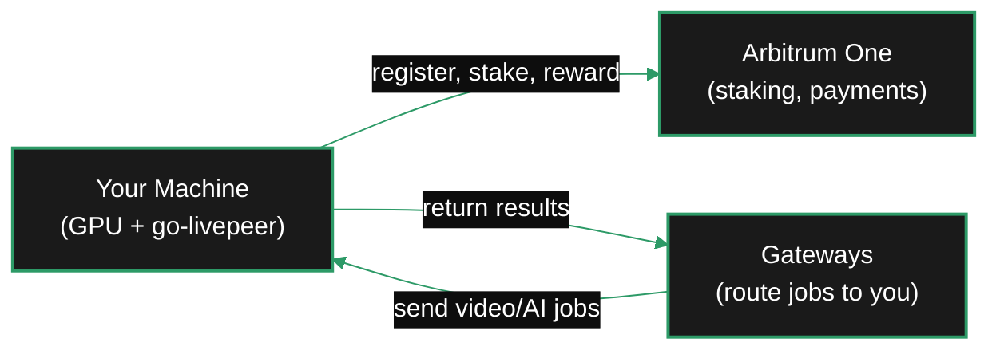

{/* TODO:
Terminology Validation:
- Ensure authoring skill is used to validate page style/copy ai-tools/ai-skills/page-authoring/SKILL.md
- Voice converted to entity-led
- Ensure the terminology and definitions used in this page is consistent with the resources/glossary terminology
Verify:
- Mermaid diagrams use theme colours / styles - for large diagrams use vertical flow and enclose in ScrollableDiagram setting height at 400-500px
- Fontawesome icons are used on accordions and tabs (reference map in docs-guide/tooling/reference-maps/icon-map.mdx)
- Tables use StyledTable component
- Tabs should be surrounded by BorderedBox variant="accent"
- Code blocks should have icon="terminal" for bash (default), icon="code" for scripts, icon="copy" for text copy. Add brief filename.
- All tabs and accordions should have icons
- No em-dashes are used (instead use standard -)
- UK spelling is used
- Headers are concise and technical
- CustomDivider is used
- Placeholders for Media and Video Resources are in comments with a TODO for a human
- REVIEW flags are in JSX comments for a human
- Accuracy is verified across repo as much as possible
Human:
- REVIEW flags
- Review Page Layout
*/}

import { StyledTable, TableRow, TableCell } from '/snippets/components/layout/tables.jsx'
import { CustomDivider } from '/snippets/components/primitives/divider.jsx'

This is the standard setup path for running a Livepeer orchestrator with go-livepeer. It covers a single-machine deployment where one node runs as both orchestrator and transcoder.

<Note>
**Not the right path?** If you want to contribute GPU to an existing pool without managing your own node, see [Join a Pool](/v2/orchestrators/guides/deployment-details/join-a-pool). For the split keystore setup (Siphon), see [Siphon Setup](/v2/orchestrators/guides/deployment-details/siphon-setup). For help choosing, see the [Navigator](/v2/orchestrators/navigator).
</Note>

<CustomDivider />

## Setup flow

Follow these steps in order. Each page is self-contained — complete it before moving to the next.

<Steps>
  <Step title="Check prerequisites">
    Confirm your hardware, GPU drivers, network, wallet, and tokens are ready.

    [Setup Checklist →](/v2/orchestrators/setup/rcs-requirements)
  </Step>
  <Step title="Install go-livepeer">
    Download and install the go-livepeer binary or Docker image for your platform.

    [Install →](/v2/orchestrators/setup/rs-install)
  </Step>
  <Step title="Configure your node">
    Set the startup flags: network, GPU selection, pricing, service address, and AI workers.

    [Configure →](/v2/orchestrators/setup/configure)
  </Step>
  <Step title="Connect to Arbitrum">
    Choose an RPC provider, add the `-ethUrl` flag, and verify the connection.

    [Connect →](/v2/orchestrators/setup/connect-and-activate)
  </Step>
  <Step title="Activate on-chain">
    Register as an orchestrator, set reward cut and fee cut, stake LPT, and join the active set.

    [Activate →](/v2/orchestrators/setup/connect-and-activate)
  </Step>
  <Step title="Verify your setup">
    Run pre- and post-activation checks: GPU detection, port reachability, Explorer status, first job.

    [Verify →](/v2/orchestrators/setup/test)
  </Step>
  <Step title="Set up monitoring">
    Enable Prometheus metrics, track key health signals, and connect to Explorer.

    [Monitor →](/v2/orchestrators/setup/r-monitor)
  </Step>
</Steps>

<CustomDivider />

## What you will need

<StyledTable variant="bordered">
  <TableRow header>
    <TableCell header>Requirement</TableCell>
    <TableCell header>Details</TableCell>
  </TableRow>
  <TableRow>
    <TableCell>**GPU**</TableCell>
    <TableCell>NVIDIA with NVENC support. RTX 3060+ for transcoding; RTX 3090+ for AI inference.</TableCell>
  </TableRow>
  <TableRow>
    <TableCell>**OS**</TableCell>
    <TableCell>Linux recommended for production. macOS and Windows for development only.</TableCell>
  </TableRow>
  <TableRow>
    <TableCell>**CUDA**</TableCell>
    <TableCell>12.0+ with matching NVIDIA driver (525+ on Linux).</TableCell>
  </TableRow>
  <TableRow>
    <TableCell>**Wallet**</TableCell>
    <TableCell>Ethereum account with ETH on Arbitrum (for gas) and LPT (for staking).</TableCell>
  </TableRow>
  <TableRow>
    <TableCell>**Port**</TableCell>
    <TableCell>8935 TCP open to the public internet.</TableCell>
  </TableRow>
  <TableRow>
    <TableCell>**RPC**</TableCell>
    <TableCell>Arbitrum One endpoint (Alchemy, Infura, or self-hosted).</TableCell>
  </TableRow>
</StyledTable>

For detailed hardware guidance, see [Requirements](/v2/orchestrators/guides/operator-considerations/requirements). For cost and revenue analysis, see [Operator Rationale](/v2/orchestrators/guides/operator-considerations/operator-rationale).

<CustomDivider />

## After setup

Once your node is live and receiving jobs:

<CardGroup cols={2}>
  <Card title="Workloads & AI" icon="layer-group" href="/v2/orchestrators/guides/ai-and-job-workloads/ai-inference-operations">
    Add AI inference pipelines to earn from the AI subnet alongside transcoding.
  </Card>
  <Card title="Staking & Rewards" icon="coins" href="/v2/orchestrators/guides/staking-and-rewards/earning-model">
    Understand your revenue streams and optimise commission parameters.
  </Card>
  <Card title="Delegate Operations" icon="users" href="/v2/orchestrators/guides/staking-and-rewards/delegate-operations">
    Attract delegators to increase your stake and job selection probability.
  </Card>
  <Card title="Troubleshooting" icon="circle-question" href="/v2/orchestrators/resources/faq">
    Common errors and fixes for orchestrator operations.
  </Card>
</CardGroup>

{/*
  PURPOSE:
  Setup overview page - the full step-by-step setup journey overview.
  Orients the reader to the setup sequence and what each step covers.

  SECTION HOME: Setup
  JOURNEY POSITION: 1 of 7 in Setup
  SEQUENCE: Guide > Requirements > Install > Configure > Connect & Activate > Test > Monitor
*/}
