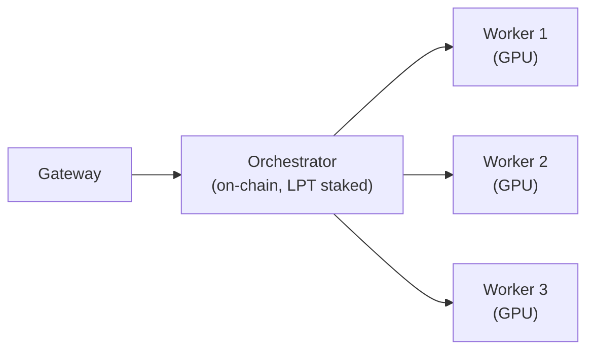

A Livepeer pool is a single orchestrator node that routes jobs to multiple external GPU workers. Pool operators hold the on-chain identity and LPT stake; workers contribute GPU compute and earn payouts managed off-chain by the operator. This page is for experienced orchestrators who want to expand beyond their own hardware by accepting external worker connections.

If you are looking to join an existing pool as a worker, see [Join a Pool](/v2/orchestrators/get-started/join-a-pool). {/* REVIEW: confirm path */}

---

## How a pool works

The Livepeer protocol sees only one entity: your orchestrator. It has a single on-chain address, a single stake, and a single service URI. What happens behind that address is your architecture to design.

In a pool, the orchestrator node accepts connections from remote transcoders (workers). When a gateway routes a job to your orchestrator, go-livepeer dispatches it to an available worker via gRPC streaming RPC. Workers process the segment and return results directly — the orchestrator handles the protocol-level interaction, the workers handle the compute.



Workers have no on-chain presence. They are not visible to delegators or on Livepeer Explorer. All stake, all protocol reputation, and all on-chain fees flow to and through the orchestrator.

---

## Worker connection models

<Tabs>
  <Tab title="BYO Container">
    Workers run go-livepeer in transcoder mode directly — in Docker, on bare Linux, or on a VM — and connect to your orchestrator using the shared secret you configure.

    **Who it's for:** Technically capable workers who want full control over their environment. Best for Linux operators or those already running GPU containers.

    **Worker provides:** A machine with an NVIDIA GPU, NVIDIA drivers installed, and network connectivity to your orchestrator on port 8935.

    **Worker runs:**
    ```bash
    livepeer \
      -transcoder \
      -orchAddr <YOUR_ORCHESTRATOR_HOST>:8935 \
      -orchSecret <SHARED_SECRET> \
      -nvidia 0 \
      -maxSessions 10
    ```

    Workers do not need an Ethereum account, LPT, or an RPC endpoint. They connect, register, and begin receiving transcoding tasks automatically.

    **You configure:** Set `-orchSecret` on your orchestrator (see [Accepting workers](#accepting-workers) below). Open or whitelist port 8935 inbound on your orchestrator for worker connections.
  </Tab>

  <Tab title="Pool client (managed)">
    Some pool operators provide a custom client that wraps go-livepeer and adds payout tracking. Titan Node, for example, publishes their own pool binary (Windows GUI/CLI + Linux CLI) that workers download and configure with their ETH address and a nickname.

    **Who it's for:** Workers who want a simplified setup experience, particularly on Windows. Removes the requirement to install go-livepeer directly.

    **Worker provides:** GPU machine, NVIDIA driver, their Ethereum address (for payout), bandwidth (minimum 100 Mbps upload recommended).

    **You build or provide:** A custom pool client is operator-built tooling, not a Livepeer Foundation product. You are responsible for building or adapting client software, maintaining a payout dashboard, and tracking worker contributions by ETH address.

    <Note>
    Running a managed pool client is a significant engineering investment. Titan Node built and maintains their own pool binary (v1.38 at time of writing). If you are starting out, the BYO Container model requires less custom tooling.
    </Note>
  </Tab>

  <Tab title="Cloud GPU">
    Workers provision a cloud GPU instance (Vast.ai, Lambda Labs, CoreWeave, RunPod, etc.) and connect it as a remote transcoder. This requires no owned hardware — workers pay for GPU time and earn back through transcoding fees.

    **Who it's for:** Workers without dedicated hardware. Also useful for operators who want to temporarily scale capacity during peak demand.

    **Worker provides:** A provisioned cloud GPU instance running Linux, with Docker or go-livepeer installed. Network egress to your orchestrator.

    **You configure:** Same as BYO Container. Optionally provide a Docker image workers can pull to simplify setup on cloud instances.

    <Note>
    Cloud GPU unit economics for transcoding are tight. Workers should verify margins on their chosen cloud provider before committing. At current network pricing, high-end consumer GPUs (RTX 4090) on owned hardware are significantly more cost-efficient than rented compute.
    </Note>
  </Tab>
</Tabs>

---

## Accepting workers

To configure your orchestrator to accept remote worker connections, replace the combined `-orchestrator -transcoder` flags with `-orchestrator -orchSecret`:

```bash
livepeer \
  -network arbitrum-one-mainnet \
  -ethUrl <RPC_URL> \
  -orchestrator \
  -orchSecret <SHARED_SECRET> \
  -serviceAddr <PUBLIC_HOST>:8935 \
  -pricePerUnit <PRICE_PER_UNIT>
```

**Key points:**

- **`-orchSecret`** is a shared secret that authenticates worker connections. Any node that knows this secret can connect as a worker. Treat it like a password — rotate it if you believe it has been compromised.
- **`-transcoder` is omitted.** This puts the orchestrator in standalone mode: it handles gateway connections and routing, but does no local transcoding. All jobs are dispatched to connected workers.
- **Port 8935** must be open for both inbound gateway connections and inbound worker connections.

<Warning>
Keep `-orchSecret` private. If exposed, any node can connect as a worker and receive job assignments. Depending on your off-chain payout model, this could result in payout obligations to unknown parties or dilute job distribution across unintended workers.
</Warning>

Workers connect by running:
```bash
livepeer \
  -transcoder \
  -orchAddr <YOUR_ORCHESTRATOR_HOST>:8935 \
  -orchSecret <SHARED_SECRET> \
  -nvidia 0,1,2 \
  -maxSessions 10
```

Adjust `-nvidia` for the worker's GPU IDs (use `nvidia-smi -L` to list them) and `-maxSessions` based on available VRAM and the NVENC concurrent session limit for their card.

When a worker connects, your orchestrator logs will show:
```
Got a RegisterTranscoder request
```

---

## Fee distribution

<Note>
**Fee distribution in a Livepeer pool is entirely off-chain.** The protocol pays all fees and rewards to the orchestrator's Ethereum address. There is no protocol-level mechanism to split payments to workers. Pool operators implement their own payout systems.
</Note>

In practice, this means:

**What the protocol does:** All ETH transcoding fees and LPT block rewards are paid to your orchestrator's Ethereum address. The split you configured between yourself and delegators (reward cut / fee cut) applies at this level.

**What you manage:** Tracking worker contributions and distributing their share of earnings from your orchestrator wallet. Common approaches:

- **Per-session tracking** — log sessions handled per worker ETH address; pay out proportionally to sessions at the end of each period
- **Custom pool client** — build tooling that tracks ethAddr + nickname + sessions (Titan Node's model); automate payouts on a schedule
- **Manual distribution** — suitable for small pools; calculate shares and send ETH periodically

There is no standardised payout protocol. Existing pools (Titan Node, others) have each implemented their own approach. If you are building a public-facing pool, be explicit with workers about your payout frequency, minimum thresholds, and how contributions are measured.

---

## On-chain identity and transparency

Your pool is represented by your orchestrator's Ethereum address. On [Livepeer Explorer](https://explorer.livepeer.org):

- **Delegators** see your orchestrator's total stake, reward cut, fee cut, and historical performance (sessions, fees earned)
- **Workers** are not visible — Explorer has no concept of remote transcoders
- **Pool performance** (sessions, fees) reflects the aggregate work done by all connected workers; there is no worker-level breakdown in Explorer

If you are running a public pool and want to build delegator trust, consider publishing a transparency page or regular forum posts documenting your pool's architecture, hardware footprint, uptime, and payout history. Titan Node does this via their website and Livepeer Forum campaign posts.

---

<Accordion title="Running a pool: ongoing responsibilities">

**Worker connection management**
Monitor connected workers. If a worker disconnects, your orchestrator will continue accepting jobs and assign them to remaining workers. A disconnected worker that was handling a session will cause that session to fail. Workers reconnect automatically on restart (you will see `Got a RegisterTranscoder request` in logs when they do).

**Session limits and NVENC caps**
Consumer NVIDIA GPUs have a cap on concurrent NVENC encoding sessions (typically 3–8 per card, depending on model). Workers hitting this limit will reject new segments silently. Titan Node patches the NVIDIA driver to remove this limit. Ensure workers are aware of this limitation and have patched drivers if needed.

**Routing and load balancing**
go-livepeer distributes sessions across connected workers internally. No manual load balancing is required for basic deployments. For large pools, a load balancer in front of multiple orchestrator instances is possible but is an advanced setup — see go-livepeer `doc/multi-o.md` for the multi-orchestrator architecture.

**Node updates**
Updating go-livepeer on the orchestrator drops all connected workers and in-flight sessions. Coordinate updates with workers if you have SLA commitments. Workers reconnect automatically after the orchestrator restarts.

**Payout and communication**
Establish clear communication channels with workers (Discord server, Telegram group, email list). Workers need to know: expected downtime windows, payout schedule, fee changes, and how to report connection issues. Titan Node uses Discord and a public forum thread for this.

**Key rotation**
If you rotate your `-orchSecret`, all existing worker connections will break. Communicate the new secret to workers before restarting the orchestrator. There is no zero-downtime rotation mechanism.
</Accordion>

---

## Key takeaways

- A pool is one orchestrator on-chain, multiple workers behind it. Only the orchestrator's address is visible to the protocol and delegators.
- Workers connect using `-orchSecret` — a shared secret you control. Keep it private and rotate it if compromised.
- Fee distribution to workers is **entirely off-chain**. You are responsible for tracking contributions and sending payouts from your orchestrator wallet.
- Workers do not need LPT, an Ethereum account for protocol purposes, or an RPC endpoint. They contribute compute only.
- Running a public pool requires operational investment beyond go-livepeer configuration: payout tooling, worker communication, uptime monitoring, and transparent reporting to delegators.

---

## Related

- [Join a Pool](/v2/orchestrators/get-started/join-a-pool) — worker perspective: connecting your GPU to an existing pool {/* REVIEW: confirm path */}
- [Community Pools](/v2/orchestrators/resources/community-pools) — existing pools on the network {/* REVIEW: confirm path */}
- [Earnings and economics](/v2/orchestrators/advanced/earnings) — pool economics and fee strategy {/* REVIEW: confirm path */}
{/* REVIEW: Previous version covered What to publish (hardware, workloads, revenue split, payouts) — not present in new draft. Human to decide whether to include. */}
