{/* TODO:
Verify:
- Mermaid diagrams use theme colours (but must be hardcoded)
- Tables use StyledTable component
- No em-dashes are used
- UK spelling is used
- Headers are concise and technical (aim for max 3 words)
- CustomDivider uses approved margin patterns
- Placeholders for Media and Video Resources are in comments with a TODO for a human.
- REVIEW flags are in JSX flags for a human.
Human
- Find Media
- Review REVIEW items
*/}

import { LinkArrow } from '/snippets/components/primitives/links.jsx'
import { StyledTable, TableRow, TableCell } from '/snippets/components/layout/tables.jsx'
import { CustomDivider } from '/snippets/components/primitives/divider.jsx'
import { ScrollableDiagram } from '/snippets/components/content/zoomableDiagram.jsx'
import { CenteredContainer, BorderedBox } from '/snippets/components/layout/containers.jsx'

<CustomDivider style={{margin: "-1rem 0 -1rem 0"}} />

This page explains where Orchestrators sit in the Livepeer stack, how they interact with Gateways
and the protocol layer, how a job flows through the system, and the key internal components.

For what Orchestrators *do*, see <LinkArrow href="/v2/orchestrators/concepts/capabilities" label="Capabilities" newline={false} />. For why you would run one, see <LinkArrow href="/v2/orchestrators/concepts/incentive-model" label="Incentive Model" newline={false} />.

<CustomDivider middleText="Layer Position" style={{margin: "-1rem 0 -1rem 0"}} />

## Orchestrator Layer Context

The Livepeer network has three functional layers. Orchestrators sit at the **compute layer**, receiving
jobs from Gateways and executing them on GPU hardware.

```mermaid
%%{init: {'theme': 'base', 'themeVariables': { 'primaryColor': '#1a1a1a', 'primaryTextColor': '#fff', 'primaryBorderColor': '#2d9a67', 'lineColor': '#2d9a67', 'secondaryColor': '#0d0d0d', 'tertiaryColor': '#1a1a1a', 'background': '#0d0d0d', 'fontFamily': 'system-ui' }}}%%
graph TB
    subgraph APP["Application Layer"]
        A["Applications\nDaydream, Streamplace, ComfyUI, custom apps"]
    end
    subgraph GW["Gateway Layer"]
        B["Gateways\nJob intake, orchestrator selection, payment dispatch"]
    end
    subgraph ORC["Compute Layer (Orchestrators)"]
        C["Orchestrator process\nCapability advertisement, session management, worker coordination"]
        D["GPU Workers\nTranscoder (video) / AI Runner (inference) / BYOC executor"]
    end
    subgraph PROTO["Protocol Layer"]
        E["Arbitrum Smart Contracts\nBondingManager, TicketBroker, ServiceRegistry, RoundsManager"]
    end

    A -->|Requests| B
    B -->|Jobs + payment tickets| C
    C -->|Work units| D
    D -->|Results| C
    C -->|Results| B
    B -->|Responses| A
    C <-->|Staking, rewards, registration| PROTO

    classDef default fill:#1a1a1a,color:#fff,stroke:#2d9a67,stroke-width:2px
    style APP fill:#0d0d0d,stroke:#2d9a67,stroke-width:1px
    style GW fill:#0d0d0d,stroke:#2d9a67,stroke-width:1px
    style ORC fill:#0d0d0d,stroke:#2d9a67,stroke-width:1px
    style PROTO fill:#0d0d0d,stroke:#2d9a67,stroke-width:1px
```

<ScrollableDiagram title="Livepeer Stack: Orchestrator Position" maxHeight="500px">



</ScrollableDiagram>

<StyledTable variant="bordered">
  <thead>
    <TableRow header>
      <TableCell header>Layer</TableCell>
      <TableCell header>Participants</TableCell>
      <TableCell header>Responsibility</TableCell>
    </TableRow>
  </thead>
  <tbody>
    <TableRow>
      <TableCell>**Application**</TableCell>
      <TableCell>Developers, streaming platforms, AI products</TableCell>
      <TableCell>Send requests to Gateways; receive results</TableCell>
    </TableRow>
    <TableRow>
      <TableCell>**Gateway**</TableCell>
      <TableCell>Gateway operators</TableCell>
      <TableCell>Aggregate demand, select Orchestrators, dispatch jobs, handle payments</TableCell>
    </TableRow>
    <TableRow>
      <TableCell>**Compute (Orchestrator)**</TableCell>
      <TableCell>Orchestrators, transcoders, AI runners</TableCell>
      <TableCell>Execute video and AI work on GPUs; manage workers; receive payment tickets</TableCell>
    </TableRow>
    <TableRow>
      <TableCell>**Protocol**</TableCell>
      <TableCell>Arbitrum smart contracts</TableCell>
      <TableCell>Staking, reward distribution, payment settlement, orchestrator registry</TableCell>
    </TableRow>
  </tbody>
</StyledTable>

Orchestrators are the only participants that interact with all layers below the Gateway - accepting
jobs from the Gateway layer, executing them at the compute layer, and transacting with the protocol
layer for staking, rewards, and payment ticket redemption.

<CustomDivider middleText="System Interactions" style={{margin: "-1rem 0 -1rem 0"}} />

## Orchestrator Interactions

An Orchestrator interacts with three categories of actor.

### Gateways

Gateways are the Orchestrator's job sources. Every job an Orchestrator executes arrives from a Gateway.

- The Gateway establishes a **session** with the Orchestrator, agreeing on price and verifying capability
- Jobs arrive as segments (video) or HTTP requests (AI inference), each with a probabilistic
  micropayment ticket attached
- The Orchestrator processes the job, returns the result, and accumulates payment tickets
- If the Orchestrator fails or is slow, the Gateway will deprioritise it in future selection

The Orchestrator does not choose which Gateways to work with - selection runs in the opposite
direction. Gateways choose Orchestrators based on capability, price, and performance.

### GPU Workers

The Orchestrator process coordinates two types of GPU worker:

- **Transcoder** - handles video transcoding. Receives raw segments, applies output profiles (resolution,
  bitrate, codec), returns encoded segments. May run in-process or as a separate `transcoder` process
  in an O-T split configuration.
- **AI Runner** - handles AI inference. Receives inference requests, routes them to the appropriate
  loaded model (or loads the model on demand), and returns results. Runs as a Docker container managed
  by the Orchestrator process.

### Arbitrum Protocol

Orchestrators interact with four Arbitrum smart contracts:

<StyledTable variant="bordered">
  <thead>
    <TableRow header>
      <TableCell header>Contract</TableCell>
      <TableCell header>Orchestrator interaction</TableCell>
    </TableRow>
  </thead>
  <tbody>
    <TableRow>
      <TableCell>**BondingManager**</TableCell>
      <TableCell>Stake LPT (self-bond), receive delegated stake, set reward cut and fee cut, call rewards each round</TableCell>
    </TableRow>
    <TableRow>
      <TableCell>**RoundsManager**</TableCell>
      <TableCell>Track active rounds; the reward call is triggered once per round per Orchestrator</TableCell>
    </TableRow>
    <TableRow>
      <TableCell>**TicketBroker**</TableCell>
      <TableCell>Redeem winning probabilistic micropayment tickets for ETH; receive service fees from Gateways</TableCell>
    </TableRow>
    <TableRow>
      <TableCell>**ServiceRegistry**</TableCell>
      <TableCell>Register service URI so Gateways can discover the Orchestrator on-chain</TableCell>
    </TableRow>
  </tbody>
</StyledTable>

<Note>
The **AIServiceRegistry** contract (`0x04C0b249740175999E5BF5c9ac1dA92431EF34C5` on Arbitrum Mainnet)
is separate from the primary ServiceRegistry and is used specifically for AI subnet registration.
Enable it with the `-aiServiceRegistry` flag. The contract is currently detached from the main
protocol controller - confirm the current integration status with your setup guide.
{/* REVIEW: Confirm AIServiceRegistry detached-from-controller status is intentional with Mehrdad */}
</Note>

<CustomDivider middleText="Internal Architecture" style={{margin: "-1rem 0 -1rem 0"}} />

## Dual Pipeline Architecture

The Orchestrator node (`LivepeerNode` in go-livepeer) runs two independent processing pipelines - one
for video transcoding and one for AI inference. Both pipelines are active simultaneously in a
dual-workload configuration.

```mermaid
%%{init: {'theme': 'base', 'themeVariables': { 'primaryColor': '#1a1a1a', 'primaryTextColor': '#fff', 'primaryBorderColor': '#2d9a67', 'lineColor': '#2d9a67', 'secondaryColor': '#0d0d0d', 'tertiaryColor': '#1a1a1a', 'background': '#0d0d0d', 'fontFamily': 'system-ui' }}}%%
flowchart TB
    subgraph INPUT["From Gateways"]
        direction LR
        SEG["Video segments\n(from Gateway BroadcastSessionsManager)"]
        AIREQ["AI requests\n(from Gateway AISessionManager)"]
    end

    subgraph ORC["Orchestrator Process (go-livepeer -orchestrator)"]
        ORCHCORE["Session Manager\n- Verify payment ticket\n- Authenticate request\n- Route to worker"]
    end

    SEG --> ORC
    AIREQ --> ORC

    subgraph VIDEO["Video Pipeline"]
        direction TB
        TRANS["Transcoder\n(in-process or O-T split)"]
        VOUT["Encoded segments\n(HLS/DASH-ready)"]
    end

    subgraph AI["AI Pipeline"]
        direction TB
        AIRUN["AI Runner\n(Docker container per model)"]
        AIOUT["Inference results\n(image / video / JSON / audio)"]
    end

    ORCHCORE -->|Segment + profile| TRANS
    TRANS --> VOUT

    ORCHCORE -->|Inference request| AIRUN
    AIRUN --> AIOUT

    subgraph PAY["Payment"]
        direction LR
        VPAY["Ticket accumulated\n(per segment)"]
        APAY["Ticket accumulated\n(per pixel or ms)"]
    end

    VOUT --> VPAY
    AIOUT --> APAY

    classDef default fill:#1a1a1a,color:#fff,stroke:#2d9a67,stroke-width:2px
    classDef video fill:#1a1a1a,color:#fff,stroke:#3b82f6,stroke-width:2px
    classDef ai fill:#1a1a1a,color:#fff,stroke:#a855f7,stroke-width:2px

    class SEG,TRANS,VOUT,VPAY video
    class AIREQ,AIRUN,AIOUT,APAY ai

    style INPUT fill:#0d0d0d,stroke:#2d9a67,stroke-width:1px
    style ORC fill:#0d0d0d,stroke:#2d9a67,stroke-width:1px
    style VIDEO fill:#0d0d0d,stroke:#3b82f6,stroke-width:1px
    style AI fill:#0d0d0d,stroke:#a855f7,stroke-width:1px
    style PAY fill:#0d0d0d,stroke:#2d9a67,stroke-width:1px
```

<ScrollableDiagram title="Orchestrator Dual Pipeline Architecture" maxHeight="800px">



</ScrollableDiagram>

### Video vs AI Pipelines

<StyledTable variant="bordered">
  <thead>
    <TableRow header>
      <TableCell header>Aspect</TableCell>
      <TableCell header>Video pipeline (blue)</TableCell>
      <TableCell header>AI pipeline (purple)</TableCell>
    </TableRow>
  </thead>
  <tbody>
    <TableRow>
      <TableCell>**Input**</TableCell>
      <TableCell>Raw video segments from Gateway RTMP ingest</TableCell>
      <TableCell>HTTP inference request with prompt, image, or audio</TableCell>
    </TableRow>
    <TableRow>
      <TableCell>**Worker**</TableCell>
      <TableCell>Transcoder (NVENC GPU or CPU)</TableCell>
      <TableCell>AI Runner (Docker container)</TableCell>
    </TableRow>
    <TableRow>
      <TableCell>**Output**</TableCell>
      <TableCell>Encoded segment returned to Gateway</TableCell>
      <TableCell>Inference result (image, video clip, JSON, audio)</TableCell>
    </TableRow>
    <TableRow>
      <TableCell>**Payment unit**</TableCell>
      <TableCell>Wei per pixel per segment</TableCell>
      <TableCell>Wei per pixel or per millisecond</TableCell>
    </TableRow>
    <TableRow>
      <TableCell>**Session duration**</TableCell>
      <TableCell>Long-lived (entire stream)</TableCell>
      <TableCell>Short-lived (single request or batch)</TableCell>
    </TableRow>
    <TableRow>
      <TableCell>**Model warm-up**</TableCell>
      <TableCell>Not applicable</TableCell>
      <TableCell>First request to a cold model incurs warm-up time; loaded models respond immediately</TableCell>
    </TableRow>
  </tbody>
</StyledTable>

<CustomDivider middleText="Job Lifecycle" style={{margin: "-1rem 0 -1rem 0"}} />

## Request Flow

This is what happens when a Gateway sends a job to an Orchestrator, from receipt through result
delivery and payment accumulation.

<ScrollableDiagram title="Orchestrator Job Flow" maxHeight="600px">

```mermaid
%%{init: {'theme': 'base', 'themeVariables': { 'primaryColor': '#1a1a1a', 'primaryTextColor': '#fff', 'primaryBorderColor': '#2d9a67', 'lineColor': '#2d9a67', 'secondaryColor': '#0d0d0d', 'tertiaryColor': '#1a1a1a', 'background': '#0d0d0d', 'fontFamily': 'system-ui' }}}%%
sequenceDiagram
    participant GW as Gateway
    participant ORC as Orchestrator
    participant WORKER as GPU Worker<br/>(Transcoder / AI Runner)
    participant PROTO as Arbitrum

    GW->>ORC: Job + payment ticket
    ORC->>ORC: Verify ticket validity
    ORC->>ORC: Route to pipeline (video or AI)
    ORC->>WORKER: Work unit (segment or inference request)
    WORKER->>ORC: Result
    ORC->>GW: Processed result
    ORC->>ORC: Accumulate payment ticket
    ORC-->>PROTO: Redeem winning ticket (probabilistic; not every ticket)
    PROTO-->>ORC: ETH (service fee)
```

</ScrollableDiagram>

### Lifecycle Steps

1. **Job arrives** - The Gateway sends a video segment or AI request with an attached probabilistic
   micropayment ticket.
2. **Ticket verification** - The Orchestrator verifies the ticket is valid (correct signer, sufficient
   face value, within expected value range).
3. **Pipeline routing** - The Orchestrator routes the job to the video pipeline (transcoder) or the
   AI pipeline (AI runner) based on the job type.
4. **Execution** - The worker processes the job. For video: transcodes the segment to all requested
   output profiles. For AI: runs inference against the loaded model.
5. **Result return** - The Orchestrator returns the result to the Gateway over HTTP.
6. **Ticket accumulation** - The ticket is stored. At the protocol level, each ticket has a probability
   of being a "winning" ticket - the Orchestrator redeems only winning tickets on-chain.
7. **On-chain redemption** - Winning tickets are submitted to the TicketBroker contract on Arbitrum,
   releasing ETH to the Orchestrator.

<CustomDivider middleText="Deployment Configurations" style={{margin: "-1rem 0 -1rem 0"}} />

## Setup Configurations

The go-livepeer binary can be deployed in several physical configurations depending on hardware
scale and operational requirements.

<Tabs>
  <Tab title="Combined (solo)" icon="server">
    The Orchestrator and Transcoder run as a single process on one machine. This is the default
    configuration for most solo operators.

    - Simple to operate and monitor
    - Transcoder worker runs in-process (same machine)
    - AI Runner containers managed by the same process
    - Suitable for single-GPU setups

    ```bash
    livepeer -orchestrator -transcoder -datadir /path/to/data
    ```
  </Tab>
  <Tab title="O-T Split" icon="diagram-project">
    The Orchestrator and Transcoder run as separate processes, optionally on separate machines.
    This allows GPU workers to scale independently of the Orchestrator controller.

    - Orchestrator process handles session management, payment, and protocol interactions
    - Transcoder process handles only video encoding work on its GPU(s)
    - Multiple Transcoders can register with a single Orchestrator
    - Reduces resource contention between control-plane and data-plane operations

    ```bash
    # On the Orchestrator machine
    livepeer -orchestrator -datadir /path/to/data

    # On each Transcoder machine
    livepeer -transcoder -orchAddr <orchestrator-address> -datadir /path/to/data
    ```
  </Tab>
  <Tab title="Pool Operator" icon="building">
    A pool Orchestrator registers on-chain and accepts GPU workers from external contributors. Workers
    earn a share of the Orchestrator's revenue without needing to manage LPT staking themselves.

    - Pool Orchestrator holds the stake and on-chain identity
    - Workers register with the pool's Orchestrator address
    - Revenue distribution between pool operator and workers is managed off-chain or via pool software
    - Common in commercial operations (Titan Node, and similar)
  </Tab>
</Tabs>

<CustomDivider middleText="Key Components" style={{margin: "-1rem 0 -1rem 0"}} />

## Software Components

### go-livepeer

The core node software. When started with `-orchestrator`, it runs as the Orchestrator controller.
Handles:

- Session management with Gateways (negotiation, job receipt, result return)
- Worker coordination (in-process transcoder or external transcoder via `-orchAddr`)
- AI Runner container management (`-aiWorker`, `-aiModels`, `-aiModelsDir`)
- Payment ticket accumulation and on-chain redemption
- Prometheus metrics (port 7935 by default)
- Protocol interactions (reward calls, stake management)

Source: [github.com/livepeer/go-livepeer](https://github.com/livepeer/go-livepeer)

### AI Runner

A Docker container that handles AI inference workloads. The go-livepeer Orchestrator process spawns
and manages AI Runner containers for each configured pipeline and model. Containers are started on
demand and kept warm while work is flowing.

{/* REVIEW: Confirm AI Runner container lifecycle - are containers kept warm between requests? Check with j0sh */}

The `-aiModels` flag specifies which pipelines and models to load on startup:

```bash
-aiModels "text-to-image:stabilityai/stable-diffusion-3-medium-diffusers,audio-to-text:openai/whisper-large-v3"
```

### livepeer_cli

A command-line tool that connects to a running Orchestrator node. Used for:

- Activating the Orchestrator on-chain
- Configuring reward cut and fee cut
- Setting price per unit and price per Gateway
- Viewing node status, connected Gateways, and current earnings

### Arbitrum Contracts

See <LinkArrow href="/v2/orchestrators/resources/technical/contract-addresses" label="Contract Addresses" newline={false} /> for deployed addresses on Arbitrum Mainnet and Arbitrum Sepolia (testnet).

<CustomDivider style={{margin: "0 0 -1rem 0"}} />

## Related Pages

<CardGroup cols={2}>
  <Card title="Orchestrator Role" icon="user-gear" href="/v2/orchestrators/concepts/role" arrow horizontal>
    What Orchestrators are and how the role has evolved.
  </Card>
  <Card title="Orchestrator Capabilities" icon="gears" href="/v2/orchestrators/concepts/capabilities" arrow horizontal>
    Workload types, pipeline support, and Gateway selection factors.
  </Card>
  <Card title="Incentive Model" icon="coins" href="/v2/orchestrators/concepts/incentive-model" arrow horizontal>
    Revenue streams, cost structure, and why operating an Orchestrator earns.
  </Card>
  <Card title="Payment Flow" icon="credit-card" href="/v2/orchestrators/guides/payments-and-pricing/payment-flow" arrow horizontal>
    How probabilistic micropayment tickets work from the Orchestrator's side.
  </Card>
</CardGroup>
