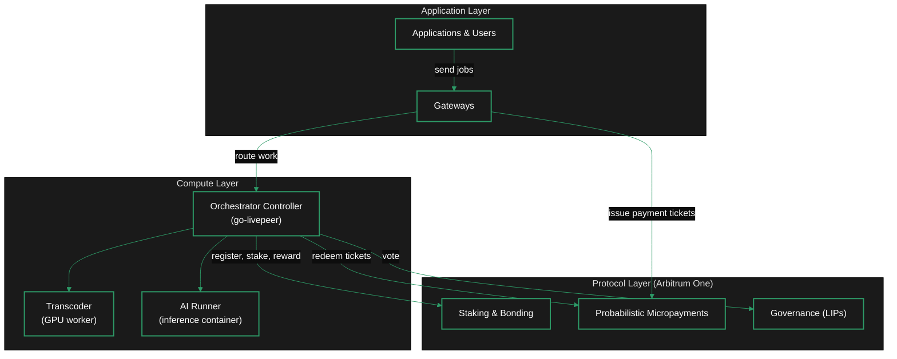
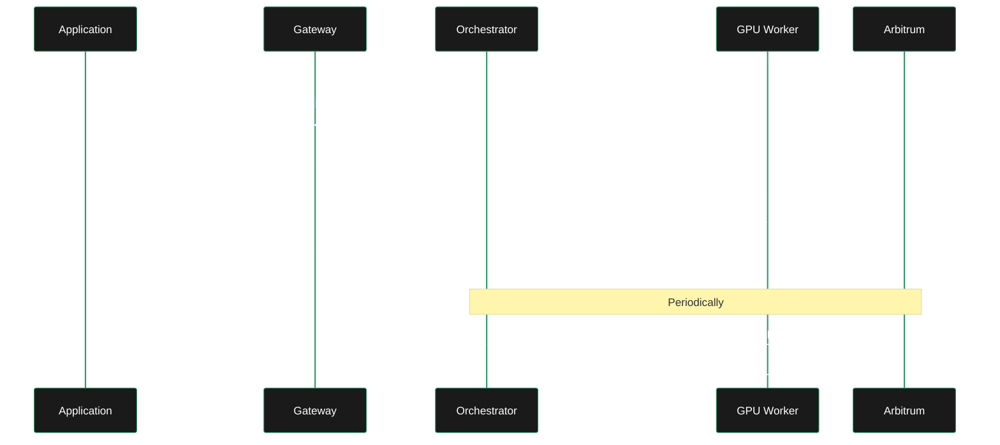

This page explains where orchestrators sit in the Livepeer stack, how they interact with other network participants, how work flows through the system, and the key components involved.

For what orchestrators *do*, see [Role](/v2/orchestrators/concepts/role). For the workloads they run, see [Capabilities](/v2/orchestrators/concepts/capabilities).

---

## Layer position

The Livepeer network has three functional layers. Orchestrators operate at the compute layer, bridging the protocol layer (on-chain) and the application layer (off-chain).

| Layer | Participants | Responsibility |
|---|---|---|
| **Application** | Developers, end users, gateways | Ingest content, route jobs, deliver results |
| **Compute** | Orchestrators, transcoders, AI runners | Execute video and AI work on GPUs |
| **Protocol** | Arbitrum smart contracts | Staking, payments, governance, round management |

Orchestrators are the only participants that interact with all three layers — they receive work from gateways, execute it on GPU hardware, and settle on-chain.

---

## System interactions

An orchestrator interacts with four categories of actors:

### Gateways

Gateways are the demand side of the network. They receive jobs from applications (livestreams, AI requests) and select orchestrators to perform the work based on price, performance history, and stake weight.

- Gateways discover orchestrators through the on-chain registry
- Job routing uses a selection algorithm that factors in price (`-pricePerUnit`), latency, past performance, and stake
- Payment is handled via probabilistic micropayment tickets attached to each job segment

### Delegators

Delegators stake LPT to orchestrators, increasing the orchestrator's total stake and improving selection probability. In return, orchestrators share a portion of rewards and fees (configured via reward cut and fee cut).

- More delegated stake = higher ranking in the active set
- Orchestrators compete for delegation by offering competitive cuts and maintaining good performance
- See [Attracting Delegates](/v2/orchestrators/guides/staking-and-rewards/attracting-delegates)

### GPU workers

In the simplest setup, the orchestrator and transcoder run on the same machine as a single go-livepeer process. In split configurations, the orchestrator controller can route work to remote transcoder or AI runner processes.

| Configuration | How it works |
|---|---|
| **Combined** (default) | One go-livepeer process runs as both orchestrator and transcoder. `-orchestrator -transcoder` flags. |
| **Split O/T** | Orchestrator controller on one machine delegates GPU work to separate transcoder nodes. Used for multi-GPU or multi-machine setups. |
| **AI Runner** | A separate Docker container runs AI inference models. The orchestrator routes AI jobs to it via `aiModels.json`. |

See [Orchestrator-Transcoder Split](/v2/orchestrators/guides/advanced-operations/orchestrator-transcoder-setup) for the split configuration.

### Arbitrum protocol

The orchestrator's on-chain identity lives on Arbitrum One. Key interactions:

- **Registration** — `livepeer_cli` submits a bond transaction to register as an orchestrator
- **Reward calls** — once per round (~24 hours), the node calls `reward()` to mint new LPT
- **Ticket redemption** — payment tickets from gateways are redeemed on-chain for ETH
- **Governance** — orchestrators can vote on Livepeer Improvement Proposals (LIPs)

---

## Request flow

This is the lifecycle of a single job — from a user's request through execution and payment.

### Step-by-step

1. **Job submission** — An application sends a video segment or AI inference request to a gateway.
2. **Orchestrator selection** — The gateway picks an orchestrator from the active set based on price, performance, latency, and stake weight.
3. **Work dispatch** — The gateway sends the segment/request to the orchestrator along with a probabilistic micropayment ticket.
4. **Execution** — The orchestrator's controller routes the work to the appropriate GPU worker (transcoder process for video, AI Runner container for inference).
5. **Result delivery** — The GPU worker returns the output to the orchestrator, which sends it back to the gateway.
6. **Payment settlement** — The orchestrator accumulates payment tickets and periodically redeems them on Arbitrum for ETH.
7. **Reward minting** — Once per round, the orchestrator calls `reward()` on Arbitrum to mint LPT proportional to its stake.

---

## Key components

### go-livepeer

The core node software. Runs as the orchestrator controller and (in combined mode) the transcoder. Handles:

- Job negotiation with gateways
- GPU work dispatch
- Payment ticket management
- Reward calls and on-chain transactions
- Prometheus metrics (port 7935)

Source: [github.com/livepeer/go-livepeer](https://github.com/livepeer/go-livepeer)

### livepeer_cli

A command-line tool that connects to a running go-livepeer node. Used for:

- Activation (registering as an orchestrator, staking LPT)
- Updating reward cut, fee cut, and service URI
- Withdrawing funds

### AI Runner

A Docker container that serves AI inference models. The orchestrator discovers available models through `aiModels.json` and routes matching AI requests to the runner.

Source: [github.com/livepeer/ai-worker](https://github.com/livepeer/ai-worker)

### Arbitrum smart contracts

The Livepeer protocol contracts on Arbitrum One manage:

| Contract | Purpose |
|---|---|
| **BondingManager** | Staking, delegation, active set management |
| **RoundsManager** | Round lifecycle (~24 hours), reward eligibility |
| **TicketBroker** | Probabilistic micropayment ticket redemption |
| **ServiceRegistry** | On-chain service URI for orchestrator discovery |

See [Contract Addresses](/v2/orchestrators/resources/technical/x-contract-addresses) for deployed addresses.

### Livepeer Explorer

A web interface at [explorer.livepeer.org](https://explorer.livepeer.org) for viewing orchestrator status, stake, performance, and governance activity. Not a node component, but the primary tool for monitoring your on-chain presence.

---

## Related

<CardGroup cols={3}>
  <Card title="Role" icon="user-gear" href="/v2/orchestrators/concepts/role" arrow />
  <Card title="Capabilities" icon="gears" href="/v2/orchestrators/concepts/capabilities" arrow />
  <Card title="Incentives" icon="coins" href="/v2/orchestrators/concepts/rcs-incentives" arrow />
</CardGroup>
