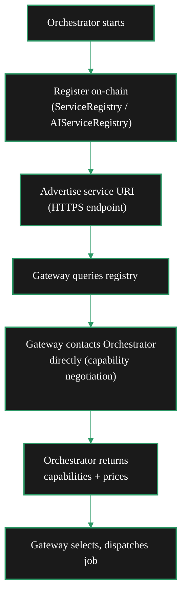

{/* TODO:
Verify:
- Mermaid diagrams use theme colours (but must be hardcoded)
- Fontawesome icons are used on accordions and tabs
- Tables use StyledTable component
- No em-dashes are used
- UK spelling is used
- Headers are concise and technical (aim for max 3 words)
- CustomDivider uses approved margin patterns
- Placeholders for Media and Video Resources are in comments with a TODO for a human.
- REVIEW flags are in JSX flags for a human.
Human
- Find Media
- Review REVIEW items
*/}

import { LinkArrow } from '/snippets/components/primitives/links.jsx'
import { StyledTable, TableRow, TableCell } from '/snippets/components/layout/tables.jsx'
import { CustomDivider } from '/snippets/components/primitives/divider.jsx'
import { ScrollableDiagram } from '/snippets/components/content/zoomableDiagram.jsx'
import { CenteredContainer, BorderedBox } from '/snippets/components/layout/containers.jsx'

<CenteredContainer style={{ width: '90%' }}>
  <Tip>Orchestrators perform compute - they do not route or discover work. Gateways send jobs; Orchestrators execute them on GPU hardware and return results. Every capability an Orchestrator exposes must be declared on registration so Gateways can discover and select it.</Tip>
</CenteredContainer>

<CustomDivider middleText="Workload Types" style={{margin: "0 0 -1rem 0"}} />

## Workload Types

Orchestrators can execute four categories of compute workload. Which workloads a node accepts depends
on its hardware, the pipelines and models it has loaded, and how it is configured.

<StyledTable variant="bordered">
  <thead>
    <TableRow header>
      <TableCell header>Workload</TableCell>
      <TableCell header>What the Orchestrator does</TableCell>
      <TableCell header>Unit of work</TableCell>
      <TableCell header>GPU required</TableCell>
    </TableRow>
  </thead>
  <tbody>
    <TableRow>
      <TableCell>**Video transcoding**</TableCell>
      <TableCell>Re-encode live video segments from RTMP ingest into multiple output profiles (resolution, bitrate, format)</TableCell>
      <TableCell>Per segment (typically 2 seconds of video)</TableCell>
      <TableCell>Yes (NVENC preferred; CPU possible)</TableCell>
    </TableRow>
    <TableRow>
      <TableCell>**Batch AI inference**</TableCell>
      <TableCell>Run single-request AI jobs: text-to-image, image-to-image, image-to-video, audio-to-text, upscale, segmentation</TableCell>
      <TableCell>Per request (pixel or millisecond-based)</TableCell>
      <TableCell>Yes (VRAM requirements vary by model)</TableCell>
    </TableRow>
    <TableRow>
      <TableCell>**Real-time AI (Cascade)**</TableCell>
      <TableCell>Apply continuous AI processing to a live video stream - style transfer, avatar rendering, real-time generative overlays</TableCell>
      <TableCell>Per interval during stream duration</TableCell>
      <TableCell>Yes (high VRAM; dedicated GPU strongly recommended)</TableCell>
    </TableRow>
    <TableRow>
      <TableCell>**BYOC containers**</TableCell>
      <TableCell>Execute application-defined Docker containers on Orchestrator hardware for custom ML workflows or novel compute tasks</TableCell>
      <TableCell>Per request or per interval (defined by pipeline)</TableCell>
      <TableCell>Depends on container</TableCell>
    </TableRow>
  </tbody>
</StyledTable>

<Note>
An Orchestrator running both video transcoding and AI inference is described as operating in a
**dual-workload configuration**. This is not a separate mode - it is the same Orchestrator process
with both pipelines enabled. See <LinkArrow href="/v2/orchestrators/concepts/architecture" label="Orchestrator Architecture" newline={false} /> for the pipeline internals.
</Note>

<CustomDivider middleText="AI Pipelines" style={{margin: "0 0 -1rem 0"}} />

## Supported AI Pipelines

Livepeer defines a standard set of AI pipelines that Orchestrators can advertise. Each pipeline maps
to a category of inference task and a compatible set of models.

<StyledTable variant="bordered">
  <thead>
    <TableRow header>
      <TableCell header>Pipeline</TableCell>
      <TableCell header>Input</TableCell>
      <TableCell header>Output</TableCell>
      <TableCell header>Example models</TableCell>
    </TableRow>
  </thead>
  <tbody>
    <TableRow>
      <TableCell>**text-to-image**</TableCell>
      <TableCell>Text prompt</TableCell>
      <TableCell>Image</TableCell>
      <TableCell>`stabilityai/stable-diffusion-3-medium-diffusers`, `ByteDance/SDXL-Lightning`</TableCell>
    </TableRow>
    <TableRow>
      <TableCell>**image-to-image**</TableCell>
      <TableCell>Image + prompt</TableCell>
      <TableCell>Image</TableCell>
      <TableCell>`timbrooks/instruct-pix2pix`</TableCell>
    </TableRow>
    <TableRow>
      <TableCell>**image-to-video**</TableCell>
      <TableCell>Image + motion prompt</TableCell>
      <TableCell>Video clip</TableCell>
      <TableCell>`stabilityai/stable-video-diffusion-img2vid-xt-1-1`</TableCell>
    </TableRow>
    <TableRow>
      <TableCell>**audio-to-text**</TableCell>
      <TableCell>Audio file</TableCell>
      <TableCell>Transcript (JSON)</TableCell>
      <TableCell>`openai/whisper-large-v3`</TableCell>
    </TableRow>
    <TableRow>
      <TableCell>**upscale**</TableCell>
      <TableCell>Low-resolution image</TableCell>
      <TableCell>High-resolution image</TableCell>
      <TableCell>`stabilityai/stable-diffusion-x4-upscaler`</TableCell>
    </TableRow>
    <TableRow>
      <TableCell>**segment-anything-2**</TableCell>
      <TableCell>Image + prompt</TableCell>
      <TableCell>Segmentation mask</TableCell>
      <TableCell>`facebook/sam2-hiera-large`</TableCell>
    </TableRow>
    <TableRow>
      <TableCell>**live-video-to-video**</TableCell>
      <TableCell>Live video stream</TableCell>
      <TableCell>Transformed live stream</TableCell>
      <TableCell>Cascade pipeline models</TableCell>
    </TableRow>
  </tbody>
</StyledTable>

{/* REVIEW: Confirm pipeline list is complete and up-to-date with AI subnet - check go-livepeer AI runner for current list */}

An Orchestrator can support any subset of pipelines and models. Each combination of pipeline and model
is independently priced and advertised. Gateways discover these via the AIServiceRegistry contract or
from the Orchestrator's capability response during session negotiation.

<CustomDivider middleText="Capability Advertisement" style={{margin: "0 0 -1rem 0"}} />

## How Capabilities Are Advertised

When a Gateway wants to route a job, it must find an Orchestrator that can handle it. Orchestrators
make themselves discoverable through two mechanisms:

### On-chain registration

Orchestrators register their service URI in the **ServiceRegistry** contract on Arbitrum. AI-capable
Orchestrators additionally register with the **AIServiceRegistry** contract (or use the `-aiServiceRegistry`
flag to connect to the AI subnet). This makes the Orchestrator discoverable to all Gateways that query
the registry.

### Capability negotiation

When a Gateway establishes a session with an Orchestrator, the Orchestrator returns a **capability
manifest** - the full list of pipelines it supports, the models it has loaded, and its price per unit
for each. The Gateway uses this to decide whether to proceed with the session.

Capabilities that are advertised but not actually available (e.g. models not yet loaded into VRAM) will
result in job failures. Keep declared capabilities in sync with loaded models.

<CustomDivider middleText="Gateway Selection" style={{margin: "0 0 -1rem 0"}} />

## How Gateways Select Orchestrators

Understanding Gateway selection is essential for Orchestrators that want to attract work. Gateways do
not randomly assign jobs - they apply a multi-factor ranking algorithm to every session.

<StyledTable variant="bordered">
  <thead>
    <TableRow header>
      <TableCell header>Factor</TableCell>
      <TableCell header>What the Gateway looks at</TableCell>
      <TableCell header>Operator implication</TableCell>
    </TableRow>
  </thead>
  <tbody>
    <TableRow>
      <TableCell>**Capability match**</TableCell>
      <TableCell>Does the Orchestrator support the requested pipeline and model?</TableCell>
      <TableCell>Declare only what you can actually run</TableCell>
    </TableRow>
    <TableRow>
      <TableCell>**Price**</TableCell>
      <TableCell>Is your `-pricePerUnit` at or below the Gateway's `-maxPricePerUnit`?</TableCell>
      <TableCell>Price competitively; too high means no jobs</TableCell>
    </TableRow>
    <TableRow>
      <TableCell>**Latency**</TableCell>
      <TableCell>How fast did you respond to recent segments?</TableCell>
      <TableCell>Low-latency GPU access and reliable network connectivity are critical</TableCell>
    </TableRow>
    <TableRow>
      <TableCell>**Performance history**</TableCell>
      <TableCell>What is your success rate and error rate over recent sessions?</TableCell>
      <TableCell>Uptime and job reliability directly affect how much work you receive</TableCell>
    </TableRow>
    <TableRow>
      <TableCell>**Stake weight**</TableCell>
      <TableCell>How much LPT is bonded to your Orchestrator (self-stake + delegated)?</TableCell>
      <TableCell>Higher stake increases selection probability when other factors are equal</TableCell>
    </TableRow>
  </tbody>
</StyledTable>

A Gateway that sends a job and receives an error or timeout will deprioritise your Orchestrator for
subsequent sessions. Sustained availability and accurate capability declaration are the strongest
signals for consistent job flow.

See <LinkArrow href="/v2/orchestrators/guides/config-and-optimisation/pricing-strategy" label="Pricing Strategy" newline={false} /> for how to configure competitive prices.

<CustomDivider middleText="What Orchestrators Don't Do" style={{margin: "0 0 -1rem 0"}} />

## Capability Boundaries

Orchestrators handle compute and payment receipt. They do not handle job routing, application
integration, or business-layer concerns.

<StyledTable variant="bordered">
  <thead>
    <TableRow header>
      <TableCell header>Not part of the Orchestrator role</TableCell>
      <TableCell header>Where it happens instead</TableCell>
    </TableRow>
  </thead>
  <tbody>
    <TableRow>
      <TableCell>Accepting RTMP streams from applications</TableCell>
      <TableCell>Gateway (RTMP ingest, port 1935)</TableCell>
    </TableRow>
    <TableRow>
      <TableCell>Routing jobs between multiple Orchestrators</TableCell>
      <TableCell>Gateway (orchestrator selection algorithm)</TableCell>
    </TableRow>
    <TableRow>
      <TableCell>Managing API keys or billing for end users</TableCell>
      <TableCell>Gateway or application layer</TableCell>
    </TableRow>
    <TableRow>
      <TableCell>Sending payment tickets to anyone</TableCell>
      <TableCell>Gateways send tickets; Orchestrators receive and redeem them</TableCell>
    </TableRow>
    <TableRow>
      <TableCell>Staking LPT for Delegators</TableCell>
      <TableCell>BondingManager contract (Delegators do this themselves)</TableCell>
    </TableRow>
  </tbody>
</StyledTable>

If you want to aggregate application demand and route work across multiple Orchestrators, that is
the Gateway role. See <LinkArrow href="/v2/gateways/concepts/role" label="Gateway Role" newline={false} /> for that path.

<CustomDivider style={{margin: "0 0 -1rem 0"}} />

## Related Pages

<CardGroup cols={2}>
  <Card title="Orchestrator Role" icon="user-gear" href="/v2/orchestrators/concepts/role" arrow horizontal>
    What Orchestrators are and how the role has evolved.
  </Card>
  <Card title="Orchestrator Architecture" icon="diagram-project" href="/v2/orchestrators/concepts/architecture" arrow horizontal>
    Internal components, request flow, and system interactions.
  </Card>
  <Card title="Incentive Model" icon="coins" href="/v2/orchestrators/concepts/incentive-model" arrow horizontal>
    Revenue streams, cost structure, and earnings potential.
  </Card>
  <Card title="Workloads and AI" icon="microchip" href="/v2/orchestrators/guides/ai-and-job-workloads/workload-options" arrow horizontal>
    Detailed setup guides for video, AI, and BYOC workloads.
  </Card>
</CardGroup>
