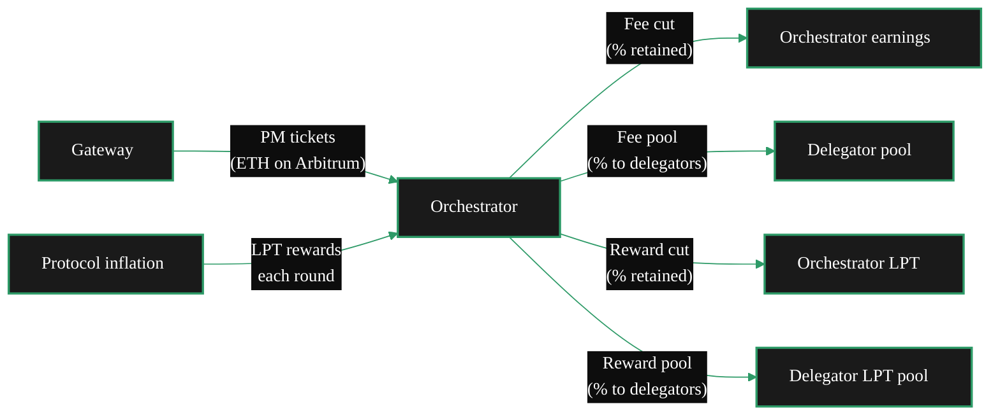

{/* TODO:
Verify:
- Mermaid diagrams use theme colours (but must be hardcoded)
- Tables use StyledTable component
- No em-dashes are used
- UK spelling is used
- Headers are concise and technical (aim for max 3 words)
- CustomDivider uses approved margin patterns
- Placeholders for Media and Video Resources are in comments with a TODO for a human.
- REVIEW flags are in JSX flags for a human.
Human
- Find Media (Livepeer Explorer earnings charts would work well here)
- Review REVIEW items
*/}

import { LinkArrow } from '/snippets/components/primitives/links.jsx'
import { StyledTable, TableRow, TableCell } from '/snippets/components/layout/tables.jsx'
import { CustomDivider } from '/snippets/components/primitives/divider.jsx'
import { ScrollableDiagram } from '/snippets/components/content/zoomableDiagram.jsx'
import { CenteredContainer, BorderedBox } from '/snippets/components/layout/containers.jsx'

<CenteredContainer style={{ width: '90%' }}>
  <Tip>Orchestrators earn from two independent sources: ETH service fees for processing jobs, and LPT inflation rewards for protocol participation. Both require active set membership. Earnings from fees depend on workload volume; earnings from rewards depend on total stake and the reward cut configuration.</Tip>
</CenteredContainer>

<CustomDivider middleText="Revenue Streams" style={{margin: "0 0 -1rem 0"}} />

## Two Revenue Streams

An Orchestrator's total earnings combine two streams that are structurally independent.

```mermaid
%%{init: {'theme': 'base', 'themeVariables': { 'primaryColor': '#1a1a1a', 'primaryTextColor': '#fff', 'primaryBorderColor': '#2d9a67', 'lineColor': '#2d9a67', 'secondaryColor': '#0d0d0d', 'tertiaryColor': '#1a1a1a', 'background': '#0d0d0d', 'fontFamily': 'system-ui' }}}%%
flowchart LR
    subgraph FEES["Stream 1: Service Fees (ETH)"]
        A["Gateway sends job\n+ payment ticket"] --> B["Orchestrator\nexecutes work"]
        B --> C["Winning ticket redeemed\non TicketBroker"]
        C --> D["ETH paid to Orchestrator\n(fee cut retained;\nremainder to fee pool)"]
    end

    subgraph REWARDS["Stream 2: Inflation Rewards (LPT)"]
        E["Orchestrator calls\nrewards each round"] --> F["Protocol calculates\nshare based on stake"]
        F --> G["LPT minted and distributed\n(reward cut retained;\nremainder to delegator pool)"]
    end

    classDef default fill:#1a1a1a,color:#fff,stroke:#2d9a67,stroke-width:2px
    style FEES fill:#0d0d0d,stroke:#2d9a67,stroke-width:1px
    style REWARDS fill:#0d0d0d,stroke:#2d9a67,stroke-width:1px
```



<StyledTable variant="bordered">
  <thead>
    <TableRow header>
      <TableCell header>Stream</TableCell>
      <TableCell header>Currency</TableCell>
      <TableCell header>Source</TableCell>
      <TableCell header>Frequency</TableCell>
      <TableCell header>Depends on</TableCell>
    </TableRow>
  </thead>
  <tbody>
    <TableRow>
      <TableCell>**Service fees**</TableCell>
      <TableCell>ETH</TableCell>
      <TableCell>Gateways paying for compute (transcoding or AI inference)</TableCell>
      <TableCell>Per job (ticket redemption is probabilistic)</TableCell>
      <TableCell>Volume of work received; price configuration; uptime</TableCell>
    </TableRow>
    <TableRow>
      <TableCell>**Inflation rewards**</TableCell>
      <TableCell>LPT</TableCell>
      <TableCell>Protocol inflation (new LPT minted per round)</TableCell>
      <TableCell>Once per round (~22 hours) via reward call</TableCell>
      <TableCell>Total bonded stake (self-stake + delegated); reward cut setting</TableCell>
    </TableRow>
  </tbody>
</StyledTable>

<CustomDivider middleText="Service Fees" style={{margin: "0 0 -1rem 0"}} />

## Service Fees (ETH)

Service fees are paid by Gateways via **probabilistic micropayment (PM) tickets**. Each job segment
or inference request carries a ticket with a face value and a win probability. When a ticket "wins"
(determined cryptographically), the Orchestrator redeems it on the TicketBroker contract on Arbitrum
for the face value in ETH.

The expected value of a ticket equals its face value multiplied by the win probability. Over a large
number of tickets, actual earnings converge to the expected value.

### Pricing units

Fee income per job is determined by the price the Orchestrator charges and the volume it processes:

<StyledTable variant="bordered">
  <thead>
    <TableRow header>
      <TableCell header>Workload</TableCell>
      <TableCell header>Pricing unit</TableCell>
      <TableCell header>Configuration flag</TableCell>
    </TableRow>
  </thead>
  <tbody>
    <TableRow>
      <TableCell>**Video transcoding**</TableCell>
      <TableCell>Wei per pixel per segment</TableCell>
      <TableCell>`-pricePerUnit`</TableCell>
    </TableRow>
    <TableRow>
      <TableCell>**Batch AI inference**</TableCell>
      <TableCell>Wei per pixel or per millisecond (pipeline-dependent)</TableCell>
      <TableCell>`-pricePerCapability` (per pipeline and model)</TableCell>
    </TableRow>
    <TableRow>
      <TableCell>**Real-time AI (Cascade)**</TableCell>
      <TableCell>Interval-based during stream duration</TableCell>
      <TableCell>`-livePaymentInterval`</TableCell>
    </TableRow>
  </tbody>
</StyledTable>

Setting prices too high means Gateways will not select the Orchestrator (their `-maxPricePerUnit`
ceiling acts as a filter). Setting prices too low reduces earnings per job. The network forms a
market price - use `livepeer_cli` to survey current rates before setting your own.

### Fee distribution

The Orchestrator's **fee cut** determines what share of collected fees goes to the Orchestrator versus
the shared fee pool distributed to Delegators.

```
Total fee ticket value = Orchestrator fee cut + Delegator fee pool
```

For example, at a fee cut of 5%: the Orchestrator keeps 5% of ticket value; 95% goes to the fee pool
distributed proportionally among Delegators.

{/* REVIEW: Confirm fee cut mechanics - does 5% go to Orchestrator and 95% to delegator pool, or is it expressed as percentage Delegators receive? Check BondingManager contract */}

<CustomDivider middleText="Inflation Rewards" style={{margin: "0 0 -1rem 0"}} />

## Inflation Rewards (LPT)

The Livepeer protocol mints new LPT each round to incentivise participation. Orchestrators in the
active set earn a share of this inflation proportional to their total bonded stake.

### The reward call

To claim LPT rewards for a round, the Orchestrator (or an automated process) must call the reward
function on the BondingManager contract **once per round**. Missing a reward call means forgoing that
round's LPT rewards entirely - this is not recoverable.

Most production Orchestrators automate reward calling. The go-livepeer node can be configured to do
this automatically. See <LinkArrow href="/v2/orchestrators/guides/staking-and-rewards/reward-mechanics" label="Reward Mechanics" newline={false} /> for configuration details.

### Reward distribution

The Orchestrator's **reward cut** determines what share of the round's LPT goes to the Orchestrator
versus Delegators:

```
Total round reward = Orchestrator reward cut + Delegator reward pool
```

A reward cut of 25% means the Orchestrator keeps 25% of the LPT earned; 75% is distributed to
Delegators in proportion to their bonded stake.

<StyledTable variant="bordered">
  <thead>
    <TableRow header>
      <TableCell header>Reward cut setting</TableCell>
      <TableCell header>Orchestrator keeps</TableCell>
      <TableCell header>Delegators receive</TableCell>
      <TableCell header>Implication</TableCell>
    </TableRow>
  </thead>
  <tbody>
    <TableRow>
      <TableCell>0%</TableCell>
      <TableCell>None</TableCell>
      <TableCell>100%</TableCell>
      <TableCell>Maximum incentive to attract delegated stake; operator earns nothing from rewards</TableCell>
    </TableRow>
    <TableRow>
      <TableCell>25%</TableCell>
      <TableCell>25%</TableCell>
      <TableCell>75%</TableCell>
      <TableCell>Common production setting; balances operator return with delegator appeal</TableCell>
    </TableRow>
    <TableRow>
      <TableCell>100%</TableCell>
      <TableCell>100%</TableCell>
      <TableCell>None</TableCell>
      <TableCell>Maximum operator return; Delegators receive no LPT rewards from this Orchestrator</TableCell>
    </TableRow>
  </tbody>
</StyledTable>

### Active set requirement

Only the top 100 Orchestrators by total bonded stake (self-stake + delegated stake) are in the
**active set** in any given round. Only active set members receive inflation rewards and can receive
Gateway jobs. Stake below the threshold for active set membership means no earnings from either stream.

The active set threshold varies with network participation. Monitor your rank on the
[Livepeer Explorer](https://explorer.livepeer.org) to ensure you remain in the active set.

<CustomDivider middleText="Cost Structure" style={{margin: "0 0 -1rem 0"}} />

## Orchestrator Costs

Earnings must be weighed against operational costs. Orchestrator costs fall into three categories:

<StyledTable variant="bordered">
  <thead>
    <TableRow header>
      <TableCell header>Cost category</TableCell>
      <TableCell header>What it covers</TableCell>
      <TableCell header>Notes</TableCell>
    </TableRow>
  </thead>
  <tbody>
    <TableRow>
      <TableCell>**Hardware**</TableCell>
      <TableCell>GPU(s), server, networking</TableCell>
      <TableCell>Capital expenditure; amortised over Orchestrator lifetime</TableCell>
    </TableRow>
    <TableRow>
      <TableCell>**Infrastructure**</TableCell>
      <TableCell>Electricity, bandwidth, colocation or cloud fees</TableCell>
      <TableCell>Ongoing operating expense; electricity is the largest recurring cost for GPU operators</TableCell>
    </TableRow>
    <TableRow>
      <TableCell>**Staking opportunity cost**</TableCell>
      <TableCell>LPT locked in self-bond cannot be sold or used elsewhere</TableCell>
      <TableCell>Relevant when evaluating ROI against alternative LPT uses (delegating to another Orchestrator)</TableCell>
    </TableRow>
  </tbody>
</StyledTable>

{/* REVIEW: Add gas cost for reward calls once confirmed - reward calls on Arbitrum are cheap but not zero */}

<Note>
Unlike Gateways, Orchestrators do not pay for the jobs they process - they are paid. The cost structure
is infrastructure and staking, not service fees.
</Note>

<CustomDivider middleText="Full Payment Flow" style={{margin: "0 0 -1rem 0"}} />

## Payment Flow End-to-End

This is the complete flow from Gateway payment through Orchestrator receipt to Delegator distribution.



<CustomDivider middleText="Why Operate?" style={{margin: "0 0 -1rem 0"}} />

## Operator Models

Orchestrators operate for different reasons. The earnings model looks different depending on context.

<AccordionGroup>
  <Accordion title="GPU miner (earning from idle hardware)" icon="microchip">
    If you have GPU hardware already running - mining, rendering, or sitting idle - adding Livepeer
    Orchestrator workloads converts spare capacity into ETH service fees and LPT rewards.

    The incremental cost is electricity and a small slice of GPU time. The marginal earnings are
    service fees (proportional to workload volume) plus LPT rewards (proportional to stake).

    This model favours operators with high-end consumer or prosumer GPUs (RTX 3090, 4090, A100, H100)
    and reliable connectivity. The solo-operator path is documented in the
    <LinkArrow href="/v2/orchestrators/quickstart" label="Orchestrator Quickstart" newline={false} />.
  </Accordion>
  <Accordion title="Commercial GPU operator (serving workloads at scale)" icon="building">
    Commercial Orchestrators serving application workloads (Daydream, Livepeer Studio, custom AI
    products) operate differently from solo GPU miners.

    Revenue is primarily from service fees rather than inflation rewards. The key metrics are
    throughput, latency, and reliability - not stake size. Pricing strategy matters more, and
    direct relationships with high-volume Gateways are common.

    {/* REVIEW: Link to commercial-orchestrators.mdx once written */}
    This model requires understanding Gateway selection mechanics in depth. See
    <LinkArrow href="/v2/orchestrators/concepts/capabilities" label="Gateway Selection" newline={false} /> for
    the factors Gateways weigh.
  </Accordion>
  <Accordion title="Infrastructure business (pool operation)" icon="server">
    Pool operators run the Orchestrator process and LPT staking infrastructure, then accept GPU
    workers from contributors who want to earn without managing the on-chain complexity.

    Revenue for pool operators typically comes from a fee charged to workers (percentage of their
    earnings) or from running some of the GPUs in the pool themselves.

    This model combines the earnings from running GPU compute with revenue from managing the protocol
    layer on behalf of workers.
  </Accordion>
  <Accordion title="Delegator-focused (earning rewards without compute)" icon="coins">
    An Orchestrator that holds substantial self-stake but operates at low capacity or joins a pool
    earns primarily from inflation rewards rather than service fees.

    High reward cut retains more LPT per round. Low reward cut attracts more delegated stake, which
    increases the Orchestrator's share of the total round reward.

    This model is most relevant for large LPT holders evaluating whether to self-operate versus
    delegating to an existing Orchestrator.
  </Accordion>
</AccordionGroup>

<CustomDivider middleText="Pricing Configuration" style={{margin: "0 0 -1rem 0"}} />

## Configuring Prices

Orchestrators set three categories of pricing parameter at startup or via `livepeer_cli`:

### Base price

```bash
# Price per pixel per second for video transcoding
-pricePerUnit=1000

# Enable automatic price adjustment based on network conditions
-autoAdjustPrice=true
```

### AI capability pricing

```bash
# Per-pipeline, per-model AI pricing (JSON file path)
-pricePerCapability=/path/to/ai-prices.json
```

Example `ai-prices.json`:

```json
{
  "capabilities_prices": [
    {
      "pipeline": "text-to-image",
      "model_id": "stabilityai/stable-diffusion-3-medium-diffusers",
      "price_per_unit": 4768371,
      "pixels_per_unit": 1
    },
    {
      "pipeline": "audio-to-text",
      "model_id": "openai/whisper-large-v3",
      "price_per_unit": 15000,
      "pixels_per_unit": 1
    }
  ]
}
```

### Per-Gateway pricing

```bash
# Set a different price for a specific Gateway address
-pricePerGateway='{"0xGatewayAddress": 800}'
```

Per-Gateway pricing allows commercial Orchestrators to negotiate rates with high-volume Gateways
independently of the base network price.

See <LinkArrow href="/v2/orchestrators/guides/config-and-optimisation/pricing-strategy" label="Pricing Strategy" newline={false} /> for competitive pricing guidance and current network rate benchmarks.

<CustomDivider middleText="Delegator Relationship" style={{margin: "0 0 -1rem 0"}} />

## Attracting Delegators

Delegated stake increases an Orchestrator's share of inflation rewards and improves its active set
ranking. Attracting and retaining Delegators is therefore an economic lever for Orchestrators.

Delegators evaluate Orchestrators on:

- **Reward cut** - lower reward cut means more LPT to Delegators per round
- **Fee cut** - lower fee cut means more ETH to Delegators from service fees
- **Reliability** - missed reward calls mean Delegators receive no rewards for that round
- **Reputation** - track record of uptime, performance, and community engagement
- **Stake already committed** - larger self-stake signals greater operator commitment

The Livepeer Explorer shows all active Orchestrators and their current cut settings, stake, and
recent reward-calling history. Delegators use this to compare options.

See <LinkArrow href="/v2/orchestrators/guides/staking-and-rewards/delegate-operations" label="Delegate Operations" newline={false} /> for operator strategies.

<CustomDivider style={{margin: "0 0 -1rem 0"}} />

## Related Pages

<CardGroup cols={2}>
  <Card title="Orchestrator Role" icon="user-gear" href="/v2/orchestrators/concepts/role" arrow horizontal>
    What Orchestrators are and how the role has evolved.
  </Card>
  <Card title="Orchestrator Capabilities" icon="gears" href="/v2/orchestrators/concepts/capabilities" arrow horizontal>
    Workload types and how Gateways select Orchestrators.
  </Card>
  <Card title="Pricing Strategy" icon="tag" href="/v2/orchestrators/guides/config-and-optimisation/pricing-strategy" arrow horizontal>
    How to set competitive prices for video and AI workloads.
  </Card>
  <Card title="Gateway Business Model" icon="chart-line" href="/v2/gateways/concepts/business-model" arrow horizontal>
    The buy-side view - how Gateways pay and what they maximise.
  </Card>
</CardGroup>
