import { LinkArrow } from '/snippets/components/primitives/links.jsx'
import { StyledTable, TableRow, TableCell } from '/snippets/components/layout/tables.jsx'
import { CustomDivider } from '/snippets/components/primitives/divider.jsx'
import { ScrollableDiagram } from '/snippets/components/content/zoomableDiagram.jsx'
import { CenteredContainer, BorderedBox } from '/snippets/components/layout/containers.jsx'

<CenteredContainer style={{ width: '90%' }}>
  <Tip>Orchestrators earn from two sources: LPT protocol rewards (for staking) and ETH service fees (for doing work). The more stake you attract and the more jobs you complete, the more you earn.</Tip>
</CenteredContainer>

<CustomDivider />

This page explains how orchestrators earn, what it costs to operate, and why the incentive model works. For what orchestrators *do*, see [Role](/v2/orchestrators/concepts/role). For the workloads they run, see [Capabilities](/v2/orchestrators/concepts/capabilities).

<CustomDivider middleText="Participation Model" />

## Stake-for-access

The Livepeer Token (LPT) operates under a [Stake-for-Access (SFA)](https://messari.io/report/how-are-web3-infrastructure-protocols-trying-to-capture-value) model, common in [DePIN](https://livepeer.org/depin) networks. To participate as an orchestrator, you must stake LPT tokens.

Staking serves three purposes:

1. **Access** - you must stake to register as an orchestrator and receive work
2. **Selection weight** - higher stake increases your probability of being selected by gateways
3. **Economic security** - stake creates a financial commitment to good behaviour

Your total stake = your self-stake + LPT delegated to you by other token holders. Delegators stake to orchestrators they trust, increasing the orchestrator's weight and earning a share of rewards in return.

<Note>
There is no fixed minimum stake to register. However, to enter the **active set** (the pool of orchestrators eligible for work and rewards), your total stake must rank in the top orchestrators by stake weight. The active set size is a protocol parameter.
</Note>

<CustomDivider middleText="Revenue Streams" />

## How orchestrators earn

Orchestrators earn from two independent revenue streams:

```mermaid
%%{init: {'theme': 'base', 'themeVariables': { 'primaryColor': '#1a1a1a', 'primaryTextColor': '#fff', 'primaryBorderColor': '#2d9a67', 'lineColor': '#2d9a67', 'secondaryColor': '#0d0d0d', 'tertiaryColor': '#1a1a1a', 'background': '#0d0d0d', 'fontFamily': 'system-ui' }}}%%
flowchart LR
    subgraph Revenue["Orchestrator Revenue"]
        direction TB
        R1["LPT Protocol Rewards<br/>(inflationary, per round)"]
        R2["ETH Service Fees<br/>(usage-based, per job)"]
    end

    subgraph Sources["Sources"]
        S1["Livepeer Protocol<br/>reward() call each round"]
        S2["Gateways<br/>payment tickets per job"]
    end

    subgraph Sharing["Shared With Delegators"]
        D1["LPT share<br/>(100% minus reward cut)"]
        D2["ETH share<br/>(100% minus fee cut)"]
    end

    S1 --> R1
    S2 --> R2
    R1 --> D1
    R2 --> D2

    classDef default fill:#1a1a1a,color:#fff,stroke:#2d9a67,stroke-width:2px
    style Revenue fill:#0d0d0d,stroke:#2d9a67,stroke-width:1px
    style Sources fill:#0d0d0d,stroke:#2d9a67,stroke-width:1px
    style Sharing fill:#0d0d0d,stroke:#2d9a67,stroke-width:1px
```

### Protocol rewards (LPT)

Every round (~24 hours), the protocol mints new LPT and distributes it proportionally to staked orchestrators in the active set. To claim your share, your node must call `reward()` once per round.

- **Currency:** LPT
- **Frequency:** Once per round (~24 hours)
- **Amount:** Proportional to your total stake relative to total network stake
- **Requirement:** Must be in the active set and call `reward()` each round
- **Sharing:** You keep your **reward cut** percentage; the remainder goes to your delegators

Protocol rewards exist to incentivise staking and secure the network. They are inflationary - the LPT supply grows over time, but at a decreasing rate.

### Service fees (ETH)

Every time your orchestrator completes a job (transcoding a video segment, running AI inference), the gateway attaches a **probabilistic micropayment ticket**. Most tickets are worth zero; a small percentage are "winning" tickets worth a larger face value. Over time, the expected value equals the agreed price.

- **Currency:** ETH (on Arbitrum)
- **Frequency:** Per job (accumulated, redeemed periodically)
- **Amount:** Based on your advertised price and the volume of work you process
- **Requirement:** Complete jobs successfully; redeem winning tickets on-chain
- **Sharing:** You keep your **fee cut** percentage; the remainder goes to your delegators

<StyledTable variant="bordered">
  <thead>
    <TableRow header>
      <TableCell header>Revenue stream</TableCell>
      <TableCell header>Currency</TableCell>
      <TableCell header>Source</TableCell>
      <TableCell header>Driven by</TableCell>
    </TableRow>
  </thead>
  <tbody>
    <TableRow>
      <TableCell>**Protocol rewards**</TableCell>
      <TableCell>LPT</TableCell>
      <TableCell>Protocol inflation</TableCell>
      <TableCell>Stake weight + calling `reward()` each round</TableCell>
    </TableRow>
    <TableRow>
      <TableCell>**Service fees**</TableCell>
      <TableCell>ETH</TableCell>
      <TableCell>Gateway payment tickets</TableCell>
      <TableCell>Job volume + advertised price + node performance</TableCell>
    </TableRow>
  </tbody>
</StyledTable>

<CustomDivider middleText="Costs" />

## What it costs to operate

Running an orchestrator involves both financial and operational costs.

### Financial costs

<StyledTable variant="bordered">
  <TableRow header>
    <TableCell header>Cost</TableCell>
    <TableCell header>Description</TableCell>
  </TableRow>
  <TableRow>
    <TableCell>**GPU hardware**</TableCell>
    <TableCell>Purchase or lease NVIDIA GPUs. Consumer cards (RTX 3090/4090) for small operators; data-centre cards (A100, H100) for large operations</TableCell>
  </TableRow>
  <TableRow>
    <TableCell>**Hosting**</TableCell>
    <TableCell>Colocation, cloud, or home setup. Includes power, cooling, and network</TableCell>
  </TableRow>
  <TableRow>
    <TableCell>**Bandwidth**</TableCell>
    <TableCell>Video transcoding is bandwidth-intensive; AI inference less so</TableCell>
  </TableRow>
  <TableRow>
    <TableCell>**Energy**</TableCell>
    <TableCell>GPU power draw under load (200-400W per card is typical)</TableCell>
  </TableRow>
  <TableRow>
    <TableCell>**ETH for gas**</TableCell>
    <TableCell>On-chain transactions (registration, reward calls, ticket redemption) require small amounts of ETH on Arbitrum</TableCell>
  </TableRow>
  <TableRow>
    <TableCell>**LPT for staking**</TableCell>
    <TableCell>Must acquire and stake LPT to register and compete for work</TableCell>
  </TableRow>
</StyledTable>

### Operational costs

<StyledTable variant="bordered">
  <TableRow header>
    <TableCell header>Cost</TableCell>
    <TableCell header>Description</TableCell>
  </TableRow>
  <TableRow>
    <TableCell>**Uptime commitment**</TableCell>
    <TableCell>Node must be online to receive jobs and call `reward()` each round</TableCell>
  </TableRow>
  <TableRow>
    <TableCell>**Maintenance**</TableCell>
    <TableCell>Software updates, GPU driver updates, monitoring</TableCell>
  </TableRow>
  <TableRow>
    <TableCell>**Delegation management**</TableCell>
    <TableCell>Competitive reward cut and fee cut settings to attract delegators</TableCell>
  </TableRow>
  <TableRow>
    <TableCell>**Risk**</TableCell>
    <TableCell>Hardware failure, downtime, missed reward calls, ETH price volatility</TableCell>
  </TableRow>
</StyledTable>

<CustomDivider middleText="Reward and Fee Cuts" />

## How earnings are shared with delegators

Orchestrators configure two percentages that determine how rewards and fees are split with delegators:

- **Reward cut** - the percentage of LPT protocol rewards the orchestrator keeps. The remainder is distributed to delegators proportionally.
- **Fee cut** - the percentage of ETH service fees the orchestrator keeps. The remainder is distributed to delegators proportionally.

**Example:** An orchestrator with a 10% reward cut and 5% fee cut:
- Earns 1000 LPT in protocol rewards this round - keeps 100 LPT, distributes 900 LPT to delegators
- Earns 0.5 ETH in service fees this round - keeps 0.025 ETH, distributes 0.475 ETH to delegators

Lower cuts attract more delegation (increasing your stake weight and job selection probability). Higher cuts increase your per-round earnings but may reduce delegation. Finding the right balance is a key competitive lever.

See <LinkArrow href="/v2/orchestrators/guides/staking-and-rewards/attracting-delegates" label="Attracting Delegates" newline={false} /> for strategies.

<CustomDivider middleText="Why Operate" />

## Why run an orchestrator?

### Direct financial incentives

- **LPT protocol rewards** - earn newly minted LPT every round for staking and maintaining uptime
- **ETH service fees** - earn ETH for every job you complete (transcoding, AI inference, LLM, real-time AI)
- **Compounding stake** - reinvesting LPT rewards increases your stake weight, improving selection probability and future earnings

### Strategic and non-financial incentives

- **Governance influence** - orchestrators vote on Livepeer Improvement Proposals (LIPs), shaping the protocol's direction. Your voting weight is proportional to your total stake.
- **Ecosystem position** - as the network grows, early operators build reputation, delegation relationships, and operational expertise that compound over time
- **AI infrastructure opportunity** - the expansion from video to AI inference and real-time AI creates new revenue streams for existing GPU operators
- **Monetise idle GPUs** - if you already run GPU hardware for other workloads, Livepeer provides additional revenue during idle time

<Note>
Gateways, by contrast, do not earn at the protocol level. They earn at the business layer through service margins. See <LinkArrow href="/v2/gateways/concepts/business-model" label="Gateway Business Model" newline={false} /> for comparison.
</Note>

<CustomDivider />

## Related Pages

<CardGroup cols={3}>
  <Card title="Role" icon="user-gear" href="/v2/orchestrators/concepts/role" arrow />
  <Card title="Capabilities" icon="gears" href="/v2/orchestrators/concepts/capabilities" arrow />
  <Card title="Architecture" icon="diagram-project" href="/v2/orchestrators/concepts/architecture" arrow />
</CardGroup>
