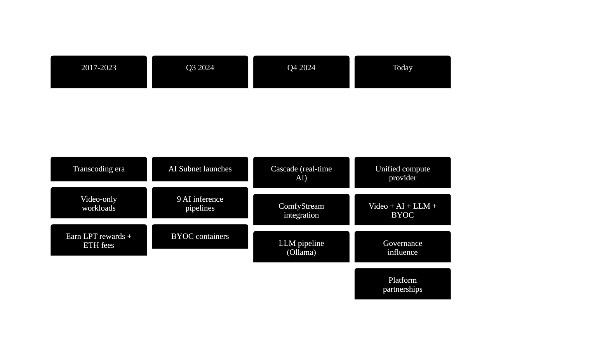

import { LinkArrow } from '/snippets/components/primitives/links.jsx'
import { Image } from '/snippets/components/primitives/image.jsx'
import { StyledTable, TableRow, TableCell } from '/snippets/components/layout/tables.jsx'
import { CustomDivider } from '/snippets/components/primitives/divider.jsx'
import { ScrollableDiagram } from '/snippets/components/content/zoomableDiagram.jsx'
import { CenteredContainer, BorderedBox } from '/snippets/components/layout/containers.jsx'

import OrchestratorRoleDiagram from './composable/orchestratorRole.mdx'

<CenteredContainer style={{ width: '90%' }}>
  <Tip>Anyone with a GPU can monetise their compute resources on the Livepeer Network - whether you want passive income in idle times, or you want to run a full-fledged infrastructure business.</Tip>
</CenteredContainer>

---

In the early days of Livepeer, orchestrators were solely responsible for transcoding video.

Today, the role has expanded dramatically. Orchestrators are both **general-purpose GPU compute providers** (transcoding, AI inference, real-time AI, LLM, BYOC) and **economic actors** that stake LPT, earn rewards, attract delegation, and vote in governance. This dual role makes them critical to Livepeer's vision as a unified compute layer for real-time AI workloads.

<OrchestratorRoleDiagram />
_Read more:_ <LinkArrow label="Orchestrator-Delegate Dual Role" href="https://github.com/shtukaresearch/livepeer-data-geography/blob/651a56e8c8290b30855f1393543ee9e0961c071c/roles/orchestrator-delegate.md" newline={false} />

<CustomDivider middleText="Four Roles" />

## Technical Role

An orchestrator is a **supply-side compute operator** that contributes GPU resources to the network. Gateways route jobs to your node; your node performs the work (transcoding, inference, generation) and returns results. You get compensated via probabilistic micropayment tickets (ETH) per job.

Core responsibilities:
- **Receive work** - accept jobs from gateways over HTTP
- **Execute compute** - run transcoding, AI inference, LLM generation, or BYOC containers on your GPU
- **Return results** - deliver processed output back to the gateway
- **Manage workers** - in split configurations, coordinate between the orchestrator controller and remote transcoder/AI runner nodes

See <LinkArrow href="/v2/orchestrators/concepts/capabilities" label="Capabilities" newline={false} /> for the full set of workloads orchestrators run.

---

## Economic Role

Orchestrators stake LPT to register on the network and earn protocol rewards. Your total stake (self-stake + delegated LPT) determines your position in the active set and your selection probability for jobs.

- **LPT protocol rewards** - mint new LPT every round (~24 hours) by calling `reward()`
- **ETH service fees** - earn per job from gateway payment tickets
- **Delegation economics** - configure reward cut and fee cut to attract delegators and share earnings

See <LinkArrow href="/v2/orchestrators/concepts/rcs-incentives" label="Incentives" newline={false} /> for the full economics breakdown.

---

## Governance Role

Orchestrators are not passive compute providers. They vote on **Livepeer Improvement Proposals (LIPs)** that change protocol parameters, add features, or allocate treasury funds. Your voting weight is proportional to your total stake - making high-stake orchestrators influential governance actors.

See <LinkArrow href="/v2/orchestrators/guides/delegates-voting-pools" label="Delegates and Voting" newline={false} /> for governance participation.

---

## Business Role

Orchestrators are key partners for developers building on Livepeer. By providing reliable, performant compute, you enable applications like <LinkArrow href="/v2/solutions/daydream" label="Daydream" newline={false} /> (real-time AI video), <LinkArrow href="/v2/solutions/embody" label="Embody" newline={false} /> (AI avatars), and streaming platforms to deliver their services.

Running an orchestrator and building relationships with gateway operators and application developers opens revenue streams beyond protocol rewards - direct partnerships, SLA-based pricing, and preferred orchestrator status.

<Image src="/snippets/assets/media/images/gpu-callout.png" alt="Livepeer Orchestrators Hero" />

<CustomDivider middleText="Mental Models" />

## Understanding orchestrators by analogy

<AccordionGroup>
  <Accordion title="From a Cloud Background?" icon="cloud">
    Running an orchestrator is like operating a **GPU compute fleet** behind a managed service. You provide the hardware and keep it running; the network (via gateways) handles job scheduling and customer relationships. Think AWS EC2 GPU instances, but instead of Amazon selling your compute, Livepeer's protocol matches you with demand automatically.

```mermaid
%%{init: {'theme': 'base', 'themeVariables': { 'primaryColor': '#1a1a1a', 'primaryTextColor': '#fff', 'primaryBorderColor': '#2d9a67', 'lineColor': '#2d9a67', 'secondaryColor': '#0d0d0d', 'tertiaryColor': '#1a1a1a', 'background': '#0d0d0d', 'fontFamily': 'system-ui' }}}%%
flowchart LR
    subgraph Demand["Demand Side"]
        A["Gateways<br/>(= Cloud control plane)"]
    end

    subgraph Supply["Your Orchestrator"]
        B["GPU Fleet<br/>(= EC2 GPU instances)<br/><br/>Transcoding<br/>AI Inference<br/>LLM<br/>BYOC"]
    end

    subgraph Protocol["Protocol Layer"]
        C["Livepeer Protocol<br/>(= AWS billing)<br/><br/>Staking<br/>Payments<br/>Discovery"]
    end

    A -->|Route jobs| B
    B -->|Return results| A
    B -->|Earn ETH fees| C
    C -->|LPT rewards| B

    classDef default fill:#1a1a1a,color:#fff,stroke:#2d9a67,stroke-width:2px
    style Demand fill:#0d0d0d,stroke:#2d9a67,stroke-width:1px
    style Supply fill:#0d0d0d,stroke:#2d9a67,stroke-width:1px
    style Protocol fill:#0d0d0d,stroke:#2d9a67,stroke-width:1px
```

    <ScrollableDiagram title="Orchestrator as Cloud GPU Fleet" maxHeight="400px">

    </ScrollableDiagram>
  </Accordion>
  <Accordion title="From an Ethereum Background?" icon="coin">
    An orchestrator is closest to a **validator** in a Proof-of-Stake network, but instead of validating transactions, you perform GPU compute. Like a validator, you stake tokens to participate, attract delegation to increase your weight, earn protocol rewards each epoch (round), and vote in governance.

    The key difference: validators earn from block production regardless of external demand. Orchestrators earn protocol rewards from staking *and* service fees from actual compute work - making revenue a function of both stake and performance.

```mermaid
%%{init: {'theme': 'base', 'themeVariables': { 'primaryColor': '#1a1a1a', 'primaryTextColor': '#fff', 'primaryBorderColor': '#2d9a67', 'lineColor': '#2d9a67', 'secondaryColor': '#0d0d0d', 'tertiaryColor': '#1a1a1a', 'background': '#0d0d0d', 'fontFamily': 'system-ui' }}}%%
flowchart LR
    subgraph Shared["Shared with PoS Validators"]
        S1["Stake tokens to participate"]
        S2["Attract delegation"]
        S3["Earn protocol rewards per round"]
        S4["Vote in governance"]
    end

    subgraph Unique["Unique to Orchestrators"]
        U1["Provide GPU compute"]
        U2["Earn ETH per job (service fees)"]
        U3["Run AI models + transcoding"]
        U4["Revenue scales with demand"]
    end

    classDef default fill:#1a1a1a,color:#fff,stroke:#2d9a67,stroke-width:2px
    style Shared fill:#0d0d0d,stroke:#2d9a67,stroke-width:1px
    style Unique fill:#0d0d0d,stroke:#a855f7,stroke-width:1px
```

    <ScrollableDiagram title="Orchestrator as PoS Validator" maxHeight="400px">

    </ScrollableDiagram>
  </Accordion>
  <Accordion title="Neither? Think of it as a contractor" icon="wrench">
    An orchestrator is like a **skilled contractor** who gets hired through a job marketplace. You bring the tools (GPUs), register your capabilities and rates, and jobs come to you through the platform (gateways). You get paid per job, build a reputation over time, and can vote on how the marketplace rules work.

    The better your equipment, the more reliable your work, and the more reputation (stake) you build, the more jobs you attract and the more you earn.

```mermaid
%%{init: {'theme': 'base', 'themeVariables': { 'primaryColor': '#1a1a1a', 'primaryTextColor': '#fff', 'primaryBorderColor': '#2d9a67', 'lineColor': '#2d9a67', 'secondaryColor': '#0d0d0d', 'tertiaryColor': '#1a1a1a', 'background': '#0d0d0d', 'fontFamily': 'system-ui' }}}%%
flowchart TB
    subgraph You["You (Orchestrator)"]
        Tools["Your GPUs = Your Tools"]
        Skills["Your Capabilities<br/>Transcoding, AI, LLM"]
        Rate["Your Price Per Job"]
    end

    subgraph Platform["The Platform (Livepeer)"]
        Register["Register + stake deposit"]
        Match["Job matching via gateways"]
        Pay["Payment per job (ETH)"]
        Rewards["Bonus rewards (LPT per round)"]
    end

    subgraph Reputation["Reputation = Stake"]
        Rep["More stake = more jobs<br/>Better performance = more delegation<br/>Delegation = more stake"]
    end

    You --> Register
    Match --> You
    You --> Pay
    Rewards --> You
    Pay --> Reputation
    Reputation --> Match

    classDef default fill:#1a1a1a,color:#fff,stroke:#2d9a67,stroke-width:2px
    style You fill:#0d0d0d,stroke:#2d9a67,stroke-width:1px
    style Platform fill:#0d0d0d,stroke:#2d9a67,stroke-width:1px
    style Reputation fill:#0d0d0d,stroke:#2d9a67,stroke-width:1px
```

    <ScrollableDiagram title="Orchestrator as Contractor" maxHeight="400px">

    </ScrollableDiagram>
  </Accordion>
</AccordionGroup>

<CustomDivider />

## Related Pages

<CardGroup cols={2}>
  <Card title="Orchestrator Capabilities" icon="gears" href="/v2/orchestrators/concepts/capabilities" arrow horizontal>
    Workload types, protocol responsibilities, and what orchestrators can run.
  </Card>
  <Card title="Orchestrator Architecture" icon="diagram-project" href="/v2/orchestrators/concepts/architecture" arrow horizontal>
    How orchestrators connect to gateways, GPUs, and the protocol layer.
  </Card>
  <Card title="Orchestrator Incentives" icon="coins" href="/v2/orchestrators/concepts/rcs-incentives" arrow horizontal>
    Revenue streams, cost structure, and the stake-for-access model.
  </Card>
  <Card title="Job Types" icon="cubes" href="/v2/orchestrators/concepts/rs-workloads" arrow horizontal>
    Detailed per-workload breakdown: hardware, pricing, configuration.
  </Card>
</CardGroup>
