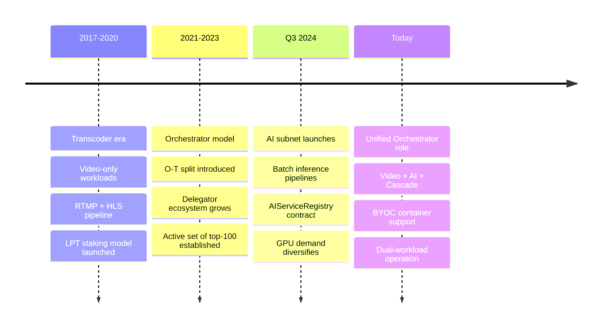
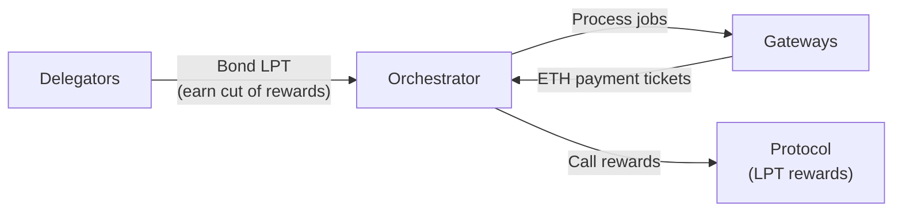

{/* TODO:
Verify:
- Mermaid diagrams use theme colours (but must be hardcoded - see snippets/components/page-structure/mermaidColours.jsx)
- Fontawesome icons are used on accordions and tabs
- Tables use StyledTable component
- No em-dashes are used (instead use standard -)
- UK spelling is used
- Headers are concise and technical (aim for max 3 words)
- CustomDivider uses approved margin patterns from the page-authoring skill
- Placeholders for Media and Video Resources are in comments with a TODO for a human.
- Fact-check flags are kept in JSX comments for a human.
Human
- Find Media
- Review fact-check items
*/}

import { LinkArrow } from '/snippets/components/primitives/links.jsx'
import { StyledTable, TableRow, TableCell } from '/snippets/components/layout/tables.jsx'
import { CustomDivider } from '/snippets/components/primitives/divider.jsx'
import { ScrollableDiagram } from '/snippets/components/content/zoomableDiagram.jsx'
import { CenteredContainer } from '/snippets/components/layout/containers.jsx'

<CenteredContainer maxWidth="960px">
  <AccordionGroup>
    <Accordion title="From a Cloud Background?" icon="cloud">
      Running an Orchestrator feels like operating a managed GPU service in a decentralised market.

      Livepeer Gateways select your node based on price, capability,
      and stake weight. You advertise what you can run and at what price; the network sends you jobs.

      <ScrollableDiagram title="Orchestrator as Managed GPU Node">

      ```mermaid
      flowchart LR
          subgraph Cloud["Cloud Analogy"]
              A["Cloud Provider<br/>• Allocates compute<br/>• Sets capacity<br/>• Charges per job"]
          end

          subgraph Livepeer["Livepeer Network"]
              B["Orchestrator Node<br/>• Advertises GPU capacity<br/>• Sets own price<br/>• Earns ETH per job"]
          end

          subgraph WorkSrc["Work Sources"]
              C["Gateways<br/>• Route jobs by price + capability<br/>• Pay per segment or pixel"]
          end

          WorkSrc -->|Job + payment ticket| Livepeer
          Livepeer -->|Result| WorkSrc

      ```

      </ScrollableDiagram>
    </Accordion>
    <Accordion title="From an Ethereum Background?" icon="coin">
      Running an Orchestrator is closer to being a validator on a proof-of-stake chain than to running a simple
      Ethereum node - but the work is compute instead of consensus.

      You stake LPT to signal commitment and earn the right to enter the **active set** (the top 100 eligible
      Orchestrators by total stake). From there, you earn ETH service fees for every job you process, plus LPT
      inflation rewards for calling rewards each round. Slash risk comes from performance failures and protocol behaviour.

      <ScrollableDiagram title="Orchestrator vs Ethereum Validator">

      ```mermaid
      flowchart LR
          subgraph ETH["Ethereum Validator"]
              A["Stake ETH<br/>→ Participate in consensus<br/>→ Earn block rewards"]
          end
          subgraph LP["Livepeer Orchestrator"]
              B["Stake LPT<br/>→ Enter active set<br/>→ Process compute jobs<br/>→ Earn ETH fees + LPT rewards"]
          end

      ```

      </ScrollableDiagram>
    </Accordion>
    <Accordion title="Neither? Here's the clearest mental model." icon="microchip">
      Think of an Orchestrator as a **GPU-for-hire on a decentralised marketplace**.

      You connect your GPU to the network, tell it what jobs you can run and at what price, and the network sends
      you work from applications that need video transcoded or AI models run. You earn ETH for each completed job
      and LPT rewards for participating in the protocol each round.

      <ScrollableDiagram title="Orchestrator as GPU Marketplace Node">

      ```mermaid
      flowchart LR
          subgraph You["You (Operator)"]
              A["GPU Hardware<br/>• Advertise capabilities<br/>• Set price<br/>• Stay online"]
          end
          subgraph Net["The Network"]
              B["Livepeer Protocol<br/>• Matches jobs to nodes<br/>• Processes payments<br/>• Distributes rewards"]
          end
          subgraph Earn["You Earn"]
              C["ETH fees (per job)<br/>+ LPT rewards (per round)"]
          end

          You -->|Stake LPT + register| Net
          Net -->|Jobs + ETH tickets| You
          You -->|Completed work| Net
          Net --> Earn

      ```

      </ScrollableDiagram>
    </Accordion>
  </AccordionGroup>
</CenteredContainer>

<CenteredContainer maxWidth="900px">



</CenteredContainer>

<CustomDivider middleText="Role Functions" />

## Technical Role

An Orchestrator is the **compute supply layer** of the Livepeer network. It accepts jobs from Gateways,
routes them to GPU workers, executes the work, and returns results. Orchestrators perform the actual
processing - transcoding video frames, running AI inference pipelines, executing BYOC containers.

Core responsibilities:

- **Job execution** - receive segments or inference requests from Gateways and route them to GPU workers
- **Capability advertisement** - broadcast supported pipelines, models, GPU types, and price per unit
- **Payment receipt** - collect probabilistic micropayment tickets per segment or pixel from Gateways
- **Reward calling** - trigger the protocol reward mechanism each round to claim LPT inflation rewards
- **Worker management** - coordinate transcoder workers (video) and AI runners (inference)

See <LinkArrow href="/v2/orchestrators/concepts/capabilities" label="Orchestrator Capabilities" newline={false} /> for the full set of workloads Orchestrators can execute.

<CustomDivider />

## Network Role

Orchestrators are the **supply side** of the Livepeer marketplace. Where Gateways aggregate application
demand, Orchestrators provide the GPU compute that fulfils it.

- **Active set participation** - only the top 100 Orchestrators by total bonded stake are eligible to receive
  work in any given round
- **Staking and security** - LPT staked to an Orchestrator signals economic commitment; Delegators extend
  this stake in exchange for a share of earnings
- **Governance** - Orchestrators participate in protocol governance via LPT voting weight
- **Capability discovery** - Orchestrators register capabilities and prices on-chain so Gateways can find them
  via the ServiceRegistry contract on Arbitrum



<Note>
Orchestrators interact with the **BondingManager**, **RoundsManager**, **TicketBroker**, and
**ServiceRegistry** contracts on Arbitrum. Gateways interact only with TicketBroker and ServiceRegistry.
This protocol depth is what distinguishes the Orchestrator role from the Gateway role.
</Note>

<CustomDivider />

## Deployment Types

Orchestrators run in five common configurations. Choose the setup that matches your hardware scale,
workload mix, and operating model.

<StyledTable variant="bordered">
  <thead>
    <TableRow header>
      <TableCell header>Setup type</TableCell>
      <TableCell header>What it means</TableCell>
      <TableCell header>Best for</TableCell>
    </TableRow>
  </thead>
  <tbody>
    <TableRow>
      <TableCell>**Solo operator**</TableCell>
      <TableCell>One Orchestrator process on one machine; handles both routing and GPU work</TableCell>
      <TableCell>Single GPU operators getting started</TableCell>
    </TableRow>
    <TableRow>
      <TableCell>**O-T split**</TableCell>
      <TableCell>Orchestrator and Transcoder run as separate processes, optionally on separate machines</TableCell>
      <TableCell>Multi-GPU operators optimising for throughput</TableCell>
    </TableRow>
    <TableRow>
      <TableCell>**Pool worker**</TableCell>
      <TableCell>GPU hardware registered under a pool Orchestrator; the pool handles staking and on-chain management</TableCell>
      <TableCell>Operators who want to earn without managing LPT staking</TableCell>
    </TableRow>
    <TableRow>
      <TableCell>**Pool operator**</TableCell>
      <TableCell>Operates the Orchestrator node; accepts registered workers who contribute GPUs under the pool's stake</TableCell>
      <TableCell>Operators building multi-node infrastructure businesses</TableCell>
    </TableRow>
    <TableRow>
      <TableCell>**Siphon setup**</TableCell>
      <TableCell>A lightweight Orchestrator that routes jobs to an upstream Orchestrator while maintaining a separate on-chain identity</TableCell>
      <TableCell>Advanced operators with existing infrastructure or managed services</TableCell>
    </TableRow>
  </tbody>
</StyledTable>

See the <LinkArrow href="/v2/orchestrators/navigator" label="Navigator" newline={false} /> to find the right setup path for your goals and hardware.

<CustomDivider />

## Who Should Operate One

Orchestrators are infrastructure operators, not application builders. The role requires sustained uptime,
GPU hardware investment, and protocol participation (LPT staking or pool membership).

<AccordionGroup>
  <Accordion title="The Miner - Can I earn from my GPU?" icon="microchip">
    Existing GPU operators can direct spare capacity at video transcoding or AI inference and earn ETH for the work.

    Start with the <LinkArrow href="/v2/orchestrators/concepts/incentive-model" label="Incentive Model" newline={false} /> to understand what earnings look like for your hardware tier.
  </Accordion>
  <Accordion title="The Easy Earner - Simplest path?" icon="bolt">
    Joining an existing pool is the fastest path when you want to participate without managing LPT staking or
    on-chain activation. Bring GPU hardware; the pool handles the rest.

    See <LinkArrow href="/v2/orchestrators/guides/deployment-details/join-a-pool" label="Join a Pool" newline={false} /> for options.
  </Accordion>
  <Accordion title="The Pro Operator - Adding AI to an existing setup?" icon="server">
    Operators who already run video transcoding can add AI inference workloads from the same node.
    New capabilities are advertised automatically once configured.

    See <LinkArrow href="/v2/orchestrators/concepts/capabilities" label="Orchestrator Capabilities" newline={false} /> for the workload overview.
  </Accordion>
  <Accordion title="The Business - Building at scale?" icon="building">
    Commercial Orchestrators serving application workloads (Daydream, Livepeer Studio, other products)
    operate differently from solo GPU miners. The incentives, pricing strategy, and operational
    requirements differ significantly.

    {/* TODO: Link to the commercial orchestrator page once it exists. */}
    See <LinkArrow href="/v2/orchestrators/concepts/incentive-model" label="Incentive Model" newline={false} /> for the revenue model breakdown.
  </Accordion>
</AccordionGroup>

<CustomDivider />

## Related Pages

<CardGroup cols={2}>
  <Card title="Orchestrator Capabilities" icon="gears" href="/v2/orchestrators/concepts/capabilities" arrow horizontal>
    Workload types, execution boundaries, and Gateway selection signals.
  </Card>
  <Card title="Orchestrator Architecture" icon="diagram-project" href="/v2/orchestrators/concepts/architecture" arrow horizontal>
    How Orchestrators connect to Gateways, the protocol layer, and GPU workers.
  </Card>
  <Card title="Incentive Model" icon="coins" href="/v2/orchestrators/concepts/incentive-model" arrow horizontal>
    Revenue streams, cost structure, and why operating an Orchestrator earns.
  </Card>
  <Card title="Navigator" icon="compass" href="/v2/orchestrators/navigator" arrow horizontal>
    Find the right setup path for your hardware, goals, and experience level.
  </Card>
</CardGroup>
