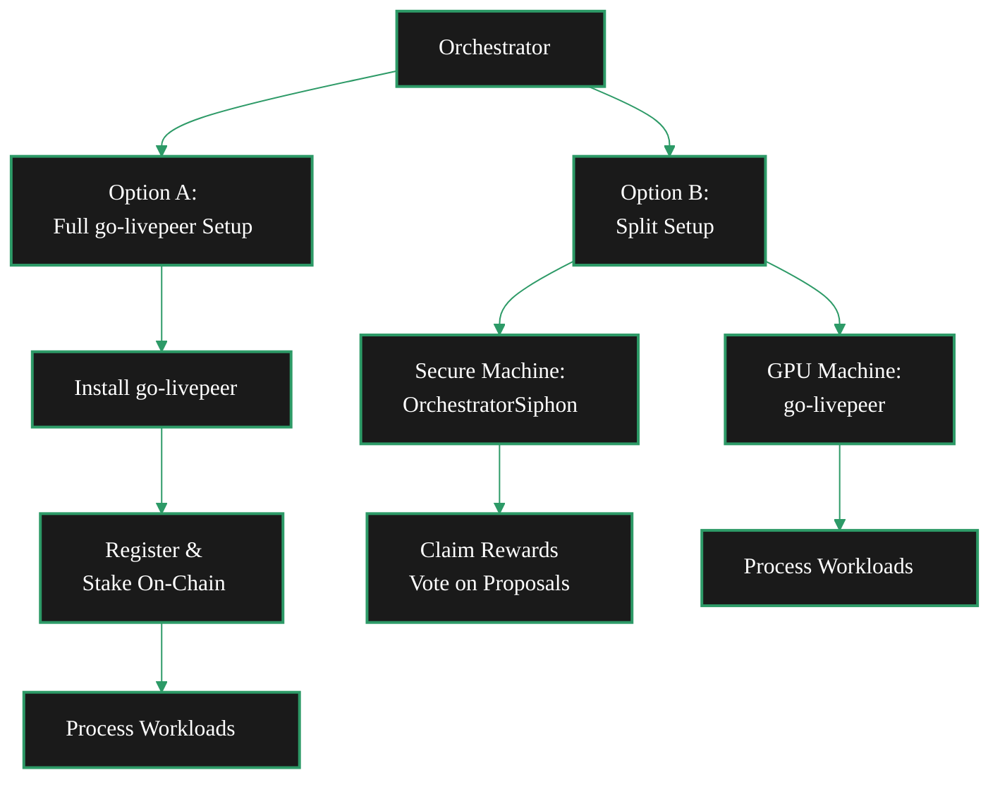

{/* The persona-routing layer for this section.

Answers the question: who are you, and what are you trying to do?

Decision Tree

A self-identification tool that helps readers choose the path that best matches their goals, resources, and experience level.

Journey Paths

Suggested reading and setup routes based on user type and intended outcome.

Who This Section Is For

A clear statement of the audience segments this section is designed to support. */}

---

{/* Decision Tree

1. Should you run an orchestrator?
    - Pool vs Solo
    - Setup planning (just set up an orchestrator - no workloads or delegates)
    - Workload planning (video vs ai)
    - 

---  */}

# Orchestrator Navigator: Find Your Path
Running an orchestrator is a commitment. It requires technical know-how, time investment, and financial resources. Use this navigator to determine if running an orchestrator is the right path for you, and if so, which setup best matches your goals and experience level.

This section helps you determine if running an orchestrator is the right path for you, and if so, which setup best matches your goals and experience level.

## Orchestrator Requirements
Requirements include technical expertise, time commitment, and financial resources. Consider your comfort with server management, willingness to troubleshoot issues, and ability to invest in hardware and stake.

**RESOURCES:**
    - See [Setup Checklist](/v2/orchestrators/setup/rcs-requirements) for hardware, network, and operational requirements.
    - See [Setup Guide](/v2/orchestrators/setup/guide) for the current install, connect, and activation path.
    - See [Feasibility](/v2/orchestrators/operations/p-feasibility) for capacity, competitiveness, and viability framing.

## Economic Feasibility
**ECONOMICALLY:**
    - See [Feasibility](/v2/orchestrators/operations/p-feasibility) for a comprehensive look at viability, competitiveness, and operator tradeoffs.
    - See [Orchestrator Earnings Explained](/v2/orchestrators/operations/earnings) for the current breakdown of rewards, fees, and revenue drivers.

## Operator Path Options
Anyone with a GPU can monetise their compute resources on the Livepeer Network, whether you want to add your GPU to the network for passive income in idle times, or you want to run a full-fledged business.

If you're a hobbyist, the best place to start is by contributing your GPU to an Orchestrator pool.
If you're a data center or want to have full control over your node, you can setup your own Orchestrator node.

<Tip> If you're a data centre or enterprise provider, please get in touch with us directly! </Tip>
{/* If you're from the web3 space, this is roughly similar to running a full chain node on your own infrastructure or simply using an RPC provider who manages that for you.

If you're from a devOps or cloud background, this is similar to either running your own bare metal infrastructure or using a managed service. */}

<Columns cols={2}>
  <Card
    title="Add your consumer GPU to a pool"
    icon="swimming-pool"
    href="/v2/orchestrators/guides/join-a-pool"
    arrow
  >
 See how to add your GPU to an Orchestrator pool.   Best for hobbyists or those with limited technical expertise.
    <Badge color="green" icon="wand-magic-sparkles">
 Quick Setup
    </Badge>
  </Card>
  <Card
    title="Run your own Orchestrator node"
    icon="microchip"
    href="/v2/orchestrators/setup/guide"
    arrow
  >
 See how to run your own Orchestrator GPU node on the Livepeer Network.   Best for data centers or those who want full control over their node.
    <Badge color="green" icon="wand-magic-sparkles">
 Advanced Setup
    </Badge>
  </Card>
</Columns>

## Orchestrator Setup Paths
If you have the resources and expertise to run your own orchestrator node, you can choose between

#### Requirements

#### Setup Options

#### Workload Types

## Advanced Operation Paths
#### Workloads & AI-Pipelines

#### Delegates & Governance Participation

#### 

---
{/* OLD CONTENT */}
## Pick Your Setup

<Columns cols={2}>
  <Card
    title="Full go-livepeer Setup"
    icon="microchip"
    href="#option-a-full-go-livepeer-setup"
    arrow
  >
    Run the full go-livepeer binary on one machine - register on-chain, stake
    LPT, and process workloads directly.
  </Card>
  <Card
    title="Split Setup (Siphon + go-livepeer)"
    icon="shield-check"
    href="#option-b-split-setup-orchestratorsiphon--go-livepeer"
    arrow
  >
    Separate rewards and keystore management from workload processing across two
    machines. Avoid missing rewards.
  </Card>
</Columns>

---

---

## Option A: Full go-livepeer Setup

The standard path runs the full go-livepeer binary, registers on-chain, and actively processes workloads. Everything runs on one machine. This is the path for operators who want a straightforward, all-in-one orchestrator.

<Steps>
  <Step title="Install go-livepeer" icon="download">
 Build from source or download a release binary. The go-livepeer CLI includes everything needed to run as an orchestrator - no additional tooling required.

    <Card title="go-livepeer Repository" icon="github" href="https://github.com/livepeer/go-livepeer" arrow horizontal>

Source code, releases, and build instructions.

</Card>

  </Step>
  <Step title="Register and activate on-chain" icon="link">
 Use the go-livepeer CLI to register as an orchestrator on the Livepeer protocol. You'll need to stake LPT and activate your node on the Arbitrum L2.

    <Card title="go-livepeer Technical Docs" icon="book-open" href="https://github.com/livepeer/go-livepeer/tree/master/doc" arrow horizontal>

Docs for networking, GPU setup, payments, and Ethereum/Arbitrum configuration.

</Card>

  </Step>
  <Step title="Configure your GPU and start processing" icon="microchip">
 Set up your GPU configuration and start your orchestrator. Once active, your node receives workloads from gateways and processes them.
  </Step>
</Steps>

---

## Option B: Split Setup (OrchestratorSiphon + go-livepeer)

The split setup separates two concerns across different machines:

- **Secure machine** - runs **OrchestratorSiphon**, a lightweight Python toolkit that manages your orchestrator keystore. Handles on-chain actions like claiming rewards, voting on proposals, and updating your service URI. Your keystore stays on one secure, isolated machine.
- **GPU machine** - runs **go-livepeer** to actively process workloads. No keystore needed on this box.

This avoids a common problem: missing rewards because your orchestrator node was busy processing workloads or went down temporarily. With the split setup, rewards claiming runs independently on its own machine.

<Columns cols={2}>
  <Card
    title="OrchestratorSiphon"
    icon="github"
    href="https://github.com/Stronk-Tech/OrchestratorSiphon"
    arrow
  >
    Lightweight keystore management - claim rewards, vote on proposals, update
    service URI. Runs on your secure machine.
  </Card>
  <Card
    title="go-livepeer"
    icon="github"
    href="https://github.com/livepeer/go-livepeer"
    arrow
  >
    Deploy on your GPU machine for active workload processing. Point your
    service URI to this box.
  </Card>
</Columns>

<Tip>
  You can start with OrchestratorSiphon alone as a passive orchestrator to earn
  rewards while you set up your GPU infrastructure. When you're ready to process
  workloads, deploy go-livepeer on a separate machine and update your service
  URI to point to it.
</Tip>

---

## Not sure which setup?

If you're new to Livepeer and just want to contribute a GPU without running a full orchestrator, consider [joining an existing pool](/v2/orchestrators/guides/join-a-pool) instead. The [Orchestrator Quickstart](/v2/orchestrators/quickstart/guide) has a decision tree to help you choose.
