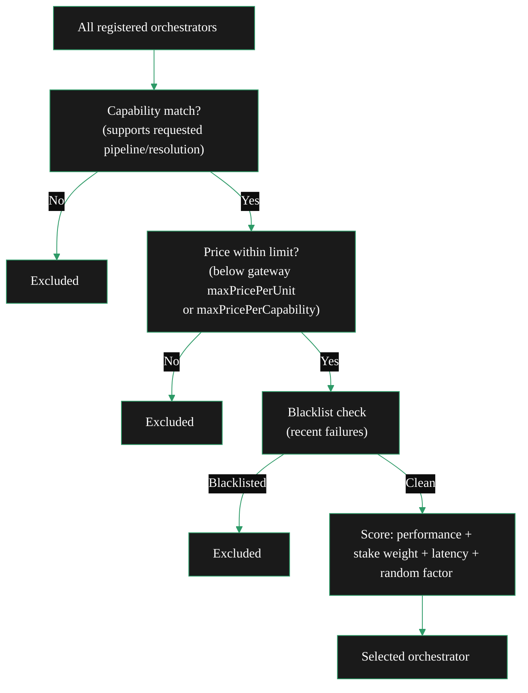
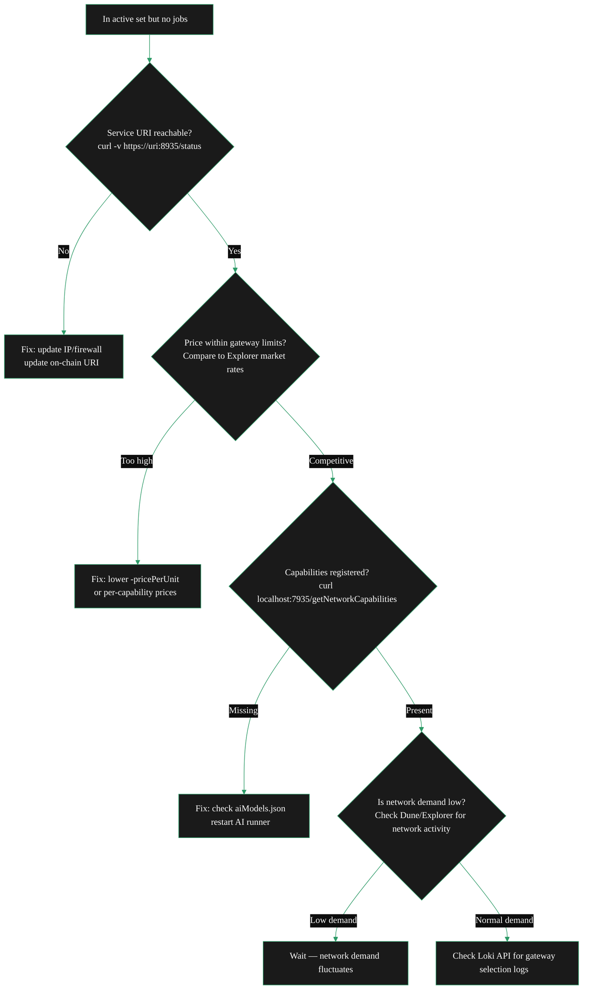

{/* Draft note: keep this page focused on gateway discovery and selection from the orchestrator side, route unresolved fact checks to internal comments only, and keep operational actions concrete. */}

import { StyledTable, TableRow, TableCell } from '/snippets/components/layout/tables.jsx'
import { CustomDivider } from '/snippets/components/primitives/divider.jsx'

Gateways decide where work goes. Your node receives jobs only when it is discoverable, supports the requested workload, and fits the gateway budget. Understanding that pipeline is what separates operators who receive steady work from those who are technically online but still idle.

<CustomDivider />

## How gateways find you

There are four mechanisms by which a gateway builds its list of orchestrators to consider:

<CardGroup cols={2}>

<Card title="On-chain discovery" icon="link">
  The gateway queries the Livepeer subgraph on Arbitrum for all registered, active orchestrators. Your on-chain registration — service URI, stake, cuts — makes you visible here automatically once you are in the active set.
</Card>

<Card title="Direct configuration" icon="server">
  Gateway operators can configure specific orchestrators directly with `-orchAddr`. This bypasses the discovery process entirely. Private pools and enterprise setups often use direct configuration.
</Card>

<Card title="Webhook discovery" icon="webhook">
  Dynamic discovery via an external service: `-orchWebhookUrl=https://discovery.example.com/orchestrators`. The gateway calls this URL to get a list of eligible orchestrators, enabling custom filtering or whitelisting without on-chain registration.
</Card>

<Card title="Network Capabilities API" icon="broadcast-tower">
  The gateway calls `GET /getNetworkCapabilities` to query what capabilities and models are available across the network. This is primarily used for AI workload routing.
</Card>

</CardGroup>

**What this means for you:** For standard video transcoding, being registered on-chain and in the top 100 active orchestrators is sufficient for discovery. For AI workloads, capability advertisement through your `aiModels.json` configuration is what makes you discoverable for specific pipelines.

<CustomDivider />

## What you advertise to gateways

Every time a gateway queries you, your node responds with an `OrchestratorInfo` message containing your full offering:

```protobuf icon="terminal" title="Example OrchestratorInfo fields"
message OrchestratorInfo {
    string transcoder = 1;           // Your service URI
    TicketParams ticket_params = 2;   // Payment parameters
    PriceInfo price_info = 3;         // Your price per pixel
    bytes address = 4;               // Your ETH address
    Capabilities capabilities = 5;    // Transcoding profiles + AI pipelines
    AuthToken auth_token = 6;         // Session auth
    repeated HardwareInformation hardware = 7;  // GPU specs
    repeated PriceInfo capabilities_prices = 33; // Per-pipeline AI prices
}
```

The `capabilities` field declares what transcoding profiles and output formats you support. The `capabilities_prices` field contains your per-pipeline AI pricing. Both are built automatically from your go-livepeer configuration and `aiModels.json`.

<CustomDivider />

## How gateways select you

Discovery gives a gateway a list of candidates. Selection narrows that list to one (or a few) nodes that actually receive a given job. The selection algorithm is multi-factor:



**The five selection factors:**

<StyledTable variant="bordered">
  <TableRow header>
    <TableCell header>Factor</TableCell>
    <TableCell header>How it works</TableCell>
    <TableCell header>What you control</TableCell>
  </TableRow>
  <TableRow>
    <TableCell>**Capability matching**</TableCell>
    <TableCell>Does your node support the requested pipeline, resolution, or AI model?</TableCell>
    <TableCell>`aiModels.json`, transcoding profiles</TableCell>
  </TableRow>
  <TableRow>
    <TableCell>**Price constraints**</TableCell>
    <TableCell>Your price must be at or below the gateway's configured maximum</TableCell>
    <TableCell>`-pricePerUnit` for transcoding; per-capability pricing for AI</TableCell>
  </TableRow>
  <TableRow>
    <TableCell>**Performance score**</TableCell>
    <TableCell>Historical success rate, latency, and failure rate tracked per orchestrator</TableCell>
    <TableCell>Uptime, hardware quality, network speed</TableCell>
  </TableRow>
  <TableRow>
    <TableCell>**Stake weight**</TableCell>
    <TableCell>For video transcoding, higher stake increases selection probability (configured via gateway `-selectStakeWeight`)</TableCell>
    <TableCell>Total stake (self + delegated)</TableCell>
  </TableRow>
  <TableRow>
    <TableCell>**Random factor**</TableCell>
    <TableCell>Gateways introduce randomness (`-selectRandFreq`) to prevent centralisation</TableCell>
    <TableCell>Not directly controllable</TableCell>
  </TableRow>
</StyledTable>

**Practical implication for AI jobs:** Capability match and price dominate AI routing. Your stake is less important than for video transcoding. If you want AI jobs, ensure your pipeline is registered, your warm model is loaded, and your price is within market range.

**Practical implication for video jobs:** Price and performance score are the primary drivers after entering the active set. A competitive price and high success rate will consistently outperform a lower-ranked orchestrator with a high price.

<CustomDivider />

## What you can control to get more work

<AccordionGroup>

<Accordion  title="1. Price competitively" icon="circle-question">
Pricing is binary before it is graduated: if your price exceeds the gateway's maximum, you receive zero work from that gateway. After clearing the ceiling, lower prices increase your attractiveness.

Check current market rates:
- Compare your `-pricePerUnit` to other active orchestrators on [Livepeer Explorer](https://explorer.livepeer.org/orchestrators)
- For AI, check [tools.livepeer.cloud](https://tools.livepeer.cloud) to see per-pipeline pricing from other operators

The gateway-side flags that affect your eligibility: `-maxPricePerUnit` for transcoding and `-maxPricePerCapability` (a JSON structure) for AI pipelines. You cannot see what individual gateways have set these to — but you can infer from the market.

See [Pricing Strategy](/v2/orchestrators/guides/config-and-optimisation/pricing-strategy) for how to adjust your prices.
</Accordion>

<Accordion  title="2. Keep your service URI correct and reachable" icon="circle-question">
If gateways cannot connect to your service URI, you receive no work — even if you are in the active set, even if your price is competitive.

**Test reachability:**
```bash icon="terminal" title="Test service URI reachability"
# From a machine outside your network
curl -v https://<your-service-uri>:8935/status
```

Common causes of unreachability: IP changed without on-chain update, firewall change blocking port 8935, certificate issue on TLS endpoint, NAT not forwarding correctly.

Update your on-chain service URI via `livepeer_cli` if your IP or hostname has changed.
</Accordion>

<Accordion  title="3. Register your AI capabilities correctly" icon="microchip">
For AI jobs, capability registration is the prerequisite. Your pipelines and warm models must be visible to the network.

**Verify:**
```bash icon="terminal" title="Check registered capabilities"
curl http://localhost:7935/getNetworkCapabilities | jq
```

Also check externally:
- [tools.livepeer.cloud/ai/network-capabilities](https://tools.livepeer.cloud/ai/network-capabilities) shows all AI-capable orchestrators visible to the network and which models are warm

If your pipeline is missing from both, check your `aiModels.json` and confirm the AI runner container started successfully.
</Accordion>

<Accordion  title="4. Maintain high performance scores" icon="microchip">
Performance scoring is based on your historical success rate and latency. Missed segments, slow responses, and OOM failures all decrease your score and reduce your selection probability.

What drives good performance: stable hardware, sufficient VRAM, fast network, and consistent uptime. A node that fails 5% of its segments will eventually score lower than a node with identical pricing but near-zero failures.
</Accordion>

<Accordion  title="5. Build stake for video transcoding" icon="video">
For video transcoding, selection probability is weighted by total stake. Being in the top 10 by stake vs top 50 means meaningfully more job volume from stake-weighted gateways.

For AI workloads, stake is less decisive. Capability and price are the primary routing criteria.
</Accordion>

</AccordionGroup>

<CustomDivider />

## Gateway Loki API — understanding selection decisions

The Livepeer Foundation operates a public Loki instance that exposes gateway logs. This API lets you see what is happening inside gateway nodes — including why specific orchestrators were or were not selected.

**Base URL:** `https://loki.livepeer.report`

```bash icon="terminal" title="Query gateway Loki logs"
# All gateway logs from all regions
curl -G -s https://loki.livepeer.report/loki/api/v1/query \
     --data-urlencode "query={region=~\".+\"}" | jq

# Logs from a specific region (e.g. NYC)
curl -G -s https://loki.livepeer.report/loki/api/v1/query \
     --data-urlencode "query={region=~\"nyc\"}" | jq

# Logs related to your specific orchestrator IP
curl -G -s https://loki.livepeer.report/loki/api/v1/query \
     --data-urlencode "query={region=~\".+\"} |= \"clientIP=<YOUR_IP>\"" | jq

# Logs between two timestamps (UNIX epoch in nanoseconds)
curl -G -s https://loki.livepeer.report/loki/api/v1/query_range \
     --data-urlencode "query={region=~\".+\"}" \
     --data 'start=1727335380000000000' \
     --data 'end=1727635380000000000' | jq

# List all available gateway regions
curl -G -s https://loki.livepeer.report/loki/api/v1/label/region/values | jq '.data'
```

**What to look for:**
- Selection events including or excluding your orchestrator address
- Price rejection messages (your price exceeding the gateway maximum)
- Capability mismatch messages (requested pipeline not found in your offerings)
- Connection failures (gateway could not reach your service URI)

The API uses [Grafana Loki query syntax](https://grafana.com/docs/loki/latest/query/). You can pipe output to `jq` for readable formatting.

{/* FACT CHECK: Verify loki.livepeer.report is still live and returning data. The endpoint returned no response during March 2026 sandbox verification and may have been blocked by the test environment. Rick to confirm current availability before publication. */}

<CustomDivider />

## Debugging missing jobs

Use this checklist when you are in the active set and job flow stays at zero:



<CustomDivider />

<CardGroup cols={2}>
  <Card title="Configure Pricing" icon="tag" href="/v2/orchestrators/setup/configure">
    Setting pricePerUnit and per-capability AI pricing to be competitive.
  </Card>
  <Card title="AI Configuration" icon="robot" href="/v2/orchestrators/guides/ai-and-job-workloads/ai-inference-operations">
    Setting up aiModels.json and capability registration.
  </Card>
  <Card title="Troubleshooting" icon="triangle-exclamation" href="/v2/orchestrators/guides/monitoring-and-tooling/troubleshooting">
    Full error reference including service URI and capability issues.
  </Card>
  <Card title="Orchestrator Tools" icon="toolbox" href="/v2/orchestrators/guides/monitoring-and-tooling/operator-toolbox">
    Explorer, Prometheus, and Loki tools for understanding network state.
  </Card>
</CardGroup>

{/* Draft note: keep cross-references focused on pricing, AI capability registration, and gateway-side selection detail. */}
