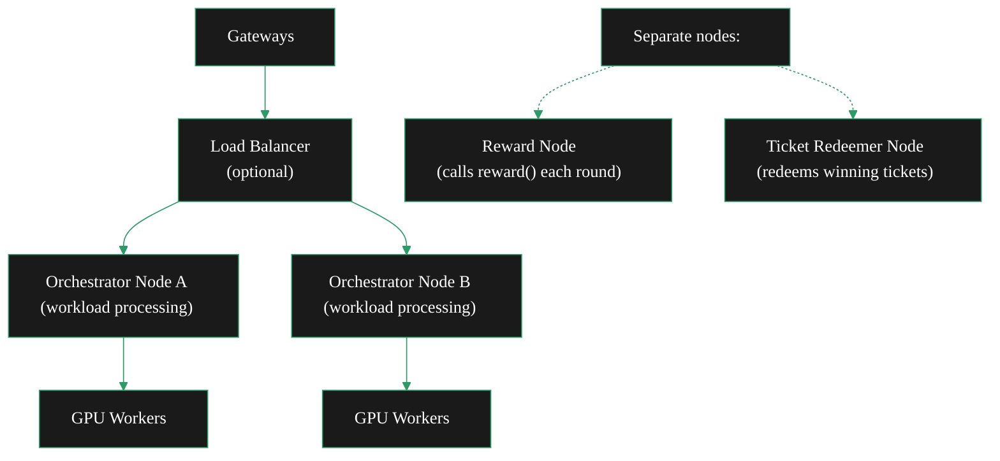

Running a single orchestrator node works up to the point where your GPU capacity exceeds what one machine can provide, or where you need regional distribution, failure isolation, or independent scaling of different node functions. At that point, you are running a fleet.

This page covers the architectural options for multi-node Livepeer deployments, the operational patterns that differ from single-node operation, and where to go for enterprise-scale onboarding.

---

## When you need fleet operations

Single-node operation is appropriate for most orchestrators. You are likely in fleet territory if:

- Your workload requires more GPU capacity than fits in one machine
- You need geographic distribution for latency-sensitive AI workloads
- You want to separate concerns — one node for reward calling, one for ticket redemption, separate GPU workers
- You are operating at data-centre scale with SLA commitments to gateway operators

If you are not clearly in one of these situations, start with a single node. Fleet architecture adds operational complexity and the marginal performance gains are only worth it at scale.

---

## Multi-orchestrator architecture

go-livepeer supports running multiple orchestrator nodes behind a single on-chain identity. This is documented in `doc/multi-o.md` in the go-livepeer repository.

The key insight: **each orchestrator node has its own keypair and accepts payments on behalf of the same on-chain registered Ethereum address.** Node separation allows you to assign specific functions to specific nodes:



**Separation patterns:**

| Node role | What it does | Why separate it |
|---|---|---|
| Workload nodes | Process transcoding and AI inference jobs | Scale horizontally; restart without affecting rewards |
| Reward node | Calls `reward()` each round | Reward safety — dedicated stable machine, not affected by workload disruption |
| Redeemer node | Redeems winning payment tickets | High-volume ticket processing on dedicated hardware |

This pattern is architecturally similar to the [Siphon split setup](/v2/orchestrators/guides/setup-paths/siphon-setup) — the principle of separating reward calling from workload processing is the same, but implemented entirely within go-livepeer rather than using OrchestratorSiphon.

<Card title="doc/multi-o.md — go-livepeer" icon="github" href="https://github.com/livepeer/go-livepeer/blob/master/doc/multi-o.md">
  The canonical multi-orchestrator architecture documentation in the go-livepeer repository.
</Card>

---

## Scaling GPU workers

Whether you are running a single orchestrator or a fleet, GPU workers scale horizontally. Each worker connects to an orchestrator with `-orchSecret` and the orchestrator distributes segments across all connected workers.

**Adding capacity:**

1. Provision a new machine with NVIDIA GPU and drivers
2. Install go-livepeer
3. Start in transcoder mode:
   ```bash
   livepeer \
     -transcoder \
     -orchAddr <orchestrator-host>:8935 \
     -orchSecret <shared-secret> \
     -nvidia 0,1,2 \
     -maxSessions 10
   ```
4. The orchestrator immediately begins routing to the new worker — no configuration change on the orchestrator required

Orchestrator logs confirm each new connection:
```
Got a RegisterTranscoder request from transcoder=10.3.27.5 capacity=10
```

---

## Capacity management at fleet scale

Each worker advertises its capacity (the `-maxSessions` value). The orchestrator tracks capacity across all connected workers and routes jobs accordingly. There is no manual load balancing step — go-livepeer handles distribution internally.

**What to monitor fleet-wide:**

| Metric | What it reveals |
|---|---|
| Sessions per worker | Whether load is balanced or some workers are always idle |
| Workers at max sessions | Your fleet is at capacity — add workers or increase per-worker `maxSessions` |
| Worker disconnections | Hardware issues, network instability, or software crashes |
| Segment failure rate per worker | A single problematic worker pulling down fleet-wide success rate |

For Prometheus fleet monitoring, run the [livepeer/livepeer-monitoring](https://github.com/livepeer/livepeer-monitoring) Docker image configured with all worker node addresses:

```bash
docker run --net=host \
  --env LP_MODE=standalone \
  --env LP_NODES=worker1:7935,worker2:7935,worker3:7935,orch:7935 \
  livepeer/monitoring:latest
```

---

## Rolling updates

Updating a single-node orchestrator drops all in-flight sessions. At fleet scale, you can do rolling updates to minimise disruption:

**Basic rolling update procedure:**

1. **Remove one node from the rotation.** Update the load balancer or `-orchAddr` configs to stop routing to the node being updated. Wait for in-flight sessions to complete (typically a few minutes).
2. **Update the node.** Pull the new go-livepeer binary and restart the service.
3. **Verify the updated node.** Confirm it connects and is receiving sessions before proceeding.
4. **Repeat for remaining nodes.**

This requires at least two workload nodes to maintain service continuity during updates. With a single orchestrator, updates are always disruptive.

<Note>
  Workers reconnect automatically when an orchestrator restarts. From a worker's perspective, the orchestrator briefly disappears and then reappears. No manual action is needed on the worker side.
</Note>

---

## Network and key management at scale

Fleet operations introduce key management complexity that does not exist on single-node deployments.

**Key considerations:**

- Each orchestrator node needs access to the same Ethereum keystore to accept payments on behalf of your on-chain address. Distribute the keystore file carefully — only over encrypted channels, with restricted file permissions on each machine.
- For reward calling, you want exactly **one** node calling `reward()` per round. Running reward calling on multiple nodes risks duplicate submissions and wasted gas. Designate a single node for reward calling and set `-reward=false` on all others.
- For ticket redemption, the Redeemer can be run as a separate process. See `doc/redeemer.md` in the go-livepeer repository.
- Static IPs or stable DNS names are essential at fleet scale — your service URI is stored on-chain and must resolve consistently.

---

## Enterprise and data-centre onboarding

If you are operating at data-centre scale, multiple co-location sites, or with commercial-grade SLA requirements, the Livepeer Foundation offers direct engagement support.

<Card title="Contact Livepeer Foundation" icon="building" href="https://livepeer.org/contact">
  For enterprise and data-centre operators. Direct support for fleet integration, custom gateway relationships, and commercial partnership discussions.
</Card>

The SPE (Special Purpose Entity) programme is the primary pathway for professional GPU operators who want a structured relationship with the network. Current SPEs include Titan Node (video mining) and MuxionLabs (formerly known as the AI SPE). See the Livepeer Forum and Discord for active SPE discussions.

---

<CardGroup cols={2}>
  <Card title="Run a Pool" icon="server" href="/v2/orchestrators/advanced/run-a-pool">
    Pool operations — accepting worker connections and managing off-chain payouts.
  </Card>
  <Card title="Split O-T Setup" icon="plug" href="/v2/orchestrators/advanced/split-o-t">
    The foundational split between orchestrator and transcoder processes.
  </Card>
  <Card title="Siphon Setup" icon="shield-check" href="/v2/orchestrators/guides/setup-paths/siphon-setup">
    The reward-safe split setup using OrchestratorSiphon.
  </Card>
  <Card title="Metrics and Monitoring" icon="gauge" href="/v2/orchestrators/guides/monitoring/metrics">
    Scaling Prometheus monitoring to a multi-node fleet.
  </Card>
</CardGroup>
