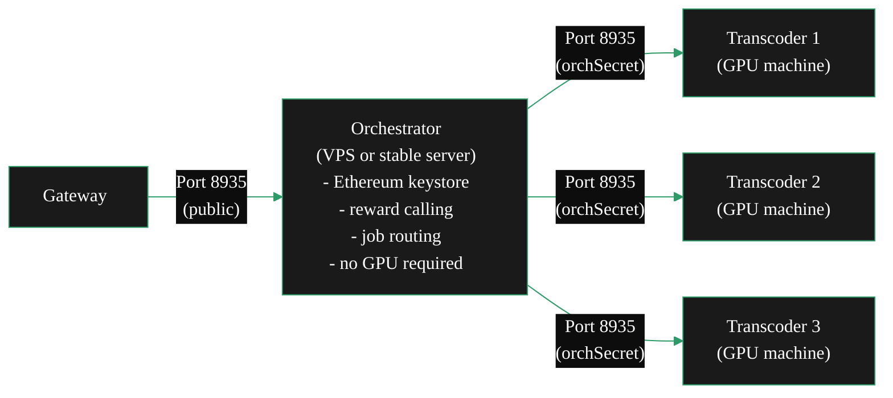

By default, go-livepeer runs the orchestrator and transcoder as a single combined process on one machine. The split setup separates them: one machine handles the protocol (on-chain interactions, job routing, reward calling) and one or more machines handle the GPU work. The two connect over the network using a shared secret.

This is the architectural foundation for [running a pool](/v2/orchestrators/advanced/run-a-pool) — a pool is simply the split setup extended to accept connections from external workers.

---

## Why split?

<CardGroup cols={2}>

<Card title="Security isolation" icon="shield-halved">
  Your Ethereum keystore and private key live only on the orchestrator machine. GPU worker machines have no access to your wallet. A compromised worker cannot drain your funds or perform on-chain actions.
</Card>

<Card title="Independent scaling" icon="server">
  Add or remove transcoder machines without touching the orchestrator. Scale GPU capacity horizontally by connecting more transcoder nodes — each advertises its own capacity to the orchestrator.
</Card>

<Card title="Stable reward calling" icon="clock">
  The orchestrator machine can be a small, stable VPS with no GPU requirement. Reward calls are made from this stable machine, independent of the availability of your GPU workload machines.
</Card>

<Card title="Better hardware utilisation" icon="microchip">
  Run a high-spec orchestrator node (fast CPU, good networking, reliable uptime) separately from your GPU transcoders. Optimise each machine for its specific role.
</Card>

</CardGroup>

---

## Architecture overview



**Data flow:**
1. A gateway connects to your orchestrator on port 8935 (your public service URI)
2. The orchestrator receives the job and dispatches it to an available connected transcoder via gRPC
3. The transcoder processes the segment and returns results to the orchestrator
4. The orchestrator returns results to the gateway

The gateway and delegators see only the orchestrator. Transcoders are not visible to the protocol.

---

## Part 1 — Run a standalone orchestrator

The orchestrator machine needs: a publicly accessible IP or hostname, an Ethereum keystore, and outbound access to your Arbitrum RPC endpoint. It does not need a GPU.

```bash
livepeer \
  -network arbitrum-one-mainnet \
  -ethUrl <ARBITRUM_RPC_URL> \
  -ethAcctAddr <YOUR_ETH_ADDRESS> \
  -orchestrator \
  -orchSecret <ORCH_SECRET> \
  -serviceAddr <YOUR_PUBLIC_HOST>:8935 \
  -pricePerUnit <PRICE_PER_UNIT>
```

**Key flags for the orchestrator-only process:**

| Flag | Description |
|---|---|
| `-orchestrator` | Runs as an orchestrator (handles gateway connections and job routing) |
| `-orchSecret` | Shared secret that transcoders use to authenticate connections. Can be plaintext or a file path: `-orchSecret /path/to/secret.txt` |
| `-serviceAddr` | Your public hostname or IP and port — must match your on-chain service URI. Example: `orch.yourdomain.com:8935` |
| `-pricePerUnit` | Your price for transcoding, in wei per pixel |

**Notice what is absent:** there is no `-transcoder` flag. Without it, go-livepeer runs in standalone orchestrator mode — it routes jobs to connected transcoders but does no local transcoding. It will refuse job assignments until at least one transcoder connects.

<Note>
  The `-orchSecret` can be passed as a plaintext value or as a path to a file containing the secret. File-based secrets are recommended for production: they are not exposed in your process list (visible via `ps aux`) and can be managed with restricted file permissions.

  ```bash
  echo "my-secret-value" > /etc/livepeer/orchsecret.txt
  chmod 600 /etc/livepeer/orchsecret.txt
  # then pass: -orchSecret /etc/livepeer/orchsecret.txt
  ```
</Note>

---

## Part 2 — Run a standalone transcoder

Each transcoder machine needs: an NVIDIA GPU with drivers installed, and network connectivity to the orchestrator on port 8935. It does not need an Ethereum account, LPT stake, or RPC endpoint.

```bash
livepeer \
  -transcoder \
  -nvidia <GPU_IDs> \
  -orchSecret <ORCH_SECRET> \
  -orchAddr <ORCHESTRATOR_HOST>:8935 \
  -maxSessions <MAX_SESSIONS>
```

**Key flags for the transcoder-only process:**

| Flag | Description | Example |
|---|---|---|
| `-transcoder` | Runs as a transcoder only — no on-chain interactions, no job routing |  |
| `-nvidia` | Comma-separated GPU device IDs. Use `nvidia-smi -L` to list devices. | `0,1,2` or `all` |
| `-orchSecret` | Must match the secret configured on the orchestrator | |
| `-orchAddr` | The orchestrator's public address and port | `orch.yourdomain.com:8935` |
| `-maxSessions` | Maximum concurrent transcoding jobs this transcoder will accept | `10` |

**What happens at startup:**

On startup, the transcoder automatically runs a test encode to verify GPU access. If this test fails (typically because of a NVENC session cap being hit, or a CUDA configuration issue), the process exits immediately.

If it passes, you will see this in the transcoder logs:

```
Registering transcoder to orch.yourdomain.com:8935
```

And this in the orchestrator logs:

```
Got a RegisterTranscoder request from transcoder=10.3.27.1 capacity=10
```

The `capacity` field is the transcoder's `-maxSessions` value. Once you see this line, the orchestrator will begin routing jobs to the connected transcoder.

---

## Connecting multiple transcoders

Any number of transcoders can connect to a single orchestrator using the same `-orchSecret`. There is no limit imposed by go-livepeer — you are constrained only by your orchestrator machine's network capacity and the total workload routed to you.

Each transcoder that connects appears in the orchestrator logs:

```
Got a RegisterTranscoder request from transcoder=10.3.27.1 capacity=10
Got a RegisterTranscoder request from transcoder=10.3.27.2 capacity=8
Got a RegisterTranscoder request from transcoder=10.3.27.3 capacity=12
```

The orchestrator distributes incoming job segments across all connected transcoders automatically. No manual load balancing is needed.

**Combined capacity:**

Your effective session capacity is the sum of all connected transcoder capacities. In the example above, the orchestrator can handle up to 30 concurrent sessions (10 + 8 + 12). New transcoders can be added at any time — the orchestrator begins routing to them immediately.

---

## Relationship to pool operations

The split O-T setup and a worker pool are the same architecture. The difference is operational scope:

| Split O-T | Worker Pool |
|---|---|
| You own and operate all machines | External workers connect their machines |
| Transcoders are internal | Workers are third parties |
| No off-chain payout system needed | Off-chain payout tracking required |
| Single operator | Multiple participants |

For pool operations — accepting external worker connections and managing off-chain fee distribution — see [Run a Pool](/v2/orchestrators/advanced/run-a-pool).

---

## Security considerations

<AccordionGroup>

<Accordion title="Protect your -orchSecret">
The `orchSecret` is the only authentication mechanism between orchestrator and transcoder. Any node that knows this secret can connect as a transcoder and receive job assignments. If your payout model tracks work by connected worker, a malicious connection could dilute legitimate workers' earnings.

Keep the secret private. Do not embed it in public Docker images, public configuration files, or version control. Use file-based secrets with restricted permissions.
</Accordion>

<Accordion title="Transcoder machines have no wallet access">
In a correctly configured split setup, transcoder machines do not have your Ethereum keystore and are not passed `-ethUrl` or `-ethAcctAddr`. This is intentional: transcoders have no ability to submit on-chain transactions. Keep it this way — do not copy your keystore to GPU worker machines.
</Accordion>

<Accordion title="Port 8935 on the orchestrator">
Port 8935 must be publicly accessible for both gateway and transcoder connections. Gateways connect inbound to route jobs to you; transcoders connect inbound to register and receive work.

If your orchestrator is behind a firewall, open port 8935 for all inbound TCP. The orchestrator port is the single network requirement for the entire setup.
</Accordion>

<Accordion title="orchSecret rotation">
If you believe your `-orchSecret` has been compromised, rotate it:

1. Generate a new secret
2. Update the orchestrator launch command with the new secret
3. Communicate the new secret to all transcoder operators
4. Restart the orchestrator — all existing transcoder connections will drop
5. Transcoders reconnect automatically with the new secret

There is no zero-downtime rotation mechanism.
</Accordion>

</AccordionGroup>

---

## Diagnosing connection problems

<AccordionGroup>

<Accordion title="Transcoder not connecting — no log line on orchestrator">

**Check in order:**
1. Verify the orchestrator's port 8935 is reachable from the transcoder machine: `curl -v https://<orchestrator-host>:8935/status`
2. Confirm `-orchSecret` matches exactly on both sides (case-sensitive)
3. Check for a TLS certificate issue if your orchestrator uses HTTPS — the transcoder will fail to connect if the cert is self-signed and not trusted
4. Check the transcoder's startup logs for the GPU test result — if the test fails, the process exits before connecting
</Accordion>

<Accordion title="Transcoder connected but not receiving jobs">

Once `Got a RegisterTranscoder request` appears in orchestrator logs, the transcoder is connected and will receive jobs as they arrive. If jobs arrive but the transcoder is not being used:
- Check if the transcoder's capacity (`-maxSessions`) is already reported as fully used
- Verify the orchestrator is receiving jobs from gateways (check session metrics at `http://localhost:7935/metrics`)
- If the orchestrator is idle (no incoming jobs), the issue is at the gateway routing level — see [Gateway Relationships](/v2/orchestrators/advanced/gateway-relationships)
</Accordion>

<Accordion title="Cannot allocate memory error at transcoder startup">

The transcoder's GPU startup test failed, typically because the NVENC session cap has been reached on that GPU. See the [GPU and Memory Errors section](/v2/orchestrators/guides/monitoring/troubleshooting#gpu-and-memory-errors) in the troubleshooting guide for the full resolution steps.
</Accordion>

</AccordionGroup>

---

<CardGroup cols={2}>
  <Card title="Run a Pool" icon="server" href="/v2/orchestrators/advanced/run-a-pool">
    Extend this architecture to accept external worker connections — the full pool operations guide.
  </Card>
  <Card title="Siphon Setup" icon="shield-check" href="/v2/orchestrators/guides/setup-paths/siphon-setup">
    Combining the split architecture with OrchestratorSiphon for reward-safe operation.
  </Card>
  <Card title="Fleet Operations" icon="building" href="/v2/orchestrators/advanced/fleet-ops">
    Scaling beyond a single orchestrator to multi-node fleet architecture.
  </Card>
  <Card title="Troubleshooting" icon="triangle-exclamation" href="/v2/orchestrators/guides/monitoring/troubleshooting">
    Full error reference including GPU, transcoding, and networking issues.
  </Card>
</CardGroup>
