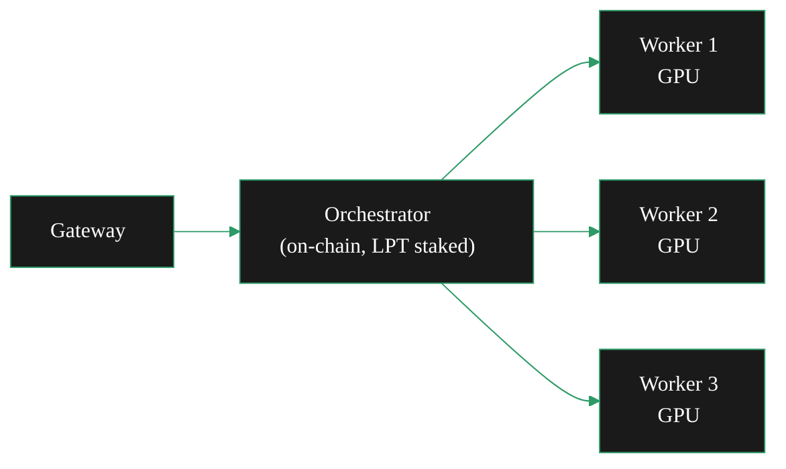

{/* TODO:
Terminology Validation:
- Ensure authoring skill is used to validate page style/copy ai-tools/ai-skills/page-authoring/SKILL.md
- Voice converted to entity-led
- Ensure the terminology and definitions used in this page is consistent with the resources/glossary terminology
Verify:
- Mermaid diagrams use theme colours / styles - for large diagrams use vertical flow and enclose in ScrollableDiagram setting height at 400-500px
- Fontawesome icons are used on accordions and tabs (reference map in docs-guide/tooling/reference-maps/icon-map.mdx)
- Tables use StyledTable component
- Tabs should be surrounded by BorderedBox variant="accent"
- Code blocks should have icon="terminal" for bash (default), icon="code" for scripts, icon="copy" for text copy. Add brief filename.
- All tabs and accordions should have icons
- No em-dashes are used (instead use standard -)
- UK spelling is used
- Headers are concise and technical
- CustomDivider is used
- Placeholders for Media and Video Resources are in comments with a TODO for a human
- REVIEW flags are in JSX comments for a human
- Accuracy is verified across repo as much as possible
Human:
- REVIEW flags
- Review Page Layout
*/}

import { BorderedBox } from '/snippets/components/layout/containers.jsx'
import { StyledTable, TableRow, TableCell } from '/snippets/components/layout/tables.jsx'
import { CustomDivider } from '/snippets/components/primitives/divider.jsx'

A Livepeer pool is a single orchestrator node that routes jobs to multiple external GPU workers. You hold the on-chain identity and LPT stake; workers contribute GPU compute and earn payouts managed off-chain by you, the operator. This page is for experienced orchestrators who want to expand beyond their own hardware by accepting external worker connections.

If you are looking to **join** an existing pool as a worker, see [Join a Pool](/v2/orchestrators/guides/deployment-details/join-a-pool) instead.

<CustomDivider />

## How a pool works

The Livepeer protocol sees only one entity: your orchestrator. It has a single on-chain address, a single stake, and a single service URI. Everything behind that address is your architecture to design.

In a pool, the orchestrator node accepts connections from remote transcoders (workers). When a gateway routes a job to your orchestrator, go-livepeer dispatches it to an available worker via gRPC streaming RPC. Workers process the segment and return results — the orchestrator handles all protocol-level interaction, the workers handle the compute.



Workers have no on-chain presence. They are not visible to delegators or on Livepeer Explorer. All stake, all protocol reputation, and all on-chain fees flow to and through your orchestrator address.

<CustomDivider />

## Worker connection models

<BorderedBox variant="accent" padding="16px">
<Tabs>
  <Tab  title="BYO Container" icon="microchip">
    Workers run go-livepeer in `-transcoder` mode directly — on bare Linux, in Docker, or in a VM — and connect using the `-orchSecret` you configure.

    **Who it suits:** Technically capable workers who want full control over their environment. Best for Linux operators already comfortable with GPU workloads.

    **Worker provides:** A machine with an NVIDIA GPU, NVIDIA drivers, and network connectivity to your orchestrator on port 8935.

    **Worker runs:**
    ```bash icon="terminal"
    livepeer \
      -transcoder \
      -orchAddr <YOUR_ORCHESTRATOR_HOST>:8935 \
      -orchSecret <SHARED_SECRET> \
      -nvidia 0 \
      -maxSessions 10
    ```

    Workers do not need an Ethereum account, LPT, or an RPC endpoint. They connect, register, and begin receiving transcoding jobs automatically.

    **You configure:** Set `-orchSecret` on your orchestrator (see [Accepting workers](#accepting-workers)). Open port 8935 inbound for worker connections.
  </Tab>

  <Tab  title="Managed pool client" icon="coins">
    Some pool operators build a custom client that wraps go-livepeer and adds payout tracking and a simplified UX. Titan Node, for example, publishes their own pool binary that workers download and configure with their ETH address and a nickname.

    **Who it suits:** Workers who want a simplified setup experience, particularly on Windows. Removes the requirement to install go-livepeer directly.

    **Worker provides:** GPU machine, NVIDIA driver, their Ethereum address for payout tracking, and sufficient upload bandwidth (100 Mbps+ recommended).

    **You build or provide:** A custom pool client is operator-built tooling — not a Livepeer Foundation product. You are responsible for building or adapting client software, maintaining a payout dashboard, and tracking worker contributions by ETH address.

    <Note>
      Building and maintaining a custom pool client is a significant engineering investment. Titan Node built and maintains their own pool binary. If you are starting out, the BYO Container model requires far less custom tooling.
    </Note>
  </Tab>

  <Tab  title="Cloud GPU" icon="server">
    Workers provision a cloud GPU instance (Vast.ai, Lambda Labs, CoreWeave, RunPod) and connect it as a remote transcoder. This requires no owned hardware — workers pay for GPU time and earn back through transcoding fees.

    **Who it suits:** Workers without dedicated hardware. Also useful for pool operators who need temporary capacity bursts.

    **You configure:** Same as BYO Container. Optionally provide a Docker image workers can pull to simplify cloud setup.

    <Note>
      Cloud GPU economics for transcoding are tight. Workers should verify margins on their chosen provider before committing. At current network pricing, high-end consumer GPUs on owned hardware are significantly more cost-efficient than rented compute.
    </Note>
  </Tab>
</Tabs>
</BorderedBox>

<CustomDivider />

## Accepting workers

To configure your orchestrator to accept remote worker connections, run **without** `-transcoder` but **with** `-orchSecret`:

```bash icon="terminal"
livepeer \
  -network arbitrum-one-mainnet \
  -ethUrl <RPC_URL> \
  -orchestrator \
  -orchSecret <SHARED_SECRET> \
  -serviceAddr <PUBLIC_HOST>:8935 \
  -pricePerUnit <PRICE_PER_UNIT>
```

**Key points:**

- **`-orchSecret`** is a shared secret that authenticates worker connections. Any node that knows this secret can connect as a worker. Treat it like a password.
- **`-transcoder` is omitted.** This puts the orchestrator in standalone mode: it handles gateway connections and routing, but does no local transcoding. All jobs go to connected workers.
- **Port 8935** must be open for both inbound gateway connections and inbound worker connections.

<Warning>
  Keep `-orchSecret` private. If it is exposed, any node can connect as a worker and receive job assignments. Depending on your off-chain payout model, this could result in payout obligations to unknown parties or diluted job distribution.
</Warning>

The secret can be passed as plaintext or from a file (recommended):

```bash icon="terminal"
-orchSecret /path/to/secret.txt
```

When a worker connects successfully, your orchestrator logs will show:

``` icon="terminal"
Got a RegisterTranscoder request from transcoder=10.3.27.1 capacity=10
```

The `capacity` field is the worker's `-maxSessions` value — how many concurrent jobs it can handle.

<CustomDivider />

## Fee distribution

<Note>
  **Fee distribution in a Livepeer pool is entirely off-chain.** The protocol pays all fees and rewards to your orchestrator's Ethereum address. There is no protocol mechanism to split payments to workers automatically. Pool operators implement their own payout systems.
</Note>

**What the protocol does:** All ETH transcoding fees and LPT inflation rewards are paid to your orchestrator's Ethereum address. The reward cut and fee share you configured applies at this level, splitting between you and your delegators.

**What you manage:** Tracking worker contributions and distributing their share of earnings from your orchestrator wallet. Common approaches:

<StyledTable variant="bordered">
  <TableRow header>
    <TableCell header>Approach</TableCell>
    <TableCell header>How it works</TableCell>
    <TableCell header>Suitable for</TableCell>
  </TableRow>
  <TableRow>
    <TableCell>Per-session tracking</TableCell>
    <TableCell>Log sessions handled per worker ETH address; pay proportionally at period end</TableCell>
    <TableCell>Small pools with a few trusted workers</TableCell>
  </TableRow>
  <TableRow>
    <TableCell>Custom pool client</TableCell>
    <TableCell>Build tooling that tracks address + nickname + sessions; automate periodic payouts</TableCell>
    <TableCell>Public-facing pools (Titan Node's model)</TableCell>
  </TableRow>
  <TableRow>
    <TableCell>Manual distribution</TableCell>
    <TableCell>Calculate shares manually; send ETH periodically</TableCell>
    <TableCell>Testing and very small pools only</TableCell>
  </TableRow>
</StyledTable>

There is no standardised payout protocol. Existing pools have each implemented their own approach. If you are building a public-facing pool, be explicit with workers about payout frequency, minimum thresholds, and how contributions are measured.

<CustomDivider />

## On-chain identity and transparency

Your pool is represented entirely by your orchestrator's Ethereum address. On [Livepeer Explorer](https://explorer.livepeer.org):

- **Delegators** see your total stake, reward cut, fee cut, and historical performance
- **Workers are invisible** — Explorer has no concept of remote transcoders. Worker-level data is only in your off-chain systems.
- **Pool performance** (sessions, fees) reflects aggregate work done by all connected workers combined

If you are running a public pool, building delegator trust requires transparency work beyond go-livepeer configuration. Titan Node does this via a public website, regular Livepeer Forum campaign posts, and a public payout dashboard. Consider documenting your pool's architecture, hardware footprint, uptime history, and payout record.

<CustomDivider />

## Ongoing operational responsibilities

<AccordionGroup>

<Accordion  title="Worker connection management" icon="gear">
Monitor connected workers. If a worker disconnects, your orchestrator continues accepting jobs and assigns them to remaining workers. A worker that was mid-session when it disconnected will cause that session to fail and the segment to be retried by the gateway.

Workers reconnect automatically on restart. You will see a new `Got a RegisterTranscoder request` log line each time. There is no manual reconnection step required on your side.
</Accordion>

<Accordion  title="NVENC session caps on consumer GPUs" icon="server">
Consumer NVIDIA GPUs (GTX/RTX series) have a hardware-enforced limit on concurrent NVENC encoding sessions — typically 3–8 per card depending on the model. Workers hitting this limit will reject new segments.

Titan Node patches the NVIDIA driver on worker machines to remove this cap. If you are operating a pool and want workers to achieve higher concurrency, either communicate this limitation clearly or provide driver-patching instructions.
</Accordion>

<Accordion  title="Session routing and load balancing" icon="circle-question">
go-livepeer distributes sessions across connected workers internally. No manual load balancing is required for basic deployments. For large pools, a load balancer in front of multiple orchestrator instances is possible — see `doc/multi-o.md` in the go-livepeer repository for the multi-orchestrator architecture.
</Accordion>

<Accordion  title="Node updates and downtime" icon="server">
Updating go-livepeer on the orchestrator drops all connected workers and in-flight sessions. Gateways will observe the interruption. Workers reconnect automatically after the orchestrator restarts.

For pools with SLA commitments, coordinate updates during low-traffic periods and communicate planned downtime to workers in advance.
</Accordion>

<Accordion  title="Payout and worker communication" icon="circle-question">
Establish a clear communication channel with your workers — a Discord server, Telegram group, or mailing list. Workers need timely notice of: planned downtime, payout schedule, fee changes, and how to report connection issues.

Poor communication is the most common cause of worker churn in community pools.
</Accordion>

<Accordion  title="orchSecret rotation" icon="circle-question">
If you need to rotate your `-orchSecret` (for example, because you believe it has been compromised), all existing worker connections will drop immediately when the orchestrator restarts with the new secret.

There is no zero-downtime rotation mechanism. Communicate the new secret to all workers before restarting the orchestrator. Workers reconnect automatically with the new secret once updated.
</Accordion>

</AccordionGroup>

<CustomDivider />

## Key facts to remember

<CardGroup cols={2}>

<Card title="One entity on-chain" icon="fingerprint">
  Your pool is one orchestrator address. Workers are invisible to the protocol. All reputation, stake, and on-chain fees flow to you.
</Card>

<Card title="Fee distribution is your problem" icon="coins">
  The protocol does not split fees to workers. You track contributions and pay from your wallet. Build or adopt tooling before onboarding workers.
</Card>

<Card title="-orchSecret is the gate" icon="key">
  Anyone with your `-orchSecret` can connect as a worker and receive jobs. Keep it private. Rotate it if compromised.
</Card>

<Card title="Workers need nothing on-chain" icon="server">
  Workers do not need LPT, an Ethereum account for protocol purposes, or an RPC endpoint. They contribute compute only.
</Card>

</CardGroup>

<CustomDivider />

<CardGroup cols={2}>
  <Card title="Join a Pool" icon="users" href="/v2/orchestrators/guides/deployment-details/join-a-pool">
    The worker perspective — connecting your GPU to an existing pool.
  </Card>
  <Card title="Split O-T Setup" icon="plug" href="/v2/orchestrators/guides/deployment-details/siphon-setup">
    The orchestrator-transcoder split that underpins pool architecture.
  </Card>
  <Card title="Fleet Operations" icon="building" href="/v2/orchestrators/guides/advanced-operations/scale-operations">
    Running multiple orchestrators at data-centre scale.
  </Card>
  <Card title="Earnings and Economics" icon="chart-line" href="/v2/orchestrators/guides/staking-and-rewards/earning-model">
    Pool economics, fee strategy, and what to expect from transcoding revenue.
  </Card>
</CardGroup>

{/*
  PURPOSE:
  "How do I run an orchestrator pool?" Pool architecture: orchestrator accepts
  remote transcoder workers via -orchSecret. Worker management: onboarding,
  performance monitoring, disconnection handling. Fee distribution: entirely
  off-chain and custom. Pool economics: operator take vs worker share. Worker
  reliability management. Communication and transparency with pool members.

  PLAN TARGET: running-a-pool (keep)
  SECTION: Advanced Operations → "How do I scale?"
  JOB STORIES: J4 (pool operation)

  CROSS-REFS:
  - Deployment Details > Join a Pool - worker perspective
  - Resources > Community Pools - pool directory
  - Staking & Earning > Earning Model - pool earnings distribution
*/}
