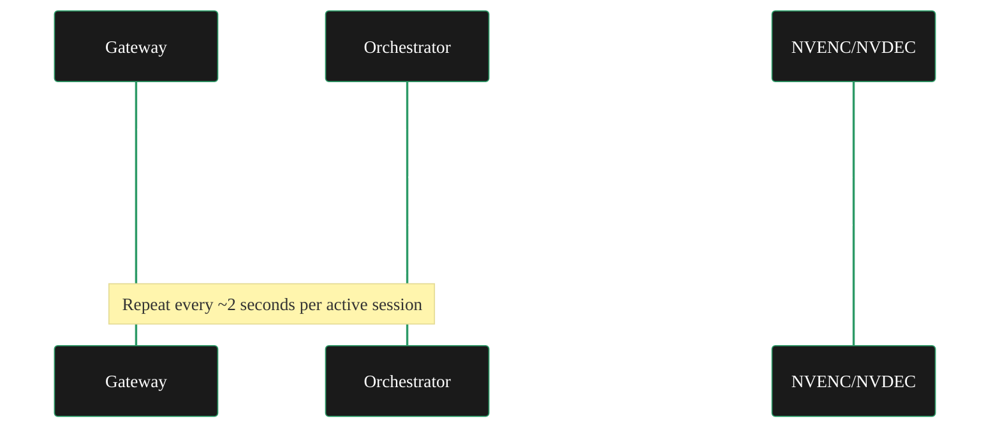

{/* Draft note: keep copy direct, UK spelling, and route unresolved factual checks to JSX comments only. */}

import { StyledSteps, StyledStep } from '/snippets/components/layout/steps.jsx'
import { StyledTable, TableRow, TableCell } from '/snippets/components/layout/tables.jsx'
import { CustomDivider } from '/snippets/components/primitives/divider.jsx'

Video transcoding configuration turns on three operator decisions: price, safe concurrency, and output profile coverage. For hardware benchmarking, see the dedicated [Benchmarking Guide](/v2/orchestrators/guides/config-and-optimisation/capacity-planning).

<CustomDivider />

## How transcoding works

When a broadcaster sends a live stream to a Livepeer gateway, the gateway segments the stream into roughly 2-second chunks and routes each segment to an orchestrator. Your node receives the raw segment, decodes it with NVDEC, re-encodes it to multiple output renditions using NVENC, and returns the results. The session persists for the duration of the stream — potentially hours. Your node processes dozens or hundreds of segments per session continuously.



**GPU vs CPU:** NVIDIA GPU-accelerated transcoding via NVENC/NVDEC is strongly recommended. CPU transcoding is possible but rarely competitive on the open market — GPU nodes are faster and cheaper per pixel, which means CPU-only nodes typically price themselves into no-work territory or operate at a loss on electricity.

<CustomDivider />

## Pricing

Transcoding is priced in **wei per pixel**. A "pixel" here is one pixel of output video — width × height × number of output frames across all renditions. You set your price with the `-pricePerUnit` flag; by default `-pixelsPerUnit` is 1, meaning you charge in wei per individual output pixel.

### Option A: Wei pricing

The simplest and most explicit approach — you set a fixed wei amount and it stays fixed until you change it.

```bash icon="terminal"
livepeer \
  -orchestrator \
  -transcoder \
  -pricePerUnit 500 \
  -pixelsPerUnit 1 \
  # ...
```

This charges 500 wei per output pixel. To work with more human-friendly numbers, use `-pixelsPerUnit` as a denominator:

```bash icon="terminal"
# Charge 500 wei per million pixels (0.0000005 wei per pixel)
-pricePerUnit 500 \
-pixelsPerUnit 1000000
```

<Note>
  `-pixelsPerUnit` is the denominator. Setting it higher makes your effective per-pixel price lower. The per-pixel rate the gateway sees is `pricePerUnit ÷ pixelsPerUnit`.
</Note>

### Option B: USD pricing (go-livepeer 0.8.0+)

USD pricing pegs your transcoding fee to a dollar amount and automatically converts to wei via a [Chainlink ETH/USD price feed](https://docs.chain.link/data-feeds/price-feeds). As ETH price moves, your advertised wei price adjusts automatically to maintain your target USD rate. This is useful for operators who think in dollar terms and want consistent real-world revenue regardless of ETH price fluctuations.

Add `USD` as a suffix to `-pricePerUnit`:

```bash icon="terminal"
# $4.10 × 10⁻¹³ per pixel
livepeer \
  -orchestrator \
  -transcoder \
  -pixelsPerUnit 1e12 \
  -pricePerUnit 0.41USD \
  # ...
```

```bash icon="terminal"
# $6.65 × 10⁻¹⁴ per pixel
-pixelsPerUnit 1e12 \
-pricePerUnit 0.0665USD
```

**Tips for USD pricing:**
- `-pixelsPerUnit` supports exponential notation (`1e12`); `-pricePerUnit` does not
- Use `-pixelsPerUnit` to keep `-pricePerUnit` as a readable decimal
- The Chainlink ETH/USD feed on Arbitrum is auto-configured for mainnet — no additional setup required
- Livepeer Studio pegs its `-maxPricePerUnit` to USD, so USD pricing on your node stays in sync with the gateway side automatically

**Custom currency or non-Arbitrum networks:**

The Chainlink feed can be overridden with `-priceFeedAddr`. Examples:

```bash icon="terminal"
# USD on Ethereum mainnet
-priceFeedAddr 0x5f4eC3Df9cbd43714FE2740f5E3616155c5b8419 \
-pricePerUnit 1USD

# BTC on Arbitrum mainnet
-priceFeedAddr 0xc5a90A6d7e4Af242dA238FFe279e9f2BA0c64B2e \
-pricePerUnit 1BTC
```

### Automatic price adjustment

By default, go-livepeer automatically adjusts your advertised price upward to account for ticket redemption overhead. Ticket redemption is a gas transaction on Arbitrum — when gas prices rise, the overhead as a percentage of ticket face value rises, which makes tickets less profitable to redeem. The auto-adjustment compensates:

<StyledTable variant="bordered">
  <TableRow header>
    <TableCell header>Base price</TableCell>
    <TableCell header>Redemption overhead</TableCell>
    <TableCell header>Advertised price</TableCell>
  </TableRow>
  <TableRow>
    <TableCell>1000 wei/px</TableCell>
    <TableCell>1%</TableCell>
    <TableCell>1010 wei/px</TableCell>
  </TableRow>
  <TableRow>
    <TableCell>1000 wei/px</TableCell>
    <TableCell>20%</TableCell>
    <TableCell>1200 wei/px</TableCell>
  </TableRow>
  <TableRow>
    <TableCell>1000 wei/px</TableCell>
    <TableCell>50%</TableCell>
    <TableCell>1500 wei/px</TableCell>
  </TableRow>
</StyledTable>

This mechanism keeps your effective earnings stable when Arbitrum gas spikes. **Auto-adjustment is on by default.** To advertise a constant price and manage overhead yourself:

```bash icon="terminal" title="Disable automatic price adjustment"
-autoAdjustPrice=false
```

### Updating price via livepeer_cli

Update your price without restarting the node:

<StyledSteps>

<StyledStep title="Run livepeer_cli">
```bash icon="terminal" title="Run livepeer_cli"
livepeer_cli
```
</StyledStep>

<StyledStep title="Select Set orchestrator config">
Enter the number corresponding to `Set orchestrator config`. You can press Enter to keep existing values for fields you do not want to change.
</StyledStep>

<StyledStep title="Set pixelsPerUnit">
``` icon="terminal"
Enter the number of pixels that make up a single unit (default: 1 pixel):
```
Enter your value (e.g. `1000000` or leave at default `1`).
</StyledStep>

<StyledStep title="Set pricePerUnit">
``` icon="terminal"
Enter the price for 1 pixel in Wei (required):
```
Enter your wei price. To use USD, append the suffix: `0.41USD`.
</StyledStep>

<StyledStep title="Verify">
Check your node logs — the updated price appears in the startup or config log output.
</StyledStep>

</StyledSteps>

### What gateways pay — and what you need to know

Gateways set a maximum price they will pay via `-maxPricePerUnit`. Any orchestrator with a price above that maximum receives zero work from that gateway. This threshold is a hard binary — above it you are invisible to that gateway, below it you are in the pool.

Within the pool, gateways weigh price, stake, and performance score. Lower prices increase your selection probability. Being above the ceiling guarantees no work.

**Checking current market rates:**

Compare your price to active orchestrators on [Livepeer Explorer](https://explorer.livepeer.org/orchestrators). Filter by active set members and look at advertised price. The median active price is a reasonable starting anchor — price competitively but do not price below your cost.

<CustomDivider />

## Session limits

Your session limit is the maximum number of concurrent transcoding sessions your node accepts. When you exceed it, the node returns `OrchestratorCapped` to gateways. The default is **10 sessions**.

Set it via `-maxSessions`:

```bash icon="terminal"
livepeer \
  -orchestrator \
  -transcoder \
  -maxSessions 30 \
  # ...
```

The right value is the **minimum of your hardware capacity and your bandwidth capacity**. Set it too high and you degrade transcoding quality and get penalised by gateway performance scoring; set it too low and you leave money on the table.

### Calculating hardware capacity

The benchmark-derived approach: run `livepeer_bench` at increasing concurrency levels and find the highest session count where the Real-Time Duration Ratio stays at or below **0.8**. The 0.8 threshold leaves a ~20% buffer for network overhead.

```bash icon="terminal"
#!/bin/bash
for i in {1..20}
do
  ./livepeer_bench \
    -in bbb/source.m3u8 \
    -transcodingOptions transcodingOptions.json \
    -nvidia 0 \
    -concurrentSessions $i |& grep "Duration Ratio" >> bench.log
done
```

Read the output:

``` icon="terminal"
| * Real-Time Duration Ratio * | 0.21  |   # 1 session
| * Real-Time Duration Ratio * | 0.38  |   # 2 sessions
| * Real-Time Duration Ratio * | 0.56  |   # 3 sessions
| * Real-Time Duration Ratio * | 0.74  |   # 4 sessions  ← last ≤ 0.8
| * Real-Time Duration Ratio * | 0.89  |   # 5 sessions  ← over threshold
```

In this example, your hardware limit is 4 sessions for this GPU.

**Multi-GPU:** Benchmark one GPU, then multiply by the number of identical GPUs. For different GPU models, benchmark each separately.

For the full benchmarking walkthrough including test stream download and CSV output analysis, see [Benchmarking](/v2/orchestrators/guides/config-and-optimisation/capacity-planning).

### Calculating bandwidth capacity

The standard ABR output ladder consumes predictable bandwidth per session:

<StyledTable variant="bordered">
  <TableRow header>
    <TableCell header>Direction</TableCell>
    <TableCell header>Per session</TableCell>
    <TableCell header>Basis</TableCell>
  </TableRow>
  <TableRow>
    <TableCell>**Download** (inbound source)</TableCell>
    <TableCell>~6 Mbps</TableCell>
    <TableCell>1080p30fps source at ~6000 kbps</TableCell>
  </TableRow>
  <TableRow>
    <TableCell>**Upload** (outbound output)</TableCell>
    <TableCell>~5.6 Mbps</TableCell>
    <TableCell>Full 5-rendition ABR ladder total</TableCell>
  </TableRow>
</StyledTable>

**Formula:**

``` icon="terminal"
Bandwidth limit = min(connection_download_Mbps ÷ 6, connection_upload_Mbps ÷ 5.6)
```

**Example — 100 Mbps symmetric connection:**

``` icon="terminal"
Download limit: 100 ÷ 6 ≈ 16 sessions
Upload limit:   100 ÷ 5.6 ≈ 17 sessions
Bandwidth limit: 16 sessions
```

In practice, not all sessions peak simultaneously, so you may extend the limit by roughly 20%. The v1 guidance (still a reasonable approximation): a 100 Mbps connection can reliably serve ~16 sessions, with room to extend cautiously toward ~19.

### Deriving your limit

``` icon="terminal"
maxSessions = min(hardware_capacity, bandwidth_capacity)
```

This is the starting point. Monitor your Duration Ratio in production (via Prometheus metrics) and back off once it exceeds 0.8 under load.

<Note>
  **CPU transcoding caveat:** If you are transcoding without GPU acceleration, the hardware capacity is much lower — approximately 3–5 sessions on modern CPU hardware. CPU transcoding is not competitive on the network at scale.
</Note>

<CustomDivider />

## NVENC session caps on consumer GPUs

Consumer NVIDIA GPUs (GTX/RTX series) have a hardware-enforced cap on the number of concurrent NVENC encoding sessions. This cap applies per GPU and exists independently of your `-maxSessions` setting.

<StyledTable variant="bordered">
  <TableRow header>
    <TableCell header>GPU tier</TableCell>
    <TableCell header>NVENC session cap</TableCell>
  </TableRow>
  <TableRow>
    <TableCell>Consumer (GTX 10xx, RTX 20xx–40xx)</TableCell>
    <TableCell>3–8 concurrent sessions per GPU</TableCell>
  </TableRow>
  <TableRow>
    <TableCell>Professional (RTX A-series, Quadro)</TableCell>
    <TableCell>Unlimited</TableCell>
  </TableRow>
  <TableRow>
    <TableCell>Data-centre (A100, H100)</TableCell>
    <TableCell>Unlimited</TableCell>
  </TableRow>
</StyledTable>

**What happens when you hit the cap:** On startup, go-livepeer runs a GPU test encode. If the NVENC session cap is already reached by other processes, the test fails and the node exits with `Cannot allocate memory`. At runtime, the sessions are hard-capped — new sessions beyond the limit are rejected.

**How to check your GPU's cap:**

Look up your specific card on the [NVIDIA Video Encode and Decode GPU Support Matrix](https://developer.nvidia.com/video-encode-and-decode-gpu-support-matrix-new), or search for "nvenc nvdec session limit `<your GPU model>`".

**Workaround — driver patching:**

The NVENC session cap is enforced in the NVIDIA driver, not the GPU hardware. An open-source patch removes it. Titan Node documents this approach for their pool workers. The patch modifies the driver binary and is not officially supported by NVIDIA — operators should read the relevant terms before applying it.

**Practical recommendation:** Account for the NVENC cap when calculating your hardware session limit. If your GPU is capped at 3 concurrent NVENC sessions, your hardware limit for the benchmark methodology above is 3, regardless of what the Duration Ratio benchmarks suggest at higher concurrency.

<CustomDivider />

## Output rendition profiles

The standard ABR (Adaptive Bitrate) ladder on the Livepeer network assumes a 1080p30fps source input. The default `transcodingOptions.json` used by `livepeer_bench` — and the profile most gateways request — is:

<StyledTable variant="bordered">
  <TableRow header>
    <TableCell header>Profile</TableCell>
    <TableCell header>Resolution</TableCell>
    <TableCell header>Bitrate</TableCell>
  </TableRow>
  <TableRow>
    <TableCell>P720p30fps</TableCell>
    <TableCell>720p at source fps</TableCell>
    <TableCell>3000 kbps</TableCell>
  </TableRow>
  <TableRow>
    <TableCell>P480p30fps</TableCell>
    <TableCell>480p at source fps</TableCell>
    <TableCell>1600 kbps</TableCell>
  </TableRow>
  <TableRow>
    <TableCell>P360p30fps</TableCell>
    <TableCell>360p at source fps</TableCell>
    <TableCell>800 kbps</TableCell>
  </TableRow>
  <TableRow>
    <TableCell>P240p30fps</TableCell>
    <TableCell>240p at source fps</TableCell>
    <TableCell>250 kbps</TableCell>
  </TableRow>
</StyledTable>

The default `-transcodingOptions` flag string is:
``` icon="terminal" title="Default transcodingOptions flag"
P240p30fps16x9,P360p30fps16x9,P720p30fps16x9
```

**How profiles affect GPU load:**

More output renditions = more NVENC encode passes per segment. The standard 4-rendition ladder is roughly 4× the GPU load of encoding a single output. If you are operating near GPU capacity, reducing the output ladder in `transcodingOptions.json` reduces load — but also reduces your coverage of what gateways request, which may lower your selection rate.

**Custom profiles:**

You can define a custom `transcodingOptions.json` for unusual gateway requirements. The file is a JSON array of profile objects specifying resolution, bitrate, fps, and profile string. The default configuration file is at:

``` icon="terminal"
https://github.com/livepeer/go-livepeer/blob/master/cmd/livepeer_bench/transcodingOptions.json
```

<CustomDivider />

## Optimisation tips

<AccordionGroup>

<Accordion  title="Always use GPU transcoding" icon="server">
CPU transcoding is not competitive on the Livepeer market. Even a mid-range NVIDIA card (RTX 3060) will outperform a modern CPU on transcoding throughput per watt and per dollar. If you are running without `-nvidia`, you are leaving performance and earnings on the table. The only exception is brief testing scenarios.
</Accordion>

<Accordion  title="Derive maxSessions from benchmarks" icon="triangle-exclamation">
The default of 10 is arbitrary. On an RTX 4090, the correct value may be 30+. On an RTX 3060, it may be 8. Always benchmark with `livepeer_bench` on your specific hardware with the standard `transcodingOptions.json` before setting a production value. Wrong values in either direction cost you money.
</Accordion>

<Accordion  title="Monitor Duration Ratio in production" icon="gear">
Set up Prometheus metrics (`-monitor` flag) and watch the Duration Ratio under production load. Lower `-maxSessions` once it climbs above 0.8 during peak periods. The benchmark is an approximation — production stream properties vary and the final value may differ.
</Accordion>

<Accordion  title="Use a domain name for serviceAddr, not a bare IP" icon="microchip">
Your service URI is stored on-chain. If you use a bare IP and your IP changes, you need an on-chain update transaction. A DNS name lets you redirect to a new IP without touching the chain. Use a stable subdomain you control.
</Accordion>

<Accordion  title="USD pricing for long-term stability" icon="circle-question">
If you plan to operate for months or years, USD pricing removes ETH volatility from your revenue calculation. Your per-pixel fee in dollar terms stays constant; the wei amount adjusts via Chainlink. Wei pricing is fine for short-term operation or if you are confident in ETH price management.
</Accordion>

<Accordion  title="Leave autoAdjustPrice on during gas price spikes" icon="circle-question">
The auto-adjustment mechanism is there precisely for Arbitrum gas spikes. Disabling it with `-autoAdjustPrice=false` makes sense if you want strict price control, but means you absorb the overhead cost directly during high-gas periods. If you cannot monitor gas prices actively, leave it on.
</Accordion>

</AccordionGroup>

<CustomDivider />

<CardGroup cols={2}>
  <Card title="Benchmarking Guide" icon="gauge-high" href="/v2/orchestrators/guides/config-and-optimisation/capacity-planning">
    Full livepeer_bench walkthrough — test stream download, concurrent session sweep, CSV output analysis.
  </Card>
  <Card title="Session Limits" icon="sliders" href="/v2/orchestrators/guides/config-and-optimisation/capacity-planning">
    Detailed bandwidth and hardware capacity methodology with worked examples.
  </Card>
  <Card title="Job Types Overview" icon="list" href="/v2/orchestrators/guides/ai-and-job-workloads/workload-options">
    How transcoding routing compares to AI workload routing.
  </Card>
  <Card title="Troubleshooting" icon="triangle-exclamation" href="/v2/orchestrators/guides/monitoring-and-tooling/troubleshooting">
    OrchestratorCapped, NVENC memory errors, and pricing-related diagnostics.
  </Card>
</CardGroup>

{/*
  REVIEW:
  - Confirm minimum NVIDIA driver recommendation for the current go-livepeer release.
  - Confirm whether tools.livepeer.cloud is the current community market-rate reference.
  - Confirm RTX 40xx NVENC session-cap behaviour before publication.
  - Confirm whether 1080p is removed from the default transcodingOptions.json or varies by gateway.

  PURPOSE:
  "How does video transcoding work from my node's perspective?" Segment-based
  pipeline: gateway sends 2-second segments, node decodes (NVDEC), re-encodes to
  requested profiles (NVENC), returns renditions. Codec support (H.264, VP8/VP9).
  NVENC hardware session limits (consumer GPUs 3-8 sessions, the driver patch).
  Per-pixel pricing from the sell side. Quality verification. Performance:
  segments/second, real-time duration ratio.

  PLAN TARGET: video-transcoding-operations (consider rename)
  SECTION: Workloads & AI → "What jobs do I run?"
  JOB STORIES: J1 (video workload understanding)

  CROSS-REFS:
  - Config & Optimisation > Capacity Planning - NVENC limits, session tuning
  - Config & Optimisation > Pricing Strategy - video pricing (sell side)
  - Gateway Tab > Node Pipelines > Video Pipelines - gateway perspective
*/}
