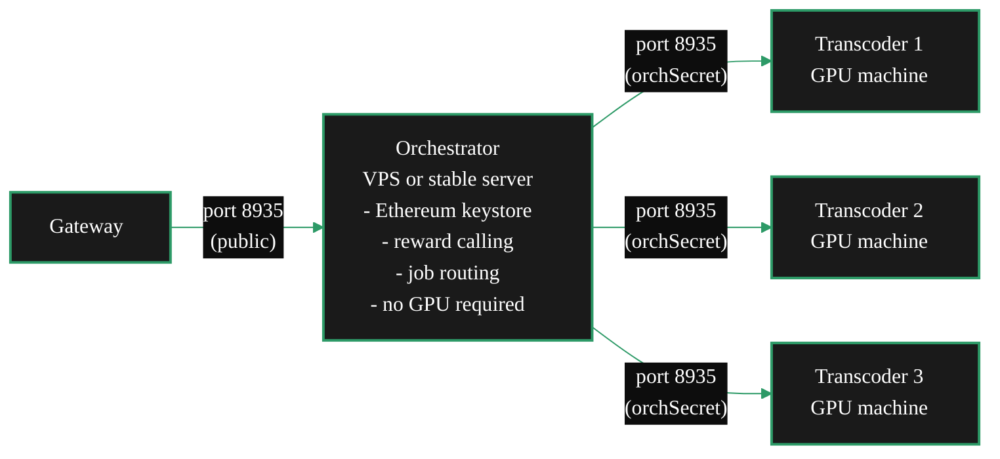

{/* TODO:
Verify:
- Mermaid diagrams use theme colours (hardcoded)
- Fontawesome icons on cards/accordions
- Tables use StyledTable with thead/tbody
- No em-dashes
- UK spelling throughout
- REVIEW flags below for SME
Human:
- REVIEW: confirm -maxSessions still valid on both O and T processes in current go-livepeer releases (Rick)
- REVIEW: port 8935 required for both inbound Gateway connections AND Transcoder connections - confirm no separate port for T-O communication
- REVIEW: orchSecret file-based path (-orchSecret /path/to/secret.txt) still supported in current releases (Rick)
*/}

import { LinkArrow } from '/snippets/components/primitives/links.jsx'
import { StyledTable, TableRow, TableCell } from '/snippets/components/layout/tables.jsx'
import { CustomDivider } from '/snippets/components/primitives/divider.jsx'
import { ScrollableDiagram } from '/snippets/components/content/zoomableDiagram.jsx'

<CustomDivider style={{margin: "-1rem 0 -1rem 0"}} />

By default, go-livepeer runs the Orchestrator and Transcoder as a single combined process on one
machine. The split setup separates them: one machine handles protocol operations (on-chain
interactions, job routing, reward calling) and one or more machines handle the GPU work. The two
connect over the network using a shared secret.

This is also the architectural foundation for
<LinkArrow href="/v2/orchestrators/guides/advanced-operations/run-a-pool" label="running a pool" newline={false} /> -
a pool is the O-T split extended to accept connections from external workers.

For a comparison of all alternate deployment options, see <LinkArrow href="/v2/orchestrators/guides/deployment-details/setup-options" label="Alternate Deployments" newline={false} />.

<CustomDivider middleText="Why Split?" style={{margin: "-1rem 0 -2rem 0"}} />

## Reasons to Split

<CardGroup cols={2}>
  <Card title="Security isolation" icon="shield-halved">
    The Ethereum keystore lives only on the Orchestrator machine. GPU worker machines have no wallet access. A compromised worker cannot drain funds or perform on-chain actions.
  </Card>
  <Card title="Independent scaling" icon="server">
    Add or remove Transcoder machines without touching the Orchestrator. Scale GPU capacity by connecting more Transcoder nodes - each reports its own capacity to the Orchestrator.
  </Card>
  <Card title="Stable reward calling" icon="clock">
    The Orchestrator machine can be a small stable VPS with no GPU. Reward calls come from this machine, independent of GPU machine availability.
  </Card>
  <Card title="Role-optimised hardware" icon="microchip">
    Optimise the Orchestrator for fast CPU, reliable network, and stable uptime. Optimise Transcoder machines purely for GPU throughput.
  </Card>
</CardGroup>

<CustomDivider middleText="Architecture" style={{margin: "-1rem 0 -2rem 0"}} />

## Architecture

<ScrollableDiagram title="O-T Split Architecture" maxHeight="380px">



</ScrollableDiagram>

**Data flow:**

1. A Gateway connects to the Orchestrator on port 8935 (the public service URI)
2. The Orchestrator receives the job and dispatches it to an available connected Transcoder via gRPC
3. The Transcoder processes the segment and returns results to the Orchestrator
4. The Orchestrator returns results to the Gateway

The Gateway and Delegators see only the Orchestrator. Transcoders are not visible to the protocol.

<CustomDivider middleText="Part 1: Orchestrator" style={{margin: "-1rem 0 -2rem 0"}} />

## Part 1 - Orchestrator Machine

The Orchestrator machine needs: a publicly accessible IP or hostname, an Ethereum keystore, and
outbound access to an Arbitrum RPC endpoint. It does not need a GPU.

```bash icon="terminal"
livepeer \
    -network arbitrum-one-mainnet \
    -ethUrl <ARBITRUM_RPC_URL> \
    -ethAcctAddr <YOUR_ETH_ADDRESS> \
    -orchestrator \
    -orchSecret <ORCH_SECRET> \
    -serviceAddr <YOUR_PUBLIC_HOST>:8935 \
    -pricePerUnit <PRICE_PER_UNIT>
```

**Key flags for the Orchestrator-only process:**

<StyledTable variant="bordered">
  <thead>
    <TableRow header>
      <TableCell header>Flag</TableCell>
      <TableCell header>Description</TableCell>
    </TableRow>
  </thead>
  <tbody>
    <TableRow>
      <TableCell>`-orchestrator`</TableCell>
      <TableCell>Runs as an Orchestrator - handles Gateway connections and job routing. No `-transcoder` flag means no local GPU transcoding.</TableCell>
    </TableRow>
    <TableRow>
      <TableCell>`-orchSecret`</TableCell>
      <TableCell>Shared secret Transcoders use to authenticate connections. Pass as plaintext or as a file path: `-orchSecret /path/to/secret.txt`</TableCell>
    </TableRow>
    <TableRow>
      <TableCell>`-serviceAddr`</TableCell>
      <TableCell>Public hostname or IP and port - must match the on-chain service URI. Example: `orch.yourdomain.com:8935`</TableCell>
    </TableRow>
    <TableRow>
      <TableCell>`-pricePerUnit`</TableCell>
      <TableCell>Transcoding price in wei per pixel</TableCell>
    </TableRow>
  </tbody>
</StyledTable>

Without `-transcoder`, go-livepeer runs in standalone Orchestrator mode - it routes jobs to
connected Transcoders but performs no local transcoding. It will refuse job assignments until at
least one Transcoder connects.

<Note>
Pass `-orchSecret` as a file path for production setups - secrets passed as plaintext values are
visible in the process list via `ps aux`.

```bash icon="terminal"
echo "my-secret-value" > /etc/livepeer/orchsecret.txt
chmod 600 /etc/livepeer/orchsecret.txt
# then: -orchSecret /etc/livepeer/orchsecret.txt
```
</Note>

<CustomDivider middleText="Part 2: Transcoder" style={{margin: "-1rem 0 -2rem 0"}} />

## Part 2 - Transcoder Machines

Each Transcoder machine needs: an NVIDIA GPU with drivers installed, and network connectivity to the
Orchestrator on port 8935. It does not need an Ethereum account, LPT stake, or Arbitrum RPC.

```bash icon="terminal"
livepeer \
    -transcoder \
    -nvidia <GPU_IDs> \
    -orchSecret <ORCH_SECRET> \
    -orchAddr <ORCHESTRATOR_HOST>:8935 \
    -maxSessions <MAX_SESSIONS>
```

**Key flags for the Transcoder-only process:**

<StyledTable variant="bordered">
  <thead>
    <TableRow header>
      <TableCell header>Flag</TableCell>
      <TableCell header>Description</TableCell>
    </TableRow>
  </thead>
  <tbody>
    <TableRow>
      <TableCell>`-transcoder`</TableCell>
      <TableCell>Runs as a Transcoder only - processes GPU work, does not handle protocol or on-chain actions</TableCell>
    </TableRow>
    <TableRow>
      <TableCell>`-nvidia`</TableCell>
      <TableCell>Comma-separated GPU IDs to use for transcoding. Example: `0` for one GPU, `0,1` for two</TableCell>
    </TableRow>
    <TableRow>
      <TableCell>`-orchSecret`</TableCell>
      <TableCell>Must match the Orchestrator's `-orchSecret` exactly - this authenticates the connection</TableCell>
    </TableRow>
    <TableRow>
      <TableCell>`-orchAddr`</TableCell>
      <TableCell>The Orchestrator's hostname and port. Example: `orch.yourdomain.com:8935`</TableCell>
    </TableRow>
    <TableRow>
      <TableCell>`-maxSessions`</TableCell>
      <TableCell>Maximum concurrent transcoding sessions this Transcoder will accept</TableCell>
    </TableRow>
  </tbody>
</StyledTable>

### Verifying the connection

When the Transcoder connects successfully, the Orchestrator logs show:

```text icon="terminal"
Got a RegisterTranscoder request from transcoder=10.3.27.1 capacity=10
```

The `capacity` field reflects the Transcoder's `-maxSessions` value. Once this line appears, the
Orchestrator begins routing jobs to the connected Transcoder.

<CustomDivider middleText="Multiple Transcoders" style={{margin: "-1rem 0 -2rem 0"}} />

## Connecting Multiple Transcoders

Any number of Transcoders can connect to a single Orchestrator using the same `-orchSecret`. Each
connection appears in Orchestrator logs:

```text icon="terminal"
Got a RegisterTranscoder request from transcoder=10.3.27.1 capacity=10
Got a RegisterTranscoder request from transcoder=10.3.27.2 capacity=8
Got a RegisterTranscoder request from transcoder=10.3.27.3 capacity=12
```

The Orchestrator distributes incoming job segments across all connected Transcoders automatically.
The effective session capacity is the sum of all connected Transcoder capacities - in the example
above, 30 concurrent sessions. New Transcoders can be added at any time; the Orchestrator begins
routing to them immediately.

<CustomDivider middleText="Pool Relationship" style={{margin: "-1rem 0 -2rem 0"}} />

## Relationship to Pool Operations

The O-T split and a worker pool are the same architecture. The difference is operational scope:

<StyledTable variant="bordered">
  <thead>
    <TableRow header>
      <TableCell header>O-T split</TableCell>
      <TableCell header>Worker pool</TableCell>
    </TableRow>
  </thead>
  <tbody>
    <TableRow>
      <TableCell>The operator owns and runs all machines</TableCell>
      <TableCell>External workers connect their own machines</TableCell>
    </TableRow>
    <TableRow>
      <TableCell>Transcoders are internal</TableCell>
      <TableCell>Workers are third parties</TableCell>
    </TableRow>
    <TableRow>
      <TableCell>No off-chain payout system needed</TableCell>
      <TableCell>Off-chain payout tracking required</TableCell>
    </TableRow>
  </tbody>
</StyledTable>

For pool operations - accepting external worker connections and managing off-chain fee distribution -
see <LinkArrow href="/v2/orchestrators/guides/advanced-operations/run-a-pool" label="Run a Pool" newline={false} />.

<CustomDivider middleText="Security" style={{margin: "-1rem 0 -2rem 0"}} />

## Security Considerations

<AccordionGroup>
  <Accordion title="Protect the orchSecret" icon="key">

    The `orchSecret` is the only authentication between Orchestrator and Transcoder. Any node
    with this secret can connect as a Transcoder and receive job assignments. Keep it private:
    do not embed it in public Docker images, public configuration files, or version control.
    Use file-based secrets with restricted permissions.

  </Accordion>
  <Accordion title="Transcoders hold no wallet" icon="shield-halved">

    In a correctly configured split setup, Transcoder machines do not have the Ethereum keystore
    and are not passed `-ethUrl` or `-ethAcctAddr`. This is intentional: Transcoders have no
    ability to submit on-chain transactions. Keep it this way - do not copy keystores to GPU
    worker machines.

  </Accordion>
  <Accordion title="Port 8935 on the Orchestrator" icon="network-wired">

    Port 8935 must be publicly accessible for both Gateway and Transcoder connections. Gateways
    connect inbound to route jobs; Transcoders connect inbound to register and receive work.
    Open port 8935 for all inbound TCP if behind a firewall.

  </Accordion>
  <Accordion title="Rotating the orchSecret" icon="arrows-rotate">

    If the `-orchSecret` is compromised: generate a new secret, update the Orchestrator launch
    command, communicate the new secret to all Transcoder operators, then restart the Orchestrator.
    All existing Transcoder connections drop; they reconnect automatically with the new secret.
    There is no zero-downtime rotation mechanism.

  </Accordion>
</AccordionGroup>

<CustomDivider middleText="Troubleshooting" style={{margin: "-1rem 0 -2rem 0"}} />

## Troubleshooting

<AccordionGroup>
  <Accordion title="Transcoder not connecting - no log line on Orchestrator" icon="triangle-exclamation">

    Check in order:
    1. Verify port 8935 is reachable from the Transcoder: `curl -v https://<orchestrator-host>:8935/status`
    2. Confirm `-orchSecret` matches exactly on both sides (case-sensitive)
    3. Check for a TLS certificate issue if the Orchestrator uses HTTPS - the Transcoder will
       fail if the cert is self-signed and not trusted
    4. Check Transcoder startup logs for the GPU test result - a GPU test failure causes the
       process to exit before connecting

  </Accordion>
  <Accordion title="Transcoder connected but not receiving jobs" icon="circle-pause">

    Once `Got a RegisterTranscoder request` appears in Orchestrator logs, the Transcoder is
    connected and will receive jobs as they arrive. If jobs arrive at the Orchestrator but the
    Transcoder is idle:
    - Check whether the Transcoder's `-maxSessions` capacity is already reported as fully used
    - Verify the Orchestrator is receiving jobs from Gateways (check session metrics at
      `http://localhost:7935/metrics`)
    - If the Orchestrator itself is idle, the issue is Gateway routing - see
      <LinkArrow href="/v2/orchestrators/guides/advanced-operations/gateways-orchestrators" label="Working with Gateways" newline={false} />

  </Accordion>
  <Accordion title="Cannot allocate memory at Transcoder startup" icon="memory">

    The Transcoder's GPU startup test failed - typically because the NVENC session cap has been
    reached on that GPU. See the GPU and memory errors section of the
    <LinkArrow href="/v2/orchestrators/guides/monitoring-and-tools/troubleshooting" label="Troubleshooting Guide" newline={false} />.

  </Accordion>
</AccordionGroup>

<CustomDivider style={{margin: "-1rem 0 -2rem 0"}} />

## Related Pages

<CardGroup cols={2}>
  <Card title="Alternate Deployments" icon="map" href="/v2/orchestrators/guides/deployment-details/setup-options" arrow horizontal>
    Overview of all three alternate deployment options and how to choose between them.
  </Card>
  <Card title="Siphon Setup" icon="shield-halved" href="/v2/orchestrators/guides/deployment-details/siphon-setup" arrow horizontal>
    Combine the split architecture with OrchestratorSiphon for keystore isolation and reward safety.
  </Card>
  <Card title="Run a Pool" icon="users" href="/v2/orchestrators/guides/advanced-operations/run-a-pool" arrow horizontal>
    Extend this architecture to accept external worker connections.
  </Card>
  <Card title="Large-Scale Operations" icon="building" href="/v2/orchestrators/guides/advanced-operations/large-scale-operations" arrow horizontal>
    Fleet architecture and multi-Orchestrator operations.
  </Card>
</CardGroup>
