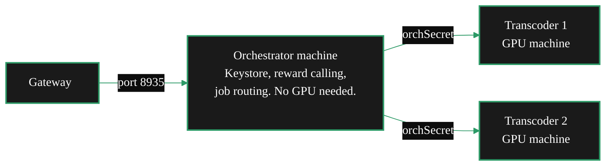

{/* TODO:
Verify:
- Mermaid diagrams use theme colours
- Tables use StyledTable with thead and tbody
- UK spelling throughout
*/}

import { LinkArrow } from '/snippets/components/primitives/links.jsx'
import { StyledTable, TableRow, TableCell } from '/snippets/components/layout/tables.jsx'
import { CustomDivider } from '/snippets/components/primitives/divider.jsx'

<CustomDivider />

The default go-livepeer installation runs Orchestrator and Transcoder as a single-process deployment
on one machine. Use an alternate deployment when the node needs a different operational split:
worker-only earnings, separated protocol and GPU roles, or keystore isolation. The standard path is
documented in the <LinkArrow href="/v2/orchestrators/setup/guide" label="Setup Guide" newline={false} />.

<CustomDivider middleText="Three Alternatives" />

## At a Glance

<StyledTable variant="bordered">
  <thead>
    <TableRow header>
      <TableCell header>Alternative</TableCell>
      <TableCell header>What it solves</TableCell>
      <TableCell header>What it requires</TableCell>
      <TableCell header>Guide</TableCell>
    </TableRow>
  </thead>
  <tbody>
    <TableRow>
      <TableCell>**Pool worker**</TableCell>
      <TableCell>Earn from GPU compute through a pool worker path with the operator handling stake and protocol operations</TableCell>
      <TableCell>GPU; a pool to join; zero stake</TableCell>
      <TableCell>[Join a Pool](/v2/orchestrators/guides/deployment-details/join-a-pool)</TableCell>
    </TableRow>
    <TableRow>
      <TableCell>**O-T split**</TableCell>
      <TableCell>Separate protocol management from GPU workload processing; scale Transcoder machines independently</TableCell>
      <TableCell>Dedicated Orchestrator and Transcoder hosts; staked LPT; shared `-orchSecret`</TableCell>
      <TableCell>[O-T Split](/v2/orchestrators/guides/deployment-details/orchestrator-transcoder-setup)</TableCell>
    </TableRow>
    <TableRow>
      <TableCell>**Siphon**</TableCell>
      <TableCell>Keep the keystore on an isolated machine; GPU restarts leave LPT rewards uninterrupted</TableCell>
      <TableCell>Two machines; staked LPT; Python on secure machine</TableCell>
      <TableCell>[Siphon Setup](/v2/orchestrators/guides/deployment-details/siphon-setup)</TableCell>
    </TableRow>
  </tbody>
</StyledTable>

<CustomDivider middleText="Pool Worker" />

## Pool Worker

A pool worker runs `go-livepeer -transcoder` against an existing pool operator's Orchestrator
address. The pool operator handles staking, reward calling, pricing, and Gateway relationships.
The worker contributes GPU compute and receives off-chain payouts.

**Use this when:** LPT is unavailable, or protocol management stays with the pool operator. It is
the lowest-barrier path from GPU hardware to earnings.

**What changes from the single-process deployment:**

- Use the `-transcoder` flag only; the process handles GPU work and never routes jobs
- Keep the Ethereum keystore on the pool operator side
- Let the pool operator handle registration and activation
- Receive payouts directly from the pool operator

```bash icon="terminal" title="Pool worker command"
# Pool worker - transcoder mode only
livepeer \
    -transcoder \
    -orchAddr <pool-orchestrator-address>:8935 \
    -nvidia 0 \
    -maxSessions 10
```

See <LinkArrow href="/v2/orchestrators/guides/deployment-details/join-a-pool" label="Join a Pool" newline={false} /> for how to evaluate pools and connect.

<CustomDivider middleText="O-T Split" />

## O-T Split

The O-T split separates what the single-process deployment runs together. The Orchestrator process
handles protocol operations, routing, reward calling, and keystore access on one machine. The
Transcoder process handles GPU work on one or more other machines. The two connect over the network
using a shared secret (`-orchSecret`).

**Use this when:** running multiple GPU machines under one Orchestrator identity, or when
optimising each machine for its specific role: a stable lightweight server for the Orchestrator and
dedicated GPU hardware for transcoding.



**What changes from the single-process deployment:**

- Orchestrator machine runs `livepeer -orchestrator` with no `-transcoder` flag and no GPU
- Each GPU machine runs `livepeer -transcoder` with no keystore and no Arbitrum RPC
- `-orchSecret` authenticates the Orchestrator-to-Transcoder connection
- Total session capacity is the sum of all connected Transcoder `-maxSessions` values

The O-T split is also the architectural basis for running a pool. A pool extends this pattern to
accept connections from external workers.

See <LinkArrow href="/v2/orchestrators/guides/deployment-details/orchestrator-transcoder-setup" label="O-T Split Setup" newline={false} /> for setup steps, flag reference, and multi-Transcoder setup.

<CustomDivider middleText="Siphon" />

## Siphon

The Siphon setup also uses a secure machine and a GPU machine, but the secure side runs
**OrchestratorSiphon**. This lightweight Python tool handles on-chain operations only: reward
calling, fee withdrawal, governance voting, and service URI updates.

The GPU machine runs `livepeer -transcoder` identically to the O-T split.

**Use this when:** the GPU machine's uptime cannot be trusted to protect LPT rewards, when the
keystore must be kept completely separate from the machine processing untrusted media data, or when
inflation rewards are needed before GPU infrastructure is ready.

```mermaid
%%{init: {'theme': 'base', 'themeVariables': { 'primaryColor': '#1a1a1a', 'primaryTextColor': '#fff', 'primaryBorderColor': '#2d9a67', 'lineColor': '#2d9a67', 'secondaryColor': '#0d0d0d', 'tertiaryColor': '#1a1a1a', 'background': '#0d0d0d', 'fontFamily': 'system-ui' }}}%%
flowchart LR
    subgraph S["Secure machine (no GPU)"]
        SIP["OrchestratorSiphon\nKeystore, reward calling,\nfee withdrawal, governance"]
    end
    subgraph G["GPU machine"]
        T["go-livepeer -transcoder\nVideo segments, AI inference"]
    end
    SIP -->|"reward() each round"| CHAIN["Arbitrum One"]
    CHAIN -.->|"routes work via\nservice URI"| T

    classDef default fill:#1a1a1a,color:#fff,stroke:#2d9a67,stroke-width:2px
    style S fill:#0d0d0d,stroke:#2d9a67,stroke-width:1px
    style G fill:#0d0d0d,stroke:#2d9a67,stroke-width:1px
```



**The critical difference from O-T split:** in the O-T split, reward calls stop when the
Orchestrator machine goes down. With Siphon, the secure machine calls rewards independently of the
GPU machine state. GPU maintenance, replacement, and temporary downtime leave LPT inflation rewards unchanged.

**Other differences from the single-process deployment:**

- Secure machine runs OrchestratorSiphon (Python, `config.ini`)
- GPU machine runs `livepeer -transcoder` with workload processing only
- Secure machine needs outbound access to Arbitrum RPC and keeps port 8935 closed

<Tip>
Siphon runs on the secure machine alone to keep claiming LPT inflation rewards while GPU
infrastructure is being set up. When ready, deploy the GPU machine in transcoder
mode and update the service URI. No changes to the keystore or on-chain registration are needed.
</Tip>

See <LinkArrow href="/v2/orchestrators/guides/deployment-details/siphon-setup" label="Siphon Setup" newline={false} /> for installation, setup details, and production operation.

<CustomDivider middleText="Choosing" />

## Choosing the Right Alternative

<StyledTable variant="bordered">
  <thead>
    <TableRow header>
      <TableCell header>Situation</TableCell>
      <TableCell header>Right path</TableCell>
    </TableRow>
  </thead>
  <tbody>
    <TableRow>
      <TableCell>No LPT, just a GPU</TableCell>
      <TableCell>**Pool worker** - worker-only earnings path</TableCell>
    </TableRow>
    <TableRow>
      <TableCell>One machine, comfortable with the single-process deployment</TableCell>
      <TableCell>**Standard single-process deployment** - see the Setup Guide for the default architecture</TableCell>
    </TableRow>
    <TableRow>
      <TableCell>Multiple GPU machines under one Orchestrator identity</TableCell>
      <TableCell>**O-T split** - scale Transcoder machines behind a single Orchestrator</TableCell>
    </TableRow>
    <TableRow>
      <TableCell>GPU machine uptime is uncertain; LPT rewards must be protected</TableCell>
      <TableCell>**Siphon** - reward calling is independent of GPU machine state</TableCell>
    </TableRow>
    <TableRow>
      <TableCell>Keystore must be isolated from the media-processing machine</TableCell>
      <TableCell>**Siphon** - GPU machine never holds the keystore</TableCell>
    </TableRow>
    <TableRow>
      <TableCell>Earn inflation rewards before GPU hardware is ready</TableCell>
      <TableCell>**Siphon** (secure machine only) - add GPU machine later without re-registration</TableCell>
    </TableRow>
    <TableRow>
      <TableCell>Running a pool for external workers</TableCell>
      <TableCell>**O-T split** as the foundation - then see <LinkArrow href="/v2/orchestrators/guides/advanced-operations/pool-operators" label="Run a Pool" newline={false} /></TableCell>
    </TableRow>
  </tbody>
</StyledTable>

<CustomDivider />

## Related Pages

<CardGroup cols={2}>
  <Card title="Join a Pool" icon="users" href="/v2/orchestrators/guides/deployment-details/join-a-pool" arrow horizontal>
    Contribute GPU compute through an operator-managed pool path with no staking or on-chain
    operations.
  </Card>
  <Card title="O-T Split Setup" icon="diagram-project" href="/v2/orchestrators/guides/deployment-details/orchestrator-transcoder-setup" arrow horizontal>
    Run Orchestrator and Transcoder as separate processes; connect multiple GPU machines.
  </Card>
  <Card title="Siphon Setup" icon="shield-halved" href="/v2/orchestrators/guides/deployment-details/siphon-setup" arrow horizontal>
    Install OrchestratorSiphon; keep keystore isolated; earn rewards independent of GPU uptime.
  </Card>
  <Card title="Setup Guide" icon="server" href="/v2/orchestrators/setup/guide" arrow horizontal>
    The standard single-machine combined go-livepeer installation.
  </Card>
</CardGroup>

{/*
  PURPOSE:
  "Solo, pool, or split?" The deployment type decision framework.
  Solo operator (full control, full earnings). Pool worker (zero LPT, shared
  earnings). Pool operator (manage others' GPUs). O-T split (separate orchestrator
  and transcoder for scaling/security). Siphon (residential GPU routing).
  Comparison table: complexity, LPT required, earnings share, hardware minimum.
  Workload mix belongs in Config.

  PLAN TARGET: setup-options (keep + update)
  Terminology note: use **dual mode** for the workload mix (video + AI) and **single-process deployment** for the one-node architecture.

  SECTION: Deployment Details → "What do I need and which path?"
  JOB STORIES: J1 (path selection)

  CROSS-REFS:
  - Deployment Details > Join a Pool - pool worker path
  - Deployment Details > O-T Setup - split architecture detail
  - Operator Considerations > Operator Rationale - economics per path
  - Config & Optimisation > Dual Mode Configuration - workload combination
*/}
