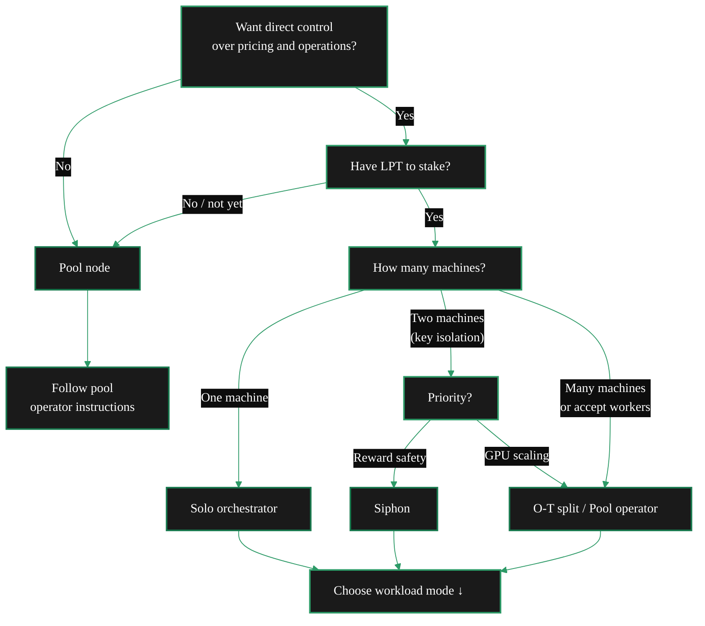

import { StyledTable, TableRow, TableCell } from '/snippets/components/layout/tables.jsx'
import { CustomDivider } from '/snippets/components/primitives/divider.jsx'
import { LinkArrow } from '/snippets/components/primitives/links.jsx'
import { ScrollableDiagram } from '/snippets/components/content/zoomableDiagram.jsx'

<CustomDivider />

This page covers the deployment options available for Orchestrators by category and their focus:
1. Software Setup Options:
- `go-livepeer` <Badge color="green"> Livepeer Software </Badge>
- Siphon <Badge color="yellow"> Ecosystem Software </Badge>
2. Workload Setup Options
- AI
- Video
- Video and Transcoding
- Dual

- the `go-livepeer` setup and provides alternative setup options then addresses the separate question of workload type (video, AI, or dual mode).

<Note>
Two independent decisions determine an orchestrator deployment:
1. **Deployment type** (this section) - how the infrastructure is organised
2. **Workload mode** (bottom of this page) - what jobs the node processes

Any deployment type can run any workload mode.
</Note>

## Three Questions

<AccordionGroup>
  <Accordion title="1. Do you want direct control over your node?" icon="server">
    **Yes** - Solo orchestrator, O-T split, or siphon. The operator registers on-chain, holds stake, sets prices, and earns directly.

    **No** - Pool node. The pool operator handles all protocol operations. The worker contributes GPU compute and receives off-chain payouts from the pool operator.

    <LinkArrow href="/v2/orchestrators/guides/deployment-details/join-a-pool" label="Join a Pool" />
  </Accordion>

  <Accordion title="2. Do you have LPT to stake?" icon="coins">
    Solo orchestrators must activate on-chain by staking LPT. The active set (top orchestrators by total bonded stake) determines video job eligibility. The current threshold varies - check [Livepeer Explorer](https://explorer.livepeer.org/orchestrators) for current rankings.

    {/* REVIEW: confirm current active set size with Rick/Mehrdad */}

    Without LPT, **joining a pool** is the practical entry point. AI-only operators need minimal LPT (enough to activate, not enough for active set) since AI routing is capability-based, not stake-based.
  </Accordion>

  <Accordion title="3. How many machines are involved?" icon="network-wired">
    **One machine** - Solo orchestrator (standard go-livepeer). Everything runs in one process.

    **Two machines** - O-T split or siphon. The protocol/keystore runs on a secure machine, the GPU work runs on a separate machine.

    **Many machines** - O-T split with multiple transcoders, or a pool operator accepting external workers.

    <LinkArrow href="/v2/orchestrators/guides/advanced-operations/scale-operations" label="Scale Operations" />
  </Accordion>
</AccordionGroup>

<CustomDivider middleText="All Deployment Types" />

## Deployment Types

<StyledTable variant="bordered">
  <thead>
    <TableRow header>
      <TableCell header>Deployment type</TableCell>
      <TableCell header>What it is</TableCell>
      <TableCell header>LPT required</TableCell>
      <TableCell header>Machines</TableCell>
      <TableCell header>Complexity</TableCell>
      <TableCell header>Guide</TableCell>
    </TableRow>
  </thead>
  <tbody>
    <TableRow>
      <TableCell>**Solo orchestrator**</TableCell>
      <TableCell>Single go-livepeer process handles protocol, routing, and GPU work. Full control, full earnings.</TableCell>
      <TableCell>Active set threshold (video) or minimal (AI-only)</TableCell>
      <TableCell>1</TableCell>
      <TableCell>Medium</TableCell>
      <TableCell><LinkArrow href="/v2/orchestrators/setup/guide" label="Setup Guide" newline={false} /></TableCell>
    </TableRow>
    <TableRow>
      <TableCell>**Pool node**</TableCell>
      <TableCell>GPU-only process connecting to a pool operator's orchestrator. No staking, no protocol management. Earnings via off-chain pool payouts.</TableCell>
      <TableCell>None</TableCell>
      <TableCell>1</TableCell>
      <TableCell>Low</TableCell>
      <TableCell><LinkArrow href="/v2/orchestrators/guides/deployment-details/join-a-pool" label="Join a Pool" newline={false} /></TableCell>
    </TableRow>
    <TableRow>
      <TableCell>**O-T split**</TableCell>
      <TableCell>Orchestrator and transcoder as separate processes on separate machines. The orchestrator handles protocol and routing (no GPU). The transcoder handles GPU work. Connected by shared secret.</TableCell>
      <TableCell>Active set threshold</TableCell>
      <TableCell>2+</TableCell>
      <TableCell>Medium-High</TableCell>
      <TableCell><LinkArrow href="/v2/orchestrators/guides/deployment-details/orchestrator-transcoder-setup" label="O-T Split" newline={false} /></TableCell>
    </TableRow>
    <TableRow>
      <TableCell>**Siphon**</TableCell>
      <TableCell>Secure machine runs OrchestratorSiphon (Python) for keystore, reward calling, and on-chain operations. GPU machine runs go-livepeer transcoder. Reward calling continues even when GPU machine is down.</TableCell>
      <TableCell>Active set threshold</TableCell>
      <TableCell>2</TableCell>
      <TableCell>Medium</TableCell>
      <TableCell><LinkArrow href="/v2/orchestrators/guides/deployment-details/siphon-setup" label="Siphon Setup" newline={false} /></TableCell>
    </TableRow>
    <TableRow>
      <TableCell>**Pool operator**</TableCell>
      <TableCell>An orchestrator that accepts external GPU workers. Manages on-chain operations and distributes earnings to workers off-chain. Extension of the O-T split pattern.</TableCell>
      <TableCell>Active set threshold + buffer</TableCell>
      <TableCell>2+</TableCell>
      <TableCell>High</TableCell>
      <TableCell><LinkArrow href="/v2/orchestrators/guides/advanced-operations/pool-operators" label="Pool Operators" newline={false} /></TableCell>
    </TableRow>
  </tbody>
</StyledTable>

<Warning>
**A pool node is not a pool operator.** A pool node joins someone else's pool and contributes GPU compute. A pool operator runs the orchestrator that accepts external workers. These are different deployment types with different requirements.
</Warning>

<CustomDivider middleText="Type Details" />

## Deployment Type Details

<Tabs>
  <Tab title="Solo" icon="server">
    The standard path. A single go-livepeer process on one machine handles protocol operations, job routing, and GPU work.

    **The operator controls:** pricing, stake, workloads, reward calling, uptime - everything.

    <StyledTable variant="bordered">
      <thead>
        <TableRow header>
          <TableCell header>Aspect</TableCell>
          <TableCell header>Detail</TableCell>
        </TableRow>
      </thead>
      <tbody>
        <TableRow>
          <TableCell>**LPT**</TableCell>
          <TableCell>Active set threshold for video. Minimal for AI-only.</TableCell>
        </TableRow>
        <TableRow>
          <TableCell>**Machines**</TableCell>
          <TableCell>1</TableCell>
        </TableRow>
        <TableRow>
          <TableCell>**Key flags**</TableCell>
          <TableCell>`-orchestrator -transcoder -nvidia`</TableCell>
        </TableRow>
      </tbody>
    </StyledTable>

    <BorderedBox variant="accent" padding="16px">
      **Tradeoff:** Full margins and direct payouts. But if the machine goes down mid-round, that round's LPT inflation reward is permanently lost.
    </BorderedBox>

    <Card title="Setup Guide" icon="gear" href="/v2/orchestrators/setup/guide" arrow>
      Install, configure, connect, and verify.
    </Card>
  </Tab>

  <Tab title="Pool Node" icon="users">
    A GPU-only process connecting to a pool operator's orchestrator. No staking, no on-chain registration, no protocol management.

    **The operator controls:** which pool to join, GPU hardware, when to switch.

    **The pool controls:** registration, staking, pricing, reward calling, payout schedules.

    <StyledTable variant="bordered">
      <thead>
        <TableRow header>
          <TableCell header>Aspect</TableCell>
          <TableCell header>Detail</TableCell>
        </TableRow>
      </thead>
      <tbody>
        <TableRow>
          <TableCell>**LPT**</TableCell>
          <TableCell>None</TableCell>
        </TableRow>
        <TableRow>
          <TableCell>**Machines**</TableCell>
          <TableCell>1</TableCell>
        </TableRow>
        <TableRow>
          <TableCell>**Key flags**</TableCell>
          <TableCell>`-transcoder -orchAddr <pool> -orchSecret <secret>`</TableCell>
        </TableRow>
      </tbody>
    </StyledTable>

    <BorderedBox variant="accent" padding="16px">
      **Tradeoff:** Lowest barrier to GPU earnings. But dependent on the pool operator for payouts - no on-chain record of individual worker contributions.
    </BorderedBox>

    <Card title="Join a Pool" icon="users" href="/v2/orchestrators/guides/deployment-details/join-a-pool" arrow>
      Evaluate pools, connect as a worker, start earning.
    </Card>
  </Tab>

  <Tab title="O-T Split" icon="diagram-project">
    Orchestrator and transcoder as separate processes on separate machines. The orchestrator handles protocol (no GPU). The transcoder handles GPU work. Connected by a shared secret.

    **The operator controls:** everything, but responsibilities are split across machines.

    <StyledTable variant="bordered">
      <thead>
        <TableRow header>
          <TableCell header>Aspect</TableCell>
          <TableCell header>Detail</TableCell>
        </TableRow>
      </thead>
      <tbody>
        <TableRow>
          <TableCell>**LPT**</TableCell>
          <TableCell>Active set threshold (on orchestrator)</TableCell>
        </TableRow>
        <TableRow>
          <TableCell>**Machines**</TableCell>
          <TableCell>2+ (1 orchestrator + N transcoders)</TableCell>
        </TableRow>
        <TableRow>
          <TableCell>**Key flags**</TableCell>
          <TableCell>Orchestrator: `-orchestrator -orchSecret`. Transcoder: `-transcoder -orchAddr -orchSecret -nvidia`</TableCell>
        </TableRow>
      </tbody>
    </StyledTable>

    <BorderedBox variant="accent" padding="16px">
      **Tradeoff:** Security isolation and independent GPU scaling. But more infrastructure to manage. Also the architectural foundation for running a pool.
    </BorderedBox>

    <Card title="O-T Split Setup" icon="diagram-project" href="/v2/orchestrators/guides/deployment-details/orchestrator-transcoder-setup" arrow>
      Separate protocol from GPU work. Connect multiple GPU machines.
    </Card>
  </Tab>

  <Tab title="Siphon" icon="shield-halved">
    A secure machine runs OrchestratorSiphon (Python) for keystore, reward calling, and on-chain operations. A GPU machine runs go-livepeer in transcoder mode. Reward calling continues even when the GPU machine is down.

    **The operator controls:** everything, via OrchestratorSiphon on the secure machine.

    <StyledTable variant="bordered">
      <thead>
        <TableRow header>
          <TableCell header>Aspect</TableCell>
          <TableCell header>Detail</TableCell>
        </TableRow>
      </thead>
      <tbody>
        <TableRow>
          <TableCell>**LPT**</TableCell>
          <TableCell>Active set threshold</TableCell>
        </TableRow>
        <TableRow>
          <TableCell>**Machines**</TableCell>
          <TableCell>2 (secure + GPU)</TableCell>
        </TableRow>
        <TableRow>
          <TableCell>**Key tool**</TableCell>
          <TableCell>OrchestratorSiphon (Python, `config.ini`)</TableCell>
        </TableRow>
      </tbody>
    </StyledTable>

    <BorderedBox variant="accent" padding="16px">
      **Tradeoff:** Reward calling is independent of GPU machine state - GPU restarts do not affect LPT earnings. But requires managing two machines and a Python tool.
    </BorderedBox>

    <Card title="Siphon Setup" icon="shield-halved" href="/v2/orchestrators/guides/deployment-details/siphon-setup" arrow>
      Keystore isolation and reward safety.
    </Card>
  </Tab>

  <Tab title="Pool Operator" icon="network-wired">
    An orchestrator that accepts external GPU workers. Manages on-chain operations and distributes earnings to workers off-chain. Extension of the O-T split pattern.

    **The operator controls:** on-chain identity, pricing, worker acceptance, fee distribution.

    <StyledTable variant="bordered">
      <thead>
        <TableRow header>
          <TableCell header>Aspect</TableCell>
          <TableCell header>Detail</TableCell>
        </TableRow>
      </thead>
      <tbody>
        <TableRow>
          <TableCell>**LPT**</TableCell>
          <TableCell>Active set threshold + buffer for reliability</TableCell>
        </TableRow>
        <TableRow>
          <TableCell>**Machines**</TableCell>
          <TableCell>2+ (orchestrator + external workers)</TableCell>
        </TableRow>
        <TableRow>
          <TableCell>**Key difference**</TableCell>
          <TableCell>Accepts external `-transcoder` connections via `-orchSecret`</TableCell>
        </TableRow>
      </tbody>
    </StyledTable>

    <BorderedBox variant="accent" padding="16px">
      **Tradeoff:** Earn from other operators' GPU capacity. But highest operational complexity - off-chain fee distribution requires trust, process, and communication with workers.
    </BorderedBox>

    <Card title="Pool Operators" icon="network-wired" href="/v2/orchestrators/guides/advanced-operations/pool-operators" arrow>
      Worker management, fee distribution, and pool economics.
    </Card>
  </Tab>
</Tabs>

<CustomDivider middleText="Decision Tree" />

## Decision Tree

<ScrollableDiagram title="Deployment Decision" maxHeight="420px">

</ScrollableDiagram>

<CustomDivider middleText="Workload Mode" />

## Workload Mode

Deployment type and workload mode are independent decisions. Any deployment type above can run any workload mode below.

<StyledTable variant="bordered">
  <thead>
    <TableRow header>
      <TableCell header>Mode</TableCell>
      <TableCell header>Workloads</TableCell>
      <TableCell header>Min VRAM</TableCell>
      <TableCell header>Pricing</TableCell>
      <TableCell header>Gateway selection</TableCell>
    </TableRow>
  </thead>
  <tbody>
    <TableRow>
      <TableCell><Badge color="blue">Video</Badge></TableCell>
      <TableCell>RTMP transcoding to HLS via NVENC/NVDEC</TableCell>
      <TableCell>4 GB (any NVENC GPU)</TableCell>
      <TableCell>`-pricePerUnit` (wei per pixel)</TableCell>
      <TableCell>Stake + price + performance</TableCell>
    </TableRow>
    <TableRow>
      <TableCell><Badge color="purple">AI</Badge></TableCell>
      <TableCell>Inference: text-to-image, LLM, audio, vision, and more</TableCell>
      <TableCell>8 GB (LLM via Ollama) to 24 GB+ (diffusion)</TableCell>
      <TableCell>`aiModels.json` per pipeline</TableCell>
      <TableCell>Capability match + price</TableCell>
    </TableRow>
    <TableRow>
      <TableCell><Badge color="green">Dual</Badge></TableCell>
      <TableCell>Both video transcoding and AI inference from one process</TableCell>
      <TableCell>16-24 GB (video + one warm AI model)</TableCell>
      <TableCell>Both `-pricePerUnit` and `aiModels.json`</TableCell>
      <TableCell>Both selection methods independently</TableCell>
    </TableRow>
  </tbody>
</StyledTable>

<Badge color="green">Dual</Badge> mode is the most common production configuration. NVENC/NVDEC (video) use dedicated silicon that does not compete with CUDA cores (AI). Both workloads share VRAM. A 24 GB GPU supports video transcoding alongside one warm AI model.

For full dual mode setup instructions, see <LinkArrow href="/v2/orchestrators/guides/deployment-details/dual-mode-configuration" label="Dual Mode Configuration" />.

For a detailed breakdown of all AI pipeline types, VRAM requirements, and demand data, see <LinkArrow href="/v2/orchestrators/guides/ai-and-job-workloads/workload-options" label="Workload Options" />.

<CustomDivider />

## Next Steps

<CardGroup cols={2}>
  <Card title="Requirements" icon="clipboard-check" href="/v2/orchestrators/guides/operator-considerations/requirements" arrow horizontal>
    Hardware, software, network, and token prerequisites by node mode.
  </Card>
  <Card title="Setup Guide" icon="gear" href="/v2/orchestrators/setup/guide" arrow horizontal>
    The standard solo orchestrator setup. Install, configure, connect, verify.
  </Card>
  <Card title="Dual Mode" icon="layer-group" href="/v2/orchestrators/guides/deployment-details/dual-mode-configuration" arrow horizontal>
    Configure video and AI on the same node.
  </Card>
  <Card title="Operator Rationale" icon="scale-balanced" href="/v2/orchestrators/guides/operator-considerations/operator-rationale" arrow horizontal>
    Not sure yet? Review costs, revenue, and break-even analysis.
  </Card>
</CardGroup>

{/*
  PURPOSE:
  "Which deployment path is right for me?" Lists ALL five deployment types
  (solo, pool node, O-T split, siphon, pool operator) as equal options, not
  as "alternatives to the default." Covers the workload mode decision (video,
  AI, dual) as a separate orthogonal choice. Decision tree routes by situation.

  SECTION: Deployment Details
  JOB STORIES: J1 (path selection)

  CROSS-REFS:
  - Setup > Guide - solo orchestrator setup
  - Deployment Details > Join a Pool - pool node path
  - Deployment Details > O-T Split - split architecture
  - Deployment Details > Siphon Setup - keystore isolation
  - Deployment Details > Dual Mode Configuration - workload combination
  - Advanced Operations > Pool Operators - pool operator guide
  - Operator Considerations > Requirements - hardware prerequisites
  - Workloads and AI > Workload Options - detailed workload breakdown
*/}
