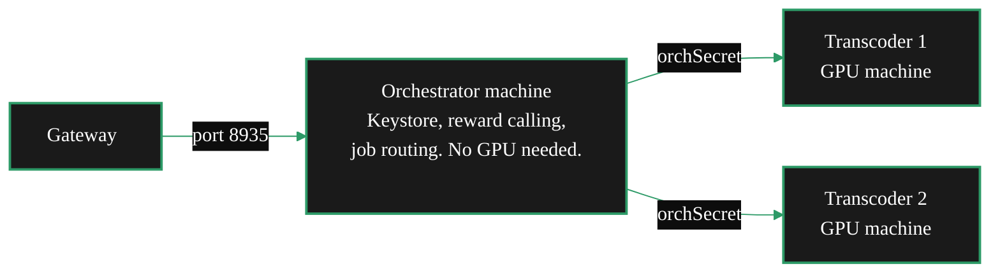

{/* TODO:
Verify:
- Mermaid diagrams use theme colours (hardcoded)
- Tables use StyledTable with thead/tbody
- No em-dashes
- UK spelling throughout
- REVIEW flags below for SME
Human:
- REVIEW: confirm siphon-setup and orchestrator-transcoder-setup paths in docs.json once navigation is finalised
*/}

import { LinkArrow } from '/snippets/components/primitives/links.jsx'
import { StyledTable, TableRow, TableCell } from '/snippets/components/layout/tables.jsx'
import { CustomDivider } from '/snippets/components/primitives/divider.jsx'

<CustomDivider style={{margin: "-1rem 0 -1rem 0"}} />

The default go-livepeer installation runs Orchestrator and Transcoder as a single combined process
on one machine. That standard path is documented in the
<LinkArrow href="/v2/orchestrators/setup/guide" label="Setup Guide" newline={false} />.

This page covers the three alternatives. Each solves a specific operational problem the standard
path has no answer for.

<CustomDivider middleText="Three Alternatives" style={{margin: "-1rem 0 -2rem 0"}} />

## At a Glance

<StyledTable variant="bordered">
  <thead>
    <TableRow header>
      <TableCell header>Alternative</TableCell>
      <TableCell header>What it solves</TableCell>
      <TableCell header>What it requires</TableCell>
      <TableCell header>Guide</TableCell>
    </TableRow>
  </thead>
  <tbody>
    <TableRow>
      <TableCell>**Pool worker**</TableCell>
      <TableCell>Earn from GPU compute without running an Orchestrator at all - no LPT, no on-chain management</TableCell>
      <TableCell>GPU; a pool to join; no stake</TableCell>
      <TableCell>[Join a Pool](/v2/orchestrators/guides/deployment-details/join-a-pool)</TableCell>
    </TableRow>
    <TableRow>
      <TableCell>**O-T split**</TableCell>
      <TableCell>Separate protocol management from GPU workload processing; scale Transcoder machines independently</TableCell>
      <TableCell>Two machines; LPT stake; `-orchSecret`</TableCell>
      <TableCell>[O-T Split](/v2/orchestrators/guides/deployment-details/orchestrator-transcoder-setup)</TableCell>
    </TableRow>
    <TableRow>
      <TableCell>**Siphon**</TableCell>
      <TableCell>Keep the keystore on an isolated machine; GPU machine can restart without missing LPT rewards</TableCell>
      <TableCell>Two machines; LPT stake; Python on secure machine</TableCell>
      <TableCell>[Siphon Setup](/v2/orchestrators/guides/deployment-details/siphon-setup)</TableCell>
    </TableRow>
  </tbody>
</StyledTable>

<CustomDivider middleText="Pool Worker" style={{margin: "-1rem 0 -2rem 0"}} />

## Pool Worker

A pool worker does not run an Orchestrator. It runs `go-livepeer -transcoder` pointed at an
existing pool operator's Orchestrator address. The pool operator handles all on-chain operations:
staking, reward calling, pricing, Gateway relationships. The worker provides GPU compute and
receives off-chain payouts.

**Use this when:** no LPT is available, or on-chain protocol management is not wanted. It is the
lowest-barrier path from GPU hardware to earnings.

**What changes from combined mode:**

- No `-orchestrator` flag - the process only transcodes, never routes
- No Ethereum keystore on the worker machine
- No on-chain registration or activation required
- Payouts come from the pool operator directly, not from the protocol

```bash icon="terminal"
# Pool worker - transcoder mode only, no orchestrator flags
livepeer \
    -transcoder \
    -orchAddr <pool-orchestrator-address>:8935 \
    -nvidia 0 \
    -maxSessions 10
```

See <LinkArrow href="/v2/orchestrators/guides/deployment-details/join-a-pool" label="Join a Pool" newline={false} /> for how to evaluate pools and connect.

<CustomDivider middleText="O-T Split" style={{margin: "-1rem 0 -2rem 0"}} />

## O-T Split

The O-T split separates what combined mode runs together. The Orchestrator process - protocol,
routing, reward calling, keystore - runs on one machine. The Transcoder process - GPU work - runs
on one or more other machines. The two connect over the network using a shared secret (`-orchSecret`).

**Use this when:** running multiple GPU machines under one Orchestrator identity, or when
optimising each machine for its specific role - a stable lightweight server for the Orchestrator
and dedicated GPU hardware for transcoding.



**What changes from combined mode:**

- Orchestrator machine runs `livepeer -orchestrator` with no `-transcoder` flag and no GPU
- Each GPU machine runs `livepeer -transcoder` with no keystore and no Arbitrum RPC
- `-orchSecret` authenticates the Orchestrator-to-Transcoder connection
- Total session capacity is the sum of all connected Transcoder `-maxSessions` values

The O-T split is also the architectural basis for running a pool. A pool extends it to accept
connections from external workers rather than machines the operator owns.

See <LinkArrow href="/v2/orchestrators/guides/deployment-details/orchestrator-transcoder-setup" label="O-T Split Setup" newline={false} /> for configuration, flag reference, and multi-Transcoder setup.

<CustomDivider middleText="Siphon" style={{margin: "-1rem 0 -2rem 0"}} />

## Siphon

The Siphon setup also uses a secure machine and a GPU machine - but uses a different tool on the
secure side. Instead of running `livepeer -orchestrator`, the secure machine runs
**OrchestratorSiphon**: a lightweight Python tool that handles only on-chain operations - reward
calling, fee withdrawal, governance voting, service URI updates.

The GPU machine runs `livepeer -transcoder` identically to the O-T split.

**Use this when:** the GPU machine's uptime cannot be trusted to protect LPT rewards, when the
keystore must be kept completely separate from the machine processing untrusted media data, or when
inflation rewards are needed before GPU infrastructure is ready.

```mermaid
%%{init: {'theme': 'base', 'themeVariables': { 'primaryColor': '#1a1a1a', 'primaryTextColor': '#fff', 'primaryBorderColor': '#2d9a67', 'lineColor': '#2d9a67', 'secondaryColor': '#0d0d0d', 'tertiaryColor': '#1a1a1a', 'background': '#0d0d0d', 'fontFamily': 'system-ui' }}}%%
flowchart LR
    subgraph S["Secure machine (no GPU)"]
        SIP["OrchestratorSiphon\nKeystore, reward calling,\nfee withdrawal, governance"]
    end
    subgraph G["GPU machine"]
        T["go-livepeer -transcoder\nVideo segments, AI inference"]
    end
    SIP -->|"reward() each round"| CHAIN["Arbitrum One"]
    CHAIN -.->|"routes work via\nservice URI"| T

    classDef default fill:#1a1a1a,color:#fff,stroke:#2d9a67,stroke-width:2px
    style S fill:#0d0d0d,stroke:#2d9a67,stroke-width:1px
    style G fill:#0d0d0d,stroke:#2d9a67,stroke-width:1px
```



**The critical difference from O-T split:** in the O-T split, the Orchestrator process still makes
reward calls - if the Orchestrator machine goes down, rewards stop. With Siphon, the secure machine
calls rewards independently of whether the GPU machine is running. The GPU machine can restart,
be replaced, or go offline without affecting LPT inflation rewards.

**Other differences from combined mode:**

- Secure machine runs OrchestratorSiphon (Python, `config.ini`) - not go-livepeer
- GPU machine runs `livepeer -transcoder` - no keystore, no Arbitrum RPC
- Secure machine needs only outbound access to Arbitrum RPC; no port 8935 required

<Tip>
Siphon can run on the secure machine alone - with no GPU machine deployed - to earn LPT inflation
rewards while GPU infrastructure is being set up. When ready, deploy the GPU machine in transcoder
mode and update the service URI. No changes to the keystore or on-chain registration are needed.
</Tip>

See <LinkArrow href="/v2/orchestrators/guides/deployment-details/siphon-setup" label="Siphon Setup" newline={false} /> for installation, configuration, and production operation.

<CustomDivider middleText="Choosing" style={{margin: "-1rem 0 -2rem 0"}} />

## Choosing the Right Alternative

<StyledTable variant="bordered">
  <thead>
    <TableRow header>
      <TableCell header>Situation</TableCell>
      <TableCell header>Right path</TableCell>
    </TableRow>
  </thead>
  <tbody>
    <TableRow>
      <TableCell>No LPT, just a GPU</TableCell>
      <TableCell>**Pool worker** - not an Orchestrator at all</TableCell>
    </TableRow>
    <TableRow>
      <TableCell>One machine, comfortable with combined setup</TableCell>
      <TableCell>**Standard combined mode** - see the Setup Guide, not this page</TableCell>
    </TableRow>
    <TableRow>
      <TableCell>Multiple GPU machines under one Orchestrator identity</TableCell>
      <TableCell>**O-T split** - scale Transcoder machines behind a single Orchestrator</TableCell>
    </TableRow>
    <TableRow>
      <TableCell>GPU machine uptime is uncertain; LPT rewards must be protected</TableCell>
      <TableCell>**Siphon** - reward calling is independent of GPU machine state</TableCell>
    </TableRow>
    <TableRow>
      <TableCell>Keystore must be isolated from the media-processing machine</TableCell>
      <TableCell>**Siphon** - GPU machine never holds the keystore</TableCell>
    </TableRow>
    <TableRow>
      <TableCell>Earn inflation rewards before GPU hardware is ready</TableCell>
      <TableCell>**Siphon** (secure machine only) - add GPU machine later without re-registration</TableCell>
    </TableRow>
    <TableRow>
      <TableCell>Running a pool for external workers</TableCell>
      <TableCell>**O-T split** as the foundation - then see <LinkArrow href="/v2/orchestrators/guides/advanced-operations/pool-operators" label="Run a Pool" newline={false} /></TableCell>
    </TableRow>
  </tbody>
</StyledTable>

<CustomDivider style={{margin: "-1rem 0 -2rem 0"}} />

## Related Pages

<CardGroup cols={2}>
  <Card title="Join a Pool" icon="users" href="/v2/orchestrators/guides/deployment-details/join-a-pool" arrow horizontal>
    Contribute GPU compute to an existing Orchestrator pool - no stake, no on-chain management.
  </Card>
  <Card title="O-T Split Setup" icon="diagram-project" href="/v2/orchestrators/guides/deployment-details/orchestrator-transcoder-setup" arrow horizontal>
    Run Orchestrator and Transcoder as separate processes; connect multiple GPU machines.
  </Card>
  <Card title="Siphon Setup" icon="shield-halved" href="/v2/orchestrators/guides/deployment-details/siphon-setup" arrow horizontal>
    Install OrchestratorSiphon; keep keystore isolated; earn rewards independent of GPU uptime.
  </Card>
  <Card title="Setup Guide" icon="server" href="/v2/orchestrators/setup/guide" arrow horizontal>
    The standard single-machine combined go-livepeer installation.
  </Card>
</CardGroup>

{/*
  PURPOSE:
  "Solo, pool, or split?" The deployment type decision framework.
  Solo operator (full control, full earnings). Pool worker (zero LPT, shared
  earnings). Pool operator (manage others' GPUs). O-T split (separate orchestrator
  and transcoder for scaling/security). Siphon (residential GPU routing).
  Comparison table: complexity, LPT required, earnings share, hardware minimum.
  NOT about node mode (video/AI/dual) - that is a workload decision in Config.

  PLAN TARGET: setup-options (keep + update)
  UPDATE NEEDED: Replace "combined mode" with "dual mode" terminology. Reframe with dual as default.

  SECTION: Deployment Details → "What do I need and which path?"
  JOB STORIES: J1 (path selection)

  CROSS-REFS:
  - Deployment Details > Join a Pool - pool worker path
  - Deployment Details > O-T Setup - split architecture detail
  - Operator Considerations > Operator Rationale - economics per path
  - Config & Optimisation > Dual Mode Configuration - workload combination
*/}
