{/* TODO:
Verify:
- Mermaid diagrams use theme colours (hardcoded)
- Fontawesome icons on accordions
- Tables use StyledTable with thead/tbody
- No em-dashes
- UK spelling throughout
- StyledSteps used for ordered install steps
- REVIEW flags below for SME
Human:
- REVIEW: Confirm OrchestratorSiphon interactive mode menu options for service URI update (Stronk-Tech / Rick)
- REVIEW: -orchAddr flag still valid for transcoder mode (Rick)
- REVIEW: Ubuntu 24.04 --break-system-packages pip approach - still required or has venv become the universal recommendation?
*/}

import { LinkArrow } from '/snippets/components/primitives/links.jsx'
import { StyledSteps, StyledStep } from '/snippets/components/layout/steps.jsx'
import { StyledTable, TableRow, TableCell } from '/snippets/components/layout/tables.jsx'
import { CustomDivider } from '/snippets/components/primitives/divider.jsx'
import { ScrollableDiagram } from '/snippets/components/content/zoomableDiagram.jsx'

<CustomDivider style={{margin: "-1rem 0 -1rem 0"}} />

Running an Orchestrator keystore on the same machine as GPU workloads creates two risks. If the GPU
machine reboots mid-round, that round's LPT inflation reward is permanently lost - and missed rewards
compound over time. A machine actively processing untrusted media data is also not the safest place
for a key controlling staked LPT.

The Siphon split setup solves both. **OrchestratorSiphon** runs on a small, secure machine and
handles all on-chain actions: reward calling, fee withdrawal, governance voting, and service URI
updates. The GPU machine runs go-livepeer in transcoder mode and processes work - it never holds
the keystore.

The two machines are independent. The GPU machine can restart, be replaced, or go offline for
maintenance without interrupting reward claims. Adding a second GPU machine later requires no
changes to the secure machine.

For a comparison with the O-T split and pool worker alternatives, see
<LinkArrow href="/v2/orchestrators/guides/deployment-details/setup-options" label="Alternate Deployments" newline={false} />.

<CustomDivider middleText="Architecture" style={{margin: "-1rem 0 -2rem 0"}} />

## Architecture

```mermaid
%%{init: {'theme': 'base', 'themeVariables': { 'primaryColor': '#1a1a1a', 'primaryTextColor': '#fff', 'primaryBorderColor': '#2d9a67', 'lineColor': '#2d9a67', 'secondaryColor': '#0d0d0d', 'tertiaryColor': '#1a1a1a', 'background': '#0d0d0d', 'fontFamily': 'system-ui' }}}%%
flowchart LR
    subgraph SM["Secure machine (no GPU required)"]
        Siphon["OrchestratorSiphon\nHolds keystore\nCalls reward each round\nWithdraws fees\nVotes on LIPs\nUpdates service URI"]
    end
    subgraph GM["GPU machine"]
        Worker["go-livepeer -transcoder\nProcesses video segments\nRuns AI inference\nNo keystore stored here"]
    end
    Siphon -->|"reward() every round\n~22 hours on Arbitrum"| Chain["On-chain Orchestrator\n(Arbitrum One)"]
    Worker -->|"Receives work from Gateways\nvia service URI"| Chain
    Siphon -.->|"Service URI\npoints here"| Worker

    classDef default fill:#1a1a1a,color:#fff,stroke:#2d9a67,stroke-width:2px
    style SM fill:#0d0d0d,stroke:#2d9a67,stroke-width:1px
    style GM fill:#0d0d0d,stroke:#2d9a67,stroke-width:1px
```

<ScrollableDiagram title="Siphon Split Architecture" maxHeight="380px">



</ScrollableDiagram>

<StyledTable variant="bordered">
  <thead>
    <TableRow header>
      <TableCell header>Machine</TableCell>
      <TableCell header>What it runs</TableCell>
      <TableCell header>GPU required</TableCell>
    </TableRow>
  </thead>
  <tbody>
    <TableRow>
      <TableCell>**Secure machine**</TableCell>
      <TableCell>OrchestratorSiphon - keystore, reward calling, fee withdrawal, on-chain actions</TableCell>
      <TableCell>No (a small VPS is sufficient)</TableCell>
    </TableRow>
    <TableRow>
      <TableCell>**GPU machine**</TableCell>
      <TableCell>go-livepeer in transcoder mode - segment processing, AI inference</TableCell>
      <TableCell>Yes</TableCell>
    </TableRow>
  </tbody>
</StyledTable>

<CustomDivider middleText="When to Use Siphon" style={{margin: "-1rem 0 -2rem 0"}} />

## When to Use This Setup

<CardGroup cols={2}>
  <Card title="Use Siphon when..." icon="shield-halved">
    GPU machine uptime is uncertain; keystore isolation from workload processing is needed; multiple GPU machines should run behind one Orchestrator identity; or LPT inflation rewards are needed before GPU infrastructure is ready.
  </Card>
  <Card title="Use combined go-livepeer instead when..." icon="server">
    A single machine is sufficient and reward calling alongside workloads is acceptable. The standard Setup Guide covers this path.
  </Card>
</CardGroup>

<Tip>
Siphon can run on the secure machine alone - with no GPU machine deployed - to earn LPT inflation
rewards while GPU infrastructure is being prepared. When ready, deploy go-livepeer in transcoder
mode and update the service URI. No changes to the keystore or on-chain registration are needed.
</Tip>

<CustomDivider middleText="Prerequisites" style={{margin: "-1rem 0 -2rem 0"}} />

## Prerequisites

<StyledTable variant="bordered">
  <thead>
    <TableRow header>
      <TableCell header>Requirement</TableCell>
      <TableCell header>Secure machine</TableCell>
      <TableCell header>GPU machine</TableCell>
    </TableRow>
  </thead>
  <tbody>
    <TableRow>
      <TableCell>**OS**</TableCell>
      <TableCell>Linux (Ubuntu 20.04+)</TableCell>
      <TableCell>Linux with NVIDIA GPU</TableCell>
    </TableRow>
    <TableRow>
      <TableCell>**Runtime**</TableCell>
      <TableCell>Python 3 + pip</TableCell>
      <TableCell>go-livepeer binary</TableCell>
    </TableRow>
    <TableRow>
      <TableCell>**Network**</TableCell>
      <TableCell>Outbound to Arbitrum One RPC</TableCell>
      <TableCell>Static IP or stable DNS entry; port 8935 open</TableCell>
    </TableRow>
    <TableRow>
      <TableCell>**Ethereum**</TableCell>
      <TableCell>Orchestrator keystore + ETH for gas</TableCell>
      <TableCell>Small ETH balance for ticket redemption</TableCell>
    </TableRow>
    <TableRow>
      <TableCell>**Stake**</TableCell>
      <TableCell>LPT staked on-chain</TableCell>
      <TableCell>Not required</TableCell>
    </TableRow>
  </tbody>
</StyledTable>

The secure machine does not need a GPU. A small VPS (1 vCPU, 512 MB RAM) is sufficient. The
important properties are stability, restricted access, and that outbound Arbitrum RPC connectivity
is reliable.

<CustomDivider middleText="Part 1: Secure Machine" style={{margin: "-1rem 0 -2rem 0"}} />

## Part 1 - Secure Machine: Install OrchestratorSiphon

<StyledSteps>

  <StyledStep title="Clone the repository">

    ```bash icon="terminal"
    git clone https://github.com/Stronk-Tech/OrchestratorSiphon.git
    cd OrchestratorSiphon
    ```

    <Card title="OrchestratorSiphon - Stronk-Tech/OrchestratorSiphon" icon="github" href="https://github.com/Stronk-Tech/OrchestratorSiphon" arrow horizontal>
      Lightweight Python toolkit for managing a Livepeer Orchestrator keystore and on-chain actions.
    </Card>

  </StyledStep>

  <StyledStep title="Install Python dependencies">

    A virtual environment is recommended on all Ubuntu versions:

    ```bash icon="terminal"
    python3 -m venv .venv
    source .venv/bin/activate
    pip install web3 eth-utils setuptools
    ```

    On Ubuntu 24.04+ without a virtualenv:

    ```bash icon="terminal"
    python3 -m pip install --break-system-packages web3 eth-utils setuptools
    ```

    Verify the installation:

    ```bash icon="terminal"
    python3 -m pip show web3 requests urllib3
    ```

    If a `RequestsDependencyWarning` about urllib3 or chardet appears:

    ```bash icon="terminal"
    pip install --upgrade "requests>=2.31" "urllib3>=2.0" web3
    ```

  </StyledStep>

  <StyledStep title="Configure config.ini">

    Open the provided configuration file:

    ```bash icon="terminal"
    nano config.ini
    ```

    The essential fields:

    ```ini icon="code" title="config.ini"
    [keystore1]
    ; Path to your Ethereum keystore file (the UTC-- file)
    keystore = /path/to/keystore/UTC--<timestamp>--<address>

    ; Keystore password or path to a file containing it.
    ; Leave empty to be prompted interactively - more secure.
    password =

    ; Your orchestrator's on-chain Ethereum address
    source_address = 0xYourOrchestratorAddress

    ; Address to receive ETH fee withdrawals
    receiver_address_eth = 0xYourReceiver

    ; Address to receive LPT bond transfers
    receiver_address_lpt = 0xYourReceiver

    [thresholds]
    lpt_threshold  = 100    ; Trigger TransferBond when pending LPT exceeds this
    eth_threshold  = 0.20   ; Trigger WithdrawFees when pending ETH exceeds this
    eth_minval     = 0.020  ; Keep at least this much ETH for gas
    eth_warn       = 0.010  ; Warn when ETH balance drops below this

    [rpc]
    l2 = https://arb1.arbitrum.io/rpc   ; Arbitrum One RPC endpoint
    ```

    To manage multiple Orchestrators, duplicate the `[keystore1]` block and name the second
    section `[keystore2]`.

    <Note>
    Every config value can alternatively be passed as an environment variable. The config file
    comments show the corresponding variable name for each setting. Environment variables always
    take precedence over the file.
    </Note>

    <Warning>
    Never share the keystore or password. If uncertain about what the script does with your key,
    search `source_private_key` in the Python source files - the repository README explicitly
    points to these locations. If in doubt, use the official go-livepeer binary to manage rewards
    instead.
    </Warning>

  </StyledStep>

  <StyledStep title="Test manually before running as a service">

    Run Siphon once to confirm it can decrypt the keystore and connect to Arbitrum. If `password`
    was left empty, it will prompt interactively:

    ```bash icon="terminal"
    # Using virtualenv:
    .venv/bin/python3 OrchestratorSiphon.py

    # Using system interpreter:
    python3 OrchestratorSiphon.py
    ```

    Enter the password when asked, then enter `0` to launch standard mode. Output should show
    the Orchestrator's current state: pending rewards, ETH balance, current round.

    If Siphon cannot connect to the RPC endpoint, verify network configuration and check that the
    Arbitrum RPC URL is reachable from this machine.

  </StyledStep>

  <StyledStep title="Set up as a systemd service">

    For production use, register Siphon as a systemd service so it restarts automatically
    after reboots.

    Create `/etc/systemd/system/orchSiphon.service`:

    ```ini icon="code" title="/etc/systemd/system/orchSiphon.service"
    [Unit]
    Description=OrchestratorSiphon - Livepeer keystore manager
    After=network-online.target
    Wants=network-online.target

    [Service]
    Type=simple
    User=<your-linux-user>
    WorkingDirectory=/path/to/OrchestratorSiphon
    ExecStart=/path/to/OrchestratorSiphon/.venv/bin/python3 -u OrchestratorSiphon.py
    Restart=on-failure
    RestartSec=10s
    StandardOutput=journal
    StandardError=journal

    [Install]
    WantedBy=multi-user.target
    ```

    Enable and start:

    ```bash icon="terminal"
    sudo systemctl daemon-reload
    sudo systemctl enable orchSiphon
    sudo systemctl start orchSiphon
    sudo systemctl status orchSiphon
    ```

    Follow logs live:

    ```bash icon="terminal"
    journalctl -u orchSiphon -f
    ```

    <Note>
    If storing the password in a file rather than entering it interactively, ensure the file has
    permissions `600` and is readable only by the service user. Alternatively, use systemd's
    `EnvironmentFile=` directive pointing to a protected file.
    </Note>

  </StyledStep>

</StyledSteps>

<CustomDivider middleText="Part 2: GPU Machine" style={{margin: "-1rem 0 -2rem 0"}} />

## Part 2 - GPU Machine: Install go-livepeer in Transcoder Mode

<StyledSteps>

  <StyledStep title="Install go-livepeer">

    Follow the standard installation guide on the GPU machine. Only the binary is needed - no
    on-chain registration, as the Orchestrator is already registered via the keystore on the
    secure machine.

    <Card title="go-livepeer Installation" icon="book" href="/v2/orchestrators/setup/rs-install" arrow horizontal>
      Standard installation steps. Follow until the binary is installed and the GPU is confirmed visible.
    </Card>

  </StyledStep>

  <StyledStep title="Start go-livepeer in transcoder mode">

    Pass `-transcoder`, not `-orchestrator`. The `-orchAddr` flag points at this machine's own
    hostname - it identifies which service URI Gateways will use to reach this worker:

    ```bash icon="terminal"
    livepeer \
        -transcoder \
        -orchAddr <this-machine-hostname>:8935 \
        -nvidia 0 \
        -maxSessions 10 \
        -network arbitrum-one-mainnet
    ```

    For AI workloads, add the models configuration:

    ```bash icon="terminal"
    livepeer \
        -transcoder \
        -orchAddr <this-machine-hostname>:8935 \
        -nvidia 0 \
        -maxSessions 10 \
        -aiModels /path/to/aiModels.json \
        -network arbitrum-one-mainnet
    ```

    <Note>
    In transcoder mode, go-livepeer does not look for or use an Ethereum keystore. It handles
    only the GPU-side of workload processing. All on-chain identity management stays with Siphon
    on the secure machine.
    </Note>

  </StyledStep>

  <StyledStep title="Update the service URI to point at this machine">

    The service URI is what Gateways use to find the node and route work. It must resolve to the
    GPU machine's address.

    To update on-chain, trigger OrchestratorSiphon's interactive mode on the secure machine.
    While Siphon is running, send it a `SIGINT` signal (Ctrl+C) - this switches to interactive
    mode rather than exiting. Select the service URI update option from the menu.

    {/* REVIEW: Confirm the exact interactive mode menu options in OrchestratorSiphon for service URI update. The README describes SIGINT/SIGQUIT/SIGTSTP triggering interactive mode but does not enumerate all menu actions. Rick or Stronk-Tech to verify the current menu structure. */}

    After updating, verify the change on-chain via the Livepeer Explorer:

    ```text icon="copy"
    https://explorer.livepeer.org/accounts/<your-orchestrator-address>/orchestrating
    ```

  </StyledStep>

</StyledSteps>

<CustomDivider middleText="Verification" style={{margin: "-1rem 0 -2rem 0"}} />

## Verifying the Split is Working

Once both machines are running, confirm each side is operating correctly.

**Secure machine (Siphon):**

```bash icon="terminal"
# Confirm rewards are being called
journalctl -u orchSiphon --since "24 hours ago" | grep -i "reward\|round"
```

A reward call should appear for each round (~once every 22 hours). Check the on-chain record on
the Livepeer Explorer.

**GPU machine (go-livepeer):**

```bash icon="terminal"
# Look for incoming work
journalctl -u livepeer --since "1 hour ago" | grep -i "transcode\|segment\|session"
```

Transcoding activity should appear if Gateways are routing work. No incoming sessions after
15-20 minutes indicates a service URI or networking issue - check that the URI resolves correctly
and port 8935 is open.

<CustomDivider middleText="Day-to-Day" style={{margin: "-1rem 0 -2rem 0"}} />

## Day-to-Day Operations

With the split setup running, ongoing workload is minimal.

**Secure machine - mostly automatic:**

- Siphon calls `reward()` each round with no intervention needed
- ETH fees are swept to the receiver address when the threshold is met
- Check `journalctl -u orchSiphon` periodically for errors
- Keep ETH balance above `eth_warn` - top up if Siphon starts logging balance warnings

**GPU machine - standard Orchestrator operations:**

- Monitor workload activity and metrics
- Restart cleanly after upgrades or hardware changes
- Ensure the IP or DNS entry stays valid so the service URI resolves

Neither machine needs to interact with the other to keep rewards safe. That is the point.

<CustomDivider middleText="Scaling" style={{margin: "-1rem 0 -2rem 0"}} />

## Adding a Second GPU Machine

To add a second GPU machine:

1. Install go-livepeer in transcoder mode on the new machine
2. Point `-orchAddr` at the same service URI, or at a load balancer in front of both machines
3. The Orchestrator's advertised capacity increases as Gateways observe higher throughput

The Siphon configuration on the secure machine does not change. Stake, on-chain identity, and
reward schedule are unaffected.

<CustomDivider middleText="Troubleshooting" style={{margin: "-1rem 0 -2rem 0"}} />

## Troubleshooting

<AccordionGroup>
  <Accordion title="Siphon failing to call rewards - gas error" icon="triangle-exclamation">

    The Orchestrator wallet ETH balance has dropped below the amount needed for gas. The
    `eth_minval` threshold is intended to prevent this, but if Arbitrum gas spikes or fees
    accumulate faster than expected, the wallet can run dry.

    Check the balance in Siphon logs, then top up the Orchestrator address with ETH on
    Arbitrum One. Siphon resumes automatically.

  </Accordion>
  <Accordion title="GPU machine not receiving any work" icon="circle-pause">

    1. Verify the service URI on-chain resolves to the GPU machine's IP or hostname
    2. Check port 8935 is open and reachable from the internet
    3. Confirm go-livepeer started successfully in transcoder mode - check for GPU detection in
       startup logs
    4. Check the Livepeer Explorer to confirm the Orchestrator is in the active set and the
       service URI is listed correctly
    5. Confirm pricing is within the range Gateways will accept - if `-pricePerUnit` is set too
       high, no work is routed regardless of uptime

  </Accordion>
  <Accordion title="Need to change the GPU machine's IP address" icon="network-wired">

    1. Update the DNS record or IP configuration first
    2. Trigger Siphon's interactive mode and update the service URI to the new address
    3. Wait a few minutes for the on-chain update to propagate
    4. Verify the new URI appears on the Livepeer Explorer before testing incoming work

  </Accordion>
  <Accordion title="Can Siphon run without the GPU machine online?" icon="server">

    Yes. Siphon manages on-chain actions independently. The Orchestrator continues claiming
    LPT inflation rewards each round regardless of whether the GPU machine is running. The
    only consequence of the GPU machine being offline is that Gateways cannot route work to
    it - staked LPT and reward schedule are unaffected.

  </Accordion>
</AccordionGroup>

<CustomDivider style={{margin: "-1rem 0 -2rem 0"}} />

## Related Pages

<CardGroup cols={2}>
  <Card title="Alternate Deployments" icon="map" href="/v2/orchestrators/guides/deployment-details/setup-options" arrow horizontal>
    Overview of all three alternate deployment options and how to choose between them.
  </Card>
  <Card title="O-T Split Setup" icon="diagram-project" href="/v2/orchestrators/guides/deployment-details/orchestrator-transcoder-setup" arrow horizontal>
    The O-T split using go-livepeer on both machines - without keystore isolation via Siphon.
  </Card>
  <Card title="Earnings and Rewards" icon="coins" href="/v2/orchestrators/guides/staking-and-rewards/earnings" arrow horizontal>
    How LPT inflation rewards and transcoding fees work - the two revenue streams Siphon helps protect.
  </Card>
  <Card title="Reward Calling" icon="clock" href="/v2/orchestrators/guides/staking-and-rewards/rewards-and-fees" arrow horizontal>
    Reward calling mechanics, gas cost breakdown, and what happens when a round is missed.
  </Card>
</CardGroup>

{/*
  PURPOSE:
  "How do I contribute a residential GPU?" Lightweight transcoder connecting to
  a remote orchestrator. Use cases: GPU at home with unstable internet, GPU on
  shared hosting, GPU where a full node is not viable. Configuration, limitations,
  earnings expectations.

  PLAN TARGET: siphon-setup (keep)
  SECTION: Deployment Details → "What do I need and which path?"
  JOB STORIES: J1 (niche path)

  CROSS-REFS:
  - Deployment Details > Setup Options - siphon in context of all paths
  - Deployment Details > O-T Setup - related split architecture
*/}
